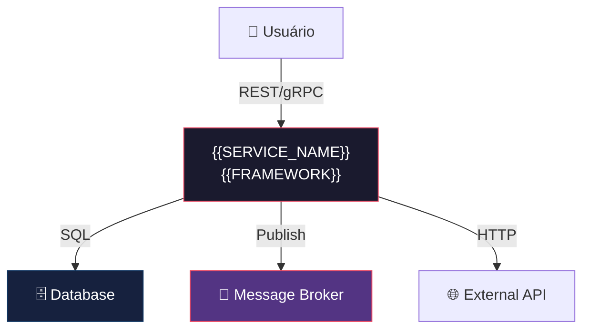

# História: Template de Documentação de Arquitetura de Serviço

**ID:** story-0004-0002

## 1. Dependências

| Blocked By | Blocks |
| :--- | :--- |
| — | story-0004-0006, story-0004-0014 |

## 2. Regras Transversais Aplicáveis

| ID | Título |
| :--- | :--- |
| RULE-001 | Dual Copy Consistency |
| RULE-002 | Source of Truth é resources/ |
| RULE-003 | Backward Compatibility |
| RULE-005 | Template-Based Artifacts |
| RULE-008 | Incremental Architecture Updates |
| RULE-009 | Documentation Output Convention |
| RULE-012 | Generated Content Language |

## 3. Descrição

Como **Architect**, eu quero um template padronizado para documentação de arquitetura de serviço
(`docs/architecture/service-architecture.md`) gerado pelo `ia-dev-env`, garantindo que cada
serviço tenha um documento vivo descrevendo sua arquitetura, integrações, NFRs e fluxos críticos.

Este template estabelece a estrutura para o documento de arquitetura que será atualizado
incrementalmente a cada feature que altere a arquitetura (RULE-008). O documento segue o modelo
C4 (Context e Container no mínimo) e inclui seções para integrações, modelo de dados, fluxos
críticos com sequence diagrams, NFRs (latência, throughput, SLAs), links para ADRs, estratégias
de observabilidade e resiliência.

O template usa placeholders `{{PLACEHOLDER}}` que são resolvidos em runtime pelo `ia-dev-env`
com base no project identity (nome do serviço, stack, interfaces).

### 3.1 Estrutura do Template

- Seção 1: Visão Geral (propósito, papel no ecossistema, stack)
- Seção 2: Diagramas C4 (Context diagram, Container diagram em Mermaid)
- Seção 3: Integrações (bancos, filas, APIs externas, caches — tabela)
- Seção 4: Modelo de Dados (entidades principais, relacionamentos)
- Seção 5: Fluxos Críticos (sequence diagrams Mermaid para top-3 operações)
- Seção 6: NFRs (latência p95, throughput, disponibilidade — tabela com SLOs)
- Seção 7: Decisões Arquiteturais (links para ADRs em `docs/adr/`)
- Seção 8: Observabilidade (métricas-chave, alertas, dashboards)
- Seção 9: Resiliência (circuit breakers, retries, fallbacks, degradation)
- Seção 10: Histórico de Mudanças (changelog interno do documento)

### 3.2 Resolução de Placeholders

- `{{SERVICE_NAME}}` — nome do serviço (de project identity)
- `{{ARCHITECTURE}}` — estilo arquitetural (hexagonal, clean, etc.)
- `{{LANGUAGE}}` / `{{FRAMEWORK}}` — stack tecnológica
- `{{INTERFACES}}` — lista de interfaces expostas

## 4. Definições de Qualidade Locais

### DoR Local (Definition of Ready)

- [ ] Modelo C4 pesquisado e compreendido
- [ ] Template `_TEMPLATE.md` (service spec) existente analisado como referência
- [ ] Estrutura de `resources/templates/` identificada

### DoD Local (Definition of Done)

- [ ] Template `_TEMPLATE-SERVICE-ARCHITECTURE.md` criado em `resources/templates/`
- [ ] Geração de `docs/architecture/service-architecture.md` no pipeline
- [ ] Placeholders resolvidos corretamente com dados do project identity
- [ ] Ambas as cópias atualizadas (RULE-001)
- [ ] Golden file tests validando output

### Global Definition of Done (DoD)

- **Cobertura:** ≥ 95% Line, ≥ 90% Branch
- **Testes Automatizados:** Golden file tests validando geração do template
- **TDD Compliance:** Commits test-first, refactoring explícito
- **Documentação:** Template atualizado em ambas as cópias
- **Backward Compatibility:** Projetos sem docs/architecture/ continuam funcionando

## 5. Contratos de Dados (Data Contract)

**_TEMPLATE-SERVICE-ARCHITECTURE.md (seções):**

| Campo | Formato | Request | Response | Origem / Regra |
| :--- | :--- | :--- | :--- | :--- |
| `# {{SERVICE_NAME}} — Architecture` | Markdown H1 | — | M | Título com nome do serviço |
| `## 1. Visão Geral` | Markdown H2 section | — | M | Propósito, stack, papel no ecossistema |
| `## 2. Diagramas C4` | Markdown H2 section | — | M | Context + Container diagrams em Mermaid |
| `## 3. Integrações` | Markdown H2 section | — | M | Tabela: Sistema, Protocolo, Propósito, SLO |
| `## 4. Modelo de Dados` | Markdown H2 section | — | M | Entidades principais com relacionamentos |
| `## 5. Fluxos Críticos` | Markdown H2 section | — | M | Sequence diagrams Mermaid (top-3 operações) |
| `## 6. NFRs` | Markdown H2 section | — | M | Tabela: Métrica, Target, Medição |
| `## 7. Decisões Arquiteturais` | Markdown H2 section | — | M | Links para ADRs em docs/adr/ |
| `## 8. Observabilidade` | Markdown H2 section | — | M | Métricas-chave, alertas, dashboards |
| `## 9. Resiliência` | Markdown H2 section | — | M | Circuit breakers, retries, fallbacks |
| `## 10. Histórico de Mudanças` | Markdown H2 section | — | M | Changelog do documento |

## 6. Diagramas

### 6.1 Exemplo de C4 Context Diagram no Template



## 7. Critérios de Aceite (Gherkin)

```gherkin
Cenario: Template de arquitetura vazio gerado com seções obrigatórias
  DADO que o ia-dev-env é executado para um novo projeto
  QUANDO a geração de templates é concluída
  ENTÃO o arquivo resources/templates/_TEMPLATE-SERVICE-ARCHITECTURE.md deve existir
  E deve conter as 10 seções obrigatórias (Visão Geral até Histórico)
  E cada seção deve conter placeholders ou instruções de preenchimento

Cenario: Placeholders resolvidos com dados do project identity
  DADO que o project identity define SERVICE_NAME como "payment-service"
  E define ARCHITECTURE como "hexagonal"
  QUANDO o template é processado pelo ia-dev-env
  ENTÃO {{SERVICE_NAME}} deve ser substituído por "payment-service"
  E {{ARCHITECTURE}} deve ser substituído por "hexagonal"

Cenario: Diagramas C4 em Mermaid incluídos no template
  DADO que o template _TEMPLATE-SERVICE-ARCHITECTURE.md foi gerado
  QUANDO a seção "Diagramas C4" é inspecionada
  ENTÃO deve conter pelo menos um bloco ```mermaid com graph TD
  E o diagrama deve incluir o serviço, suas dependências e interfaces

Cenario: Seção de NFRs com tabela estruturada
  DADO que o template _TEMPLATE-SERVICE-ARCHITECTURE.md foi gerado
  QUANDO a seção "NFRs" é inspecionada
  ENTÃO deve conter uma tabela Markdown com colunas Métrica, Target, Medição
  E deve incluir pelo menos latência p95, throughput e disponibilidade

Cenario: Template sem seção de integrações é rejeitado
  DADO que o template foi modificado removendo a seção "## 3. Integrações"
  QUANDO o golden file test é executado
  ENTÃO o teste deve falhar indicando seção obrigatória ausente

Cenario: Backward compatibility com projetos sem docs/architecture/
  DADO que um projeto existente não possui o diretório docs/architecture/
  QUANDO o ia-dev-env é re-executado nesse projeto
  ENTÃO o diretório docs/architecture/ deve ser criado sem erros
  E nenhum artefato existente deve ser afetado
```

### 7.1 Scenario Ordering (TPP)

> TPP: degenerate (empty template) → unconditional (placeholder resolution) → conditions
> (C4 diagrams, NFR table) → edge cases (missing sections, backward compat).

### 7.2 Mandatory Scenario Categories

- [x] Degenerate cases (empty template with sections)
- [x] Happy path (placeholder resolution, C4 diagrams)
- [x] Error paths (missing section rejected)
- [x] Boundary values (backward compatibility)

## 8. Sub-tarefas

- [ ] [Dev] Criar template `resources/templates/_TEMPLATE-SERVICE-ARCHITECTURE.md` com 10 seções
- [ ] [Dev] Implementar resolução de placeholders (SERVICE_NAME, ARCHITECTURE, LANGUAGE, FRAMEWORK)
- [ ] [Dev] Incluir exemplos de C4 Context e Container diagrams em Mermaid
- [ ] [Dev] Implementar geração de `docs/architecture/` no pipeline do ia-dev-env
- [ ] [Dev] Replicar template em dual copy locations (RULE-001)
- [ ] [Test] Unitário: validar estrutura do template (10 seções obrigatórias)
- [ ] [Test] Integração: golden file test para output de docs/architecture/
- [ ] [Test] Integração: backward compatibility com projetos existentes
- [ ] [Doc] Atualizar CHANGELOG
