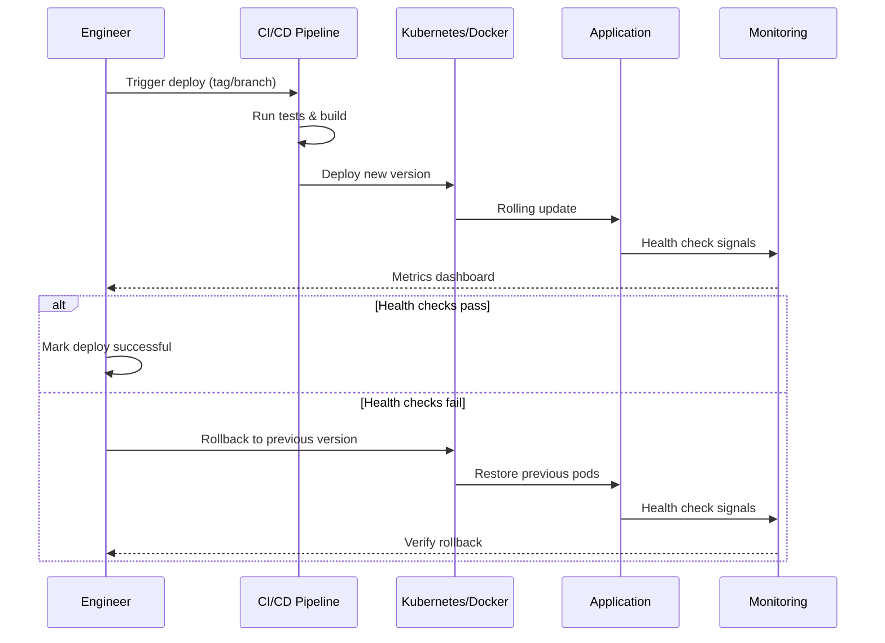

# História: Template de Runbook de Deploy

**ID:** story-0004-0003

## 1. Dependências

| Blocked By | Blocks |
| :--- | :--- |
| — | story-0004-0011 |

## 2. Regras Transversais Aplicáveis

| ID | Título |
| :--- | :--- |
| RULE-001 | Dual Copy Consistency |
| RULE-002 | Source of Truth é resources/ |
| RULE-003 | Backward Compatibility |
| RULE-005 | Template-Based Artifacts |
| RULE-009 | Documentation Output Convention |
| RULE-012 | Generated Content Language |

## 3. Descrição

Como **DevOps Engineer**, eu quero um template padronizado de runbook de deploy
(`docs/runbook/deploy-runbook.md`) gerado pelo `ia-dev-env`, garantindo que cada serviço tenha
procedimentos documentados para deploy, rollback e verificação pós-deploy.

Este template estabelece a estrutura para documentar procedimentos operacionais críticos.
Inclui seções para pré-condições de deploy, procedimento passo-a-passo, verificação de
saúde, procedimento de rollback, e checklist de validação. O template é agnóstico de cloud
mas inclui seções condicionais para Kubernetes, Docker Compose e bare metal.

### 3.1 Estrutura do Runbook

- Seção 1: Informações do Serviço (nome, versão, ambiente, data)
- Seção 2: Pré-condições (migrations aplicadas, configs atualizados, dependências)
- Seção 3: Procedimento de Deploy (passo-a-passo com comandos)
- Seção 4: Verificação Pós-Deploy (health checks, smoke tests, métricas)
- Seção 5: Procedimento de Rollback (passo-a-passo reverso com comandos)
- Seção 6: Troubleshooting (problemas conhecidos e soluções)
- Seção 7: Contatos (oncall, escalation path)

### 3.2 Seções Condicionais

- Se `container: docker` → seção com comandos Docker
- Se `orchestrator: kubernetes` → seção com kubectl commands
- Se `database: *` (não none) → seção com procedimentos de migration

## 4. Definições de Qualidade Locais

### DoR Local (Definition of Ready)

- [ ] Boas práticas de runbooks de deploy pesquisadas
- [ ] Estrutura de resources/templates/ identificada
- [ ] Project identity schema compreendido (container, orchestrator, database fields)

### DoD Local (Definition of Done)

- [ ] Template `_TEMPLATE-DEPLOY-RUNBOOK.md` criado em `resources/templates/`
- [ ] Geração de `docs/runbook/deploy-runbook.md` no pipeline
- [ ] Seções condicionais funcionando por tipo de infraestrutura
- [ ] Ambas as cópias atualizadas (RULE-001)
- [ ] Golden file tests validando output

### Global Definition of Done (DoD)

- **Cobertura:** ≥ 95% Line, ≥ 90% Branch
- **Testes Automatizados:** Golden file tests
- **TDD Compliance:** Commits test-first
- **Documentação:** Template em ambas as cópias
- **Backward Compatibility:** Projetos sem docs/runbook/ funcionam normalmente

## 5. Contratos de Dados (Data Contract)

**_TEMPLATE-DEPLOY-RUNBOOK.md (seções):**

| Campo | Formato | Request | Response | Origem / Regra |
| :--- | :--- | :--- | :--- | :--- |
| `# Deploy Runbook — {{SERVICE_NAME}}` | Markdown H1 | — | M | Título com nome do serviço |
| `## 1. Service Info` | Markdown H2 | — | M | Tabela: Name, Version, Environment, Date |
| `## 2. Pre-conditions` | Markdown H2 | — | M | Checklist de pré-condições |
| `## 3. Deploy Procedure` | Markdown H2 | — | M | Passos numerados com comandos |
| `## 4. Post-Deploy Verification` | Markdown H2 | — | M | Health checks, smoke tests |
| `## 5. Rollback Procedure` | Markdown H2 | — | M | Passos reversos com comandos |
| `## 6. Troubleshooting` | Markdown H2 | — | M | Tabela: Problem, Cause, Solution |
| `## 7. Contacts` | Markdown H2 | — | M | Oncall, escalation path |

## 6. Diagramas

### 6.1 Fluxo de Deploy e Rollback



## 7. Critérios de Aceite (Gherkin)

```gherkin
Cenario: Template de runbook gerado com seções obrigatórias
  DADO que o ia-dev-env é executado para um projeto com container docker
  QUANDO a geração de templates é concluída
  ENTÃO o arquivo resources/templates/_TEMPLATE-DEPLOY-RUNBOOK.md deve existir
  E deve conter as 7 seções obrigatórias
  E a seção Deploy Procedure deve conter comandos Docker

Cenario: Seções condicionais para Kubernetes incluídas
  DADO que o project identity define orchestrator como "kubernetes"
  QUANDO o template de runbook é processado
  ENTÃO a seção Deploy Procedure deve conter comandos kubectl
  E a seção Rollback deve conter kubectl rollout undo

Cenario: Seção de migration incluída quando database não é none
  DADO que o project identity define database como "postgresql"
  QUANDO o template de runbook é processado
  ENTÃO deve conter uma sub-seção "Database Migration" em Pre-conditions
  E deve conter procedimento de rollback de migration

Cenario: Runbook sem seção de rollback é rejeitado
  DADO que o template foi modificado removendo a seção "## 5. Rollback Procedure"
  QUANDO o golden file test é executado
  ENTÃO o teste deve falhar indicando seção obrigatória ausente

Cenario: Projeto sem container não gera seções Docker/K8s
  DADO que o project identity define container como "none"
  E define orchestrator como "none"
  QUANDO o template de runbook é processado
  ENTÃO a seção Deploy Procedure deve conter comandos genéricos
  E não deve conter comandos docker nem kubectl

Cenario: Backward compatibility com projetos sem docs/runbook/
  DADO que um projeto existente não possui o diretório docs/runbook/
  QUANDO o ia-dev-env é re-executado
  ENTÃO o diretório docs/runbook/ deve ser criado sem erros
  E nenhum artefato existente deve ser afetado
```

### 7.1 Scenario Ordering (TPP)

> TPP: degenerate (template with mandatory sections) → unconditional (K8s conditions) →
> conditions (database migration) → edge cases (missing sections, no container, backward compat).

### 7.2 Mandatory Scenario Categories

- [x] Degenerate cases (template generation)
- [x] Happy path (conditional sections)
- [x] Error paths (missing rollback section)
- [x] Boundary values (no container, backward compat)

## 8. Sub-tarefas

- [ ] [Dev] Criar template `resources/templates/_TEMPLATE-DEPLOY-RUNBOOK.md` com 7 seções
- [ ] [Dev] Implementar seções condicionais (Docker, Kubernetes, database migration)
- [ ] [Dev] Implementar geração de `docs/runbook/` no pipeline do ia-dev-env
- [ ] [Dev] Replicar template em dual copy locations (RULE-001)
- [ ] [Test] Unitário: validar seções obrigatórias do template
- [ ] [Test] Integração: golden file test para output com container docker
- [ ] [Test] Integração: golden file test para output sem container
- [ ] [Doc] Atualizar CHANGELOG
