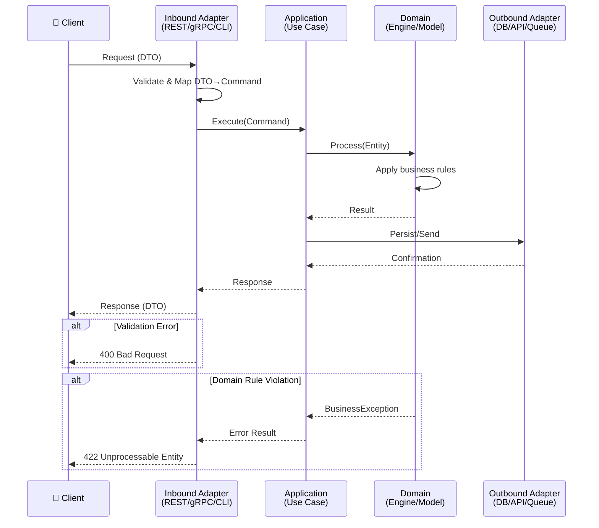

# História: `x-story-create` — Diagramas Mermaid Obrigatórios

**ID:** story-0004-0004

## 1. Dependências

| Blocked By | Blocks |
| :--- | :--- |
| — | — |

## 2. Regras Transversais Aplicáveis

| ID | Título |
| :--- | :--- |
| RULE-001 | Dual Copy Consistency |
| RULE-002 | Source of Truth é resources/ |
| RULE-003 | Backward Compatibility |
| RULE-007 | Mermaid Diagram Mandatory for Flows |
| RULE-012 | Generated Content Language |

## 3. Descrição

Como **Product Owner**, eu quero que a skill `x-story-create` torne obrigatórios os diagramas
Mermaid em stories que envolvem fluxos de aplicação, garantindo que toda story com interação
entre camadas tenha um diagrama de sequência mostrando o fluxo completo.

Atualmente, a skill `x-story-create` inclui diagramas na Seção 6 mas não os torna obrigatórios
nem especifica quais tipos de diagrama usar por tipo de story. Esta melhoria adiciona regras
explícitas ao SKILL.md da `x-story-create`:

- Stories com fluxos request→response: sequence diagram obrigatório mostrando
  inbound adapter → application → domain → outbound adapter
- Stories de infraestrutura: deployment diagram obrigatório
- Stories de event-driven: sequence diagram mostrando producer → broker → consumer
- Stories sem fluxo (ex: template, refactoring): diagram não obrigatório mas recomendado

### 3.1 Regras de Obrigatoriedade

- Diagrama de sequência: OBRIGATÓRIO quando a story envolve fluxo de dados entre 2+ componentes
- Diagrama de deployment: OBRIGATÓRIO quando a story altera infraestrutura
- Diagrama de atividade: RECOMENDADO para lógica de negócio complexa (3+ branches)
- Nenhum diagrama: PERMITIDO apenas para stories puramente documentais ou de configuração

### 3.2 Template de Sequence Diagram Inter-Camadas

- Participantes devem usar nomes reais dos componentes (não "Service A")
- Deve mostrar pelo menos: trigger → validation → business logic → persistence → response
- Deve incluir pelo menos 1 cenário de erro com `alt` block

### 3.3 Checklist de Validação

- Adicionar checklist na Seção 6 do template de story para validar completude do diagrama

## 4. Definições de Qualidade Locais

### DoR Local (Definition of Ready)

- [ ] Skill `x-story-create` atual lida e compreendida
- [ ] Tipos de diagrama Mermaid pesquisados (sequence, deployment, activity)
- [ ] Exemplos de bons diagramas em stories existentes identificados

### DoD Local (Definition of Done)

- [ ] SKILL.md do `x-story-create` atualizado com regras de obrigatoriedade
- [ ] Template de sequence diagram inter-camadas incluído
- [ ] Checklist de validação de diagramas adicionada à Seção 6
- [ ] Ambas as cópias atualizadas (RULE-001)
- [ ] Golden file tests validando output

### Global Definition of Done (DoD)

- **Cobertura:** ≥ 95% Line, ≥ 90% Branch
- **Testes Automatizados:** Golden file tests
- **TDD Compliance:** Commits test-first
- **Documentação:** Skill atualizada em ambas as cópias
- **Backward Compatibility:** Stories existentes sem diagrama continuam válidas

## 5. Contratos de Dados (Data Contract)

**x-story-create SKILL.md (seções adicionadas/modificadas):**

| Campo | Formato | Request | Response | Origem / Regra |
| :--- | :--- | :--- | :--- | :--- |
| `#### Section 6 — Diagramas` | Markdown section (enhanced) | — | M | Regras de obrigatoriedade por tipo de story |
| `Diagram Requirement Matrix` | Markdown table | — | M | Tipo de story × Tipo de diagrama × Obrigatório/Recomendado |
| `Inter-Layer Sequence Template` | Mermaid code block | — | M | Template de sequence diagram com placeholders |
| `Diagram Validation Checklist` | Markdown checklist | — | M | Items: participantes reais, error path, layers completas |

## 6. Diagramas

### 6.1 Template de Sequence Diagram Inter-Camadas



## 7. Critérios de Aceite (Gherkin)

```gherkin
Cenario: Skill x-story-create contém matriz de obrigatoriedade de diagramas
  DADO que o SKILL.md do x-story-create foi gerado pelo ia-dev-env
  QUANDO a Seção 6 é inspecionada
  ENTÃO deve conter uma tabela "Diagram Requirement Matrix"
  E a tabela deve mapear tipo de story para tipo de diagrama e obrigatoriedade

Cenario: Template de sequence diagram inter-camadas incluído
  DADO que o SKILL.md do x-story-create foi gerado
  QUANDO a Seção 6 é inspecionada
  ENTÃO deve conter um bloco Mermaid com sequenceDiagram
  E o diagrama deve incluir participantes Inbound, Application, Domain, Outbound
  E deve incluir pelo menos 1 bloco alt para cenário de erro

Cenario: Checklist de validação de diagramas presente
  DADO que o SKILL.md do x-story-create foi gerado
  QUANDO a Seção 6 é inspecionada
  ENTÃO deve conter um checklist com pelo menos 4 items de validação
  E deve incluir items para: participantes reais, error path, layers completas, nomes concretos

Cenario: Story de fluxo request-response sem diagrama é flagged
  DADO que uma story envolve um fluxo REST request→response
  QUANDO a story é gerada pelo x-story-create
  ENTÃO a Seção 6 DEVE conter um sequence diagram
  E o diagrama DEVE mostrar interação entre pelo menos 3 camadas

Cenario: Story puramente documental sem diagrama é permitida
  DADO que uma story é puramente de documentação (sem fluxo de dados)
  QUANDO a story é gerada pelo x-story-create
  ENTÃO a Seção 6 pode conter a nota "Diagrama não obrigatório para esta story"
  E nenhum erro de validação deve ser emitido

Cenario: Backward compatibility com stories existentes sem diagrama
  DADO que stories existentes no repositório não possuem diagramas
  QUANDO o x-story-create atualizado é utilizado
  ENTÃO stories existentes não são invalidadas
  E apenas novas stories seguem as regras de obrigatoriedade
```

### 7.1 Scenario Ordering (TPP)

> TPP: degenerate (matrix exists) → unconditional (template included, checklist) →
> conditions (flow story requires diagram, doc story exempt) → edge cases (backward compat).

### 7.2 Mandatory Scenario Categories

- [x] Degenerate cases (matrix and template exist)
- [x] Happy path (flow story with diagram)
- [x] Error paths (flow story flagged without diagram)
- [x] Boundary values (doc-only story, backward compat)

## 8. Sub-tarefas

- [ ] [Dev] Adicionar "Diagram Requirement Matrix" à Seção 6 do x-story-create SKILL.md
- [ ] [Dev] Incluir template de sequence diagram inter-camadas com placeholders
- [ ] [Dev] Adicionar checklist de validação de diagramas
- [ ] [Dev] Documentar regras de obrigatoriedade por tipo de story
- [ ] [Dev] Replicar mudanças em dual copy locations (RULE-001)
- [ ] [Test] Unitário: validar presença de matriz e template no output
- [ ] [Test] Integração: golden file test com novo conteúdo do x-story-create
- [ ] [Doc] Atualizar CHANGELOG
