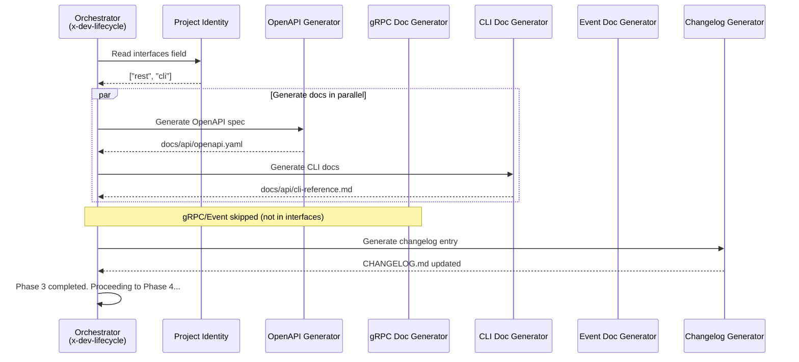

# História: Fase de Documentação no `x-dev-lifecycle`

**ID:** story-0004-0005

## 1. Dependências

| Blocked By | Blocks |
| :--- | :--- |
| — | story-0004-0007, story-0004-0008, story-0004-0009, story-0004-0010, story-0004-0011, story-0004-0012, story-0004-0013 |

## 2. Regras Transversais Aplicáveis

| ID | Título |
| :--- | :--- |
| RULE-001 | Dual Copy Consistency |
| RULE-002 | Source of Truth é resources/ |
| RULE-003 | Backward Compatibility |
| RULE-004 | Interface-Aware Generation |
| RULE-009 | Documentation Output Convention |
| RULE-010 | Lifecycle Phase Integrity |
| RULE-012 | Generated Content Language |

## 3. Descrição

Como **Tech Lead**, eu quero que o `x-dev-lifecycle` inclua uma fase dedicada de documentação
automática entre a implementação (Phase 2) e o review (Phase 3), garantindo que artefatos de
documentação sejam gerados automaticamente a cada feature implementada.

Esta é uma das stories mais críticas do épico: define a infraestrutura da fase de documentação
que será estendida pelos geradores específicos (stories 0007-0010). A nova fase (Phase 2.5 ou
renumerada como Phase 3, com bump das fases subsequentes) inspeciona o `project identity` para
determinar quais interfaces o projeto expõe (rest, grpc, cli, websocket, kafka) e invoca os
geradores correspondentes.

A fase opera como dispatcher: detecta interfaces configuradas, invoca geradores relevantes
(como subagents ou inline), e gera uma entrada de changelog. Os geradores específicos por
interface são implementados nas stories 0007-0010 — esta story define o mecanismo de dispatch
e o esqueleto da fase.

### 3.1 Posição no Lifecycle

- **Opção A (recomendada):** Inserir como nova Phase entre Phase 2 (Implementation) e Phase 3 (Review)
- Renumerar fases: Phase 3→4, Phase 4→5, Phase 5→6, Phase 6→7, Phase 7→8
- Total de fases: 9 (0-8) em vez de 8 (0-7)
- Atualizar regra "NEVER stop before Phase 8" (antes era Phase 7)

### 3.2 Mecanismo de Dispatch

- Ler campo `interfaces` do project identity
- Para cada interface configurada, invocar o gerador correspondente:
  - `rest` → OpenAPI/Swagger generator (story-0004-0007)
  - `grpc` → gRPC/Proto doc generator (story-0004-0008)
  - `cli` → CLI doc generator (story-0004-0009)
  - `websocket`, `kafka` → Event-Driven doc generator (story-0004-0010)
- Se nenhuma interface documentável: skip phase com log informativo
- Sempre gerar: Changelog entry

### 3.3 Changelog Entry

- Ler commits desde o branch point
- Gerar entrada formatada para CHANGELOG.md
- Formato: Conventional Commits summary por tipo (feat, fix, refactor)

### 3.4 Output

- Documentação salva em `docs/` com subdiretórios por tipo (RULE-009)
- Changelog entry appendada ao CHANGELOG.md

## 4. Definições de Qualidade Locais

### DoR Local (Definition of Ready)

- [ ] x-dev-lifecycle SKILL.md atual compreendido em detalhe (8 fases)
- [ ] Mecanismo de subagent dispatch compreendido
- [ ] Campo `interfaces` do project identity schema identificado
- [ ] Estrutura de `docs/` e CHANGELOG.md compreendida

### DoD Local (Definition of Done)

- [ ] x-dev-lifecycle SKILL.md atualizado com nova fase de documentação
- [ ] Mecanismo de dispatch por interface implementado
- [ ] Geração de changelog entry funcional
- [ ] Fases subsequentes renumeradas corretamente
- [ ] Regra "NEVER stop before Phase N" atualizada
- [ ] Ambas as cópias atualizadas (RULE-001)
- [ ] Golden file tests validando output

### Global Definition of Done (DoD)

- **Cobertura:** ≥ 95% Line, ≥ 90% Branch
- **Testes Automatizados:** Golden file tests validando lifecycle com nova fase
- **TDD Compliance:** Commits test-first
- **Documentação:** Skill atualizada em ambas as cópias
- **Backward Compatibility:** Lifecycle existente funcional (fases apenas renumeradas)

## 5. Contratos de Dados (Data Contract)

**x-dev-lifecycle SKILL.md (nova fase):**

| Campo | Formato | Request | Response | Origem / Regra |
| :--- | :--- | :--- | :--- | :--- |
| `## Phase 3 — Documentation` | Markdown H2 section | — | M | Nova fase no lifecycle |
| `Interface detection` | Logic block | Project identity `interfaces` field | M | Lista de interfaces configuradas |
| `Generator dispatch` | Subagent invocations | Interface list | M | Um subagent por interface |
| `Changelog entry` | Markdown section | Git commits since branch | M | Conventional Commits summary |
| Phase number update | All subsequent phases | — | M | Phase 3→4, 4→5, 5→6, 6→7, 7→8 |
| Total phase count | `8 phases (0-7)` → `9 phases (0-8)` | — | M | Header and footer updates |

## 6. Diagramas

### 6.1 Fluxo da Fase de Documentação



## 7. Critérios de Aceite (Gherkin)

```gherkin
Cenario: Lifecycle contém nova fase de documentação
  DADO que o SKILL.md do x-dev-lifecycle foi gerado pelo ia-dev-env
  QUANDO o conteúdo é inspecionado
  ENTÃO deve conter uma seção "## Phase 3 — Documentation"
  E a fase deve estar posicionada entre Phase 2 (Implementation) e Phase 4 (Review)

Cenario: Fases subsequentes renumeradas corretamente
  DADO que a nova fase de documentação foi inserida como Phase 3
  QUANDO o SKILL.md é inspecionado
  ENTÃO Phase 4 deve ser Review (antes Phase 3)
  E Phase 5 deve ser Fixes (antes Phase 4)
  E o total de fases deve ser 9 (0-8)
  E a regra deve dizer "NEVER stop before Phase 8"

Cenario: Dispatch por interface detecta REST e gera OpenAPI
  DADO que o project identity define interfaces como ["rest"]
  QUANDO a fase de documentação é executada
  ENTÃO o gerador OpenAPI/Swagger deve ser invocado
  E o output deve ser salvo em docs/api/

Cenario: Interface não configurada é ignorada silenciosamente
  DADO que o project identity define interfaces como ["cli"]
  QUANDO a fase de documentação é executada
  ENTÃO o gerador gRPC NÃO deve ser invocado
  E o gerador REST NÃO deve ser invocado
  E nenhum erro ou warning deve ser emitido para interfaces ausentes

Cenario: Changelog entry sempre gerada independente de interfaces
  DADO que a fase de documentação é executada
  QUANDO os geradores de interface terminam (ou são skipped)
  ENTÃO uma entrada de changelog DEVE ser gerada
  E a entrada deve seguir formato Conventional Commits
  E deve ser appendada ao CHANGELOG.md

Cenario: Projeto sem interfaces documentáveis skipa fase com log
  DADO que o project identity define interfaces como []
  QUANDO a fase de documentação é executada
  ENTÃO nenhum gerador de interface deve ser invocado
  E a changelog entry deve ser gerada normalmente
  E um log informativo "No documentable interfaces configured" deve ser emitido
```

### 7.1 Scenario Ordering (TPP)

> TPP: degenerate (phase exists) → unconditional (renumbering) → conditions (REST dispatch,
> skip non-configured) → iterations (changelog always) → edge cases (no interfaces).

### 7.2 Mandatory Scenario Categories

- [x] Degenerate cases (phase exists in lifecycle)
- [x] Happy path (dispatch REST, changelog generation)
- [x] Error paths (non-configured interface silently skipped)
- [x] Boundary values (no interfaces at all)

## 8. Sub-tarefas

- [ ] [Dev] Inserir nova Phase 3 — Documentation no x-dev-lifecycle SKILL.md
- [ ] [Dev] Renumerar todas as fases subsequentes (3→4, 4→5, 5→6, 6→7, 7→8)
- [ ] [Dev] Implementar mecanismo de dispatch por interface no project identity
- [ ] [Dev] Implementar geração de changelog entry a partir de commits
- [ ] [Dev] Atualizar header "9 phases (0-8)" e regra "NEVER stop before Phase 8"
- [ ] [Dev] Replicar mudanças em dual copy locations (RULE-001)
- [ ] [Test] Unitário: validar presença da nova fase e renumeração
- [ ] [Test] Integração: golden file test com lifecycle completo (9 fases)
- [ ] [Test] Integração: dispatch por interface (com e sem interfaces configuradas)
- [ ] [Doc] Atualizar CHANGELOG
