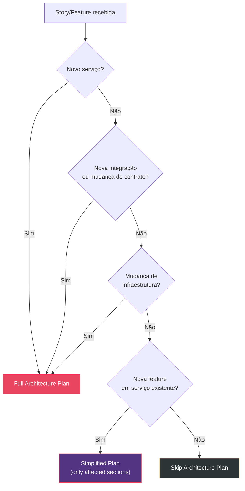
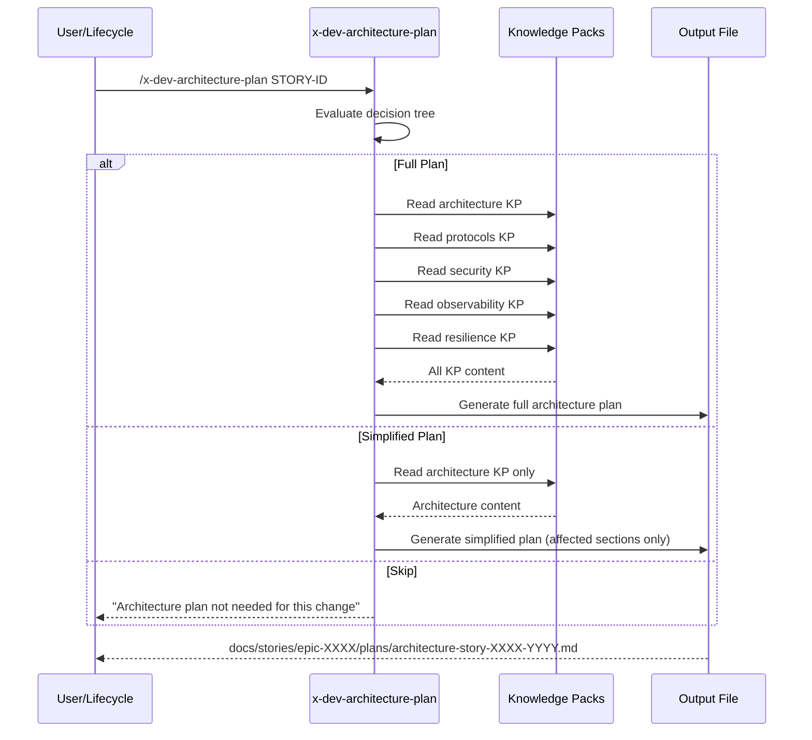

# História: Nova Skill `x-dev-architecture-plan`

**ID:** story-0004-0006

## 1. Dependências

| Blocked By | Blocks |
| :--- | :--- |
| story-0004-0001, story-0004-0002 | story-0004-0013, story-0004-0014, story-0004-0015, story-0004-0016 |

## 2. Regras Transversais Aplicáveis

| ID | Título |
| :--- | :--- |
| RULE-001 | Dual Copy Consistency |
| RULE-002 | Source of Truth é resources/ |
| RULE-003 | Backward Compatibility |
| RULE-005 | Template-Based Artifacts |
| RULE-006 | ADR Sequential Numbering |
| RULE-007 | Mermaid Diagram Mandatory for Flows |
| RULE-008 | Incremental Architecture Updates |
| RULE-009 | Documentation Output Convention |
| RULE-012 | Generated Content Language |

## 3. Descrição

Como **Architect**, eu quero uma skill dedicada `x-dev-architecture-plan` que gere um documento
de arquitetura completo com diagramas, ADRs inline, NFRs e estratégias de resiliência/observabilidade,
garantindo que decisões de design sejam documentadas antes da implementação.

Esta é a story mais importante de Layer 1 — o **Marco de Validação Arquitetural** deste épico.
Ela cria uma nova skill invocável tanto standalone (para design antes da implementação) quanto
pelo `x-dev-lifecycle` na Phase 1. A skill lê TODOS os knowledge packs relevantes (architecture,
protocols, security, observability, infrastructure, resilience, compliance) e gera um documento
de arquitetura completo seguindo o template `_TEMPLATE-SERVICE-ARCHITECTURE.md` (story-0004-0002).

A skill deve ter critérios claros de quando é aplicável (novo serviço, nova integração, mudança
de contrato, mudança de infraestrutura) vs. quando pode ser simplificada (bug fix, refactor
interno). Um decision tree no SKILL.md guia essa avaliação.

### 3.1 Knowledge Packs Lidos

- `skills/architecture/references/architecture-principles.md`
- `skills/architecture/references/architecture-patterns.md`
- `skills/protocols/references/` (REST, gRPC, GraphQL, event-driven conventions)
- `skills/security/references/` (OWASP, security headers, secrets management)
- `skills/observability/references/` (tracing, metrics, logging)
- `skills/infrastructure/references/` (Docker, K8s, 12-factor)
- `skills/resilience/references/` (circuit breaker, retry, fallback)
- `skills/compliance/references/` (se compliance ativo)

### 3.2 Output do Architecture Plan

- Diagrama de componentes (Mermaid graph TD)
- Diagramas de sequência dos fluxos principais (Mermaid sequenceDiagram)
- Diagrama de deployment (Mermaid graph TD com infra nodes)
- Conexões externas (tabela: sistema, protocolo, propósito, SLO)
- Mini-ADRs inline (decisões arquiteturais em formato resumido)
- Stack tecnológica justificada (tabela com rationale)
- NFRs (latência, throughput, disponibilidade — tabela com targets)
- Modelo de dados (se aplicável — entidades e relacionamentos)
- Estratégia de observabilidade (métricas-chave, spans, alertas)
- Estratégia de resiliência (circuit breakers, retries, fallbacks, degradation)
- Análise de impacto em serviços existentes

### 3.3 Decision Tree — Quando Aplicar

- **Full plan:** Novo serviço, nova integração, mudança de contrato público, mudança de infraestrutura
- **Simplified plan:** Nova feature em serviço existente sem mudança de contrato
- **Skip:** Bug fix, refactoring interno, mudança de documentação

### 3.4 Invocação

- Standalone: `/x-dev-architecture-plan [STORY-ID ou feature-name]`
- Via lifecycle: Phase 1 do x-dev-lifecycle invoca esta skill quando aplicável
- Output: `docs/stories/epic-XXXX/plans/architecture-story-XXXX-YYYY.md`

## 4. Definições de Qualidade Locais

### DoR Local (Definition of Ready)

- [ ] Template `_TEMPLATE-SERVICE-ARCHITECTURE.md` criado (story-0004-0002)
- [ ] Template `_TEMPLATE-ADR.md` criado (story-0004-0001)
- [ ] Todos os knowledge packs referenciados existentes e acessíveis
- [ ] Estrutura de skills do ia-dev-env compreendida (SKILL.md frontmatter)

### DoD Local (Definition of Done)

- [ ] SKILL.md criado em `resources/skills-templates/core/x-dev-architecture-plan/`
- [ ] Decision tree de aplicabilidade implementado
- [ ] Prompt de subagent para leitura de KPs definido
- [ ] Output segue _TEMPLATE-SERVICE-ARCHITECTURE.md
- [ ] Mini-ADRs inline seguem formato simplificado
- [ ] Ambas as cópias atualizadas (RULE-001)
- [ ] Golden file tests validando output da skill

### Global Definition of Done (DoD)

- **Cobertura:** ≥ 95% Line, ≥ 90% Branch
- **Testes Automatizados:** Golden file tests validando SKILL.md gerado
- **TDD Compliance:** Commits test-first
- **Documentação:** Skill em ambas as cópias, listada no README principal
- **Backward Compatibility:** Skill nova, sem impacto em existentes

## 5. Contratos de Dados (Data Contract)

**x-dev-architecture-plan SKILL.md (estrutura):**

| Campo | Formato | Request | Response | Origem / Regra |
| :--- | :--- | :--- | :--- | :--- |
| `name` | YAML frontmatter | — | M | "x-dev-architecture-plan" |
| `description` | YAML frontmatter | — | M | Descrição da skill |
| `allowed-tools` | YAML frontmatter list | — | M | Read, Write, Edit, Bash, Grep, Glob |
| `argument-hint` | YAML frontmatter | — | M | "[STORY-ID or feature-name]" |
| `## When to Use` | Markdown H2 | — | M | Decision tree: Full/Simplified/Skip |
| `## Knowledge Packs` | Markdown H2 | — | M | Lista de KPs a ler com paths |
| `## Output Structure` | Markdown H2 | — | M | Seções do architecture plan com formato |
| `## Mini-ADR Format` | Markdown H2 | — | M | Template simplificado de ADR inline |
| `## Subagent Prompt` | Markdown H2 | — | M | Prompt completo para o subagent architect |

**Architecture Plan Output:**

| Campo | Formato | Request | Response | Origem / Regra |
| :--- | :--- | :--- | :--- | :--- |
| `# Architecture Plan` | Markdown H1 | — | M | Título com story/feature |
| `## Component Diagram` | Mermaid graph TD | — | M | Componentes e dependências |
| `## Sequence Diagrams` | Mermaid sequenceDiagram | — | M | Fluxos principais |
| `## Deployment Diagram` | Mermaid graph TD | — | M | Infra nodes e networking |
| `## External Connections` | Markdown table | — | M | Sistema, Protocolo, Propósito, SLO |
| `## Architecture Decisions` | Mini-ADR format | — | M | Decisões com Context/Decision/Rationale |
| `## Technology Stack` | Markdown table | — | M | Componente, Tecnologia, Rationale |
| `## NFRs` | Markdown table | — | M | Métrica, Target, Medição |
| `## Data Model` | Markdown/Mermaid | — | O | Entidades e relacionamentos |
| `## Observability Strategy` | Markdown section | — | M | Métricas, spans, alertas |
| `## Resilience Strategy` | Markdown section | — | M | CB, retry, fallback, degradation |
| `## Impact Analysis` | Markdown section | — | M | Serviços afetados e riscos |

## 6. Diagramas

### 6.1 Decision Tree — Quando Aplicar o Architecture Plan



### 6.2 Fluxo de Execução da Skill



## 7. Critérios de Aceite (Gherkin)

```gherkin
Cenario: SKILL.md gerado com frontmatter correto
  DADO que o ia-dev-env é executado
  QUANDO o SKILL.md do x-dev-architecture-plan é gerado
  ENTÃO deve conter frontmatter YAML com name, description, allowed-tools, argument-hint
  E o name deve ser "x-dev-architecture-plan"

Cenario: Decision tree presente e completo
  DADO que o SKILL.md do x-dev-architecture-plan foi gerado
  QUANDO a seção "When to Use" é inspecionada
  ENTÃO deve conter um decision tree com 3 outcomes: Full Plan, Simplified Plan, Skip
  E deve listar critérios claros para cada outcome

Cenario: Lista de knowledge packs com paths corretos
  DADO que o SKILL.md do x-dev-architecture-plan foi gerado
  QUANDO a seção "Knowledge Packs" é inspecionada
  ENTÃO deve listar pelo menos 6 KPs com paths relativos
  E os paths devem apontar para arquivos existentes na estrutura do projeto

Cenario: Output structure segue template de service architecture
  DADO que o SKILL.md define a estrutura de output
  QUANDO a seção "Output Structure" é inspecionada
  ENTÃO deve conter pelo menos 10 seções obrigatórias
  E deve incluir Component Diagram, Sequence Diagrams, NFRs, Observability, Resilience

Cenario: Mini-ADR format definido
  DADO que o SKILL.md do x-dev-architecture-plan foi gerado
  QUANDO a seção "Mini-ADR Format" é inspecionada
  ENTÃO deve conter um formato simplificado com Context, Decision, Rationale
  E deve incluir campo para referência cruzada com story

Cenario: Skill configurada como user-invocable
  DADO que o SKILL.md do x-dev-architecture-plan foi gerado
  QUANDO o frontmatter é inspecionado
  ENTÃO não deve conter "user-invocable: false"
  E deve ser acessível via /x-dev-architecture-plan no chat
```

### 7.1 Scenario Ordering (TPP)

> TPP: degenerate (frontmatter exists) → unconditional (decision tree, KP list) →
> conditions (output structure, mini-ADR format) → edge cases (user-invocable config).

### 7.2 Mandatory Scenario Categories

- [x] Degenerate cases (SKILL.md with frontmatter)
- [x] Happy path (decision tree, KP list, output structure)
- [x] Error paths (mini-ADR format validation)
- [x] Boundary values (user-invocable configuration)

## 8. Sub-tarefas

- [ ] [Dev] Criar SKILL.md em `resources/skills-templates/core/x-dev-architecture-plan/`
- [ ] [Dev] Implementar decision tree de aplicabilidade (Full/Simplified/Skip)
- [ ] [Dev] Definir lista de KPs com paths e ordem de leitura
- [ ] [Dev] Definir output structure seguindo _TEMPLATE-SERVICE-ARCHITECTURE.md
- [ ] [Dev] Implementar formato de mini-ADR inline
- [ ] [Dev] Definir subagent prompt para Architect persona
- [ ] [Dev] Registrar skill no pipeline de geração do ia-dev-env
- [ ] [Dev] Replicar em dual copy locations (RULE-001)
- [ ] [Test] Unitário: validar frontmatter e seções obrigatórias do SKILL.md
- [ ] [Test] Integração: golden file test para output completo da skill
- [ ] [Doc] Atualizar CLAUDE.md com nova skill na lista
