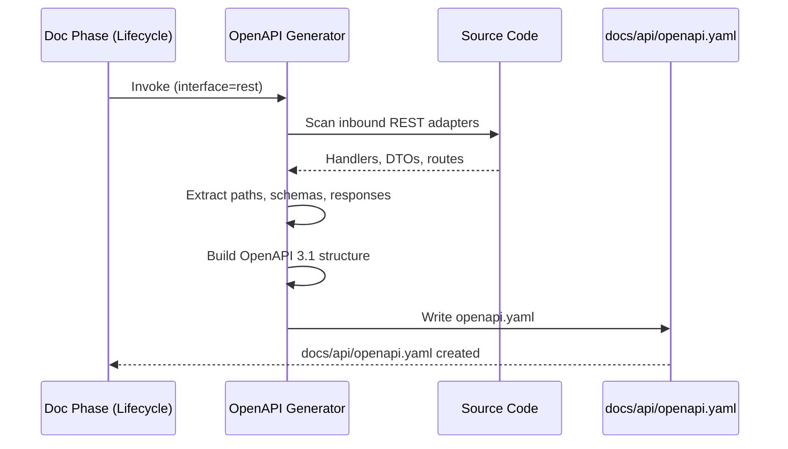

# História: Gerador de Documentação OpenAPI/Swagger (REST)

**ID:** story-0004-0007

## 1. Dependências

| Blocked By | Blocks |
| :--- | :--- |
| story-0004-0005 | — |

## 2. Regras Transversais Aplicáveis

| ID | Título |
| :--- | :--- |
| RULE-001 | Dual Copy Consistency |
| RULE-002 | Source of Truth é resources/ |
| RULE-003 | Backward Compatibility |
| RULE-004 | Interface-Aware Generation |
| RULE-005 | Template-Based Artifacts |
| RULE-009 | Documentation Output Convention |
| RULE-012 | Generated Content Language |

## 3. Descrição

Como **Developer**, eu quero que a fase de documentação do lifecycle gere automaticamente
uma especificação OpenAPI/Swagger para APIs REST, garantindo que a documentação de API
esteja sempre sincronizada com a implementação.

Este gerador é invocado pela fase de documentação (story-0004-0005) quando o project identity
contém `rest` na lista de interfaces. Ele analisa os endpoints implementados (inbound adapters
REST) e gera/atualiza um arquivo OpenAPI 3.1 YAML em `docs/api/openapi.yaml`.

O gerador opera como template/prompt para o subagent da fase de documentação. Ele instrui
o subagent a inspecionar os handlers REST, DTOs, status codes e error responses para
produzir a spec OpenAPI.

### 3.1 Escopo do Gerador

- Inspecionar inbound adapters REST (controllers, resources, handlers)
- Extrair: paths, métodos HTTP, request/response DTOs, status codes
- Gerar OpenAPI 3.1 YAML com schemas, paths, responses, error codes
- Incluir: info, servers, tags, schemas (components)
- Output: `docs/api/openapi.yaml`

### 3.2 Qualidade da Spec Gerada

- Schemas devem referenciar DTOs existentes (não duplicar)
- Responses devem incluir todos os status codes documentados
- Error responses devem seguir RFC 7807 (Problem Details)
- Examples devem ser incluídos quando possível

## 4. Definições de Qualidade Locais

### DoR Local (Definition of Ready)

- [ ] Fase de documentação no lifecycle implementada (story-0004-0005)
- [ ] OpenAPI 3.1 spec compreendida
- [ ] Padrão de inbound adapters REST no projeto compreendido

### DoD Local (Definition of Done)

- [ ] Template/prompt de gerador OpenAPI criado
- [ ] Gerador integrado ao mecanismo de dispatch da fase de documentação
- [ ] Output OpenAPI 3.1 YAML válido
- [ ] Ambas as cópias atualizadas (RULE-001)
- [ ] Golden file tests validando output

### Global Definition of Done (DoD)

- **Cobertura:** ≥ 95% Line, ≥ 90% Branch
- **Testes Automatizados:** Golden file tests
- **TDD Compliance:** Commits test-first
- **Documentação:** Gerador em ambas as cópias
- **Backward Compatibility:** Projetos sem REST não são afetados

## 5. Contratos de Dados (Data Contract)

**OpenAPI Generator Template (output):**

| Campo | Formato | Request | Response | Origem / Regra |
| :--- | :--- | :--- | :--- | :--- |
| `openapi` | YAML string | — | M | "3.1.0" |
| `info.title` | YAML string | — | M | {{SERVICE_NAME}} API |
| `info.version` | YAML string | — | M | Versão do serviço |
| `servers` | YAML array | — | M | URLs dos ambientes |
| `paths` | YAML object | — | M | Endpoints com métodos, params, responses |
| `components.schemas` | YAML object | — | M | DTOs como JSON Schema |
| `tags` | YAML array | — | O | Agrupamento de endpoints |

## 6. Diagramas

### 6.1 Fluxo de Geração OpenAPI



## 7. Critérios de Aceite (Gherkin)

```gherkin
Cenario: Gerador OpenAPI produz spec válida para projeto REST
  DADO que o project identity define interfaces como ["rest"]
  E existem endpoints REST implementados no projeto
  QUANDO a fase de documentação invoca o gerador OpenAPI
  ENTÃO o arquivo docs/api/openapi.yaml deve ser criado
  E deve ser um OpenAPI 3.1 válido com campo openapi: "3.1.0"

Cenario: Spec inclui todos os endpoints implementados
  DADO que o projeto possui endpoints GET /items, POST /items, GET /items/{id}
  QUANDO o gerador OpenAPI é executado
  ENTÃO a spec deve conter paths para /items (GET, POST) e /items/{id} (GET)
  E cada path deve ter request/response schemas

Cenario: Schemas referenciam DTOs sem duplicação
  DADO que existem DTOs ItemRequest e ItemResponse no projeto
  QUANDO o gerador OpenAPI é executado
  ENTÃO components/schemas deve conter ItemRequest e ItemResponse
  E os paths devem referenciar via $ref

Cenario: Error responses seguem RFC 7807
  DADO que endpoints retornam erros 400, 404, 422
  QUANDO o gerador OpenAPI é executado
  ENTÃO cada error response deve ter schema seguindo Problem Details
  E deve incluir campos type, title, status, detail

Cenario: Gerador skipped para projeto sem interface REST
  DADO que o project identity define interfaces como ["cli"]
  QUANDO a fase de documentação é executada
  ENTÃO o gerador OpenAPI NÃO deve ser invocado
  E nenhum arquivo docs/api/openapi.yaml deve ser criado

Cenario: Spec existente é atualizada, não sobrescrita
  DADO que já existe um docs/api/openapi.yaml com endpoints anteriores
  QUANDO o gerador OpenAPI é executado após nova implementação
  ENTÃO novos endpoints devem ser adicionados à spec existente
  E endpoints anteriores devem ser preservados
```

### 7.1 Scenario Ordering (TPP)

> TPP: degenerate (valid spec) → unconditional (all endpoints included) → conditions
> ($ref schemas, RFC 7807) → edge cases (skip non-REST, incremental update).

### 7.2 Mandatory Scenario Categories

- [x] Degenerate cases (valid spec generated)
- [x] Happy path (endpoints, schemas)
- [x] Error paths (skip non-REST)
- [x] Boundary values (incremental update)

## 8. Sub-tarefas

- [ ] [Dev] Criar template/prompt do gerador OpenAPI no lifecycle doc phase
- [ ] [Dev] Implementar lógica de scan de inbound REST adapters
- [ ] [Dev] Implementar geração de OpenAPI 3.1 YAML
- [ ] [Dev] Implementar RFC 7807 error response schemas
- [ ] [Dev] Replicar em dual copy locations (RULE-001)
- [ ] [Test] Unitário: validar estrutura OpenAPI gerada
- [ ] [Test] Integração: golden file test para projeto REST
- [ ] [Doc] Atualizar CHANGELOG
