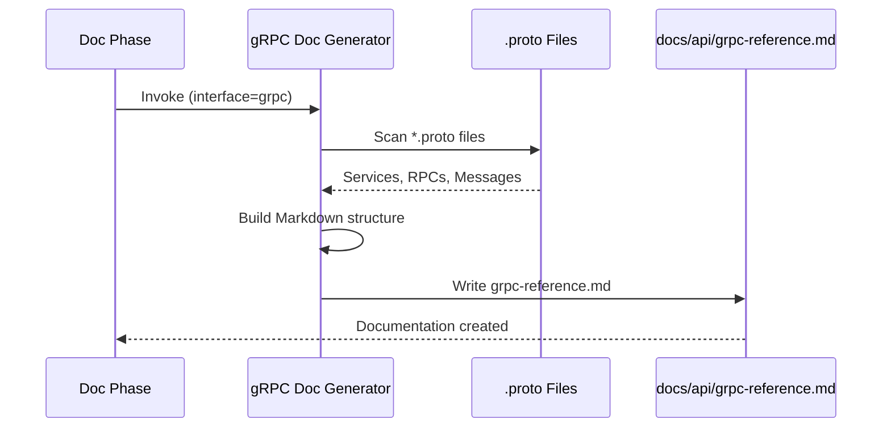

# História: Gerador de Documentação gRPC/Proto

**ID:** story-0004-0008

## 1. Dependências

| Blocked By | Blocks |
| :--- | :--- |
| story-0004-0005 | — |

## 2. Regras Transversais Aplicáveis

| ID | Título |
| :--- | :--- |
| RULE-001 | Dual Copy Consistency |
| RULE-002 | Source of Truth é resources/ |
| RULE-004 | Interface-Aware Generation |
| RULE-005 | Template-Based Artifacts |
| RULE-009 | Documentation Output Convention |
| RULE-012 | Generated Content Language |

## 3. Descrição

Como **Developer**, eu quero que a fase de documentação do lifecycle gere automaticamente
documentação para serviços gRPC a partir dos arquivos `.proto`, garantindo que contratos
de serviço gRPC estejam documentados e acessíveis.

Este gerador é invocado quando o project identity contém `grpc` na lista de interfaces.
Ele analisa arquivos `.proto` existentes e gera documentação Markdown com descrições de
serviços, RPCs, messages, enums e campos. O output vai para `docs/api/grpc-reference.md`.

### 3.1 Escopo do Gerador

- Escanear arquivos `.proto` no projeto
- Extrair: services, RPCs (unary, server-streaming, client-streaming, bidirectional)
- Documentar messages com campos, tipos e descrições
- Incluir: versão do proto, package, imports
- Documentar backward compatibility notes
- Output: `docs/api/grpc-reference.md`

### 3.2 Formato do Output

- Seção por service definido nos protos
- Tabela de RPCs por service (method, request, response, type)
- Detalhamento de cada message (campo, tipo, obrigatório, descrição)
- Notas de compatibilidade (campos deprecated, reserved)

## 4. Definições de Qualidade Locais

### DoR Local (Definition of Ready)

- [ ] Fase de documentação implementada (story-0004-0005)
- [ ] Formato Proto3 compreendido
- [ ] Padrão de protos no projeto identificado

### DoD Local (Definition of Done)

- [ ] Template/prompt de gerador gRPC criado
- [ ] Gerador integrado ao dispatch da fase de documentação
- [ ] Output Markdown com documentação de services e messages
- [ ] Ambas as cópias atualizadas (RULE-001)
- [ ] Golden file tests validando output

### Global Definition of Done (DoD)

- **Cobertura:** ≥ 95% Line, ≥ 90% Branch
- **Testes Automatizados:** Golden file tests
- **TDD Compliance:** Commits test-first
- **Backward Compatibility:** Projetos sem gRPC não afetados

## 5. Contratos de Dados (Data Contract)

**gRPC Reference Output:**

| Campo | Formato | Request | Response | Origem / Regra |
| :--- | :--- | :--- | :--- | :--- |
| `# gRPC API Reference` | Markdown H1 | — | M | Título fixo |
| `## Service: {name}` | Markdown H2 per service | — | M | Uma seção por service |
| RPC table | Markdown table | — | M | Colunas: Method, Request, Response, Type |
| `### Message: {name}` | Markdown H3 per message | — | M | Uma seção por message |
| Field table | Markdown table | — | M | Colunas: Field, Type, Number, Description |

## 6. Diagramas

### 6.1 Fluxo de Geração gRPC Docs



## 7. Critérios de Aceite (Gherkin)

```gherkin
Cenario: Gerador gRPC produz documentação para projeto com protos
  DADO que o project identity define interfaces como ["grpc"]
  E existem arquivos .proto no projeto
  QUANDO a fase de documentação invoca o gerador gRPC
  ENTÃO o arquivo docs/api/grpc-reference.md deve ser criado
  E deve conter seções para cada service definido nos protos

Cenario: Tabela de RPCs lista todos os métodos do service
  DADO que um service define RPCs GetItem, CreateItem, ListItems
  QUANDO o gerador gRPC é executado
  ENTÃO a tabela de RPCs deve conter 3 linhas
  E cada linha deve indicar request message, response message e tipo (unary/streaming)

Cenario: Messages documentadas com todos os campos
  DADO que uma message Item tem campos id (int64), name (string), price (double)
  QUANDO o gerador gRPC é executado
  ENTÃO a seção da message deve conter uma tabela com 3 campos
  E cada campo deve ter tipo, número e descrição

Cenario: Campos deprecated sinalizados na documentação
  DADO que um campo de message está marcado como deprecated no proto
  QUANDO o gerador gRPC é executado
  ENTÃO o campo deve ser marcado como "[DEPRECATED]" na documentação
  E uma nota de backward compatibility deve ser incluída

Cenario: Gerador skipped para projeto sem interface gRPC
  DADO que o project identity define interfaces como ["rest"]
  QUANDO a fase de documentação é executada
  ENTÃO o gerador gRPC NÃO deve ser invocado
  E nenhum arquivo docs/api/grpc-reference.md deve ser criado

Cenario: Múltiplos services no mesmo proto documentados separadamente
  DADO que um arquivo proto define services UserService e OrderService
  QUANDO o gerador gRPC é executado
  ENTÃO devem existir seções separadas "## Service: UserService" e "## Service: OrderService"
```

### 7.1 Scenario Ordering (TPP)

> TPP: degenerate (doc created) → unconditional (RPC table) → conditions (messages, deprecated)
> → edge cases (skip non-gRPC, multiple services).

### 7.2 Mandatory Scenario Categories

- [x] Degenerate cases (doc generated)
- [x] Happy path (RPCs, messages)
- [x] Error paths (skip non-gRPC)
- [x] Boundary values (deprecated, multiple services)

## 8. Sub-tarefas

- [ ] [Dev] Criar template/prompt do gerador gRPC no lifecycle doc phase
- [ ] [Dev] Implementar scan de arquivos .proto
- [ ] [Dev] Implementar geração de Markdown com services, RPCs, messages
- [ ] [Dev] Implementar sinalização de campos deprecated
- [ ] [Dev] Replicar em dual copy locations (RULE-001)
- [ ] [Test] Unitário: validar estrutura do output Markdown
- [ ] [Test] Integração: golden file test para projeto gRPC
- [ ] [Doc] Atualizar CHANGELOG
