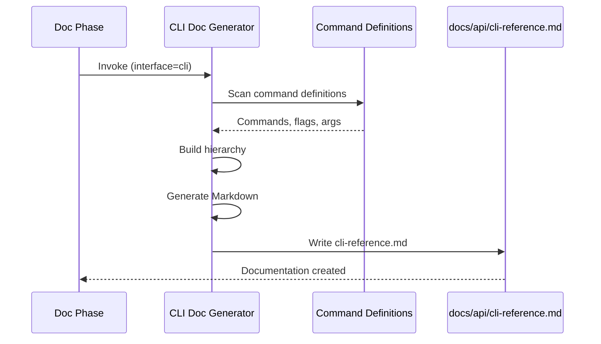

# História: Gerador de Documentação CLI

**ID:** story-0004-0009

## 1. Dependências

| Blocked By | Blocks |
| :--- | :--- |
| story-0004-0005 | — |

## 2. Regras Transversais Aplicáveis

| ID | Título |
| :--- | :--- |
| RULE-001 | Dual Copy Consistency |
| RULE-002 | Source of Truth é resources/ |
| RULE-004 | Interface-Aware Generation |
| RULE-005 | Template-Based Artifacts |
| RULE-009 | Documentation Output Convention |
| RULE-012 | Generated Content Language |

## 3. Descrição

Como **Developer**, eu quero que a fase de documentação do lifecycle gere automaticamente
documentação de comandos CLI com flags, argumentos e exemplos de uso, garantindo que
ferramentas CLI tenham documentação atualizada e acessível.

Este gerador é invocado quando o project identity contém `cli` na lista de interfaces.
Ele analisa a estrutura de comandos (commander, yargs, click, cobra, clap — dependendo da
linguagem) e gera documentação Markdown com hierarquia de comandos, flags, argumentos
e exemplos. O output vai para `docs/api/cli-reference.md`.

Este gerador é particularmente relevante para o próprio projeto `ia-dev-environment`,
que é uma CLI tool baseada em Commander.js.

### 3.1 Escopo do Gerador

- Escanear definições de comandos no framework CLI do projeto
- Extrair: comandos (top-level e subcomandos), flags (--flag), argumentos posicionais
- Documentar: descrição, tipo, valor default, obrigatoriedade
- Incluir exemplos de uso por comando
- Gerar seção de quick start
- Output: `docs/api/cli-reference.md`

### 3.2 Formato do Output

- Overview com lista de comandos disponíveis
- Seção por comando com: descrição, usage, flags (tabela), argumentos (tabela), exemplos
- Global flags (aplicáveis a todos os comandos)
- Exit codes e error messages

## 4. Definições de Qualidade Locais

### DoR Local (Definition of Ready)

- [ ] Fase de documentação implementada (story-0004-0005)
- [ ] Framework CLI do projeto compreendido (Commander.js para este projeto)
- [ ] Padrão de definição de comandos identificado

### DoD Local (Definition of Done)

- [ ] Template/prompt de gerador CLI criado
- [ ] Gerador integrado ao dispatch da fase de documentação
- [ ] Output Markdown com hierarquia de comandos documentada
- [ ] Ambas as cópias atualizadas (RULE-001)
- [ ] Golden file tests validando output

### Global Definition of Done (DoD)

- **Cobertura:** ≥ 95% Line, ≥ 90% Branch
- **Testes Automatizados:** Golden file tests
- **TDD Compliance:** Commits test-first
- **Backward Compatibility:** Projetos sem CLI não afetados

## 5. Contratos de Dados (Data Contract)

**CLI Reference Output:**

| Campo | Formato | Request | Response | Origem / Regra |
| :--- | :--- | :--- | :--- | :--- |
| `# CLI Reference` | Markdown H1 | — | M | Título fixo |
| `## Quick Start` | Markdown H2 | — | M | Exemplos básicos de uso |
| `## Global Flags` | Markdown H2 | — | M | Flags aplicáveis a todos os comandos |
| `## Command: {name}` | Markdown H2 per command | — | M | Uma seção por comando |
| Usage line | Code block | — | M | `$ tool-name command [flags] [args]` |
| Flags table | Markdown table | — | M | Colunas: Flag, Type, Default, Description |
| Args table | Markdown table | — | O | Colunas: Argument, Type, Required, Description |
| Examples | Code blocks | — | M | Pelo menos 1 exemplo por comando |
| `## Exit Codes` | Markdown H2 | — | M | Tabela: Code, Meaning |

## 6. Diagramas

### 6.1 Fluxo de Geração CLI Docs



## 7. Critérios de Aceite (Gherkin)

```gherkin
Cenario: Gerador CLI produz documentação para projeto com CLI
  DADO que o project identity define interfaces como ["cli"]
  E existem definições de comandos no projeto
  QUANDO a fase de documentação invoca o gerador CLI
  ENTÃO o arquivo docs/api/cli-reference.md deve ser criado
  E deve conter seções para cada comando definido

Cenario: Documentação inclui flags com tipos e defaults
  DADO que um comando "generate" tem flags --config (string, required) e --verbose (boolean, default false)
  QUANDO o gerador CLI é executado
  ENTÃO a seção do comando deve conter uma tabela de flags
  E a flag --config deve mostrar tipo string e required
  E a flag --verbose deve mostrar tipo boolean e default false

Cenario: Subcomandos documentados com hierarquia
  DADO que o comando "generate" tem subcomandos "claude" e "github"
  QUANDO o gerador CLI é executado
  ENTÃO deve existir seções "### Subcommand: generate claude" e "### Subcommand: generate github"
  E cada subcomando deve ter sua própria tabela de flags

Cenario: Quick start com exemplos básicos incluído
  DADO que o gerador CLI é executado
  QUANDO o output é inspecionado
  ENTÃO deve conter uma seção "## Quick Start" no início
  E deve conter pelo menos 2 exemplos de uso em code blocks

Cenario: Gerador skipped para projeto sem interface CLI
  DADO que o project identity define interfaces como ["rest", "grpc"]
  QUANDO a fase de documentação é executada
  ENTÃO o gerador CLI NÃO deve ser invocado
  E nenhum arquivo docs/api/cli-reference.md deve ser criado

Cenario: Exit codes documentados
  DADO que o projeto CLI define exit codes 0 (success), 1 (error), 2 (invalid args)
  QUANDO o gerador CLI é executado
  ENTÃO deve existir seção "## Exit Codes" com tabela
  E a tabela deve conter os 3 exit codes com descrições
```

### 7.1 Scenario Ordering (TPP)

> TPP: degenerate (doc created) → unconditional (flags table) → conditions (subcommands, quick start)
> → edge cases (skip non-CLI, exit codes).

### 7.2 Mandatory Scenario Categories

- [x] Degenerate cases (doc generated)
- [x] Happy path (flags, subcommands)
- [x] Error paths (skip non-CLI)
- [x] Boundary values (exit codes)

## 8. Sub-tarefas

- [ ] [Dev] Criar template/prompt do gerador CLI no lifecycle doc phase
- [ ] [Dev] Implementar scan de definições de comandos (Commander.js pattern)
- [ ] [Dev] Implementar geração de Markdown com hierarquia de comandos
- [ ] [Dev] Implementar seção de Quick Start e Exit Codes
- [ ] [Dev] Replicar em dual copy locations (RULE-001)
- [ ] [Test] Unitário: validar estrutura do output Markdown
- [ ] [Test] Integração: golden file test para projeto CLI
- [ ] [Doc] Atualizar CHANGELOG
