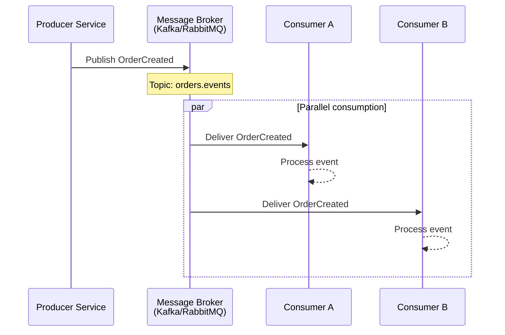

# História: Gerador de Documentação Event-Driven/WebSocket

**ID:** story-0004-0010

## 1. Dependências

| Blocked By | Blocks |
| :--- | :--- |
| story-0004-0005 | — |

## 2. Regras Transversais Aplicáveis

| ID | Título |
| :--- | :--- |
| RULE-001 | Dual Copy Consistency |
| RULE-002 | Source of Truth é resources/ |
| RULE-004 | Interface-Aware Generation |
| RULE-005 | Template-Based Artifacts |
| RULE-009 | Documentation Output Convention |
| RULE-012 | Generated Content Language |

## 3. Descrição

Como **Developer**, eu quero que a fase de documentação do lifecycle gere automaticamente
documentação para contratos de eventos e catálogos de tópicos, garantindo que sistemas
event-driven tenham seus contratos documentados e versionados.

Este gerador é invocado quando o project identity contém `websocket` ou `kafka` na lista
de interfaces. Ele analisa producers, consumers, event schemas e topic definitions para
gerar um catálogo de eventos com contratos detalhados. O output vai para
`docs/api/event-catalog.md`.

### 3.1 Escopo do Gerador

- Escanear definições de eventos (producers, consumers, schemas)
- Extrair: event names, topics/channels, payload schemas, headers
- Documentar: producer/consumer contracts, routing keys, partition keys
- Incluir: CloudEvents envelope (se aplicável), schema versioning
- Output: `docs/api/event-catalog.md`

### 3.2 Formato do Output

- Overview com tabela de tópicos/channels
- Seção por evento: nome, tópico, producer, consumers, schema
- Payload schema detalhado (campos, tipos, obrigatório)
- Event flow diagrams (producer → broker → consumers)
- Versioning notes e backward compatibility

## 4. Definições de Qualidade Locais

### DoR Local (Definition of Ready)

- [ ] Fase de documentação implementada (story-0004-0005)
- [ ] Padrões de event-driven (CloudEvents, AsyncAPI) pesquisados
- [ ] Convenções de eventos no projeto compreendidas

### DoD Local (Definition of Done)

- [ ] Template/prompt de gerador Event-Driven criado
- [ ] Gerador integrado ao dispatch da fase de documentação
- [ ] Output Markdown com catálogo de eventos
- [ ] Ambas as cópias atualizadas (RULE-001)
- [ ] Golden file tests validando output

### Global Definition of Done (DoD)

- **Cobertura:** ≥ 95% Line, ≥ 90% Branch
- **Testes Automatizados:** Golden file tests
- **TDD Compliance:** Commits test-first
- **Backward Compatibility:** Projetos sem events não afetados

## 5. Contratos de Dados (Data Contract)

**Event Catalog Output:**

| Campo | Formato | Request | Response | Origem / Regra |
| :--- | :--- | :--- | :--- | :--- |
| `# Event Catalog` | Markdown H1 | — | M | Título fixo |
| `## Topics Overview` | Markdown H2 | — | M | Tabela: Topic, Events, Partitioning |
| `## Event: {name}` | Markdown H2 per event | — | M | Uma seção por evento |
| Topic/Channel | String | — | M | Nome do tópico/channel |
| Producer | String | — | M | Serviço produtor |
| Consumers | String list | — | M | Serviços consumidores |
| Payload schema | Markdown table | — | M | Colunas: Field, Type, Required, Description |
| Headers | Markdown table | — | O | Headers customizados (correlation-id, etc.) |
| `## Event Flows` | Mermaid diagrams | — | M | Producer → Broker → Consumer |

## 6. Diagramas

### 6.1 Exemplo de Event Flow Diagram



## 7. Critérios de Aceite (Gherkin)

```gherkin
Cenario: Gerador Event-Driven produz catálogo para projeto com Kafka
  DADO que o project identity define interfaces como ["kafka"]
  E existem definições de eventos no projeto
  QUANDO a fase de documentação invoca o gerador Event-Driven
  ENTÃO o arquivo docs/api/event-catalog.md deve ser criado
  E deve conter seções para cada evento definido

Cenario: Tabela de tópicos lista todos os topics com partitioning
  DADO que o projeto define topics "orders.events" e "payments.events"
  QUANDO o gerador Event-Driven é executado
  ENTÃO a seção Topics Overview deve conter tabela com 2 linhas
  E cada linha deve indicar o topic, eventos associados e partition key

Cenario: Payload schema documentado com todos os campos
  DADO que o evento OrderCreated tem payload com orderId (string), amount (number), currency (string)
  QUANDO o gerador Event-Driven é executado
  ENTÃO a seção do evento deve conter tabela de payload com 3 campos
  E cada campo deve ter tipo, obrigatoriedade e descrição

Cenario: Event flow diagram incluído em Mermaid
  DADO que o evento OrderCreated é produzido por OrderService e consumido por PaymentService
  QUANDO o gerador Event-Driven é executado
  ENTÃO deve conter um diagrama Mermaid sequenceDiagram
  E o diagrama deve mostrar producer, broker e consumer

Cenario: Gerador skipped para projeto sem interface event-driven
  DADO que o project identity define interfaces como ["rest"]
  QUANDO a fase de documentação é executada
  ENTÃO o gerador Event-Driven NÃO deve ser invocado
  E nenhum arquivo docs/api/event-catalog.md deve ser criado

Cenario: WebSocket events documentados quando interface websocket
  DADO que o project identity define interfaces como ["websocket"]
  QUANDO a fase de documentação invoca o gerador Event-Driven
  ENTÃO o docs/api/event-catalog.md deve ser criado
  E deve documentar channels WebSocket com mensagens e schemas
```

### 7.1 Scenario Ordering (TPP)

> TPP: degenerate (catalog created) → unconditional (topics table) → conditions
> (payload schema, flow diagram) → edge cases (skip, websocket variant).

### 7.2 Mandatory Scenario Categories

- [x] Degenerate cases (catalog generated)
- [x] Happy path (topics, payload, flow diagram)
- [x] Error paths (skip non-event)
- [x] Boundary values (websocket variant)

## 8. Sub-tarefas

- [ ] [Dev] Criar template/prompt do gerador Event-Driven no lifecycle doc phase
- [ ] [Dev] Implementar scan de definições de eventos (producers, consumers, schemas)
- [ ] [Dev] Implementar geração de Markdown com catálogo de eventos
- [ ] [Dev] Implementar event flow diagrams em Mermaid
- [ ] [Dev] Suportar tanto Kafka quanto WebSocket como trigger
- [ ] [Dev] Replicar em dual copy locations (RULE-001)
- [ ] [Test] Unitário: validar estrutura do output Markdown
- [ ] [Test] Integração: golden file test para projeto event-driven
- [ ] [Doc] Atualizar CHANGELOG
