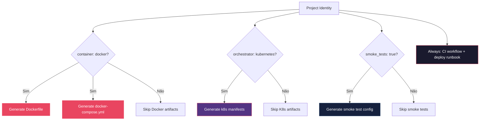

# História: Geração de Artefatos CI/CD no Lifecycle

**ID:** story-0004-0011

## 1. Dependências

| Blocked By | Blocks |
| :--- | :--- |
| story-0004-0003, story-0004-0005 | — |

## 2. Regras Transversais Aplicáveis

| ID | Título |
| :--- | :--- |
| RULE-001 | Dual Copy Consistency |
| RULE-002 | Source of Truth é resources/ |
| RULE-003 | Backward Compatibility |
| RULE-004 | Interface-Aware Generation |
| RULE-005 | Template-Based Artifacts |
| RULE-009 | Documentation Output Convention |
| RULE-012 | Generated Content Language |

## 3. Descrição

Como **DevOps Engineer**, eu quero que o `ia-dev-env` gere artefatos de CI/CD (GitHub Actions
workflows, Dockerfile, Docker Compose, manifests Kubernetes) e configuração de smoke tests,
garantindo que novos projetos tenham infraestrutura de deploy pronta para uso.

Esta story integra a geração de artefatos de infraestrutura no pipeline do `ia-dev-env`.
Os artefatos são gerados condicionalmente baseado nos campos `container`, `orchestrator`,
`build_tool` e `smoke_tests` do project identity. O deploy runbook template (story-0004-0003)
é utilizado como base para o runbook gerado.

### 3.1 Artefatos Gerados

- **GitHub Actions workflow** (`.github/workflows/ci.yml`): build, test, lint
- **Dockerfile** (se `container: docker`): multi-stage build seguindo KP de dockerfile
- **Docker Compose** (se `container: docker`): ambiente de desenvolvimento local
- **Kubernetes manifests** (se `orchestrator: kubernetes`): Deployment, Service, ConfigMap
- **Smoke test config** (se `smoke_tests: true`): configuração de smoke tests pós-deploy
- **Deploy runbook** (`docs/runbook/deploy-runbook.md`): baseado no template story-0004-0003

### 3.2 Geração Condicional

- Cada artefato gerado apenas se a configuração correspondente está habilitada
- Artefatos ausentes não geram erro — apenas log informativo
- Stack-aware: templates variam por linguagem (Java/Go/TypeScript/Python/Rust/Kotlin)

### 3.3 Integração no Lifecycle

- A geração de artefatos CI/CD acontece na fase de documentação (Phase 3)
- Ou pode ser invocada standalone como parte do `ia-dev-env generate`

## 4. Definições de Qualidade Locais

### DoR Local (Definition of Ready)

- [ ] Template de deploy runbook criado (story-0004-0003)
- [ ] Fase de documentação implementada (story-0004-0005)
- [ ] Dockerfile KP e Infrastructure KP lidos
- [ ] GitHub Actions workflow syntax compreendida

### DoD Local (Definition of Done)

- [ ] Templates de CI/CD criados para cada stack suportada
- [ ] Geração condicional implementada (container, orchestrator, smoke_tests)
- [ ] Deploy runbook gerado a partir do template
- [ ] Ambas as cópias atualizadas (RULE-001)
- [ ] Golden file tests para cada combinação de configuração

### Global Definition of Done (DoD)

- **Cobertura:** ≥ 95% Line, ≥ 90% Branch
- **Testes Automatizados:** Golden file tests por stack e configuração
- **TDD Compliance:** Commits test-first
- **Backward Compatibility:** Projetos existentes não afetados

## 5. Contratos de Dados (Data Contract)

**Artefatos gerados condicionalmente:**

| Campo | Formato | Condição | Origem / Regra |
| :--- | :--- | :--- | :--- |
| `.github/workflows/ci.yml` | YAML (GitHub Actions) | Sempre | Build, test, lint por stack |
| `Dockerfile` | Dockerfile | `container: docker` | Multi-stage build |
| `docker-compose.yml` | YAML (Compose) | `container: docker` | Dev environment |
| `k8s/deployment.yaml` | YAML (K8s) | `orchestrator: kubernetes` | Deployment + Service |
| `k8s/configmap.yaml` | YAML (K8s) | `orchestrator: kubernetes` | Externalized config |
| `tests/smoke/` | Test config | `smoke_tests: true` | Smoke test suite |
| `docs/runbook/deploy-runbook.md` | Markdown | Sempre | Deploy procedures |

## 6. Diagramas

### 6.1 Fluxo de Geração Condicional



## 7. Critérios de Aceite (Gherkin)

```gherkin
Cenario: CI workflow gerado para qualquer projeto
  DADO que o ia-dev-env é executado para um projeto TypeScript com npm
  QUANDO a geração de artefatos é concluída
  ENTÃO .github/workflows/ci.yml deve existir
  E deve conter jobs para build, test e lint
  E deve usar a versão correta do Node.js

Cenario: Dockerfile gerado quando container é docker
  DADO que o project identity define container como "docker"
  E a linguagem é "typescript"
  QUANDO a geração de artefatos é concluída
  ENTÃO o Dockerfile deve existir na raiz do projeto
  E deve usar multi-stage build (builder + runtime)
  E deve incluir health check

Cenario: Kubernetes manifests gerados quando orchestrator é kubernetes
  DADO que o project identity define orchestrator como "kubernetes"
  QUANDO a geração de artefatos é concluída
  ENTÃO k8s/deployment.yaml deve existir
  E k8s/configmap.yaml deve existir
  E o Deployment deve referenciar a imagem Docker do projeto

Cenario: Artefatos Docker não gerados quando container é none
  DADO que o project identity define container como "none"
  QUANDO a geração de artefatos é concluída
  ENTÃO nenhum Dockerfile deve ser gerado
  E nenhum docker-compose.yml deve ser gerado

Cenario: Deploy runbook gerado a partir do template
  DADO que o template de deploy runbook existe (story-0004-0003)
  QUANDO a geração de artefatos é concluída
  ENTÃO docs/runbook/deploy-runbook.md deve existir
  E deve conter seções de procedimento, verificação e rollback

Cenario: Smoke test config gerado quando smoke_tests é true
  DADO que o project identity define smoke_tests como true
  QUANDO a geração de artefatos é concluída
  ENTÃO o diretório tests/smoke/ deve existir
  E deve conter configuração básica de smoke tests
```

### 7.1 Scenario Ordering (TPP)

> TPP: degenerate (CI always generated) → unconditional (Docker, K8s) → conditions
> (no Docker, runbook, smoke tests) → edge cases.

### 7.2 Mandatory Scenario Categories

- [x] Degenerate cases (CI workflow always)
- [x] Happy path (Docker, K8s, runbook)
- [x] Error paths (container=none)
- [x] Boundary values (smoke tests conditional)

## 8. Sub-tarefas

- [ ] [Dev] Criar templates de GitHub Actions CI workflow por stack
- [ ] [Dev] Criar templates de Dockerfile multi-stage por stack
- [ ] [Dev] Criar templates de Docker Compose para dev environment
- [ ] [Dev] Criar templates de Kubernetes manifests (Deployment, Service, ConfigMap)
- [ ] [Dev] Implementar geração condicional baseada em project identity
- [ ] [Dev] Integrar geração de deploy runbook usando template story-0004-0003
- [ ] [Dev] Replicar em dual copy locations (RULE-001)
- [ ] [Test] Integração: golden file tests por combinação de configuração
- [ ] [Test] Integração: verificar que artefatos condicionais são omitidos quando desabilitados
- [ ] [Doc] Atualizar CHANGELOG
