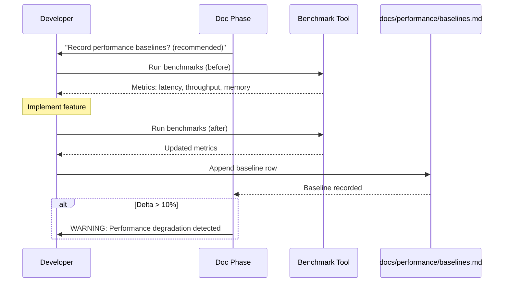

# História: Performance Baseline Tracking

**ID:** story-0004-0012

## 1. Dependências

| Blocked By | Blocks |
| :--- | :--- |
| story-0004-0005 | — |

## 2. Regras Transversais Aplicáveis

| ID | Título |
| :--- | :--- |
| RULE-001 | Dual Copy Consistency |
| RULE-002 | Source of Truth é resources/ |
| RULE-005 | Template-Based Artifacts |
| RULE-009 | Documentation Output Convention |
| RULE-012 | Generated Content Language |

## 3. Descrição

Como **Performance Engineer**, eu quero um mecanismo para registrar baselines de performance
(before/after benchmarks) no lifecycle, garantindo que o impacto de cada feature na performance
seja documentado e rastreável.

Esta story cria um template e uma convenção para tracking de performance baselines. Durante a
fase de documentação do lifecycle, um prompt guia o developer a registrar métricas de performance
antes e depois da implementação: latência (p50, p95, p99), throughput (req/s), memory footprint,
startup time. Os dados são registrados em `docs/performance/baselines.md` como tabela incremental.

### 3.1 Template de Baseline

- Formato: tabela Markdown incremental (cada feature adiciona uma linha)
- Colunas: Feature/Story ID, Date, Metric, Before, After, Delta, Notes
- Métricas padronizadas: latency_p50, latency_p95, latency_p99, throughput_rps, memory_mb, startup_ms
- O template inclui instruções de como medir cada métrica

### 3.2 Integração no Lifecycle

- Na fase de documentação, um prompt sugere ao developer registrar baselines
- O registro é recomendado (não obrigatório) para features que alteram request path
- Para features de infraestrutura: startup time e memory são priorizados

### 3.3 Alertas de Regressão

- Se a coluna Delta mostra degradação > 10%, um warning é emitido
- Se degradação > 25%, uma recomendação de investigation é gerada

## 4. Definições de Qualidade Locais

### DoR Local (Definition of Ready)

- [ ] Fase de documentação implementada (story-0004-0005)
- [ ] Métricas de performance padrão identificadas
- [ ] Ferramentas de benchmarking por stack pesquisadas

### DoD Local (Definition of Done)

- [ ] Template `_TEMPLATE-PERFORMANCE-BASELINE.md` criado
- [ ] Geração de `docs/performance/baselines.md` no pipeline
- [ ] Prompt de registro de baselines no lifecycle doc phase
- [ ] Ambas as cópias atualizadas (RULE-001)
- [ ] Golden file tests validando output

### Global Definition of Done (DoD)

- **Cobertura:** ≥ 95% Line, ≥ 90% Branch
- **Testes Automatizados:** Golden file tests
- **TDD Compliance:** Commits test-first
- **Backward Compatibility:** Projetos sem baselines funcionam normalmente

## 5. Contratos de Dados (Data Contract)

**Performance Baseline Output:**

| Campo | Formato | Request | Response | Origem / Regra |
| :--- | :--- | :--- | :--- | :--- |
| `# Performance Baselines` | Markdown H1 | — | M | Título fixo |
| `## Measurement Guide` | Markdown H2 | — | M | Instruções de como medir cada métrica |
| `## Baselines` | Markdown H2 | — | M | Tabela incremental de baselines |
| Feature/Story ID | String column | — | M | ID da story que motivou a medição |
| Date | ISO date column | — | M | Data da medição |
| Metric | Enum column | — | M | latency_p50/p95/p99, throughput_rps, memory_mb, startup_ms |
| Before | Numeric column | — | M | Valor antes da mudança |
| After | Numeric column | — | M | Valor depois da mudança |
| Delta | Percentage column | — | M | Derive: ((After-Before)/Before)*100 |
| Notes | String column | — | O | Observações |

## 6. Diagramas

### 6.1 Fluxo de Registro de Baselines



## 7. Critérios de Aceite (Gherkin)

```gherkin
Cenario: Template de performance baseline gerado com seções obrigatórias
  DADO que o ia-dev-env é executado para um novo projeto
  QUANDO a geração de templates é concluída
  ENTÃO o arquivo resources/templates/_TEMPLATE-PERFORMANCE-BASELINE.md deve existir
  E deve conter seções Measurement Guide e Baselines

Cenario: Tabela de baselines com colunas padronizadas
  DADO que o template de performance baseline foi gerado
  QUANDO a seção Baselines é inspecionada
  ENTÃO deve conter tabela com colunas Feature, Date, Metric, Before, After, Delta, Notes

Cenario: Measurement guide documenta como medir cada métrica
  DADO que o template de performance baseline foi gerado
  QUANDO a seção Measurement Guide é inspecionada
  ENTÃO deve conter instruções para latency_p50, latency_p95, throughput_rps, memory_mb
  E deve incluir comandos/ferramentas sugeridos por stack

Cenario: Delta calculado automaticamente como percentual
  DADO que uma baseline registra Before=100ms e After=120ms para latency_p95
  QUANDO o delta é calculado
  ENTÃO deve mostrar +20%
  E uma nota de warning deve ser sugerida (degradação > 10%)

Cenario: Registro de baseline é recomendado, não obrigatório
  DADO que a fase de documentação é executada
  QUANDO o prompt de baseline é apresentado
  ENTÃO deve ser formulado como recomendação ("recommended")
  E o skip do registro não deve bloquear a fase

Cenario: Backward compatibility com projetos sem docs/performance/
  DADO que um projeto existente não possui docs/performance/
  QUANDO o ia-dev-env é re-executado
  ENTÃO o diretório docs/performance/ deve ser criado sem erros
  E nenhum artefato existente deve ser afetado
```

### 7.1 Scenario Ordering (TPP)

> TPP: degenerate (template exists) → unconditional (columns, measurement guide) →
> conditions (delta calculation, recommended not mandatory) → edge cases (backward compat).

### 7.2 Mandatory Scenario Categories

- [x] Degenerate cases (template generated)
- [x] Happy path (columns, measurement guide)
- [x] Error paths (delta warning)
- [x] Boundary values (optional, backward compat)

## 8. Sub-tarefas

- [ ] [Dev] Criar template `resources/templates/_TEMPLATE-PERFORMANCE-BASELINE.md`
- [ ] [Dev] Implementar Measurement Guide com instruções por stack
- [ ] [Dev] Implementar tabela incremental de baselines com colunas padronizadas
- [ ] [Dev] Adicionar prompt de registro no lifecycle doc phase
- [ ] [Dev] Implementar cálculo de delta e alertas de regressão
- [ ] [Dev] Replicar em dual copy locations (RULE-001)
- [ ] [Test] Unitário: validar estrutura do template
- [ ] [Test] Integração: golden file test para output
- [ ] [Doc] Atualizar CHANGELOG
