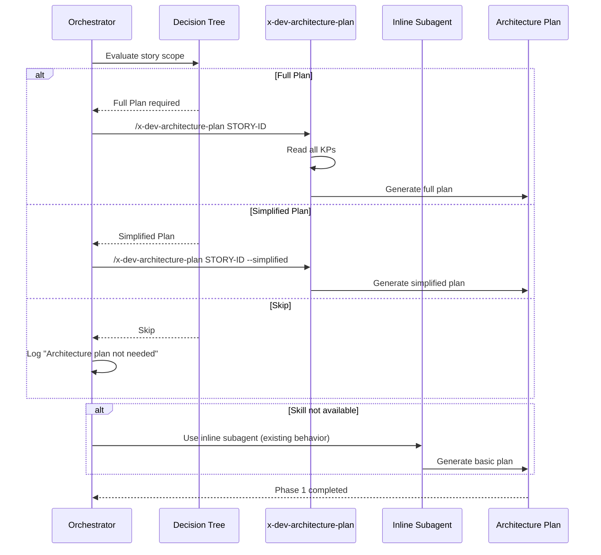

# História: Integração do Architecture Plan no Lifecycle Completo

**ID:** story-0004-0013

## 1. Dependências

| Blocked By | Blocks |
| :--- | :--- |
| story-0004-0005, story-0004-0006 | story-0004-0017 |

## 2. Regras Transversais Aplicáveis

| ID | Título |
| :--- | :--- |
| RULE-001 | Dual Copy Consistency |
| RULE-002 | Source of Truth é resources/ |
| RULE-003 | Backward Compatibility |
| RULE-008 | Incremental Architecture Updates |
| RULE-010 | Lifecycle Phase Integrity |
| RULE-012 | Generated Content Language |

## 3. Descrição

Como **Architect**, eu quero que o `x-dev-lifecycle` integre a skill `x-dev-architecture-plan`
na Phase 1 (Architecture Planning), garantindo que features complexas tenham um architecture
plan antes da implementação.

Esta story de composição conecta a skill `x-dev-architecture-plan` (story-0004-0006) ao lifecycle
(story-0004-0005). A Phase 1 existente do lifecycle já faz "Architecture Planning" com um subagent,
mas de forma simplificada. Esta integração substitui o subagent inline por uma invocação da skill
dedicada `x-dev-architecture-plan`, que lê todos os KPs e produz output mais completo.

A integração usa o decision tree da skill para determinar se um full plan, simplified plan ou
skip é apropriado. O output do architecture plan alimenta as fases subsequentes (implementation,
review) com contexto arquitetural.

### 3.1 Mudanças na Phase 1

- Substituir o subagent inline por invocação de `/x-dev-architecture-plan`
- Usar o decision tree da skill para decidir Full/Simplified/Skip
- Output salvo em `docs/stories/epic-XXXX/plans/architecture-story-XXXX-YYYY.md`
- Falha no architecture plan emite warning mas não bloqueia (soft dependency)

### 3.2 Propagação para Fases Subsequentes

- Phase 2 (Implementation): ler o architecture plan como contexto adicional
- Phase 3 (Documentation): usar architecture plan para enriquecer docs geradas
- Phase 4 (Review): reviewers validam conformidade com architecture plan

### 3.3 Backward Compatibility

- Se `x-dev-architecture-plan` não estiver disponível, fallback para o subagent inline existente
- Projetos que não usam a skill continuam com o comportamento atual

## 4. Definições de Qualidade Locais

### DoR Local (Definition of Ready)

- [ ] Skill x-dev-architecture-plan implementada (story-0004-0006)
- [ ] Fase de documentação no lifecycle implementada (story-0004-0005)
- [ ] Phase 1 existente do lifecycle compreendida em detalhe

### DoD Local (Definition of Done)

- [ ] Phase 1 do lifecycle atualizada para invocar x-dev-architecture-plan
- [ ] Decision tree integrado (Full/Simplified/Skip)
- [ ] Fallback para subagent inline implementado
- [ ] Phases 2, 3, 4 referenciam o architecture plan
- [ ] Ambas as cópias atualizadas (RULE-001)
- [ ] Golden file tests validando output

### Global Definition of Done (DoD)

- **Cobertura:** ≥ 95% Line, ≥ 90% Branch
- **Testes Automatizados:** Golden file tests
- **TDD Compliance:** Commits test-first
- **Backward Compatibility:** Fallback para comportamento anterior

## 5. Contratos de Dados (Data Contract)

**x-dev-lifecycle SKILL.md (Phase 1 modificada):**

| Campo | Formato | Request | Response | Origem / Regra |
| :--- | :--- | :--- | :--- | :--- |
| `## Phase 1 — Architecture Planning` | Markdown H2 (modified) | — | M | Invocação de x-dev-architecture-plan |
| Decision tree evaluation | Logic block | Story context | M | Full/Simplified/Skip |
| Skill invocation | `/x-dev-architecture-plan STORY-ID` | — | M | Se Full ou Simplified |
| Fallback block | Subagent inline | — | M | Se skill não disponível |
| Architecture plan path | File path | — | M | `docs/stories/epic-XXXX/plans/architecture-story-XXXX-YYYY.md` |

## 6. Diagramas

### 6.1 Phase 1 com Architecture Plan Integrado



## 7. Critérios de Aceite (Gherkin)

```gherkin
Cenario: Phase 1 invoca x-dev-architecture-plan para story complexa
  DADO que o lifecycle está na Phase 1
  E a story envolve nova integração (decision tree → Full Plan)
  QUANDO a Phase 1 é executada
  ENTÃO o lifecycle deve invocar /x-dev-architecture-plan STORY-ID
  E o architecture plan deve ser salvo em docs/stories/epic-XXXX/plans/

Cenario: Decision tree Skip para bug fix
  DADO que o lifecycle está na Phase 1
  E a story é um bug fix sem mudança de contrato
  QUANDO o decision tree é avaliado
  ENTÃO o resultado deve ser "Skip"
  E nenhum architecture plan deve ser gerado
  E um log "Architecture plan not needed" deve ser emitido

Cenario: Fallback para subagent inline quando skill não disponível
  DADO que a skill x-dev-architecture-plan não está disponível no projeto
  QUANDO a Phase 1 é executada
  ENTÃO o fallback deve invocar o subagent inline existente
  E o plan básico deve ser gerado normalmente

Cenario: Architecture plan referenciado em Phase 2 como contexto
  DADO que um architecture plan foi gerado na Phase 1
  QUANDO a Phase 2 (Implementation) é executada
  ENTÃO o prompt do subagent de implementação deve incluir referência ao architecture plan
  E o subagent deve ler o plan como contexto adicional

Cenario: Phase 4 (Review) valida conformidade com architecture plan
  DADO que um architecture plan foi gerado na Phase 1
  QUANDO a Phase 4 (Review) é executada
  ENTÃO os reviewers devem ter acesso ao architecture plan
  E devem validar se a implementação segue as decisões documentadas

Cenario: Lifecycle continua normalmente mesmo se architecture plan falha
  DADO que a skill x-dev-architecture-plan é invocada mas falha
  QUANDO o erro é detectado
  ENTÃO um warning deve ser emitido
  E o lifecycle deve continuar para Phase 2 sem bloquear
```

### 7.1 Scenario Ordering (TPP)

> TPP: degenerate (invocation happens) → unconditional (skip, fallback) → conditions
> (Phase 2 reference, Phase 4 validation) → edge cases (skill failure non-blocking).

### 7.2 Mandatory Scenario Categories

- [x] Degenerate cases (Phase 1 invokes skill)
- [x] Happy path (full plan, propagation to phases)
- [x] Error paths (skill failure, fallback)
- [x] Boundary values (skip for bug fix)

## 8. Sub-tarefas

- [ ] [Dev] Modificar Phase 1 do x-dev-lifecycle para invocar x-dev-architecture-plan
- [ ] [Dev] Implementar decision tree evaluation na Phase 1
- [ ] [Dev] Implementar fallback para subagent inline
- [ ] [Dev] Adicionar referência ao architecture plan na Phase 2 (implementation prompt)
- [ ] [Dev] Adicionar referência ao architecture plan na Phase 4 (review context)
- [ ] [Dev] Replicar mudanças em dual copy locations (RULE-001)
- [ ] [Test] Unitário: validar decision tree logic (Full/Simplified/Skip)
- [ ] [Test] Integração: golden file test do lifecycle com skill integrada
- [ ] [Test] Integração: fallback test quando skill indisponível
- [ ] [Doc] Atualizar CHANGELOG
