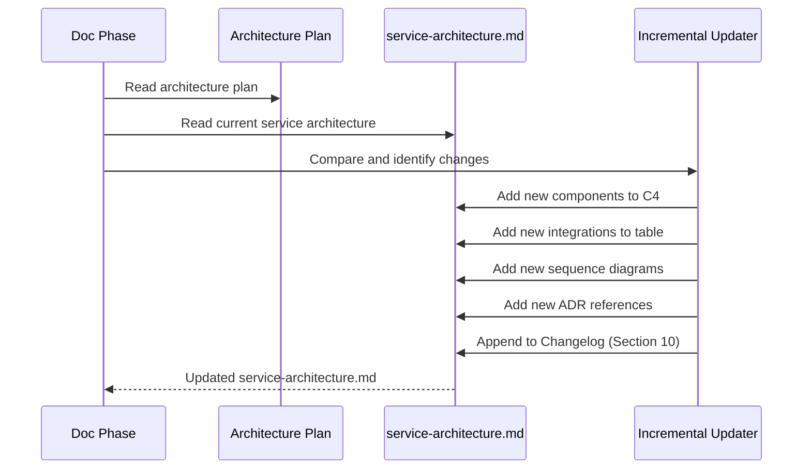

# História: Atualização Incremental do Service Architecture Doc

**ID:** story-0004-0014

## 1. Dependências

| Blocked By | Blocks |
| :--- | :--- |
| story-0004-0002, story-0004-0006 | — |

## 2. Regras Transversais Aplicáveis

| ID | Título |
| :--- | :--- |
| RULE-001 | Dual Copy Consistency |
| RULE-002 | Source of Truth é resources/ |
| RULE-005 | Template-Based Artifacts |
| RULE-008 | Incremental Architecture Updates |
| RULE-009 | Documentation Output Convention |
| RULE-012 | Generated Content Language |

## 3. Descrição

Como **Architect**, eu quero que o documento de arquitetura de serviço
(`docs/architecture/service-architecture.md`) seja atualizado incrementalmente a cada feature
que altere a arquitetura, garantindo que o documento reflita sempre o estado atual do serviço.

Esta story implementa o mecanismo de atualização incremental (RULE-008). Quando um architecture
plan é gerado (story-0004-0006) e uma feature é implementada, o document de arquitetura de
serviço é atualizado com as mudanças: novos componentes, novas integrações, novos fluxos,
novas ADRs referenciadas. O documento não é reescrito — as mudanças são inseridas nas seções
apropriadas e o changelog interno é atualizado.

### 3.1 Mecanismo de Atualização

- Ler o architecture plan da feature (se existir)
- Comparar com o documento de arquitetura de serviço existente
- Para cada seção afetada:
  - Adicionar novos componentes ao C4 diagram
  - Adicionar novas integrações à tabela
  - Adicionar novos fluxos como novos sequence diagrams
  - Adicionar links para novos ADRs
  - Atualizar NFRs se targets mudaram
- Registrar a mudança no Histórico de Mudanças (Seção 10)

### 3.2 Regras de Atualização

- NUNCA remover conteúdo existente (apenas adicionar ou emendar)
- Se um componente foi refatorado: manter o antigo como deprecated e adicionar o novo
- Se um fluxo mudou: adicionar nova versão do diagrama, manter o anterior marcado como "v1"
- Conflitos de merge devem ser resolvidos preservando ambas as versões

### 3.3 Integração

- Executado durante a fase de documentação do lifecycle (Phase 3)
- Ou invocado standalone após architecture plan ser gerado
- Prompt instrui o subagent a ler ambos os documentos e produzir diff incremental

## 4. Definições de Qualidade Locais

### DoR Local (Definition of Ready)

- [ ] Template de service architecture criado (story-0004-0002)
- [ ] Skill x-dev-architecture-plan implementada (story-0004-0006)
- [ ] Mecanismo de atualização incremental pesquisado

### DoD Local (Definition of Done)

- [ ] Prompt de atualização incremental criado
- [ ] Regras de preservação de conteúdo implementadas
- [ ] Changelog interno atualizado em cada update
- [ ] Ambas as cópias atualizadas (RULE-001)
- [ ] Golden file tests validando atualização incremental

### Global Definition of Done (DoD)

- **Cobertura:** ≥ 95% Line, ≥ 90% Branch
- **Testes Automatizados:** Golden file tests
- **TDD Compliance:** Commits test-first
- **Backward Compatibility:** Docs existentes preservadas

## 5. Contratos de Dados (Data Contract)

**Incremental Update Protocol:**

| Campo | Formato | Request | Response | Origem / Regra |
| :--- | :--- | :--- | :--- | :--- |
| Architecture plan input | File path | M | — | `docs/stories/epic-XXXX/plans/architecture-*` |
| Service architecture doc | File path | M | M | `docs/architecture/service-architecture.md` |
| Updated sections | Markdown diff | — | M | Seções modificadas com conteúdo adicionado |
| Changelog entry | Markdown row | — | M | Data, Story ID, Seções afetadas, Resumo |

## 6. Diagramas

### 6.1 Fluxo de Atualização Incremental



## 7. Critérios de Aceite (Gherkin)

```gherkin
Cenario: Documento atualizado com novos componentes do architecture plan
  DADO que o service-architecture.md existe com 3 componentes no C4 diagram
  E o architecture plan adiciona 1 novo componente "CacheService"
  QUANDO a atualização incremental é executada
  ENTÃO o C4 diagram deve conter 4 componentes
  E "CacheService" deve estar presente no diagrama
  E os 3 componentes anteriores devem estar preservados

Cenario: Nova integração adicionada à tabela de integrações
  DADO que a tabela de integrações tem 2 linhas
  E o architecture plan define nova integração com "Redis" via "TCP"
  QUANDO a atualização incremental é executada
  ENTÃO a tabela deve ter 3 linhas
  E a nova linha deve conter Redis, TCP e propósito

Cenario: Changelog interno atualizado com entrada da mudança
  DADO que o service-architecture.md tem Seção 10 (Histórico de Mudanças) com 2 entradas
  QUANDO a atualização incremental adiciona novo componente
  ENTÃO a Seção 10 deve ter 3 entradas
  E a nova entrada deve conter data, story ID e seções afetadas

Cenario: Conteúdo existente nunca removido na atualização
  DADO que o service-architecture.md tem conteúdo em todas as 10 seções
  QUANDO a atualização incremental é executada
  ENTÃO todas as 10 seções devem manter seu conteúdo original
  E apenas novas adições devem aparecer

Cenario: Atualização skipped quando não há architecture plan
  DADO que nenhum architecture plan foi gerado para a feature
  QUANDO a fase de documentação tenta a atualização incremental
  ENTÃO a atualização deve ser skipped com log informativo
  E o service-architecture.md não deve ser modificado

Cenario: Documento criado do zero se não existir
  DADO que docs/architecture/service-architecture.md NÃO existe
  E um architecture plan foi gerado
  QUANDO a atualização incremental é executada
  ENTÃO o documento deve ser criado a partir do template (story-0004-0002)
  E deve ser populado com dados do architecture plan
```

### 7.1 Scenario Ordering (TPP)

> TPP: degenerate (update with new component) → unconditional (new integration, changelog)
> → conditions (preserve existing, skip without plan) → edge cases (create from zero).

### 7.2 Mandatory Scenario Categories

- [x] Degenerate cases (incremental update)
- [x] Happy path (components, integrations, changelog)
- [x] Error paths (skip without plan)
- [x] Boundary values (create from scratch, preserve existing)

## 8. Sub-tarefas

- [ ] [Dev] Criar prompt de atualização incremental para subagent
- [ ] [Dev] Implementar regras de preservação de conteúdo (nunca remover)
- [ ] [Dev] Implementar atualização do changelog interno (Seção 10)
- [ ] [Dev] Implementar criação do documento from scratch quando não existe
- [ ] [Dev] Integrar com fase de documentação do lifecycle
- [ ] [Dev] Replicar em dual copy locations (RULE-001)
- [ ] [Test] Unitário: validar preservação de conteúdo em updates
- [ ] [Test] Integração: golden file test de update incremental
- [ ] [Test] Integração: golden file test de criação from scratch
- [ ] [Doc] Atualizar CHANGELOG
