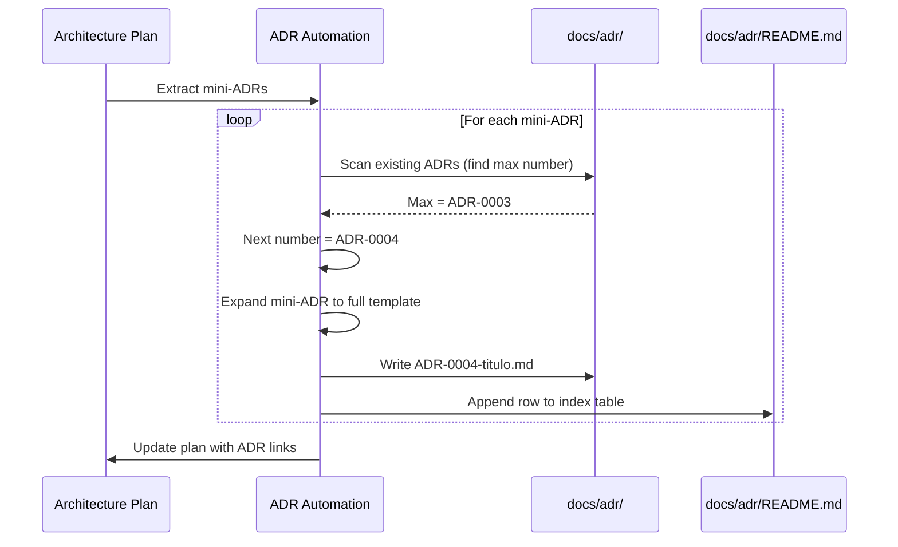

# História: ADR Automation — Geração e Indexação Automática

**ID:** story-0004-0015

## 1. Dependências

| Blocked By | Blocks |
| :--- | :--- |
| story-0004-0001, story-0004-0006 | — |

## 2. Regras Transversais Aplicáveis

| ID | Título |
| :--- | :--- |
| RULE-001 | Dual Copy Consistency |
| RULE-002 | Source of Truth é resources/ |
| RULE-005 | Template-Based Artifacts |
| RULE-006 | ADR Sequential Numbering |
| RULE-009 | Documentation Output Convention |
| RULE-012 | Generated Content Language |

## 3. Descrição

Como **Architect**, eu quero que ADRs sejam gerados automaticamente a partir de decisões
arquiteturais tomadas no architecture plan, e que o índice de ADRs seja atualizado
automaticamente, garantindo que toda decisão relevante seja documentada sem esforço manual.

Esta story automatiza o ciclo de vida dos ADRs. Quando o `x-dev-architecture-plan` produz
mini-ADRs inline (decisões arquiteturais), esta automação os converte em ADRs completos
seguindo o template (story-0004-0001), atribui numeração sequencial, e atualiza o índice
em `docs/adr/README.md`.

### 3.1 Fluxo de Automação

1. Ler architecture plan e extrair mini-ADRs inline
2. Para cada mini-ADR:
   a. Determinar próximo número sequencial (ler docs/adr/ e encontrar max+1)
   b. Expandir mini-ADR para formato completo usando _TEMPLATE-ADR.md
   c. Salvar como `docs/adr/ADR-NNNN-titulo.md`
   d. Adicionar entrada ao índice `docs/adr/README.md`
3. Adicionar referência cruzada: story → ADR e ADR → story

### 3.2 Conversão Mini-ADR → ADR Completo

- Mini-ADR contém: Context, Decision, Rationale (3 campos)
- ADR completo adiciona: Status (Accepted), Date, Deciders, Consequences (Positive/Negative/Neutral)
- Consequences são inferidas a partir do Rationale e do contexto da story

### 3.3 Referência Cruzada

- Cada ADR gerado inclui campo `story-ref` no frontmatter
- O architecture plan é atualizado com links para os ADRs gerados
- O service architecture doc (se existir) é atualizado com novos ADR links na Seção 7

### 3.4 Detecção de Duplicatas

- Antes de criar um ADR, verificar se já existe ADR com título similar
- Se duplicata detectada: log warning e skip (não sobrescrever)

## 4. Definições de Qualidade Locais

### DoR Local (Definition of Ready)

- [ ] Template ADR criado (story-0004-0001)
- [ ] Skill x-dev-architecture-plan com mini-ADRs implementada (story-0004-0006)
- [ ] Formato de mini-ADR inline compreendido

### DoD Local (Definition of Done)

- [ ] Automação de conversão mini-ADR → ADR completo implementada
- [ ] Numeração sequencial automática funcional
- [ ] Índice `docs/adr/README.md` auto-atualizado
- [ ] Referência cruzada story ↔ ADR implementada
- [ ] Detecção de duplicatas funcional
- [ ] Ambas as cópias atualizadas (RULE-001)
- [ ] Golden file tests

### Global Definition of Done (DoD)

- **Cobertura:** ≥ 95% Line, ≥ 90% Branch
- **Testes Automatizados:** Golden file tests
- **TDD Compliance:** Commits test-first
- **Backward Compatibility:** Projetos sem ADRs não afetados

## 5. Contratos de Dados (Data Contract)

**Mini-ADR Input (from architecture plan):**

| Campo | Formato | Request | Response | Origem / Regra |
| :--- | :--- | :--- | :--- | :--- |
| `title` | String | M | — | Título da decisão |
| `context` | String | M | — | Contexto do problema |
| `decision` | String | M | — | Decisão tomada |
| `rationale` | String | M | — | Justificativa |

**ADR Output (expanded):**

| Campo | Formato | Request | Response | Origem / Regra |
| :--- | :--- | :--- | :--- | :--- |
| `status` | YAML frontmatter | — | M | "Accepted" |
| `date` | YAML frontmatter | — | M | Data de geração |
| `story-ref` | YAML frontmatter | — | M | ID da story relacionada |
| `## Status` | Section | — | M | "Accepted — {date}" |
| `## Context` | Section | — | M | Expandido do mini-ADR context |
| `## Decision` | Section | — | M | Expandido do mini-ADR decision |
| `## Consequences` | Section | — | M | Inferido do rationale |

## 6. Diagramas

### 6.1 Fluxo de Automação de ADRs



## 7. Critérios de Aceite (Gherkin)

```gherkin
Cenario: Mini-ADR convertido em ADR completo com numeração sequencial
  DADO que o architecture plan contém 2 mini-ADRs
  E docs/adr/ contém ADR-0001 e ADR-0002
  QUANDO a automação de ADRs é executada
  ENTÃO docs/adr/ADR-0003-*.md e ADR-0004-*.md devem ser criados
  E cada ADR deve seguir o template com Status, Context, Decision, Consequences

Cenario: Índice de ADRs atualizado automaticamente
  DADO que docs/adr/README.md contém tabela com 2 ADRs
  E 2 novos ADRs são gerados
  QUANDO a automação é executada
  ENTÃO a tabela deve conter 4 linhas
  E as novas linhas devem ter status "Accepted" e data atual

Cenario: Referência cruzada story → ADR inserida no ADR
  DADO que a automação gera um ADR a partir de story-0004-0006
  QUANDO o ADR é inspecionado
  ENTÃO o frontmatter deve conter story-ref: "story-0004-0006"
  E a seção Context deve referenciar a story

Cenario: Duplicata detectada e skipped
  DADO que existe ADR-0001 com título "Use PostgreSQL for persistence"
  E o architecture plan contém mini-ADR com título "Use PostgreSQL for persistence"
  QUANDO a automação é executada
  ENTÃO nenhum novo ADR deve ser criado para essa decisão
  E um warning "Duplicate ADR detected, skipping" deve ser emitido

Cenario: Automação funciona com diretório docs/adr/ vazio
  DADO que docs/adr/ existe mas não contém nenhum ADR
  QUANDO a automação é executada com 1 mini-ADR
  ENTÃO ADR-0001-*.md deve ser criado
  E o índice README.md deve conter 1 linha

Cenario: Architecture plan atualizado com links para ADRs gerados
  DADO que 2 ADRs foram gerados (ADR-0003, ADR-0004)
  QUANDO a automação finaliza
  ENTÃO o architecture plan deve ser atualizado com links [ADR-0003](../../docs/adr/ADR-0003-*.md)
```

### 7.1 Scenario Ordering (TPP)

> TPP: degenerate (conversion with numbering) → unconditional (index update, cross-reference)
> → conditions (duplicate detection, empty directory) → edge cases (plan update with links).

### 7.2 Mandatory Scenario Categories

- [x] Degenerate cases (conversion and numbering)
- [x] Happy path (index update, cross-reference)
- [x] Error paths (duplicate detection)
- [x] Boundary values (empty directory, plan update)

## 8. Sub-tarefas

- [ ] [Dev] Implementar extração de mini-ADRs do architecture plan
- [ ] [Dev] Implementar conversão mini-ADR → ADR completo com template
- [ ] [Dev] Implementar numeração sequencial automática
- [ ] [Dev] Implementar auto-atualização do índice docs/adr/README.md
- [ ] [Dev] Implementar referência cruzada story ↔ ADR
- [ ] [Dev] Implementar detecção de duplicatas por título
- [ ] [Dev] Replicar em dual copy locations (RULE-001)
- [ ] [Test] Unitário: validar conversão e numeração
- [ ] [Test] Integração: golden file test com múltiplos ADRs
- [ ] [Test] Integração: detecção de duplicatas
- [ ] [Doc] Atualizar CHANGELOG
