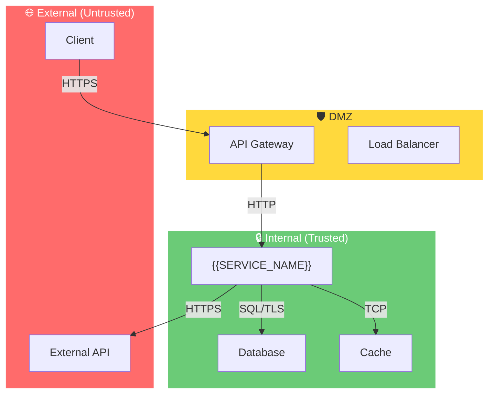

# História: Documentação de Security Threat Model

**ID:** story-0004-0016

## 1. Dependências

| Blocked By | Blocks |
| :--- | :--- |
| story-0004-0006 | — |

## 2. Regras Transversais Aplicáveis

| ID | Título |
| :--- | :--- |
| RULE-001 | Dual Copy Consistency |
| RULE-002 | Source of Truth é resources/ |
| RULE-005 | Template-Based Artifacts |
| RULE-009 | Documentation Output Convention |
| RULE-012 | Generated Content Language |

## 3. Descrição

Como **Security Engineer**, eu quero que o architecture plan e o security review gerem
automaticamente documentação de threat model, garantindo que riscos de segurança sejam
documentados e rastreáveis para cada feature que altera superfície de ataque.

Atualmente, o `/x-review` inclui um Security Engineer review que identifica vulnerabilidades
e recomendações, mas os findings não são consolidados em um threat model persistente. Esta
story cria um template de threat model e um mecanismo para consolidar findings de security
review em `docs/security/threat-model.md`.

### 3.1 Template de Threat Model

- Formato: STRIDE-based (Spoofing, Tampering, Repudiation, Information Disclosure,
  Denial of Service, Elevation of Privilege)
- Seção por componente/interface: threats identificados, severidade, mitigação
- Tabela de riscos: Threat, Severity (Critical/High/Medium/Low), Mitigation, Status
- Diagrama de trust boundaries (Mermaid)
- Atualizado incrementalmente (RULE-008 aplica)

### 3.2 Integração com Architecture Plan

- O `x-dev-architecture-plan` inclui análise de impacto que cobre segurança
- Os findings de segurança do plan são extraídos e inseridos no threat model
- Cada entry no threat model referencia a story/feature que o introduziu

### 3.3 Integração com Security Review

- Após o `/x-review` ser executado, findings do Security Engineer são extraídos
- Findings com severity High ou Critical são automaticamente adicionados ao threat model
- Findings com severity Medium são adicionados como candidatos (status: "Under Review")

### 3.4 Output

- `docs/security/threat-model.md` — documento vivo incrementado a cada feature
- Template: `resources/templates/_TEMPLATE-THREAT-MODEL.md`

## 4. Definições de Qualidade Locais

### DoR Local (Definition of Ready)

- [ ] Skill x-dev-architecture-plan implementada (story-0004-0006)
- [ ] STRIDE methodology pesquisada
- [ ] Security KP lido e compreendido
- [ ] Formato de findings do x-review Security Engineer compreendido

### DoD Local (Definition of Done)

- [ ] Template `_TEMPLATE-THREAT-MODEL.md` criado
- [ ] Geração de `docs/security/threat-model.md` implementada
- [ ] Extração de findings do architecture plan funcional
- [ ] Extração de findings do security review funcional
- [ ] Ambas as cópias atualizadas (RULE-001)
- [ ] Golden file tests validando output

### Global Definition of Done (DoD)

- **Cobertura:** ≥ 95% Line, ≥ 90% Branch
- **Testes Automatizados:** Golden file tests
- **TDD Compliance:** Commits test-first
- **Backward Compatibility:** Projetos sem threat model não afetados

## 5. Contratos de Dados (Data Contract)

**Threat Model Output:**

| Campo | Formato | Request | Response | Origem / Regra |
| :--- | :--- | :--- | :--- | :--- |
| `# Threat Model — {{SERVICE_NAME}}` | Markdown H1 | — | M | Título com nome do serviço |
| `## Trust Boundaries` | Mermaid diagram | — | M | Diagram showing trust boundaries |
| `## STRIDE Analysis` | Markdown H2 | — | M | Uma sub-seção por categoria STRIDE |
| Risk table | Markdown table per category | — | M | Colunas: Threat, Severity, Mitigation, Status, Story Ref |
| `## Risk Summary` | Markdown H2 | — | M | Contagem por severity: Critical, High, Medium, Low |
| `## Change History` | Markdown H2 | — | M | Changelog: Date, Story, Threats Added/Updated |

**Severity enum:** Critical, High, Medium, Low

**Status enum:** Open, Mitigated, Accepted, Under Review

## 6. Diagramas

### 6.1 Trust Boundary Diagram (Template)



## 7. Critérios de Aceite (Gherkin)

```gherkin
Cenario: Template de threat model gerado com categorias STRIDE
  DADO que o ia-dev-env é executado para um novo projeto
  QUANDO a geração de templates é concluída
  ENTÃO resources/templates/_TEMPLATE-THREAT-MODEL.md deve existir
  E deve conter seções para cada categoria STRIDE
  E deve conter tabela de riscos com colunas Threat, Severity, Mitigation, Status

Cenario: Trust boundary diagram incluído em Mermaid
  DADO que o template de threat model foi gerado
  QUANDO a seção Trust Boundaries é inspecionada
  ENTÃO deve conter um diagrama Mermaid com subgraphs
  E deve separar External, DMZ e Internal zones

Cenario: Findings de architecture plan extraídos para threat model
  DADO que o architecture plan contém 2 findings de segurança
  QUANDO o threat model é atualizado
  ENTÃO a tabela de riscos deve conter 2 novas entradas
  E cada entrada deve ter story reference

Cenario: Security review findings High/Critical adicionados automaticamente
  DADO que o security review identifica 1 finding Critical e 1 Medium
  QUANDO o threat model é atualizado
  ENTÃO o finding Critical deve ser adicionado com status "Open"
  E o finding Medium deve ser adicionado com status "Under Review"

Cenario: Threat model atualizado incrementalmente sem perder entries anteriores
  DADO que o threat model tem 3 entries existentes
  E novos findings adicionam 2 entries
  QUANDO a atualização é executada
  ENTÃO o threat model deve ter 5 entries
  E as 3 entries anteriores devem estar preservadas

Cenario: Risk summary contabiliza corretamente por severity
  DADO que o threat model tem 1 Critical, 2 High, 3 Medium, 1 Low
  QUANDO a seção Risk Summary é inspecionada
  ENTÃO deve mostrar Critical: 1, High: 2, Medium: 3, Low: 1
  E o total deve ser 7
```

### 7.1 Scenario Ordering (TPP)

> TPP: degenerate (template with STRIDE) → unconditional (trust boundary, extraction)
> → conditions (severity-based auto-add) → edge cases (incremental, summary).

### 7.2 Mandatory Scenario Categories

- [x] Degenerate cases (template with STRIDE categories)
- [x] Happy path (extraction, auto-add)
- [x] Error paths (incremental preservation)
- [x] Boundary values (severity-based rules, risk summary)

## 8. Sub-tarefas

- [ ] [Dev] Criar template `resources/templates/_TEMPLATE-THREAT-MODEL.md` com STRIDE
- [ ] [Dev] Implementar trust boundary diagram template em Mermaid
- [ ] [Dev] Implementar extração de findings do architecture plan
- [ ] [Dev] Implementar extração de findings do security review
- [ ] [Dev] Implementar severity-based auto-add rules (Critical/High → Open, Medium → Under Review)
- [ ] [Dev] Implementar atualização incremental do threat model
- [ ] [Dev] Implementar Risk Summary com contagem por severity
- [ ] [Dev] Replicar em dual copy locations (RULE-001)
- [ ] [Test] Unitário: validar template STRIDE e tabela de riscos
- [ ] [Test] Integração: golden file test de extração e atualização
- [ ] [Doc] Atualizar CHANGELOG
