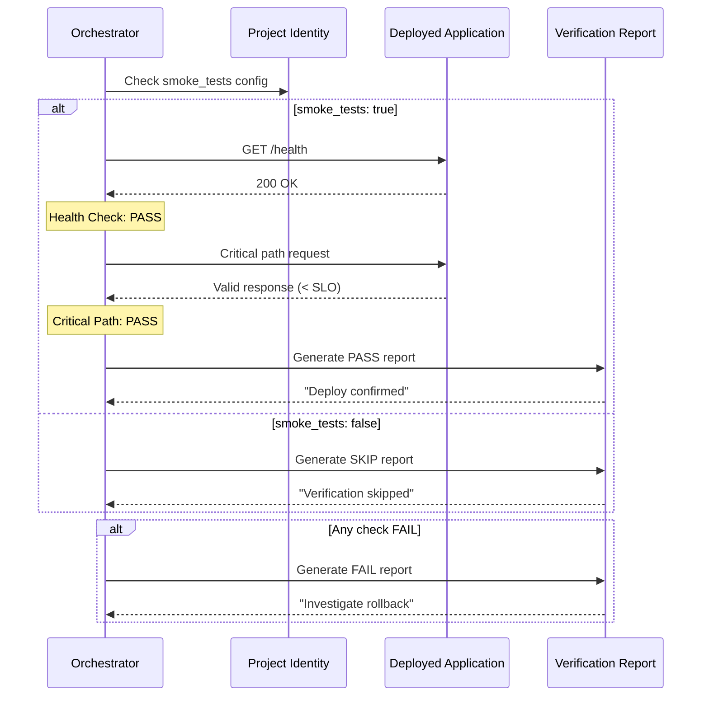

# História: Post-Deploy Verification Step

**ID:** story-0004-0017

## 1. Dependências

| Blocked By | Blocks |
| :--- | :--- |
| story-0004-0013 | — |

## 2. Regras Transversais Aplicáveis

| ID | Título |
| :--- | :--- |
| RULE-001 | Dual Copy Consistency |
| RULE-002 | Source of Truth é resources/ |
| RULE-003 | Backward Compatibility |
| RULE-010 | Lifecycle Phase Integrity |
| RULE-012 | Generated Content Language |

## 3. Descrição

Como **DevOps Engineer**, eu quero que o `x-dev-lifecycle` inclua um passo de verificação
pós-deploy com smoke tests automatizados, garantindo que a feature deployada funcione
corretamente em ambiente de produção/staging antes de declarar o deploy como sucesso.

O lifecycle atual termina na Phase 7 (verificação) que faz checklist de DoD e limpeza.
Esta story adiciona um sub-passo na fase final que, quando configurado, executa smoke
tests automatizados contra o ambiente deployado. Isso completa o ciclo do planejamento
à validação em produção.

### 3.1 Post-Deploy Verification

- Executado como sub-passo da fase final do lifecycle (após PR merge e deploy)
- Condicional: apenas quando `smoke_tests: true` no project identity
- Invoca a skill `/run-e2e` ou um script de smoke test configurado
- Valida: health check endpoints, critical path request, response time SLO

### 3.2 Verificações Realizadas

- **Health Check**: GET /health ou endpoint configurado → 200 OK
- **Critical Path**: Request básico do fluxo principal → response válido
- **Response Time**: Latência < SLO configurado (p95)
- **Error Rate**: Taxa de erro < threshold (default 1%)

### 3.3 Resultado

- PASS: Todos os checks passaram → Deploy confirmado
- FAIL: Algum check falhou → Alerta para rollback manual
- SKIP: smoke_tests=false → Verificação skipped com log

### 3.4 Integração no Lifecycle

- Sub-passo na Phase final (Phase 8 após renumeração da story-0004-0005)
- Executado após PR merge (manual trigger ou CI-triggered)
- Não bloqueia automaticamente — emite resultado para decisão humana

## 4. Definições de Qualidade Locais

### DoR Local (Definition of Ready)

- [ ] Architecture plan integrado no lifecycle (story-0004-0013)
- [ ] Lifecycle renumerado com nova fase de documentação (story-0004-0005)
- [ ] Skill /run-e2e existente e funcional
- [ ] Formato de smoke tests compreendido

### DoD Local (Definition of Done)

- [ ] Sub-passo de post-deploy verification na fase final do lifecycle
- [ ] Verificações de health check, critical path, response time, error rate
- [ ] Resultado PASS/FAIL/SKIP com detalhes
- [ ] Condicional por configuração smoke_tests
- [ ] Ambas as cópias atualizadas (RULE-001)
- [ ] Golden file tests validando output

### Global Definition of Done (DoD)

- **Cobertura:** ≥ 95% Line, ≥ 90% Branch
- **Testes Automatizados:** Golden file tests
- **TDD Compliance:** Commits test-first
- **Backward Compatibility:** Projetos sem smoke_tests não afetados

## 5. Contratos de Dados (Data Contract)

**Post-Deploy Verification Output:**

| Campo | Formato | Request | Response | Origem / Regra |
| :--- | :--- | :--- | :--- | :--- |
| `## Post-Deploy Verification` | Markdown H2 section in lifecycle | — | M | Sub-passo da fase final |
| Health Check result | Status (PASS/FAIL) | — | M | GET /health → 200 OK |
| Critical Path result | Status (PASS/FAIL) | — | M | Request principal → response válido |
| Response Time result | Status (PASS/FAIL) | — | M | p95 < SLO configurado |
| Error Rate result | Status (PASS/FAIL) | — | M | Error rate < 1% |
| Overall result | PASS/FAIL/SKIP | — | M | Agregação de todos os checks |

**Verification Report:**

| Campo | Formato | Request | Response | Origem / Regra |
| :--- | :--- | :--- | :--- | :--- |
| `timestamp` | ISO datetime | — | M | Data/hora da verificação |
| `environment` | String | — | M | staging/production |
| `checks` | Array of check results | — | M | Lista de verificações com status |
| `overall` | Enum | — | M | PASS, FAIL, SKIP |
| `recommendation` | String | — | M | "Deploy confirmed" ou "Investigate rollback" |

## 6. Diagramas

### 6.1 Fluxo de Post-Deploy Verification



## 7. Critérios de Aceite (Gherkin)

```gherkin
Cenario: Post-deploy verification PASS quando todos os checks passam
  DADO que smoke_tests é true no project identity
  E a aplicação está deployada e respondendo
  QUANDO a verificação pós-deploy é executada
  ENTÃO o health check deve retornar PASS
  E o critical path deve retornar PASS
  E o resultado overall deve ser PASS
  E a recomendação deve ser "Deploy confirmed"

Cenario: Post-deploy verification FAIL quando health check falha
  DADO que smoke_tests é true
  E a aplicação não responde no endpoint /health
  QUANDO a verificação pós-deploy é executada
  ENTÃO o health check deve retornar FAIL
  E o resultado overall deve ser FAIL
  E a recomendação deve ser "Investigate rollback"

Cenario: Post-deploy verification SKIP quando smoke_tests desabilitado
  DADO que smoke_tests é false no project identity
  QUANDO a fase final do lifecycle é executada
  ENTÃO a verificação pós-deploy deve ser skipped
  E o resultado deve ser SKIP
  E um log "Post-deploy verification skipped (smoke_tests=false)" deve ser emitido

Cenario: Response time excedendo SLO gera FAIL
  DADO que o SLO de latência p95 é 200ms
  E a aplicação responde com latência p95 de 350ms
  QUANDO a verificação pós-deploy é executada
  ENTÃO o check de response time deve retornar FAIL
  E o resultado overall deve ser FAIL
  E os detalhes devem mostrar "p95: 350ms > SLO: 200ms"

Cenario: Verification report gerado com timestamp e detalhes
  DADO que a verificação pós-deploy é executada
  QUANDO o relatório é gerado
  ENTÃO deve conter timestamp ISO, environment, lista de checks e resultado overall

Cenario: Verificação não bloqueia — apenas emite resultado
  DADO que a verificação retorna FAIL
  QUANDO o resultado é emitido
  ENTÃO o lifecycle deve reportar o FAIL como informativo
  E não deve executar rollback automático
  E a mensagem deve sugerir investigação manual
```

### 7.1 Scenario Ordering (TPP)

> TPP: degenerate (all PASS) → unconditional (health check FAIL) → conditions
> (SKIP, SLO exceeded) → edge cases (report format, non-blocking).

### 7.2 Mandatory Scenario Categories

- [x] Degenerate cases (all checks PASS)
- [x] Happy path (PASS with report)
- [x] Error paths (FAIL, SLO exceeded)
- [x] Boundary values (SKIP, non-blocking)

## 8. Sub-tarefas

- [ ] [Dev] Adicionar sub-passo de post-deploy verification na fase final do lifecycle
- [ ] [Dev] Implementar health check verification
- [ ] [Dev] Implementar critical path verification
- [ ] [Dev] Implementar response time SLO check
- [ ] [Dev] Implementar geração de verification report
- [ ] [Dev] Implementar lógica condicional (smoke_tests true/false)
- [ ] [Dev] Replicar em dual copy locations (RULE-001)
- [ ] [Test] Unitário: validar lógica de PASS/FAIL/SKIP
- [ ] [Test] Integração: golden file test do lifecycle com verification step
- [ ] [Doc] Atualizar CHANGELOG
