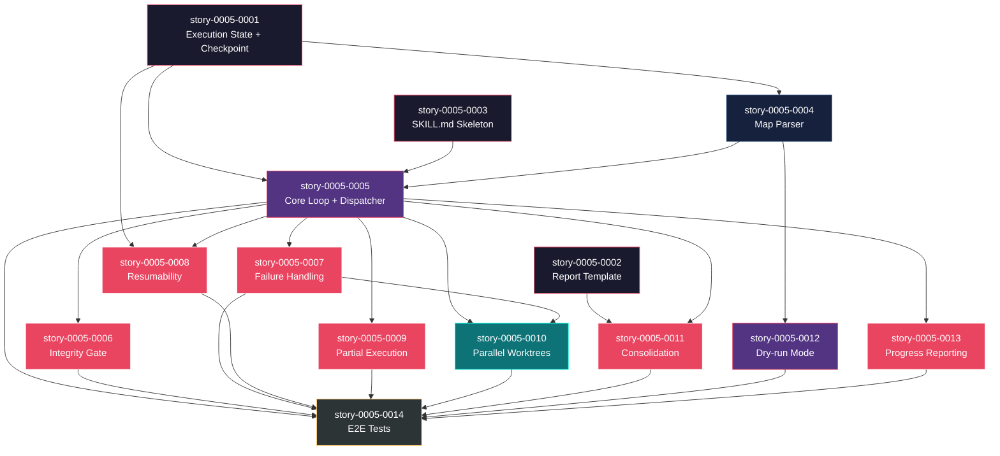

# Mapa de Implementação — Epic Orchestrator (x-dev-epic-implement)

**Gerado a partir das dependências BlockedBy/Blocks de cada história do EPIC-0005.**

---

## 1. Matriz de Dependências

| Story | Título | Blocked By | Blocks | Status |
| :--- | :--- | :--- | :--- | :--- |
| story-0005-0001 | Execution State Schema + Checkpoint Engine | — | story-0005-0004, story-0005-0005, story-0005-0008 | Concluída |
| story-0005-0002 | Epic Execution Report Template | — | story-0005-0011 | Pendente |
| story-0005-0003 | SKILL.md Skeleton + Input Parsing | — | story-0005-0005 | Pendente |
| story-0005-0004 | Implementation Map Parser | story-0005-0001 | story-0005-0005, story-0005-0012 | Pendente |
| story-0005-0005 | Orchestrator Core Loop + Sequential Dispatcher | story-0005-0001, story-0005-0003, story-0005-0004 | story-0005-0006, story-0005-0007, story-0005-0008, story-0005-0009, story-0005-0010, story-0005-0011, story-0005-0013, story-0005-0014 | Pendente |
| story-0005-0006 | Integrity Gate Between Phases | story-0005-0005 | story-0005-0014 | Pendente |
| story-0005-0007 | Failure Handling — Retry + Block Propagation | story-0005-0005 | story-0005-0010, story-0005-0014 | Pendente |
| story-0005-0008 | Resumability (`--resume`) | story-0005-0001, story-0005-0005 | story-0005-0014 | Concluída |
| story-0005-0009 | Partial Execution (`--phase N`, `--story`) | story-0005-0005 | story-0005-0014 | Pendente |
| story-0005-0010 | Parallel Execution with Worktrees | story-0005-0005, story-0005-0007 | story-0005-0014 | Pendente |
| story-0005-0011 | Consolidação Final — Review + Report + PR | story-0005-0002, story-0005-0005 | story-0005-0014 | Pendente |
| story-0005-0012 | Dry-run Mode (`--dry-run`) | story-0005-0004 | story-0005-0014 | Pendente |
| story-0005-0013 | Progress Reporting + Execution Metrics | story-0005-0005 | story-0005-0014 | Concluída |
| story-0005-0014 | E2E Tests + Generator Integration | story-0005-0005, story-0005-0006, story-0005-0007, story-0005-0008, story-0005-0009, story-0005-0010, story-0005-0011, story-0005-0012, story-0005-0013 | — | Pendente |

> **Nota:** story-0005-0005 (Orchestrator Core Loop) é o maior fan-out node, bloqueando 8 stories diretamente. É o gargalo central do projeto. story-0005-0014 (E2E Tests) é o maior fan-in node, dependendo de 9 stories — só pode ser implementada quando todo o resto estiver pronto. story-0005-0002 (Report Template) e story-0005-0003 (SKILL.md Skeleton) são raízes independentes que podem iniciar imediatamente.

---

## 2. Fases de Implementação

> As histórias são agrupadas em fases. Dentro de cada fase, as histórias podem ser implementadas **em paralelo**. Uma fase só pode iniciar quando todas as dependências das fases anteriores estiverem concluídas.

```
╔══════════════════════════════════════════════════════════════════════════════╗
║                     FASE 0 — Foundation (3 paralelas)                      ║
║                                                                            ║
║  ┌────────────────────┐  ┌────────────────────┐  ┌──────────────────────┐  ║
║  │ story-0005-0001    │  │ story-0005-0002    │  │ story-0005-0003      │  ║
║  │ Execution State    │  │ Report Template    │  │ SKILL.md Skeleton    │  ║
║  │ + Checkpoint       │  │                    │  │ + Input Parsing      │  ║
║  └─────────┬──────────┘  └────────┬───────────┘  └──────────┬───────────┘  ║
╚════════════╪══════════════════════╪══════════════════════════╪══════════════╝
             │                      │                          │
             ▼                      │                          │
╔══════════════════════════════════════════════════════════════════════════════╗
║                     FASE 1 — Parser (1 história)                           ║
║                                                                            ║
║  ┌──────────────────────────────────────────────────────────┐              ║
║  │ story-0005-0004  Implementation Map Parser               │              ║
║  │ (← story-0005-0001)                                      │              ║
║  └────────────────────────────┬─────────────────────────────┘              ║
╚═══════════════════════════════╪════════════════════════════════════════════╝
                                │
                                ▼
╔══════════════════════════════════════════════════════════════════════════════╗
║               FASE 2 — Core + Dry-run (2 paralelas)                       ║
║                                                                            ║
║  ┌──────────────────────────────────────────────┐  ┌────────────────────┐  ║
║  │ story-0005-0005  Orchestrator Core Loop       │  │ story-0005-0012  │  ║
║  │ + Sequential Dispatcher                       │  │ Dry-run Mode     │  ║
║  │ (← 0001, 0003, 0004)                         │  │ (← 0004)         │  ║
║  └────────────────────┬─────────────────────────┘  └────────────────────┘  ║
╚═══════════════════════╪════════════════════════════════════════════════════╝
                        │
                        ▼
╔══════════════════════════════════════════════════════════════════════════════╗
║           FASE 3 — Extensions + Compositions (6 paralelas)                 ║
║                                                                            ║
║  ┌──────────────────┐  ┌──────────────────┐  ┌──────────────────────────┐  ║
║  │ story-0005-0006  │  │ story-0005-0007  │  │ story-0005-0008         │  ║
║  │ Integrity Gate   │  │ Failure Handling │  │ Resumability (--resume) │  ║
║  │ (← 0005)         │  │ (← 0005)         │  │ (← 0001, 0005)         │  ║
║  └──────────────────┘  └────────┬─────────┘  └──────────────────────────┘  ║
║                                 │                                          ║
║  ┌──────────────────┐  ┌──────────────────┐  ┌──────────────────────────┐  ║
║  │ story-0005-0009  │  │ story-0005-0011  │  │ story-0005-0013         │  ║
║  │ Partial Exec     │  │ Consolidação     │  │ Progress Reporting      │  ║
║  │ (← 0005)         │  │ (← 0002, 0005)  │  │ (← 0005)               │  ║
║  └──────────────────┘  └──────────────────┘  └──────────────────────────┘  ║
╚════════════════════════════════╪════════════════════════════════════════════╝
                                 │
                                 ▼
╔══════════════════════════════════════════════════════════════════════════════╗
║               FASE 4 — Parallel Composition (1 história)                   ║
║                                                                            ║
║  ┌──────────────────────────────────────────────────────────┐              ║
║  │ story-0005-0010  Parallel Execution with Worktrees       │              ║
║  │ (← story-0005-0005, story-0005-0007)                     │              ║
║  └────────────────────────────┬─────────────────────────────┘              ║
╚═══════════════════════════════╪════════════════════════════════════════════╝
                                │
                                ▼
╔══════════════════════════════════════════════════════════════════════════════╗
║                   FASE 5 — E2E + Integration (1 história)                  ║
║                                                                            ║
║  ┌──────────────────────────────────────────────────────────┐              ║
║  │ story-0005-0014  E2E Tests + Generator Integration       │              ║
║  │ (← 0005, 0006, 0007, 0008, 0009, 0010, 0011, 0012, 0013)│              ║
║  └──────────────────────────────────────────────────────────┘              ║
╚══════════════════════════════════════════════════════════════════════════════╝
```

---

## 3. Caminho Crítico

> O caminho crítico (a sequência mais longa de dependências) determina o tempo mínimo de implementação do projeto.

```
story-0005-0001 ──→ story-0005-0004 ──→ story-0005-0005 ──→ story-0005-0007 ──→ story-0005-0010 ──→ story-0005-0014
     Fase 0              Fase 1              Fase 2              Fase 3              Fase 4              Fase 5
```

**6 fases no caminho crítico, 6 histórias na cadeia mais longa (0001 → 0004 → 0005 → 0007 → 0010 → 0014).**

Atraso em qualquer história do caminho crítico impacta diretamente o prazo final. A passagem
obrigatória por story-0005-0005 (Orchestrator Core Loop) é o ponto de maior risco — todas as
extensões da Fase 3 dependem dela. Investir tempo extra na qualidade e design do core loop
compensa diretamente, pois erros no pattern de orquestração propagam para todas as 8 stories
downstream.

---

## 4. Grafo de Dependências (Mermaid)



---

## 5. Resumo por Fase

| Fase | Histórias | Camada | Paralelismo | Pré-requisito |
| :--- | :--- | :--- | :--- | :--- |
| 0 | 0001, 0002, 0003 | Foundation | 3 paralelas | — |
| 1 | 0004 | Core (Parser) | 1 | Fase 0 concluída (story-0005-0001) |
| 2 | 0005, 0012 | Core (Loop) + Cross-cutting | 2 paralelas | Fase 1 concluída |
| 3 | 0006, 0007, 0008, 0009, 0011, 0013 | Extensions + Compositions | 6 paralelas | Fase 2 concluída (story-0005-0005) |
| 4 | 0010 | Composition (Parallel) | 1 | Fase 3 concluída (story-0005-0007) |
| 5 | 0014 | Cross-cutting (E2E + Integration) | 1 | Fases 0-4 concluídas |

**Total: 14 histórias em 6 fases.**

> **Nota:** Fase 3 tem o máximo de paralelismo (6 histórias) e é onde o investimento em equipe paralela traz maior retorno. story-0005-0012 (Dry-run) na Fase 2 é independente do core loop — só precisa do parser, o que permite implementá-la em paralelo com a story mais complexa do épico (core loop).

---

## 6. Detalhamento por Fase

### Fase 0 — Foundation

| Story | Escopo Principal | Artefatos Chave |
| :--- | :--- | :--- |
| story-0005-0001 | Schema de estado de execução + checkpoint engine | Interfaces TS, `_TEMPLATE-EXECUTION-STATE.json`, checkpoint CRUD |
| story-0005-0002 | Template de relatório de execução | `_TEMPLATE-EPIC-EXECUTION-REPORT.md` |
| story-0005-0003 | SKILL.md skeleton com parsing de flags | `x-dev-epic-implement/SKILL.md` (skeleton) |

**Entregas da Fase 0:**

- Tipos TypeScript para todo o sistema de estado (`ExecutionState`, `SubagentResult`, `StoryStatus`)
- Checkpoint engine funcional (create, read, update, validate com atomic write)
- Template de relatório com todos os placeholders definidos
- SKILL.md skeleton invocável via `/x-dev-epic-implement` com 6 flags reconhecidas
- Verificação de pré-requisitos (epic dir, map, story files)

### Fase 1 — Parser

| Story | Escopo Principal | Artefatos Chave |
| :--- | :--- | :--- |
| story-0005-0004 | Parser de implementation map + DAG builder | Módulo de parsing, DAG, computação de fases, critical path |

**Entregas da Fase 1:**

- Parser robusto para `IMPLEMENTATION-MAP.md` (extrai matriz de dependências)
- DAG builder com validação (simetria, ciclos, raízes)
- Computação de fases a partir do DAG
- Identificação do caminho crítico (longest path)
- Função `getExecutableStories()` com priorização por critical path

### Fase 2 — Core Loop + Dry-run

| Story | Escopo Principal | Artefatos Chave |
| :--- | :--- | :--- |
| story-0005-0005 | Loop de orquestração com dispatch sequencial | Core loop no SKILL.md, subagent prompt, result validation |
| story-0005-0012 | Modo dry-run (plano sem execução) | Seção dry-run no SKILL.md |

**Entregas da Fase 2:**

- Core loop completo: iteração de fases → dispatch sequencial → coleta de resultados → checkpoint
- Subagent dispatch com prompt template (story ID, branch, mode)
- Validação de contrato do SubagentResult (RULE-008)
- Branch management (create/checkout)
- Dry-run mode: exibe plano de execução sem despachar subagents

### Fase 3 — Extensions + Compositions

| Story | Escopo Principal | Artefatos Chave |
| :--- | :--- | :--- |
| story-0005-0006 | Integrity gate entre fases | Gate subagent, regression diagnosis, git revert |
| story-0005-0007 | Retry + block propagation | Retry com error context, BFS transitivo no DAG |
| story-0005-0008 | Resumability | Leitura de checkpoint, reclassificação de estados |
| story-0005-0009 | Execução parcial | Filtro por fase/story, validação de pré-condições |
| story-0005-0011 | Consolidação final | Tech lead review, report generation, PR creation |
| story-0005-0013 | Progress reporting | Events, métricas, estimativa de tempo restante |

**Entregas da Fase 3:**

- Integrity gate obrigatório entre fases com regression diagnosis
- Sistema de retry (max 2) com error context e block propagation transitiva
- Resumabilidade via `--resume` com reclassificação inteligente de estados
- Execução parcial via `--phase N` e `--story XXXX-YYYY`
- Consolidação final: tech lead review + report + PR
- Progress reporting em tempo real com métricas e estimativa

### Fase 4 — Parallel Composition

| Story | Escopo Principal | Artefatos Chave |
| :--- | :--- | :--- |
| story-0005-0010 | Execução paralela com worktrees | Dispatch paralelo, merge strategy, conflict resolution |

**Entregas da Fase 4:**

- Modo `--parallel` com Agent tool `isolation: "worktree"`
- Merge sequencial ao final da fase (critical path first)
- Subagent de conflict resolution
- Worktree cleanup após merge

### Fase 5 — E2E + Integration

| Story | Escopo Principal | Artefatos Chave |
| :--- | :--- | :--- |
| story-0005-0014 | Testes E2E + integração no gerador | E2E tests (mock dispatch), golden files, generator registration |

**Entregas da Fase 5:**

- E2E tests cobrindo: happy path, failure, resume, partial, dry-run, parallel
- Golden file tests para SKILL.md e templates
- Skill registrada no gerador com dual copy
- CLAUDE.md atualizado com nova skill

---

## 7. Observações Estratégicas

### Gargalo Principal

**story-0005-0005 (Orchestrator Core Loop + Sequential Dispatcher)** é o maior gargalo do projeto —
bloqueia 8 histórias downstream diretamente (0006-0011, 0013-0014). É a story que estabelece o
pattern de orquestração: como despachar subagents, como coletar resultados, como atualizar o
checkpoint, como iterar fases. Todas as extensões (integrity gate, retry, resume, partial, parallel,
consolidation, progress) são variações ou adições ao core loop. Investir tempo extra no design desta
story compensa diretamente: um core loop bem projetado permite que as 6 stories da Fase 3 sejam
implementadas de forma independente e com velocidade. Um core loop mal projetado força refactoring
em cascata em 8+ stories.

**Recomendação:** Alocar o developer mais experiente para story-0005-0005. Fazer design review antes
de iniciar implementação. Considerar pair programming para esta story.

### Histórias Folha (sem dependentes)

As seguintes histórias não bloqueiam nenhuma outra e podem absorver atrasos sem impacto no caminho
crítico:

- **story-0005-0002** — Report Template (leaf, Fase 0) — pode ser feita a qualquer momento
- **story-0005-0006** — Integrity Gate (leaf exceto para 0014, Fase 3)
- **story-0005-0008** — Resumability (leaf exceto para 0014, Fase 3)
- **story-0005-0009** — Partial Execution (leaf exceto para 0014, Fase 3)
- **story-0005-0011** — Consolidação (leaf exceto para 0014, Fase 3)
- **story-0005-0012** — Dry-run (leaf exceto para 0014, Fase 2)
- **story-0005-0013** — Progress Reporting (leaf exceto para 0014, Fase 3)
- **story-0005-0014** — E2E Tests (leaf absoluta, Fase 5)

**8 de 14 histórias são folhas** (considerando 0014 como fan-in final) — excelente para paralelismo
na Fase 3. Apenas stories 0001, 0003, 0004, 0005, 0007 estão no caminho crítico verdadeiro.

### Otimização de Tempo

- **Fase 0**: 3 stories paralelas, todas relativamente simples (templates + types + skeleton).
  Podem ser concluídas em 1-2 dias por um único developer ou em horas com 3 developers paralelos.
- **Fase 1**: Story única (parser). Depende apenas de 0001. Pode começar assim que 0001 estiver pronta,
  mesmo que 0002 e 0003 ainda estejam em andamento.
- **Fase 2**: 2 stories paralelas. 0005 (core loop) é complexa e no caminho crítico — priorizar.
  0012 (dry-run) é simples e pode ser feita por outro developer simultaneamente.
- **Fase 3**: Máximo paralelismo de 6 — ideal para equipes de 3-4 developers. Stories 0006-0009
  são extensões com padrão similar (adicionar seção ao SKILL.md + testes). 0011 (consolidação) e
  0013 (progress) são mais independentes.
- **Fase 4**: Story única (parallel worktrees). Depende de 0007 (failure handling) para conflict
  resolution. É a mais complexa da Fase 4 por envolver git worktrees e merge strategy.
- **Fase 5**: Story única (E2E). Depende de tudo. É a última a ser implementada.

### Dependências Cruzadas

**story-0005-0008 (Resumability)** depende de dois ramos: story-0005-0001 (Fase 0, checkpoint engine)
e story-0005-0005 (Fase 2, core loop). Ambos devem convergir antes de 0008. Isto não é problemático
porque 0005 já depende de 0001, então a convergência é natural.

**story-0005-0010 (Parallel Worktrees)** depende de dois ramos na Fase 3: story-0005-0005 (core loop)
e story-0005-0007 (failure handling). O failure handling é necessário para conflict resolution quando
merges paralelos falham. Este é o principal ponto de convergência que separa Fase 3 de Fase 4.

**story-0005-0011 (Consolidação)** depende de story-0005-0002 (Fase 0, report template) e
story-0005-0005 (Fase 2, core loop). A dependência de 0002 é leve (template é input estático),
então o risco de bloqueio é mínimo.

### Marco de Validação Arquitetural

**story-0005-0005 (Orchestrator Core Loop)** deve servir como checkpoint de validação. Ao concluí-la,
o time valida:

- **Pattern de orquestração**: O loop fase-por-fase com dispatch de subagents funciona end-to-end
- **Checkpoint consistency**: O estado é atualizado atomicamente após cada story sem corrupção
- **Context isolation**: O orchestrator de fato não lê código-fonte nem KPs (RULE-001)
- **Subagent contract**: O contrato de resultado é validado e enforced (RULE-008)
- **Escalabilidade do pattern**: O core loop é extensível — adicionar integrity gates, retry, e
  resume é questão de hooks no loop, não reescrita

Se story-0005-0005 funciona bem, as 6 stories da Fase 3 terão implementação significativamente
mais rápida por reuso do pattern de extensão.
