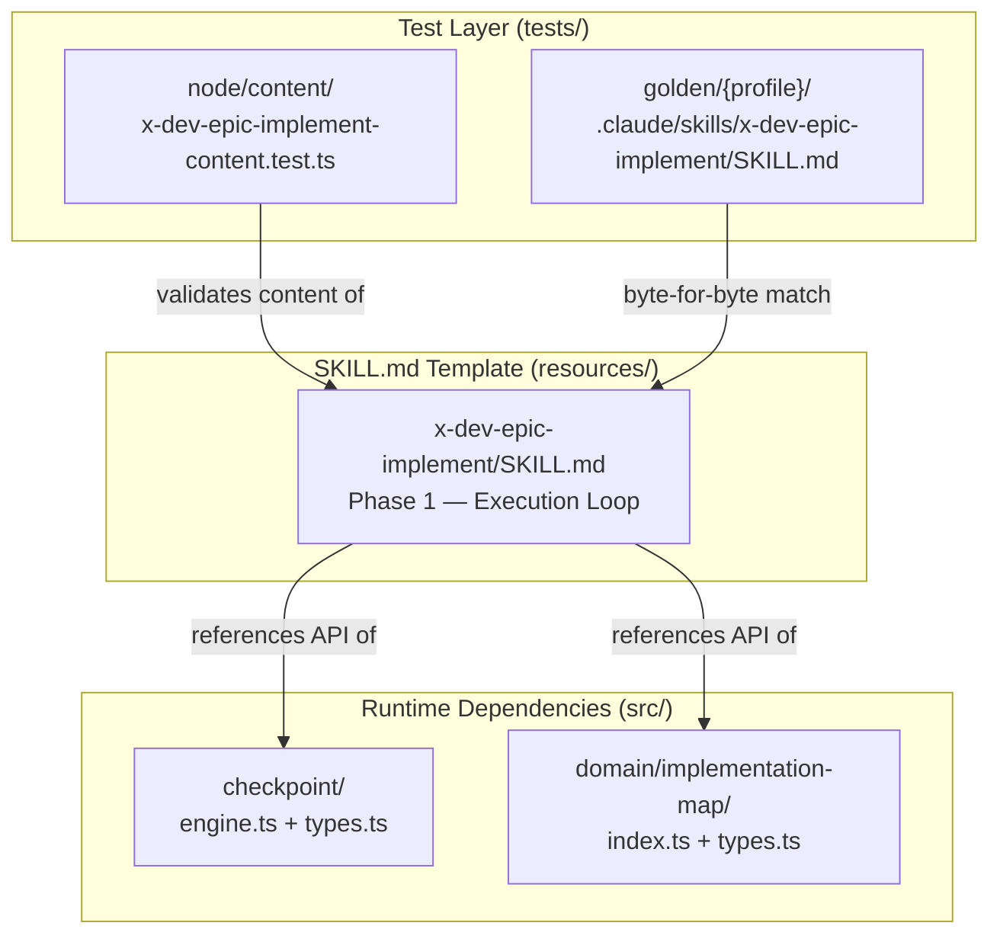
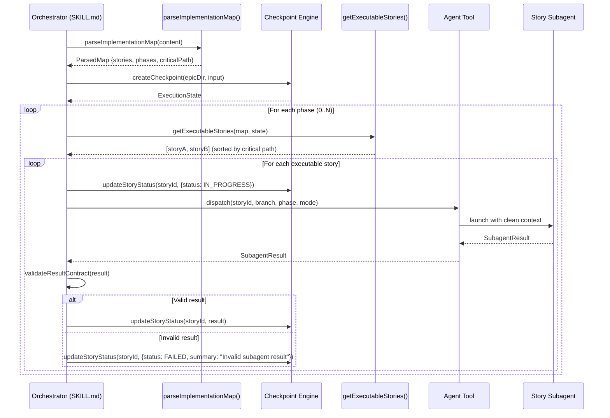
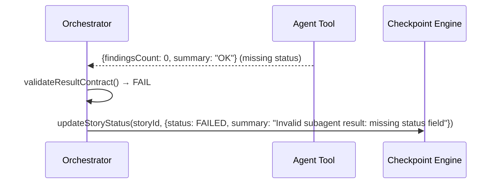

# Architecture Plan — Orchestrator Core Loop + Sequential Dispatcher

**Story:** story-0005-0005
**Plan Level:** Simplified (new feature in existing module, no contract/infra changes)

## Executive Summary

Story-0005-0005 implements the core execution loop in the `x-dev-epic-implement` SKILL.md template. The orchestrator reads the IMPLEMENTATION-MAP.md via the parser (story-0005-0004), creates a checkpoint (story-0005-0001), then iterates phase-by-phase dispatching subagents sequentially for each executable story. Results are validated against the SubagentResult contract (RULE-008) and the checkpoint is updated after each story (RULE-002). This is a template-only change — the core loop is Markdown instructions consumed by an AI agent at runtime, not executable TypeScript code. The implementation touches: (1) the SKILL.md template file, (2) content validation tests, and (3) golden file regeneration.

## Component Diagram

## Sequence Diagrams

### Happy Path — Sequential Execution

### Error Path — Invalid SubagentResult

## Architecture Decisions

### ADR-001: Template-Only Implementation (No New TypeScript Modules)

**Status:** Accepted

**Context:**
The core loop is orchestration logic executed by an AI agent at runtime. It references existing TypeScript modules (checkpoint engine, implementation map parser) but does not create new ones. The SKILL.md acts as a "runbook" for the agent.

**Decision:**
Implement the core loop as Markdown instructions in Phase 1 of `x-dev-epic-implement/SKILL.md`. No new TypeScript source files.

**Rationale:**
- The orchestrator is an AI agent following SKILL.md instructions, not compiled TypeScript
- Runtime dependencies (checkpoint engine, map parser) already exist as TypeScript modules
- Content validation tests ensure the template contains required sections and keywords
- Golden file tests ensure template consistency across profiles

**Consequences:**
- Positive: No compilation overhead, no new runtime dependencies
- Negative: Logic is in Markdown, not unit-testable at the TypeScript level — tested via content assertions

**Story Reference:** story-0005-0005

### ADR-002: Placeholder Extension Points for Future Stories

**Status:** Accepted

**Context:**
The core loop must be extensible for integrity gates (0005-0006), retry (0005-0007), resume (0005-0008), partial execution (0005-0009), parallel worktrees (0005-0010), consolidation (0005-0011), and progress reporting (0005-0013).

**Decision:**
Insert clearly-marked placeholder comments at extension points within the core loop: `[Placeholder: integrity gate — story-0005-0006]`, `[Placeholder: retry — story-0005-0007]`, etc.

**Rationale:**
- Each downstream story replaces its placeholder with actual logic
- Content tests can verify placeholder presence until the story is implemented
- No behavioral change needed — purely additive

**Consequences:**
- Positive: Clear extension points, no refactoring needed for downstream stories
- Negative: Placeholders add visual noise (mitigated by clear naming)

**Story Reference:** story-0005-0005

### ADR-003: SubagentResult Validation as Inline Logic

**Status:** Accepted

**Context:**
RULE-008 requires validating the subagent result contract. The validation is simple: check `status`, `findingsCount`, `summary` fields exist; if `status === SUCCESS`, `commitSha` must be present.

**Decision:**
Implement validation as inline logic in the SKILL.md template, not as a separate TypeScript validator.

**Rationale:**
- The SubagentResult type already exists in `src/checkpoint/types.ts` — it defines the contract
- The AI agent performs the validation at runtime by checking field presence
- The checkpoint engine's `updateStoryStatus()` already validates the story entry update
- Adding a TypeScript validator would be dead code (never called outside the AI agent context)

**Consequences:**
- Positive: No dead code, simple implementation
- Negative: Validation logic is in Markdown — covered by content tests asserting required field names

**Story Reference:** story-0005-0005

## Technology Stack

| Component | Technology | Version | Rationale |
|-----------|-----------|---------|-----------|
| Template | Markdown (SKILL.md) | N/A | Standard skill template format |
| Content tests | Vitest | 2.x | Project standard test framework |
| Golden files | Byte-for-byte comparison | N/A | Ensures template consistency across profiles |
| Runtime checkpoint | `src/checkpoint/engine.ts` | N/A | Existing from story-0005-0001 |
| Runtime parser | `src/domain/implementation-map/index.ts` | N/A | Existing from story-0005-0004 |

## Non-Functional Requirements

| Metric | Target | Measurement |
|--------|--------|-------------|
| Orchestrator overhead between stories | < 5 seconds | Time between subagent completion and next dispatch (excluding subagent execution time) |
| Content test execution time | < 2 seconds | Vitest wall clock for content test suite |
| Template size | < 300 lines for Phase 1 section | Line count of the Execution Loop section |

## Observability Strategy

Not applicable — this is a template change. Observability is handled at the AI agent runtime level:
- The orchestrator logs phase transitions and story dispatch events to stdout
- The checkpoint engine persists state to `execution-state.json` (existing from story-0005-0001)
- Progress metrics tracked in `ExecutionMetrics` (existing type)

## Resilience Strategy

Not applicable at the template level. Future stories add resilience:
- **story-0005-0007**: Retry + block propagation
- **story-0005-0008**: Resumability from checkpoint

The core loop includes placeholder hooks for these extensions.

## Impact Analysis

### Affected Files

| File | Change Type | Description |
|------|------------|-------------|
| `resources/skills-templates/core/x-dev-epic-implement/SKILL.md` | Modify | Replace Phase 1 placeholder with core loop logic |
| `resources/github-skills-templates/dev/x-dev-epic-implement.md` | Modify | Mirror Phase 1 content (abbreviated) |
| `tests/node/content/x-dev-epic-implement-content.test.ts` | Modify | Add content assertions for Phase 1 sections |
| `tests/golden/*/` (8 profiles) | Regenerate | Update golden files to match new template |

### Migration Plan

No migration — additive change replacing a placeholder.

### Rollback Strategy

Revert to the placeholder version of Phase 1 in SKILL.md.

### Risk Assessment

| Risk | Likelihood | Impact | Mitigation |
|------|-----------|--------|-----------|
| Existing Phase 1 content test breaks | Medium | Low | Test currently asserts `placeholder|story-0005|TODO|implemented in` — update assertion |
| Golden file regeneration misses a profile | Low | Medium | CI pipeline validates golden files across all 8 profiles |
| Downstream stories misread extension points | Low | Medium | Placeholder naming convention is consistent and documented |
