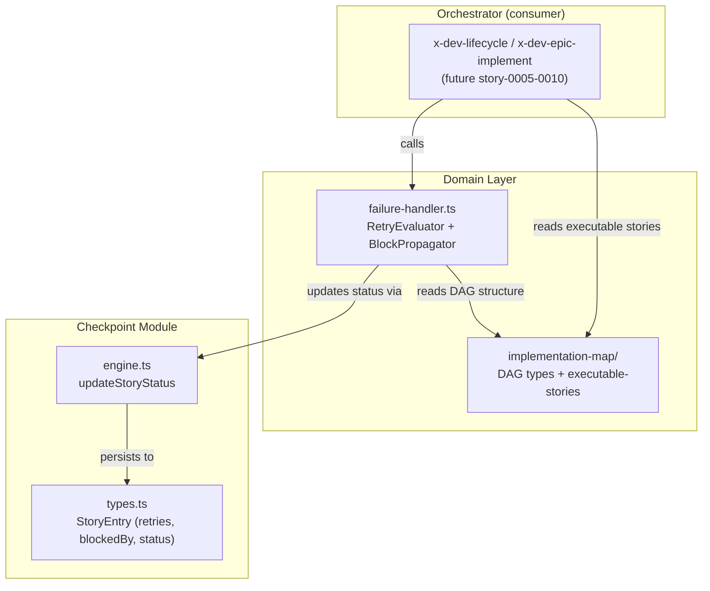
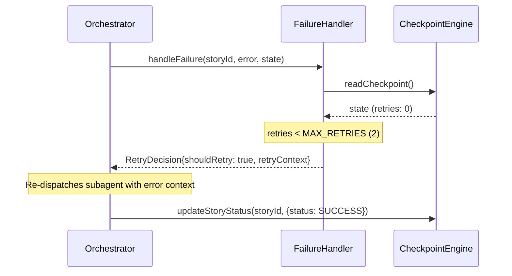
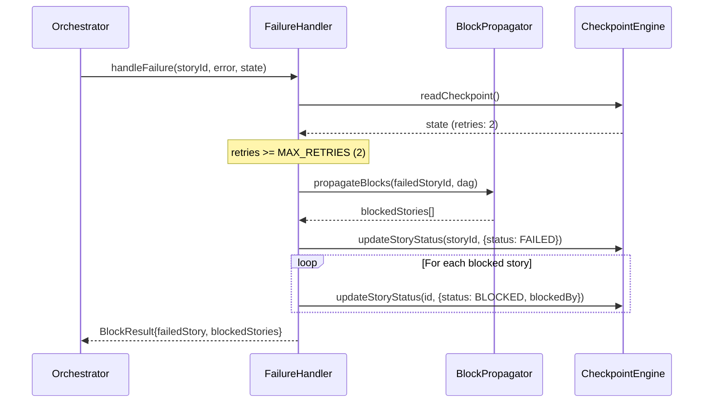

# Architecture Plan — Failure Handling: Retry + Block Propagation

**Story:** story-0005-0007
**Plan Level:** Simplified (new feature in existing module, no contract/infra change)

## Executive Summary

This story adds a failure handling subsystem to the epic orchestrator, introducing three resilience levels: (1) retry with budget and error context, (2) transitive block propagation via BFS on the dependency DAG, and (3) integration point for integrity gate failures. In this story, the implementation lives in the new `src/domain/failure/` module (pure functions) with a re-export from `src/domain/index.ts`; there are no changes to the existing `src/checkpoint/` module in this PR. No new external connections, no API changes, no infrastructure changes.

## Component Diagram

## Sequence Diagrams

### Happy Path: Retry succeeds on first attempt

### Error Path: Retries exhausted, block propagation

## External Connections

| System | Protocol | Purpose | SLO |
|--------|----------|---------|-----|
| Local filesystem | File I/O | Checkpoint persistence (execution-state.json) | N/A (local) |

No new external connections introduced.

## Architecture Decisions

### ADR-001: Pure function for block propagation

**Status:** Proposed

**Context:**
Block propagation requires BFS traversal of the dependency DAG. This logic is algorithmic and deterministic — given a failed story ID and a DAG, it always produces the same set of blocked stories.

**Decision:**
Implement block propagation as a pure function in `src/domain/failure/block-propagator.ts` with no I/O dependencies. It receives a DAG (Map<string, DagNode>) and a failed story ID, returns an array of blocked story IDs.

**Rationale:**
Pure functions are trivially testable, composable, and follow the hexagonal architecture principle of keeping domain logic free of infrastructure concerns.

**Consequences:**
- Positive: 100% unit-testable without mocks, reusable by integrity gate handler
- Negative: Orchestrator must coordinate between propagator and checkpoint engine

**Story Reference:** story-0005-0007

### ADR-002: Retry budget as constant, not configuration

**Status:** Proposed

**Context:**
RULE-005 defines a fixed retry budget of 2. This is a business rule, not a deployment configuration.

**Decision:**
Define `MAX_RETRIES = 2` as a named constant in the failure handler module. Do not externalize to environment variables.

**Rationale:**
The retry budget is a domain rule (RULE-005), not infrastructure configuration. Changing it requires a conscious product decision, not a deploy-time knob.

**Consequences:**
- Positive: Simple, no config drift, enforces business rule
- Negative: Changing budget requires code change (acceptable for a domain rule)

**Story Reference:** story-0005-0007

### ADR-003: Reuse existing DagNode type from implementation-map

**Status:** Proposed

**Context:**
Block propagation needs to traverse dependencies. The `DagNode` type in `src/domain/implementation-map/types.ts` already has `blockedBy` and `blocks` arrays.

**Decision:**
Reuse the existing `DagNode` type rather than creating a new dependency graph type.

**Rationale:**
Avoids type duplication. The DAG structure is already well-tested and validated by the implementation-map module.

**Consequences:**
- Positive: No type duplication, leverages existing validation
- Negative: Creates a dependency from failure module to implementation-map types

**Story Reference:** story-0005-0007

## Technology Stack

| Component | Technology | Version | Rationale |
|-----------|-----------|---------|-----------|
| Language | TypeScript | 5 | Project standard |
| Runtime | Node.js | 20+ | Project standard |
| Test Framework | Vitest | latest | Project standard |
| Persistence | JSON file (atomic write) | N/A | Existing checkpoint mechanism |

## Non-Functional Requirements

| Metric | Target | Measurement |
|--------|--------|-------------|
| Block propagation latency | < 100ms for DAGs with < 50 stories | Vitest benchmark |
| Memory usage | O(n) where n = number of stories in DAG | BFS visited set |
| Retry context size | < 10KB per retry | JSON serialization of error + summary |

## Observability Strategy

No new observability infrastructure. The failure handler logs to structured console output (existing pattern):

- **Retry attempt:** `{storyId, retryNumber, previousError}` at WARN level
- **Block propagation:** `{failedStory, blockedCount, blockedStories}` at ERROR level
- **Budget exhausted:** `{storyId, totalRetries}` at ERROR level

## Resilience Strategy

The failure handler IS the resilience strategy for the epic orchestrator:

1. **Retry with budget (Level 1):** Max 2 retries per story (RULE-005), error context passed to retry subagent
2. **Block propagation (Level 2):** Transitive BFS marks all dependents as BLOCKED
3. **Continuation:** Orchestrator continues executing non-blocked stories
4. **Fail-secure:** Stories default to FAILED, never silently succeed after error

## Impact Analysis

**Affected modules:**
- `src/checkpoint/` — no changes to existing code, new exports from `failure-handler.ts`
- `src/domain/failure/` — NEW module with `block-propagator.ts` and `retry-evaluator.ts`

**Migration:** None — additive change only.

**Rollback:** Remove new files, no existing behavior changes.

**Risk:** Low — isolated module with pure functions, fully tested before integration.
