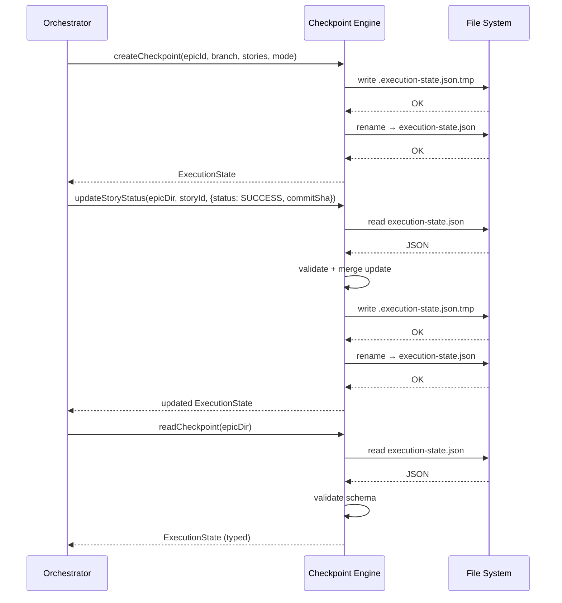

# História: Execution State Schema + Checkpoint Engine

**ID:** story-0005-0001

## 1. Dependências

| Blocked By | Blocks |
| :--- | :--- |
| — | story-0005-0004, story-0005-0005, story-0005-0008 |

## 2. Regras Transversais Aplicáveis

| ID | Título |
| :--- | :--- |
| RULE-002 | Checkpoint After Every Story |
| RULE-008 | Subagent Result Contract |

## 3. Descrição

Como **orchestrator de épicos**, eu quero um schema tipado para o estado de execução e um engine
de checkpoint que persista/recupere esse estado em disco, garantindo que o progresso de cada story
seja registrado atomicamente e nunca corrompido por falhas parciais.

Esta história é a fundação de dados de todo o orchestrator. Define as interfaces TypeScript que
representam o estado de execução (`ExecutionState`, `StoryEntry`, `IntegrityGateEntry`, `Metrics`),
os enums de status (`PENDING`, `IN_PROGRESS`, `SUCCESS`, `FAILED`, `BLOCKED`), e a interface do
contrato de resultado de subagent (`SubagentResult`). Além dos tipos, implementa o checkpoint
engine — o módulo responsável por criar, ler, atualizar e validar o arquivo `execution-state.json`
em `docs/stories/epic-XXXX/`.

O checkpoint engine é crítico para a resumabilidade: se o processo morre no meio de uma execução,
o arquivo persiste o último estado conhecido. A atualização deve ser atômica — escrever em arquivo
temporário e renomear — para evitar corrupção em caso de crash.

### 3.1 Execution State Schema

- Interface `ExecutionState` com campos: `epicId`, `branch`, `startedAt` (ISO-8601), `currentPhase`,
  `mode` (`{ parallel: boolean, skipReview: boolean }`), `stories` (mapa de story ID → `StoryEntry`),
  `integrityGates` (mapa de phase → `IntegrityGateEntry`), `metrics` (`ExecutionMetrics`)
- Interface `StoryEntry`: `status` (enum), `commitSha?`, `phase`, `duration?` (ISO-8601 duration),
  `retries`, `blockedBy?` (string array), `summary?`, `findingsCount?`
- Interface `IntegrityGateEntry`: `status` (`PASS` | `FAIL`), `timestamp`, `testCount`, `coverage`,
  `failedTests?` (string array)
- Interface `ExecutionMetrics`: `storiesCompleted`, `storiesTotal`, `estimatedRemainingMinutes?`
- Enum `StoryStatus`: `PENDING`, `IN_PROGRESS`, `SUCCESS`, `FAILED`, `BLOCKED`, `PARTIAL`
- Interface `SubagentResult`: `status` (`SUCCESS` | `FAILED` | `PARTIAL`), `commitSha?`, `findingsCount`, `summary`

### 3.2 Checkpoint Engine

- Função `createCheckpoint(epicId, branch, stories, mode)` → cria `execution-state.json` inicial
- Função `readCheckpoint(epicDir)` → lê e valida o JSON, retorna `ExecutionState` tipado
- Função `updateStoryStatus(epicDir, storyId, update: Partial<StoryEntry>)` → atualiza atomicamente
- Função `updateIntegrityGate(epicDir, phase, result: IntegrityGateEntry)` → registra resultado do gate
- Função `updateMetrics(epicDir, metrics: Partial<ExecutionMetrics>)` → atualiza métricas
- Atomic write: escrever em `.execution-state.json.tmp`, renomear para `execution-state.json`
- Validação no `readCheckpoint`: verificar campos obrigatórios, tipos, enum values válidos

### 3.3 Template do Execution State

- Criar template em `resources/templates/_TEMPLATE-EXECUTION-STATE.json` com a estrutura base
  e placeholders comentados
- Template usado como referência na documentação do SKILL.md

## 4. Definições de Qualidade Locais

### DoR Local (Definition of Ready)

- [ ] Schema do `execution-state.json` definido e aprovado nesta spec
- [ ] Convenção de diretórios `docs/stories/epic-XXXX/` documentada (SD-09)
- [ ] Decisão sobre atomic write (tmp + rename) validada para Node.js/TypeScript

### DoD Local (Definition of Done)

- [ ] Interfaces TypeScript exportadas e compilando sem erros
- [ ] Checkpoint engine cria, lê, atualiza e valida `execution-state.json`
- [ ] Atomic write implementado com tmp file + rename
- [ ] Testes unitários cobrem: criação, leitura, atualização atômica, validação de schema inválido
- [ ] Template `_TEMPLATE-EXECUTION-STATE.json` criado em `resources/templates/`
- [ ] Golden file tests para o template gerado

### Global Definition of Done (DoD)

- **Cobertura:** ≥ 95% Line, ≥ 90% Branch
- **Testes Automatizados:** Unitários, integração (golden file tests). Cenários Gherkin cobertos.
- **Relatório de Cobertura:** Vitest coverage report com thresholds validados
- **Documentação:** Types e checkpoint engine documentados
- **Persistência:** `execution-state.json` nunca corrompido — atomic write garante integridade
- **Performance:** Leitura/escrita do checkpoint em < 50ms para arquivos típicos (< 100 stories)

## 5. Contratos de Dados (Data Contract)

**ExecutionState JSON Schema:**

| Campo | Formato | Request | Response | Origem / Regra |
| :--- | :--- | :--- | :--- | :--- |
| `epicId` | string | M | M | Extraído do epic ID do argumento |
| `branch` | string | M | M | Gerado: `feat/epic-{epicId}-full-implementation` |
| `startedAt` | string (ISO-8601) | M | M | Generate — timestamp de início |
| `currentPhase` | number | M | M | Derive — fase sendo executada |
| `mode.parallel` | boolean | M | M | Echo — flag `--parallel` |
| `mode.skipReview` | boolean | M | M | Echo — flag `--skip-review` |
| `stories` | object (map) | M | M | Generate — mapa story ID → StoryEntry |
| `stories.{id}.status` | enum StoryStatus | M | M | Derive — status atual da story |
| `stories.{id}.commitSha` | string? | O | O | Derive — SHA do commit se SUCCESS |
| `stories.{id}.phase` | number | M | M | Derive — fase da story no mapa |
| `stories.{id}.duration` | string? (ISO-8601) | O | O | Derive — duração da execução |
| `stories.{id}.retries` | number | M | M | Derive — contador de retries |
| `integrityGates` | object (map) | M | M | Generate — mapa phase → IntegrityGateEntry |
| `metrics.storiesCompleted` | number | M | M | Derive — contagem de SUCCESS |
| `metrics.storiesTotal` | number | M | M | Derive — total de stories no mapa |

**SubagentResult Contract:**

| Campo | Formato | Request | Response | Origem / Regra |
| :--- | :--- | :--- | :--- | :--- |
| `status` | enum (`SUCCESS` \| `FAILED` \| `PARTIAL`) | - | M | Derive — resultado da execução |
| `commitSha` | string? | - | O | Derive — SHA se houve commit |
| `findingsCount` | number | - | M | Derive — total de findings do review |
| `summary` | string | - | M | Generate — resumo textual |

## 6. Diagramas

### 6.1 Fluxo do Checkpoint Engine



## 7. Critérios de Aceite (Gherkin)

```gherkin
Cenario: Criação de checkpoint inicial com estado vazio
  DADO que o diretório do épico "docs/stories/epic-0042/" existe
  E não existe arquivo "execution-state.json" no diretório
  QUANDO createCheckpoint é chamado com epicId "0042", branch "feat/epic-0042-full-implementation", 5 stories e mode {parallel: false, skipReview: false}
  ENTÃO o arquivo "execution-state.json" é criado no diretório
  E todas as 5 stories têm status "PENDING"
  E retries é 0 para todas as stories
  E metrics.storiesCompleted é 0
  E metrics.storiesTotal é 5

Cenario: Leitura de checkpoint existente com validação de schema
  DADO que existe um "execution-state.json" válido com 3 stories no diretório
  QUANDO readCheckpoint é chamado para o diretório
  ENTÃO retorna um objeto ExecutionState tipado
  E todos os campos obrigatórios estão presentes
  E os enum values de status são válidos

Cenario: Atualização atômica de status de story para SUCCESS
  DADO que existe um checkpoint com story "0042-0001" em status "IN_PROGRESS"
  QUANDO updateStoryStatus é chamado com storyId "0042-0001" e {status: "SUCCESS", commitSha: "abc123"}
  ENTÃO o arquivo temporário ".execution-state.json.tmp" é criado
  E em seguida renomeado para "execution-state.json"
  E story "0042-0001" tem status "SUCCESS" e commitSha "abc123"
  E as demais stories permanecem inalteradas

Cenario: Atualização atômica de status de story para FAILED com retry increment
  DADO que existe um checkpoint com story "0042-0003" em status "IN_PROGRESS" e retries 1
  QUANDO updateStoryStatus é chamado com {status: "FAILED", retries: 2}
  ENTÃO story "0042-0003" tem status "FAILED" e retries 2

Cenario: Rejeição de checkpoint com schema inválido
  DADO que existe um "execution-state.json" com campo "epicId" ausente
  QUANDO readCheckpoint é chamado para o diretório
  ENTÃO uma exceção de validação é lançada
  E a mensagem inclui "epicId is required"

Cenario: Rejeição de status enum inválido no checkpoint
  DADO que existe um "execution-state.json" com uma story com status "UNKNOWN"
  QUANDO readCheckpoint é chamado para o diretório
  ENTÃO uma exceção de validação é lançada
  E a mensagem inclui "invalid status"

Cenario: Atualização de integrity gate result
  DADO que existe um checkpoint válido
  QUANDO updateIntegrityGate é chamado com phase 0 e {status: "PASS", testCount: 42, coverage: 96.3}
  ENTÃO integrityGates["phase-0"] contém o resultado registrado
  E o timestamp é preenchido automaticamente

Cenario: Criação de checkpoint em diretório inexistente
  DADO que o diretório "docs/stories/epic-9999/" não existe
  QUANDO createCheckpoint é chamado
  ENTÃO uma exceção é lançada com mensagem indicando diretório ausente
```

### 7.1 Scenario Ordering (TPP)

> Scenarios seguem TPP: degenerate (schema inválido, diretório ausente) → unconditional (criação) →
> conditions (atualização SUCCESS, FAILED) → iterations (integrity gate) → edge cases (enum inválido).

### 7.2 Mandatory Scenario Categories

- [x] Degenerate cases (schema inválido, diretório inexistente)
- [x] Happy path (criação, leitura, atualização SUCCESS)
- [x] Error paths (validação de schema, enum inválido)
- [x] Boundary values (retry increment)

## 8. Sub-tarefas

- [ ] [Dev] Definir interfaces TypeScript: `ExecutionState`, `StoryEntry`, `IntegrityGateEntry`, `ExecutionMetrics`, `SubagentResult`, `StoryStatus` enum
- [ ] [Dev] Implementar `createCheckpoint()` com geração de estado inicial
- [ ] [Dev] Implementar `readCheckpoint()` com validação de schema
- [ ] [Dev] Implementar `updateStoryStatus()` com atomic write (tmp + rename)
- [ ] [Dev] Implementar `updateIntegrityGate()` e `updateMetrics()`
- [ ] [Dev] Criar template `_TEMPLATE-EXECUTION-STATE.json` em `resources/templates/`
- [ ] [Test] Unitário: criação, leitura, atualização atômica, validação de schema inválido
- [ ] [Test] Unitário: enum validation, campos ausentes, diretório inexistente
- [ ] [Test] Integração: golden file test do template gerado
- [ ] [Doc] Documentar schema do `execution-state.json` no SKILL.md
