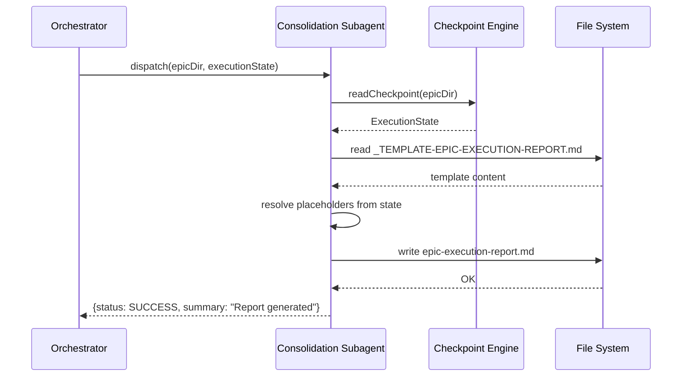

# História: Epic Execution Report Template

**ID:** story-0005-0002

## 1. Dependências

| Blocked By | Blocks |
| :--- | :--- |
| — | story-0005-0011 |

## 2. Regras Transversais Aplicáveis

| ID | Título |
| :--- | :--- |
| RULE-001 | Context Isolation |
| RULE-008 | Subagent Result Contract |

## 3. Descrição

Como **orchestrator de épicos**, eu quero um template padronizado para o relatório de execução
do épico (`epic-execution-report.md`), garantindo que o relatório final contenha todas as
informações necessárias para auditoria e acompanhamento.

O Epic Execution Report é o artefato final gerado após a última fase do épico. Ele consolida
o estado de todas as stories, os resultados de todos os integrity gates, os findings dos reviews,
a cobertura delta (antes vs. depois), e a timeline de execução. O template segue a convenção
`_TEMPLATE-*.md` do projeto em `resources/templates/` e usa placeholders `{{PLACEHOLDER}}` que
são resolvidos em runtime pelo subagent de consolidação final.

Este template é independente da lógica de orquestração — serve como definição de formato. A
geração efetiva do relatório é implementada em story-0005-0011 (Consolidação Final).

### 3.1 Seções do Template

- **Sumário Executivo:** Stories completadas, falhadas, bloqueadas. Percentual de conclusão.
- **Timeline de Execução:** Duração por fase, com início e fim de cada story.
- **Tabela de Status Final:** Story ID, título, status, commit SHA, duration, retries, findings count.
- **Findings Consolidados:** Agrupados por engineer/specialist, com severidade e contagem.
- **Coverage Delta:** Cobertura antes do épico (baseline) vs. após o épico. Delta por métrica.
- **Commits e SHAs:** Lista ordenada de commits por story, com mensagem e SHA.
- **Issues Não Resolvidos:** Stories FAILED e BLOCKED com motivos. Findings não corrigidos.
- **PR Link:** Link do PR criado na consolidação final.

### 3.2 Placeholders do Template

- `{{EPIC_ID}}`, `{{BRANCH}}`, `{{STARTED_AT}}`, `{{FINISHED_AT}}`
- `{{STORIES_COMPLETED}}`, `{{STORIES_FAILED}}`, `{{STORIES_BLOCKED}}`, `{{STORIES_TOTAL}}`
- `{{COMPLETION_PERCENTAGE}}`
- `{{PHASE_TIMELINE_TABLE}}` — tabela gerada dinamicamente
- `{{STORY_STATUS_TABLE}}` — tabela gerada dinamicamente
- `{{FINDINGS_SUMMARY}}` — seção gerada dos reviews
- `{{COVERAGE_BEFORE}}`, `{{COVERAGE_AFTER}}`, `{{COVERAGE_DELTA}}`
- `{{COMMIT_LOG}}` — lista de commits
- `{{UNRESOLVED_ISSUES}}` — stories falhadas/bloqueadas
- `{{PR_LINK}}` — URL do PR

## 4. Definições de Qualidade Locais

### DoR Local (Definition of Ready)

- [ ] Formato do `execution-state.json` definido (story-0005-0001)
- [ ] Seções do relatório aprovadas nesta spec
- [ ] Convenção de templates `{{PLACEHOLDER}}` compreendida

### DoD Local (Definition of Done)

- [ ] Template `_TEMPLATE-EPIC-EXECUTION-REPORT.md` criado em `resources/templates/`
- [ ] Todas as seções especificadas presentes com placeholders
- [ ] Template registrado no gerador (dual copy: `resources/` + `.claude/` + `.github/`)
- [ ] Golden file test validando o template gerado

### Global Definition of Done (DoD)

- **Cobertura:** ≥ 95% Line, ≥ 90% Branch
- **Testes Automatizados:** Unitários, integração (golden file tests). Cenários Gherkin cobertos.
- **Relatório de Cobertura:** Vitest coverage report com thresholds validados
- **Documentação:** Template documentado no SKILL.md
- **Persistência:** N/A (template estático)
- **Performance:** N/A (template estático)

## 5. Contratos de Dados (Data Contract)

**Template Placeholders:**

| Campo | Formato | Request | Response | Origem / Regra |
| :--- | :--- | :--- | :--- | :--- |
| `{{EPIC_ID}}` | string | - | M | Echo — epic ID do execution-state |
| `{{BRANCH}}` | string | - | M | Echo — branch do execution-state |
| `{{STARTED_AT}}` | string (ISO-8601) | - | M | Echo — timestamp de início |
| `{{FINISHED_AT}}` | string (ISO-8601) | - | M | Generate — timestamp de conclusão |
| `{{STORIES_COMPLETED}}` | number | - | M | Derive — count(status=SUCCESS) |
| `{{STORIES_FAILED}}` | number | - | M | Derive — count(status=FAILED) |
| `{{STORIES_BLOCKED}}` | number | - | M | Derive — count(status=BLOCKED) |
| `{{STORIES_TOTAL}}` | number | - | M | Echo — metrics.storiesTotal |
| `{{COMPLETION_PERCENTAGE}}` | string (XX.X%) | - | M | Derive — completed/total × 100 |
| `{{COVERAGE_BEFORE}}` | string (XX.X%) | - | M | Derive — baseline coverage |
| `{{COVERAGE_AFTER}}` | string (XX.X%) | - | M | Derive — final coverage |
| `{{COVERAGE_DELTA}}` | string (+/-X.X%) | - | M | Derive — after - before |
| `{{PR_LINK}}` | string (URL) | - | O | Generate — link do PR criado |

## 6. Diagramas

### 6.1 Fluxo de Geração do Report



## 7. Critérios de Aceite (Gherkin)

```gherkin
Cenario: Template contém todas as seções obrigatórias
  DADO que o template "_TEMPLATE-EPIC-EXECUTION-REPORT.md" existe em "resources/templates/"
  QUANDO o conteúdo é lido
  ENTÃO contém a seção "Sumário Executivo"
  E contém a seção "Timeline de Execução"
  E contém a seção "Status Final por Story"
  E contém a seção "Findings Consolidados"
  E contém a seção "Coverage Delta"
  E contém a seção "Commits e SHAs"
  E contém a seção "Issues Não Resolvidos"
  E contém a seção "PR Link"

Cenario: Template contém todos os placeholders definidos
  DADO que o template existe
  QUANDO o conteúdo é analisado
  ENTÃO contém o placeholder "{{EPIC_ID}}"
  E contém "{{STORIES_COMPLETED}}", "{{STORIES_FAILED}}", "{{STORIES_BLOCKED}}"
  E contém "{{COMPLETION_PERCENTAGE}}"
  E contém "{{COVERAGE_BEFORE}}", "{{COVERAGE_AFTER}}", "{{COVERAGE_DELTA}}"
  E contém "{{PR_LINK}}"

Cenario: Template segue convenção de naming do projeto
  DADO que o template foi criado
  QUANDO verificado o nome do arquivo
  ENTÃO o nome é "_TEMPLATE-EPIC-EXECUTION-REPORT.md"
  E está localizado em "resources/templates/"

Cenario: Dual copy é mantida
  DADO que o template existe em "resources/templates/"
  QUANDO o gerador é executado
  ENTÃO o template é propagado para ".claude/templates/"
  E é propagado para ".github/" conforme convenção

Cenario: Template usa markdown válido
  DADO que o template existe
  QUANDO renderizado como markdown
  ENTÃO não há erros de sintaxe
  E as tabelas são formatadas corretamente
  E os headings seguem hierarquia (h1 → h2 → h3)
```

### 7.1 Scenario Ordering (TPP)

> Scenarios seguem TPP: existência do template → conteúdo das seções → placeholders → naming → dual copy → markdown válido.

### 7.2 Mandatory Scenario Categories

- [x] Degenerate cases (template ausente — implícito nos cenários de existência)
- [x] Happy path (template com todas as seções e placeholders)
- [x] Error paths (naming incorreto, dual copy ausente)
- [x] Boundary values (markdown válido, hierarquia de headings)

## 8. Sub-tarefas

- [ ] [Dev] Criar template `_TEMPLATE-EPIC-EXECUTION-REPORT.md` com todas as seções e placeholders
- [ ] [Dev] Registrar template no gerador para dual copy
- [ ] [Dev] Adicionar entrada no CLAUDE.md/README.md se necessário
- [ ] [Test] Golden file test validando conteúdo do template gerado
- [ ] [Test] Unitário: verificar presença de todas as seções e placeholders
- [ ] [Doc] Documentar o template e seus placeholders no SKILL.md
