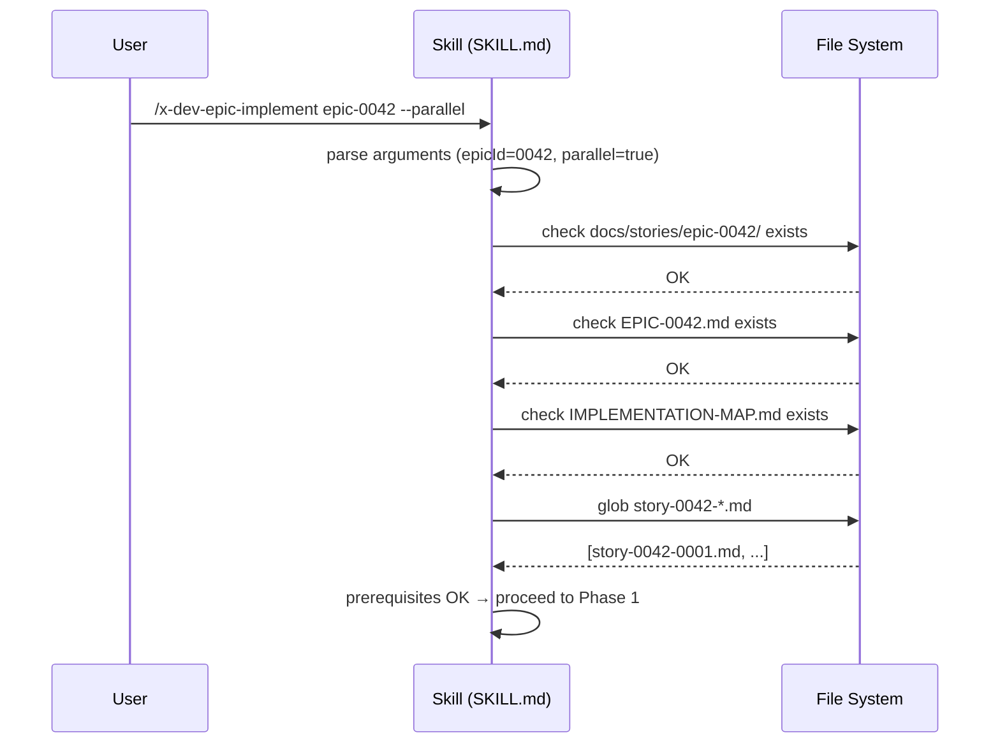
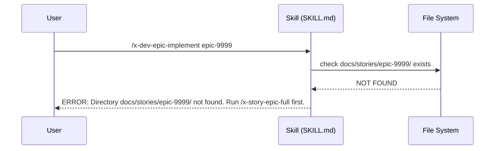

# História: SKILL.md Skeleton + Input Parsing

**ID:** story-0005-0003

## 1. Dependências

| Blocked By | Blocks |
| :--- | :--- |
| — | story-0005-0005 |

## 2. Regras Transversais Aplicáveis

| ID | Título |
| :--- | :--- |
| RULE-001 | Context Isolation |

## 3. Descrição

Como **desenvolvedor de skills**, eu quero o arquivo SKILL.md base para `x-dev-epic-implement`
com frontmatter, parsing de argumentos, seção de pré-requisitos e estrutura de fases, garantindo
que a skill seja invocável via `/x-dev-epic-implement epic-XXXX` e reconheça todas as flags
opcionais.

Esta história cria o esqueleto da skill — a estrutura do SKILL.md que será incrementalmente
estendida pelas stories subsequentes. Cada story de Layer 1+ adiciona seções ao SKILL.md.
O skeleton inclui: frontmatter YAML (name, description, allowed-tools, argument-hint),
seção de Global Output Policy, parsing de argumentos (epic ID obrigatório + flags opcionais),
verificação de pré-requisitos (existência do epic dir, implementation-map, story files), e
a estrutura vazia das fases de execução que serão preenchidas posteriormente.

O SKILL.md segue o padrão de skills existentes (`x-dev-lifecycle`, `x-review`, etc.) com
prompts que orientam o comportamento do Claude Code ao executar a skill.

### 3.1 Frontmatter YAML

- `name: x-dev-epic-implement`
- `description:` texto descritivo da skill
- `allowed-tools: Read, Write, Edit, Bash, Grep, Glob, Skill`
- `argument-hint: "[EPIC-ID] [--phase N] [--story XXXX-YYYY] [--skip-review] [--dry-run] [--resume] [--parallel]"`

### 3.2 Input Parsing

- Argumento posicional obrigatório: `epic-XXXX` (ID do épico)
- Flags opcionais:
  - `--phase N` → executar apenas fase N
  - `--story XXXX-YYYY` → executar apenas uma story específica
  - `--skip-review` → pular fases de review nos subagents
  - `--dry-run` → gerar plano sem executar
  - `--resume` → continuar de onde parou
  - `--parallel` → habilitar worktrees paralelos (default: sequencial)

### 3.3 Verificação de Pré-requisitos

- Verificar existência de `docs/stories/epic-XXXX/`
- Verificar existência de `EPIC-XXXX.md` no diretório
- Verificar existência de `IMPLEMENTATION-MAP.md` no diretório
- Verificar que há pelo menos um `story-XXXX-YYYY.md`
- Se `--resume`: verificar existência de `execution-state.json`
- Se pré-requisito ausente: abortar com mensagem clara indicando o que falta

### 3.4 Estrutura de Fases (Placeholders)

- Phase 0: Preparation (parsing + prerequisites + branch creation)
- Phase 1: Execution Loop (placeholder — implementado em story-0005-0005)
- Phase 2: Consolidation (placeholder — implementado em story-0005-0011)
- Phase 3: Verification (placeholder — implementado em story-0005-0011)

## 4. Definições de Qualidade Locais

### DoR Local (Definition of Ready)

- [ ] Padrão de SKILL.md existente (`x-dev-lifecycle`) estudado como referência
- [ ] Lista completa de flags aprovada nesta spec
- [ ] Convenção de diretórios `docs/stories/epic-XXXX/` documentada

### DoD Local (Definition of Done)

- [ ] SKILL.md criado em `resources/skills-templates/core/x-dev-epic-implement/SKILL.md`
- [ ] Frontmatter YAML válido com todos os campos
- [ ] Input parsing documentado para todas as flags
- [ ] Pré-requisitos verificados com mensagens de erro claras
- [ ] Estrutura de fases com placeholders para extensão futura
- [ ] Dual copy mantida (`resources/` + `.claude/` + `.github/`)
- [ ] Golden file test validando o SKILL.md gerado

### Global Definition of Done (DoD)

- **Cobertura:** ≥ 95% Line, ≥ 90% Branch
- **Testes Automatizados:** Unitários, integração (golden file tests). Cenários Gherkin cobertos.
- **Relatório de Cobertura:** Vitest coverage report com thresholds validados
- **Documentação:** SKILL.md é auto-documentado (é um prompt)
- **Persistência:** N/A
- **Performance:** N/A

## 5. Contratos de Dados (Data Contract)

**Input Arguments:**

| Campo | Formato | Request | Response | Origem / Regra |
| :--- | :--- | :--- | :--- | :--- |
| `epicId` | string (XXXX) | M | - | Argumento posicional — ex: "0042" |
| `--phase` | number | O | - | Flag — número da fase (0..N) |
| `--story` | string (XXXX-YYYY) | O | - | Flag — ID da story |
| `--skip-review` | boolean | O | - | Flag — default false |
| `--dry-run` | boolean | O | - | Flag — default false |
| `--resume` | boolean | O | - | Flag — default false |
| `--parallel` | boolean | O | - | Flag — default false |

**Prerequisite Check Output:**

| Campo | Formato | Request | Response | Origem / Regra |
| :--- | :--- | :--- | :--- | :--- |
| `epicDir` | string (path) | - | M | Derive — `docs/stories/epic-{epicId}/` |
| `epicFile` | string (path) | - | M | Derive — `EPIC-{epicId}.md` |
| `mapFile` | string (path) | - | M | Derive — `IMPLEMENTATION-MAP.md` |
| `storyFiles` | string[] | - | M | Derive — glob `story-{epicId}-*.md` |
| `checkpointFile` | string? (path) | - | O | Derive — `execution-state.json` (se --resume) |

## 6. Diagramas

### 6.1 Fluxo de Inicialização da Skill



### 6.2 Fluxo de Erro — Pré-requisito Ausente



## 7. Critérios de Aceite (Gherkin)

```gherkin
Cenario: Invocação com epic ID válido e diretório existente
  DADO que o diretório "docs/stories/epic-0042/" existe
  E contém "EPIC-0042.md" e "IMPLEMENTATION-MAP.md" e pelo menos um story file
  QUANDO o usuário invoca "/x-dev-epic-implement epic-0042"
  ENTÃO o parsing extrai epicId "0042"
  E todas as flags opcionais são false por default
  E a verificação de pré-requisitos passa
  E a execução avança para Phase 1

Cenario: Invocação com todas as flags opcionais
  DADO que o diretório do épico existe e é válido
  QUANDO o usuário invoca "/x-dev-epic-implement epic-0042 --phase 2 --skip-review --parallel"
  ENTÃO epicId é "0042"
  E phase é 2
  E skipReview é true
  E parallel é true
  E dryRun é false
  E resume é false

Cenario: Falha quando diretório do épico não existe
  DADO que o diretório "docs/stories/epic-9999/" NÃO existe
  QUANDO o usuário invoca "/x-dev-epic-implement epic-9999"
  ENTÃO a skill aborta com mensagem "Directory docs/stories/epic-9999/ not found"
  E sugere executar "/x-story-epic-full" primeiro

Cenario: Falha quando IMPLEMENTATION-MAP.md está ausente
  DADO que o diretório "docs/stories/epic-0042/" existe
  MAS "IMPLEMENTATION-MAP.md" não existe no diretório
  QUANDO o usuário invoca "/x-dev-epic-implement epic-0042"
  ENTÃO a skill aborta com mensagem "IMPLEMENTATION-MAP.md not found"
  E sugere executar "/x-story-map" primeiro

Cenario: Falha quando --resume é passado sem checkpoint existente
  DADO que o diretório do épico existe e é válido
  MAS "execution-state.json" não existe
  QUANDO o usuário invoca "/x-dev-epic-implement epic-0042 --resume"
  ENTÃO a skill aborta com mensagem "No checkpoint found. Cannot resume."
  E sugere executar sem --resume

Cenario: SKILL.md contém frontmatter YAML válido
  DADO que o SKILL.md foi gerado
  QUANDO o frontmatter é parseado
  ENTÃO contém name "x-dev-epic-implement"
  E contém allowed-tools incluindo "Read, Write, Edit, Bash, Grep, Glob, Skill"
  E contém argument-hint com todas as flags documentadas

Cenario: Invocação sem epic ID
  DADO que o usuário não forneceu argumentos
  QUANDO o usuário invoca "/x-dev-epic-implement"
  ENTÃO a skill aborta com mensagem "Epic ID is required"
  E mostra usage: "/x-dev-epic-implement [EPIC-ID] [flags]"
```

### 7.1 Scenario Ordering (TPP)

> Scenarios seguem TPP: invocação simples → flags múltiplas → erros (diretório, map, checkpoint) → frontmatter → sem argumentos.

### 7.2 Mandatory Scenario Categories

- [x] Degenerate cases (sem argumentos, diretório inexistente)
- [x] Happy path (invocação válida, todas as flags)
- [x] Error paths (map ausente, checkpoint ausente)
- [x] Boundary values (frontmatter válido)

## 8. Sub-tarefas

- [ ] [Dev] Criar SKILL.md com frontmatter YAML completo
- [ ] [Dev] Implementar seção de input parsing (epic ID + 6 flags)
- [ ] [Dev] Implementar seção de verificação de pré-requisitos (5 checks)
- [ ] [Dev] Criar estrutura de fases com placeholders
- [ ] [Dev] Registrar skill no gerador para dual copy
- [ ] [Test] Golden file test do SKILL.md gerado
- [ ] [Test] Unitário: parsing de argumentos (válidos e inválidos)
- [ ] [Test] Unitário: verificação de pré-requisitos (presentes e ausentes)
- [ ] [Doc] Adicionar skill ao índice do CLAUDE.md
