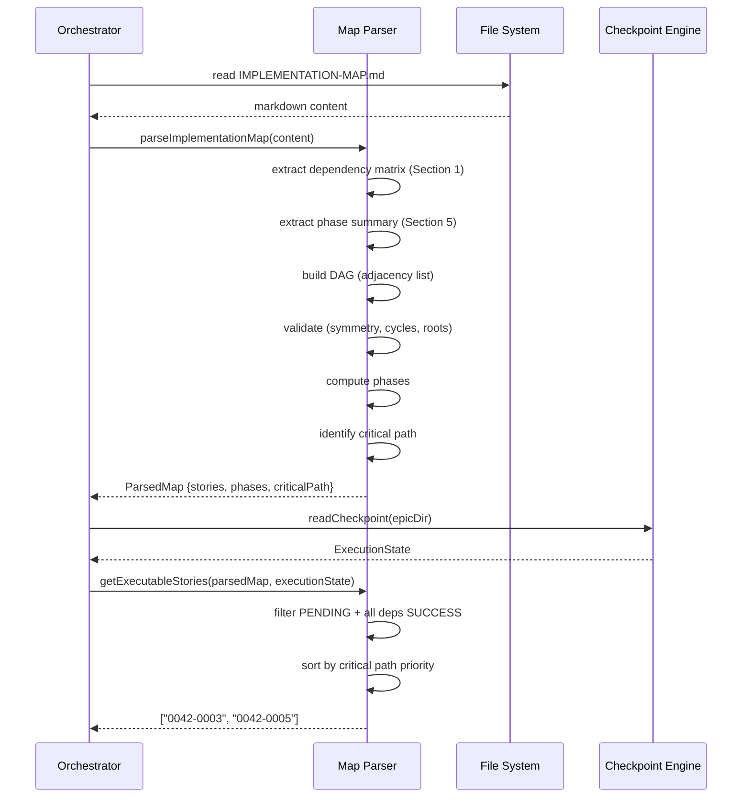

# História: Implementation Map Parser

**ID:** story-0005-0004

## 1. Dependências

| Blocked By | Blocks |
| :--- | :--- |
| story-0005-0001 | story-0005-0005, story-0005-0012 |

## 2. Regras Transversais Aplicáveis

| ID | Título |
| :--- | :--- |
| RULE-003 | Dependency Satisfaction |
| RULE-007 | Critical Path Priority |

## 3. Descrição

Como **orchestrator de épicos**, eu quero um parser que leia o `IMPLEMENTATION-MAP.md` e construa
um grafo de dependências computável, garantindo que o orchestrator saiba exatamente quais stories
podem ser executadas em cada momento e qual é o caminho crítico.

Esta história implementa o coração lógico do planejamento de execução. O parser lê o markdown do
implementation map — especificamente a Matriz de Dependências (Seção 1) e o Resumo por Fase
(Seção 5) — e constrói um DAG (Directed Acyclic Graph) em memória. A partir do DAG, computa:
fases de implementação, caminho crítico, e a lista de stories executáveis dado o estado atual
(do `execution-state.json`).

O parser é essencial para que o orchestrator respeite RULE-003 (Dependency Satisfaction): uma
story só pode ser despachada se todas as suas dependências têm status SUCCESS. Também fundamenta
RULE-007 (Critical Path Priority): dentro de uma fase, stories no caminho crítico são priorizadas.

### 3.1 Parsing do Implementation Map

- Ler o arquivo `IMPLEMENTATION-MAP.md` como string
- Extrair a tabela da Seção 1 (Matriz de Dependências): story ID, título, blocked by, blocks, status
- Extrair o Resumo por Fase (Seção 5): fase → lista de stories, camada, paralelismo
- Parsing robusto: tolerar variações de formatação markdown (espaços extras, alinhamento)

### 3.2 Construção do DAG

- Representar como adjacency list: `Map<storyId, { blockedBy: string[], blocks: string[] }>`
- Validar simetria: se A blocks B, então B deve ter A em blockedBy (avisar se inconsistente)
- Validar ausência de ciclos (DFS com detecção de back-edges)
- Validar que existem raízes (stories sem blockedBy)

### 3.3 Computação de Fases

- Phase 0: stories sem dependências (raízes)
- Phase N: stories cujas dependências estão todas em phases 0..N-1
- Retornar `Map<phase, storyId[]>`

### 3.4 Identificação do Caminho Crítico

- Longest path no DAG (por número de fases, não stories)
- Retornar array ordenado de story IDs no caminho crítico
- Marcar cada story com flag `isOnCriticalPath: boolean`

### 3.5 Stories Executáveis

- Função `getExecutableStories(dag, executionState)` → lista de story IDs
- Uma story é executável se: status é PENDING, e todas as dependências têm status SUCCESS
- Respeitar RULE-007: ordenar resultado por critical path first

## 4. Definições de Qualidade Locais

### DoR Local (Definition of Ready)

- [ ] Formato do `IMPLEMENTATION-MAP.md` estável (template `_TEMPLATE-IMPLEMENTATION-MAP.md`)
- [ ] Formato do `execution-state.json` definido (story-0005-0001)
- [ ] Exemplos de implementation maps existentes para teste (epic-0003, epic-0004)

### DoD Local (Definition of Done)

- [ ] Parser extrai corretamente a matriz de dependências e resumo por fase
- [ ] DAG construído e validado (simetria, ciclos, raízes)
- [ ] Fases computadas corretamente a partir do DAG
- [ ] Caminho crítico identificado como longest path
- [ ] `getExecutableStories()` retorna stories em ordem de prioridade (critical path first)
- [ ] Testes com implementation maps reais (epic-0003, epic-0004) e sintéticos

### Global Definition of Done (DoD)

- **Cobertura:** ≥ 95% Line, ≥ 90% Branch
- **Testes Automatizados:** Unitários, integração (golden file tests). Cenários Gherkin cobertos.
- **Relatório de Cobertura:** Vitest coverage report com thresholds validados
- **Documentação:** API do parser documentada
- **Persistência:** N/A (leitura apenas)
- **Performance:** Parsing de map com 50 stories em < 100ms

## 5. Contratos de Dados (Data Contract)

**Input — Implementation Map Markdown:**

| Campo | Formato | Request | Response | Origem / Regra |
| :--- | :--- | :--- | :--- | :--- |
| `mapContent` | string (markdown) | M | - | Leitura de `IMPLEMENTATION-MAP.md` |

**Output — Parsed DAG:**

| Campo | Formato | Request | Response | Origem / Regra |
| :--- | :--- | :--- | :--- | :--- |
| `stories` | Map<string, StoryNode> | - | M | Derive — parsing da matriz |
| `stories.{id}.title` | string | - | M | Echo — título da story |
| `stories.{id}.blockedBy` | string[] | - | M | Echo — dependências |
| `stories.{id}.blocks` | string[] | - | M | Echo — bloqueios |
| `stories.{id}.phase` | number | - | M | Derive — computação de fases |
| `stories.{id}.isOnCriticalPath` | boolean | - | M | Derive — longest path |
| `phases` | Map<number, string[]> | - | M | Derive — agrupamento por fase |
| `criticalPath` | string[] | - | M | Derive — caminho mais longo |
| `totalPhases` | number | - | M | Derive — count de fases |

**Output — Executable Stories:**

| Campo | Formato | Request | Response | Origem / Regra |
| :--- | :--- | :--- | :--- | :--- |
| `executableStories` | string[] | - | M | Derive — PENDING + deps SUCCESS, sorted by critical path |

## 6. Diagramas

### 6.1 Fluxo do Parser



## 7. Critérios de Aceite (Gherkin)

```gherkin
Cenario: Parsing de implementation map vazio (sem stories)
  DADO que o IMPLEMENTATION-MAP.md contém uma matriz de dependências vazia
  QUANDO parseImplementationMap é chamado
  ENTÃO retorna um ParsedMap com stories vazio e phases vazio
  E totalPhases é 0

Cenario: Parsing de implementation map com uma story raiz
  DADO que o IMPLEMENTATION-MAP.md contém uma story "0042-0001" sem dependências
  QUANDO parseImplementationMap é chamado
  ENTÃO stories contém "0042-0001" com blockedBy vazio e phase 0
  E phases contém {0: ["0042-0001"]}
  E criticalPath é ["0042-0001"]

Cenario: Parsing de implementation map com dependências lineares
  DADO que o map contém: 0001 → 0002 → 0003 (cadeia linear)
  QUANDO parseImplementationMap é chamado
  ENTÃO 0001 está na phase 0, 0002 na phase 1, 0003 na phase 2
  E criticalPath é ["0001", "0002", "0003"]
  E totalPhases é 3

Cenario: Parsing de implementation map com paralelismo
  DADO que o map contém: 0001 sem deps, 0002 sem deps, 0003 depende de 0001 e 0002
  QUANDO parseImplementationMap é chamado
  ENTÃO 0001 e 0002 estão na phase 0
  E 0003 está na phase 1
  E criticalPath contém 0003

Cenario: Detecção de dependência assimétrica
  DADO que o map declara 0001 blocks 0002, mas 0002 não lista 0001 em blockedBy
  QUANDO parseImplementationMap é chamado
  ENTÃO um warning é emitido sobre assimetria
  E o parser corrige automaticamente adicionando a dependência faltante

Cenario: Detecção de ciclo no grafo
  DADO que o map contém: 0001 → 0002 → 0003 → 0001 (ciclo)
  QUANDO parseImplementationMap é chamado
  ENTÃO uma exceção é lançada com mensagem "Circular dependency detected: 0001 → 0002 → 0003 → 0001"

Cenario: Stories executáveis com estado parcial
  DADO que o map contém 5 stories em 3 fases
  E o execution state tem: 0001=SUCCESS, 0002=SUCCESS, 0003=PENDING, 0004=PENDING, 0005=PENDING
  E 0003 depende de 0001, 0004 depende de 0002, 0005 depende de 0003
  QUANDO getExecutableStories é chamado
  ENTÃO retorna ["0003", "0004"] (ambos têm deps satisfeitas)
  E 0005 NÃO está na lista (0003 ainda é PENDING)

Cenario: Priorização por caminho crítico
  DADO que stories 0003 e 0004 são ambas executáveis
  E 0003 está no caminho crítico mas 0004 não
  QUANDO getExecutableStories é chamado
  ENTÃO 0003 aparece antes de 0004 na lista

Cenario: Parsing do implementation map real (epic-0004)
  DADO que o IMPLEMENTATION-MAP.md do epic-0004 é usado como input
  QUANDO parseImplementationMap é chamado
  ENTÃO 17 stories são extraídas
  E 4 fases são computadas
  E o caminho crítico inclui stories 0001, 0006, 0013, 0017
```

### 7.1 Scenario Ordering (TPP)

> Scenarios seguem TPP: vazio → single → linear → paralelo → validação (assimetria, ciclo) → estado parcial → priorização → mapa real.

### 7.2 Mandatory Scenario Categories

- [x] Degenerate cases (mapa vazio, single story)
- [x] Happy path (linear, paralelo, mapa real)
- [x] Error paths (ciclo, assimetria)
- [x] Boundary values (priorização critical path, estado parcial)

## 8. Sub-tarefas

- [ ] [Dev] Implementar extrator de tabela markdown (regex para linhas de tabela)
- [ ] [Dev] Implementar parsing da Matriz de Dependências (Seção 1)
- [ ] [Dev] Implementar parsing do Resumo por Fase (Seção 5)
- [ ] [Dev] Implementar construção do DAG (adjacency list)
- [ ] [Dev] Implementar validação: simetria, detecção de ciclos (DFS), raízes
- [ ] [Dev] Implementar computação de fases a partir do DAG
- [ ] [Dev] Implementar identificação do caminho crítico (longest path)
- [ ] [Dev] Implementar `getExecutableStories(dag, state)` com priorização
- [ ] [Test] Unitário: parsing de tabelas markdown com variações de formatação
- [ ] [Test] Unitário: DAG construction, validation (simetria, ciclos, raízes)
- [ ] [Test] Unitário: phase computation com grafos variados
- [ ] [Test] Unitário: critical path identification
- [ ] [Test] Unitário: executable stories com priorização
- [ ] [Test] Integração: parsing de implementation maps reais (epic-0003, epic-0004)
