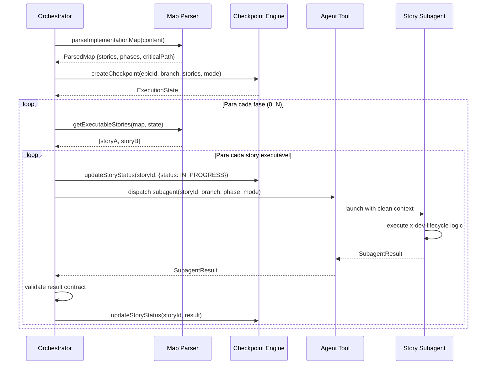

# História: Orchestrator Core Loop + Sequential Dispatcher

**ID:** story-0005-0005

## 1. Dependências

| Blocked By | Blocks |
| :--- | :--- |
| story-0005-0001, story-0005-0003, story-0005-0004 | story-0005-0006, story-0005-0007, story-0005-0008, story-0005-0009, story-0005-0010, story-0005-0011, story-0005-0013, story-0005-0014 |

## 2. Regras Transversais Aplicáveis

| ID | Título |
| :--- | :--- |
| RULE-001 | Context Isolation |
| RULE-002 | Checkpoint After Every Story |
| RULE-003 | Dependency Satisfaction |
| RULE-007 | Critical Path Priority |
| RULE-008 | Subagent Result Contract |

## 3. Descrição

Como **orchestrator de épicos**, eu quero o loop principal de execução que itera fase por fase,
despacha subagents sequencialmente para cada story, coleta resultados e atualiza o checkpoint,
garantindo que todas as stories sejam executadas na ordem correta respeitando dependências.

Esta é a história central do épico — o "Marco de Validação Arquitetural". Estabelece o padrão
de orquestração que todas as extensões (integrity gate, retry, resume, parallel) reutilizam.
O core loop funciona como um "gerente de projeto": lê o implementation map, determina quais
stories executar, despacha um subagent por story, coleta o resultado (`SubagentResult`), e
atualiza o checkpoint. O orchestrator NUNCA lê código-fonte, KPs ou diffs (RULE-001).

O dispatcher sequencial (default) executa stories uma por vez na mesma branch. É simples,
sem conflitos de merge, e ideal para a maioria dos épicos. O modo paralelo é adicionado em
story-0005-0010 como extensão.

### 3.1 Core Loop Algorithm

```
1. Ler implementation map e construir DAG (via parser de story-0005-0004)
2. Criar checkpoint inicial (via engine de story-0005-0001)
3. Criar branch: feat/epic-{epicId}-full-implementation
4. Para cada fase (0..N):
   a. Identificar stories executáveis (getExecutableStories)
   b. Para cada story (ordenada por critical path priority):
      i.   Marcar status IN_PROGRESS no checkpoint
      ii.  Despachar subagent com: story ID, branch name, fase, mode
      iii. Coletar SubagentResult
      iv.  Validar contrato do resultado (RULE-008)
      v.   Atualizar checkpoint com resultado (RULE-002)
   c. [Placeholder: integrity gate — story-0005-0006]
   d. Avançar para próxima fase
5. [Placeholder: consolidação final — story-0005-0011]
```

### 3.2 Subagent Dispatch (Sequential Mode)

- Cada story é executada por um subagent `general-purpose` via Agent tool
- O subagent recebe como prompt:
  - Story ID e path do arquivo da story
  - Branch name atual
  - Mode (skipReview true/false)
  - Instrução para executar lógica equivalente ao `x-dev-lifecycle`
  - Instrução para retornar `SubagentResult` no formato exato
- O subagent nasce com contexto limpo (sem herança do orchestrator)
- O subagent morre após completar (libera contexto)

### 3.3 Result Validation

- O orchestrator valida que o resultado contém: `status`, `findingsCount`, `summary`
- Se `status` é `SUCCESS`, `commitSha` deve estar presente
- Se o resultado não segue o contrato → story marcada FAILED com summary "Invalid subagent result"

### 3.4 Branch Management

- Antes do loop: `git checkout main && git pull origin main`
- Criar branch: `git checkout -b feat/epic-{epicId}-full-implementation`
- Cada subagent commita na mesma branch (modo sequencial)
- Se a branch já existe (resume mode): fazer checkout

## 4. Definições de Qualidade Locais

### DoR Local (Definition of Ready)

- [ ] Checkpoint engine funcional (story-0005-0001 concluída)
- [ ] SKILL.md skeleton criado (story-0005-0003 concluída)
- [ ] Implementation map parser funcional (story-0005-0004 concluída)
- [ ] Comportamento do Agent tool compreendido (dispatch + result collection)

### DoD Local (Definition of Done)

- [ ] Core loop itera fases corretamente seguindo o DAG
- [ ] Subagent é despachado para cada story com prompt correto
- [ ] SubagentResult é coletado e validado (contrato RULE-008)
- [ ] Checkpoint atualizado após cada story (RULE-002)
- [ ] Branch criada e gerenciada corretamente
- [ ] Stories executadas em ordem de critical path priority (RULE-007)
- [ ] SKILL.md atualizado com lógica do core loop (Phase 1)

### Global Definition of Done (DoD)

- **Cobertura:** ≥ 95% Line, ≥ 90% Branch
- **Testes Automatizados:** Unitários, integração (golden file tests). Cenários Gherkin cobertos.
- **Relatório de Cobertura:** Vitest coverage report com thresholds validados
- **Documentação:** Core loop documentado no SKILL.md
- **Persistência:** Checkpoint consistente após cada story
- **Performance:** Overhead do orchestrator < 5s entre stories (excluindo tempo do subagent)

## 5. Contratos de Dados (Data Contract)

**Subagent Prompt (enviado ao Agent tool):**

| Campo | Formato | Request | Response | Origem / Regra |
| :--- | :--- | :--- | :--- | :--- |
| `storyId` | string | M | - | Echo — ID da story a executar |
| `storyPath` | string (file path) | M | - | Derive — `docs/stories/epic-XXXX/story-XXXX-YYYY.md` |
| `branchName` | string | M | - | Echo — branch do épico |
| `currentPhase` | number | M | - | Echo — fase atual |
| `skipReview` | boolean | M | - | Echo — flag do mode |
| `epicId` | string | M | - | Echo — ID do épico |

**SubagentResult (retornado pelo subagent):**

| Campo | Formato | Request | Response | Origem / Regra |
| :--- | :--- | :--- | :--- | :--- |
| `status` | enum | - | M | Derive — SUCCESS/FAILED/PARTIAL |
| `commitSha` | string? | - | O | Derive — SHA do último commit (se SUCCESS) |
| `findingsCount` | number | - | M | Derive — total de findings |
| `summary` | string | - | M | Generate — resumo textual da execução |

## 6. Diagramas

### 6.1 Core Loop — Sequencial



## 7. Critérios de Aceite (Gherkin)

```gherkin
Cenario: Execução de épico com uma única story sem dependências
  DADO que o implementation map contém uma story "0042-0001" na phase 0 sem dependências
  QUANDO o core loop é executado
  ENTÃO um subagent é despachado para "0042-0001"
  E o resultado é coletado e validado
  E o checkpoint registra status SUCCESS e commitSha
  E metrics.storiesCompleted é 1

Cenario: Execução sequencial de duas fases com dependência
  DADO que o map contém: 0001 (phase 0) → 0002 (phase 1)
  QUANDO o core loop é executado
  ENTÃO 0001 é executada primeiro
  E somente após 0001 ter status SUCCESS, 0002 é despachada
  E o checkpoint é atualizado após cada story

Cenario: Priorização por caminho crítico dentro de uma fase
  DADO que phase 1 contém stories 0003 (critical path) e 0004 (não-critical)
  E ambas têm dependências satisfeitas
  QUANDO o core loop executa phase 1
  ENTÃO 0003 é despachada antes de 0004

Cenario: Validação de contrato do SubagentResult — resultado válido
  DADO que o subagent retorna {status: "SUCCESS", commitSha: "abc123", findingsCount: 0, summary: "OK"}
  QUANDO o resultado é validado
  ENTÃO a validação passa
  E o checkpoint é atualizado com o resultado

Cenario: Validação de contrato do SubagentResult — resultado inválido
  DADO que o subagent retorna um objeto sem o campo "status"
  QUANDO o resultado é validado
  ENTÃO a story é marcada FAILED
  E summary registra "Invalid subagent result: missing status field"

Cenario: Criação de branch para o épico
  DADO que a branch "feat/epic-0042-full-implementation" não existe
  QUANDO o core loop inicia
  ENTÃO a branch é criada a partir de main atualizada
  E o checkout é feito para a nova branch

Cenario: Checkpoint atualizado após cada story (RULE-002)
  DADO que 3 stories serão executadas
  QUANDO o core loop executa as 3 stories
  ENTÃO o checkpoint é atualizado 3 vezes (uma após cada story)
  E entre o término de uma story e o início da próxima, o checkpoint reflete o estado atual

Cenario: Orchestrator não lê código-fonte nem KPs (RULE-001)
  DADO que o orchestrator está executando o core loop
  QUANDO analisado o contexto do orchestrator
  ENTÃO ele contém apenas: implementation map, tabela de status, commit SHAs, contadores
  E NÃO contém: código-fonte de arquivos .ts/.js, conteúdo de knowledge packs, diffs de git

Cenario: Story com status BLOCKED não é despachada
  DADO que story "0042-0003" tem status BLOCKED
  QUANDO o core loop avalia stories executáveis
  ENTÃO "0042-0003" NÃO aparece na lista de executáveis
```

### 7.1 Scenario Ordering (TPP)

> Scenarios seguem TPP: single story → duas fases → priorização → validação de contrato → branch → checkpoint → context isolation → blocked story.

### 7.2 Mandatory Scenario Categories

- [x] Degenerate cases (resultado inválido do subagent)
- [x] Happy path (single story, duas fases, priorização)
- [x] Error paths (contrato inválido, story blocked)
- [x] Boundary values (context isolation RULE-001, checkpoint timing RULE-002)

## 8. Sub-tarefas

- [ ] [Dev] Implementar core loop algorithm no SKILL.md (Phase 1 section)
- [ ] [Dev] Implementar subagent dispatch prompt template
- [ ] [Dev] Implementar result validation (contrato RULE-008)
- [ ] [Dev] Implementar branch management (create/checkout)
- [ ] [Dev] Integrar com checkpoint engine (createCheckpoint + updateStoryStatus)
- [ ] [Dev] Integrar com map parser (parseImplementationMap + getExecutableStories)
- [ ] [Test] Unitário: core loop com mock de subagent dispatch
- [ ] [Test] Unitário: result validation (válido e inválido)
- [ ] [Test] Unitário: priorização por critical path
- [ ] [Test] Integração: execução E2E com mini implementation map sintético
- [ ] [Doc] Documentar core loop no SKILL.md com diagrama de sequência
