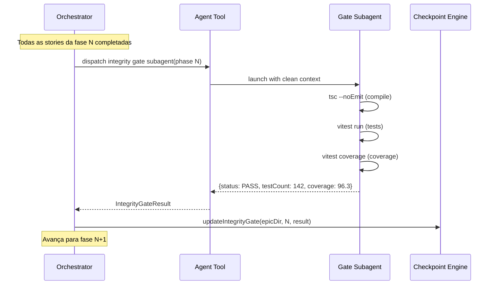
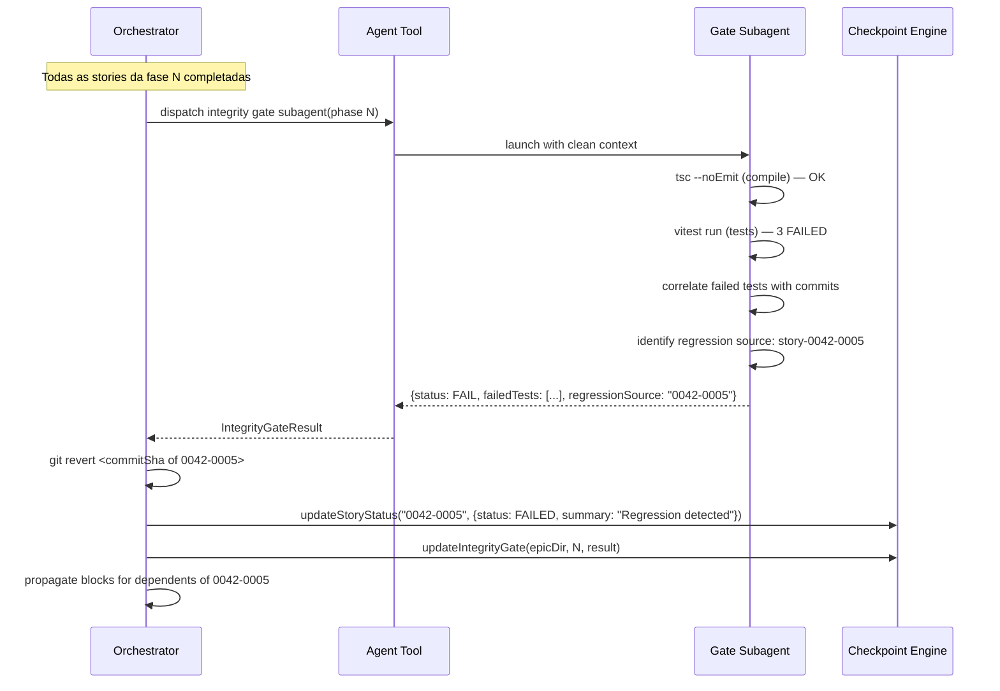

# História: Integrity Gate Between Phases

**ID:** story-0005-0006

## 1. Dependências

| Blocked By | Blocks |
| :--- | :--- |
| story-0005-0005 | story-0005-0014 |

## 2. Regras Transversais Aplicáveis

| ID | Título |
| :--- | :--- |
| RULE-004 | Integrity Gate Mandatory |
| RULE-006 | Block Propagation Transitiva |

## 3. Descrição

Como **orchestrator de épicos**, eu quero um integrity gate executado entre cada fase que verifica
compilação, testes e cobertura do projeto inteiro, garantindo que nenhuma story introduza regressões
sem detecção imediata.

O integrity gate é um subagent leve despachado após todas as stories de uma fase serem completadas.
Ele executa: compilação completa (`tsc --noEmit` ou equivalente), suite completa de testes (não só
os da fase atual), e verificação de coverage thresholds (≥ 95% line, ≥ 90% branch). Se o gate
falha, um subagent de diagnóstico é acionado para identificar qual story da fase causou a regressão.
A story culpada é revertida (`git revert`), marcada FAILED, e block propagation é executada.

O gate é obrigatório (RULE-004) — não há bypass. O resultado é registrado no checkpoint em
`integrityGates["phase-N"]`.

### 3.1 Integrity Gate Subagent

- Subagent `general-purpose` com prompt focado em validação
- Executa: `{{COMPILE_COMMAND}}` para compilação
- Executa: `{{TEST_COMMAND}}` para testes
- Executa: `{{COVERAGE_COMMAND}}` para cobertura
- Retorna: `{ status: PASS|FAIL, testCount, coverage, failedTests?, regressionSource? }`

### 3.2 Regression Diagnosis

- Se testes falham, o subagent analisa quais testes quebraram
- Correlaciona testes falhados com stories da fase atual (via commit history)
- Identifica a story mais provável como causa raiz
- Se identificada: reverte o merge dessa story (`git revert <commitSha>`)
- Story revertida é marcada FAILED com summary indicando regressão

### 3.3 Gate Result Registration

- Resultado registrado via `updateIntegrityGate(epicDir, phase, result)`
- Status PASS: avança para próxima fase
- Status FAIL + regression identified: revert + FAILED + block propagation
- Status FAIL + regression unidentified: parar execução, reportar ao orchestrator

## 4. Definições de Qualidade Locais

### DoR Local (Definition of Ready)

- [ ] Core loop funcional (story-0005-0005 concluída)
- [ ] `{{COMPILE_COMMAND}}`, `{{TEST_COMMAND}}`, `{{COVERAGE_COMMAND}}` definidos no project identity
- [ ] `updateIntegrityGate()` disponível no checkpoint engine

### DoD Local (Definition of Done)

- [ ] Integrity gate subagent despachado após cada fase
- [ ] Compilação, testes e cobertura executados e resultados coletados
- [ ] Regression diagnosis identifica story culpada quando possível
- [ ] Git revert aplicado na story culpada
- [ ] Resultado registrado no checkpoint (integrityGates)
- [ ] SKILL.md atualizado com lógica do integrity gate

### Global Definition of Done (DoD)

- **Cobertura:** ≥ 95% Line, ≥ 90% Branch
- **Testes Automatizados:** Unitários, integração (golden file tests). Cenários Gherkin cobertos.
- **Relatório de Cobertura:** Vitest coverage report com thresholds validados
- **Documentação:** Integrity gate documentado no SKILL.md
- **Persistência:** Gate results no checkpoint
- **Performance:** Gate execution < 5min para projetos típicos

## 5. Contratos de Dados (Data Contract)

**IntegrityGateResult:**

| Campo | Formato | Request | Response | Origem / Regra |
| :--- | :--- | :--- | :--- | :--- |
| `status` | enum (`PASS` \| `FAIL`) | - | M | Derive — resultado da validação |
| `timestamp` | string (ISO-8601) | - | M | Generate — momento da execução |
| `testCount` | number | - | M | Derive — total de testes executados |
| `coverage` | number (float, %) | - | M | Derive — line coverage |
| `branchCoverage` | number (float, %) | - | O | Derive — branch coverage |
| `failedTests` | string[] | - | O | Derive — nomes dos testes falhados |
| `regressionSource` | string? (story ID) | - | O | Derive — story que causou regressão |

## 6. Diagramas

### 6.1 Fluxo do Integrity Gate — PASS



### 6.2 Fluxo do Integrity Gate — FAIL com Regression



## 7. Critérios de Aceite (Gherkin)

```gherkin
Cenario: Integrity gate PASS — compilação, testes e cobertura OK
  DADO que todas as stories da fase 0 completaram com SUCCESS
  QUANDO o integrity gate é executado para fase 0
  E compilação passa, todos os 42 testes passam, coverage é 96.3%
  ENTÃO o resultado registrado é {status: PASS, testCount: 42, coverage: 96.3}
  E o orchestrator avança para fase 1

Cenario: Integrity gate FAIL — teste quebrado com regression identificada
  DADO que todas as stories da fase 1 completaram com SUCCESS
  QUANDO o integrity gate é executado para fase 1
  E 3 testes falham e o diagnóstico identifica story "0042-0005" como causa
  ENTÃO git revert é executado para o commit de "0042-0005"
  E "0042-0005" é marcada FAILED com summary "Regression detected by integrity gate"
  E dependentes de "0042-0005" são marcados BLOCKED
  E o resultado registrado contém {status: FAIL, regressionSource: "0042-0005"}

Cenario: Integrity gate FAIL — cobertura abaixo do threshold
  DADO que compilação e testes passam
  MAS line coverage é 93.2% (abaixo do threshold de 95%)
  QUANDO o integrity gate é executado
  ENTÃO o resultado é {status: FAIL}
  E o summary indica "Coverage below threshold: 93.2% < 95.0%"

Cenario: Integrity gate FAIL — regression não identificável
  DADO que testes falham mas o diagnóstico não consegue correlacionar com uma story específica
  QUANDO o integrity gate falha sem regressionSource
  ENTÃO a execução é pausada
  E o orchestrator reporta o problema para o usuário
  E o checkpoint registra o gate como FAIL sem regressionSource

Cenario: Gate executado entre CADA fase (RULE-004)
  DADO que o épico tem 4 fases (0, 1, 2, 3)
  QUANDO a execução completa
  ENTÃO integrity gates são executados 4 vezes (após fase 0, 1, 2 e 3)
  E todos os 4 resultados estão registrados no checkpoint

Cenario: Git revert preserva commits de outras stories
  DADO que fase 1 tem stories 0003 e 0004, ambas SUCCESS
  E o gate identifica 0004 como regression source
  QUANDO git revert é executado para 0004
  ENTÃO os commits de 0003 permanecem intactos
  E somente os commits de 0004 são revertidos
```

### 7.1 Scenario Ordering (TPP)

> Scenarios seguem TPP: PASS simples → FAIL com regression → FAIL coverage → FAIL unidentified → múltiplas fases → preservação de commits.

### 7.2 Mandatory Scenario Categories

- [x] Degenerate cases (regression não identificável)
- [x] Happy path (gate PASS)
- [x] Error paths (regression, coverage abaixo)
- [x] Boundary values (gate em cada fase, preservação de commits)

## 8. Sub-tarefas

- [ ] [Dev] Implementar prompt do integrity gate subagent
- [ ] [Dev] Implementar regression diagnosis (correlação testes ↔ commits)
- [ ] [Dev] Implementar git revert para story culpada
- [ ] [Dev] Implementar registro do gate result no checkpoint
- [ ] [Dev] Integrar gate no core loop (após cada fase)
- [ ] [Dev] Atualizar SKILL.md com seção de integrity gate
- [ ] [Test] Unitário: gate PASS, gate FAIL com regression, gate FAIL sem source
- [ ] [Test] Unitário: coverage threshold validation
- [ ] [Test] Integração: git revert preserva commits de outras stories
- [ ] [Doc] Documentar integrity gate no SKILL.md
