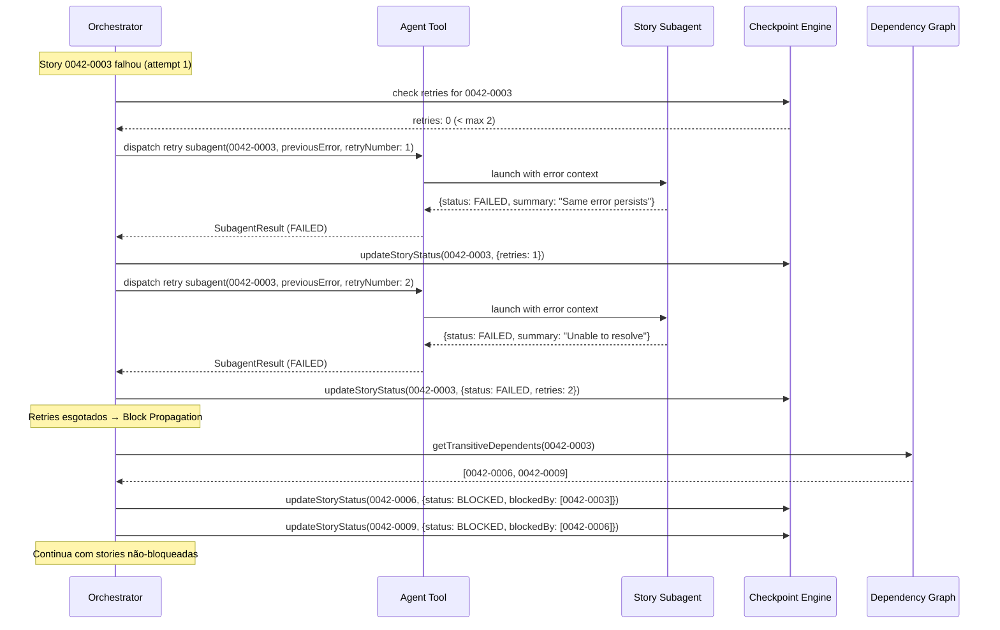

# História: Failure Handling — Retry + Block Propagation

**ID:** story-0005-0007

## 1. Dependências

| Blocked By | Blocks |
| :--- | :--- |
| story-0005-0005 | story-0005-0010, story-0005-0014 |

## 2. Regras Transversais Aplicáveis

| ID | Título |
| :--- | :--- |
| RULE-005 | Retry Budget |
| RULE-006 | Block Propagation Transitiva |

## 3. Descrição

Como **orchestrator de épicos**, eu quero um sistema de gestão de falhas com 3 níveis (retry,
block propagation, integrity gate failure), garantindo que falhas individuais não interrompam
a execução de stories independentes e que dependentes bloqueados sejam identificados corretamente.

Esta história implementa os mecanismos de resiliência do orchestrator. Quando uma story falha,
o sistema decide: (1) retry com contexto de erro (até 2 tentativas), (2) se esgotado, marcar
FAILED e propagar bloqueios transitivamente para todos os dependentes, (3) continuar executando
stories não-bloqueadas. A propagação é transitiva: se A falha, B (que depende de A) é BLOCKED,
e C (que depende de B) também é BLOCKED.

### 3.1 Nível 1 — Retry

- Story falhou mas o projeto compila (erro local, não regressão global)
- Retry com budget máximo de 2 (RULE-005): `retries` incrementa no checkpoint
- Subagent do retry recebe como contexto adicional: o erro anterior, o summary da tentativa falha
- Se retry tem SUCCESS: story marcada SUCCESS normalmente
- Se retry falha novamente: avança para Nível 2

### 3.2 Nível 2 — Block Propagation

- Story marcada FAILED permanentemente (retries esgotados)
- Algoritmo de propagação transitiva (BFS/DFS no DAG):
  1. Marcar a story como FAILED
  2. Para cada story que depende diretamente: marcar BLOCKED, registrar `blockedBy`
  3. Para cada story transitivamente dependente: marcar BLOCKED
- O orchestrator continua executando stories cujas dependências não incluem a story FAILED

### 3.3 Nível 3 — Integrity Gate Failure

- Implementado em story-0005-0006, este nível é a integração:
  - Se o integrity gate identifica uma regression source, a story é revertida e marcada FAILED
  - Block propagation é acionada para os dependentes da story revertida
- Esta história implementa a lógica de propagação que o integrity gate consome

### 3.4 Continuação após Falha

- O orchestrator NÃO para ao encontrar uma falha
- Identifica stories nas fases atual e futuras que NÃO dependem da story falhada
- Continua executando essas stories normalmente
- O report final mostra quais stories foram completadas, falhadas e bloqueadas

## 4. Definições de Qualidade Locais

### DoR Local (Definition of Ready)

- [ ] Core loop funcional (story-0005-0005 concluída)
- [ ] DAG disponível para traversal de dependências
- [ ] Checkpoint engine suporta update de status e blockedBy

### DoD Local (Definition of Done)

- [ ] Retry com budget de 2, com erro anterior como contexto
- [ ] Block propagation transitiva implementada e testada
- [ ] Orchestrator continua executando stories não-bloqueadas após falha
- [ ] Checkpoint atualizado com status FAILED e BLOCKED corretos
- [ ] SKILL.md atualizado com seção de failure handling

### Global Definition of Done (DoD)

- **Cobertura:** ≥ 95% Line, ≥ 90% Branch
- **Testes Automatizados:** Unitários, integração (golden file tests). Cenários Gherkin cobertos.
- **Relatório de Cobertura:** Vitest coverage report com thresholds validados
- **Documentação:** Failure handling documentado no SKILL.md
- **Persistência:** Status FAILED/BLOCKED corretamente no checkpoint
- **Performance:** Block propagation < 100ms para grafos típicos (< 50 stories)

## 5. Contratos de Dados (Data Contract)

**Retry Context (passado ao subagent no retry):**

| Campo | Formato | Request | Response | Origem / Regra |
| :--- | :--- | :--- | :--- | :--- |
| `previousError` | string | M | - | Echo — summary da tentativa anterior |
| `retryNumber` | number (1 ou 2) | M | - | Derive — contador de retries |
| `storyId` | string | M | - | Echo — ID da story |
| `branchName` | string | M | - | Echo — branch atual |

**Block Propagation Output:**

| Campo | Formato | Request | Response | Origem / Regra |
| :--- | :--- | :--- | :--- | :--- |
| `blockedStories` | string[] | - | M | Derive — IDs das stories bloqueadas transitivamente |
| `failedStory` | string | - | M | Echo — ID da story que falhou |

## 6. Diagramas

### 6.1 Fluxo de Retry + Block Propagation



## 7. Critérios de Aceite (Gherkin)

```gherkin
Cenario: Retry com SUCCESS na primeira tentativa
  DADO que story "0042-0003" falhou com retries 0
  QUANDO o retry é executado com o erro anterior como contexto
  E o subagent retorna SUCCESS
  ENTÃO "0042-0003" é marcada SUCCESS
  E retries permanece 0 (não incrementa no sucesso)
  E nenhum block propagation é acionado

Cenario: Retry falha duas vezes e marca FAILED
  DADO que story "0042-0003" falhou com retries 0
  QUANDO o primeiro retry falha
  E o segundo retry também falha
  ENTÃO "0042-0003" é marcada FAILED com retries 2
  E block propagation é acionada

Cenario: Retry não ultrapassa budget de 2 (RULE-005)
  DADO que story "0042-0003" está com retries 2 e status FAILED
  QUANDO o orchestrator avalia se deve retry
  ENTÃO nenhum retry é executado (budget esgotado)

Cenario: Block propagation direta — dependente imediato bloqueado
  DADO que "0042-0003" é marcada FAILED
  E "0042-0006" depende diretamente de "0042-0003"
  QUANDO block propagation é executada
  ENTÃO "0042-0006" é marcada BLOCKED com blockedBy ["0042-0003"]

Cenario: Block propagation transitiva — dependente indireto bloqueado (RULE-006)
  DADO que "0042-0003" é FAILED
  E "0042-0006" depende de "0042-0003"
  E "0042-0009" depende de "0042-0006"
  QUANDO block propagation é executada
  ENTÃO "0042-0006" é BLOCKED com blockedBy ["0042-0003"]
  E "0042-0009" é BLOCKED com blockedBy ["0042-0006"]

Cenario: Continuação com stories não-bloqueadas
  DADO que "0042-0003" é FAILED na fase 1
  E "0042-0004" na fase 1 NÃO depende de "0042-0003"
  QUANDO o orchestrator avalia stories executáveis
  ENTÃO "0042-0004" é executada normalmente
  E "0042-0006" (dependente de 0003) NÃO é executada

Cenario: Retry recebe erro anterior como contexto
  DADO que story "0042-0003" falhou com summary "Compilation error in parser.ts line 42"
  QUANDO o retry subagent é despachado
  ENTÃO o prompt do subagent contém o previousError "Compilation error in parser.ts line 42"
  E contém retryNumber 1

Cenario: Block propagation não afeta stories sem dependência da falhada
  DADO que "0042-0003" é FAILED
  E "0042-0005" não tem nenhuma dependência em "0042-0003" (nem direta nem transitiva)
  QUANDO block propagation é executada
  ENTÃO "0042-0005" permanece com seu status original (PENDING ou SUCCESS)
```

### 7.1 Scenario Ordering (TPP)

> Scenarios seguem TPP: retry SUCCESS → retry FAILED → budget esgotado → block direta → block transitiva → continuação → contexto do retry → não-afetados.

### 7.2 Mandatory Scenario Categories

- [x] Degenerate cases (budget esgotado)
- [x] Happy path (retry com sucesso)
- [x] Error paths (retry falha, block propagation)
- [x] Boundary values (transitividade, stories não-afetadas)

## 8. Sub-tarefas

- [ ] [Dev] Implementar lógica de retry com budget e contexto de erro
- [ ] [Dev] Implementar prompt do retry subagent com previousError
- [ ] [Dev] Implementar algoritmo de block propagation transitiva (BFS no DAG)
- [ ] [Dev] Implementar lógica de continuação com stories não-bloqueadas
- [ ] [Dev] Integrar failure handling no core loop
- [ ] [Dev] Atualizar SKILL.md com seção de failure handling
- [ ] [Test] Unitário: retry SUCCESS, retry FAILED, budget esgotado
- [ ] [Test] Unitário: block propagation direta e transitiva
- [ ] [Test] Unitário: continuação com stories não-afetadas
- [ ] [Test] Integração: cenário completo retry → block → continue
