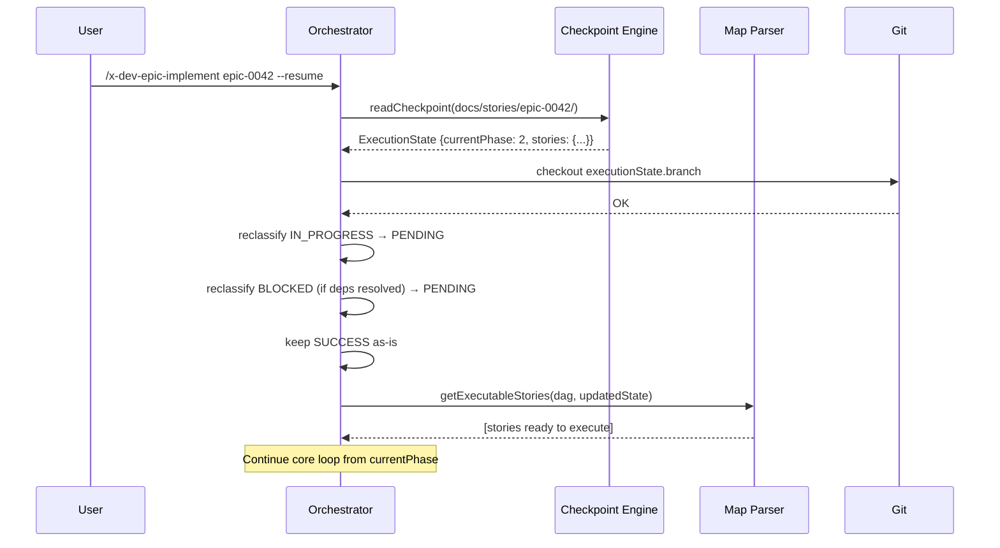

# História: Resumability (`--resume`)

**ID:** story-0005-0008

## 1. Dependências

| Blocked By | Blocks |
| :--- | :--- |
| story-0005-0001, story-0005-0005 | story-0005-0014 |

## 2. Regras Transversais Aplicáveis

| ID | Título |
| :--- | :--- |
| RULE-002 | Checkpoint After Every Story |
| RULE-003 | Dependency Satisfaction |

## 3. Descrição

Como **orchestrator de épicos**, eu quero poder retomar a execução de um épico de onde parou
usando a flag `--resume`, garantindo que stories já completadas não sejam re-executadas e que
o progresso anterior seja totalmente preservado.

A resumabilidade é essencial para épicos grandes: se o processo morre (timeout, crash, interrupção
do usuário), o orchestrator pode continuar exatamente de onde parou. Ao receber `--resume`, o
orchestrator lê o `execution-state.json` existente, identifica stories PENDING e FAILED (com
retries < max), recalcula quais dependências estão satisfeitas, e continua o loop de execução.

Stories com status IN_PROGRESS (que podem ter sido interrompidas mid-execution) são tratadas como
PENDING para re-despacho. Stories SUCCESS são preservadas — nunca re-executadas. Stories FAILED
com retries < max são candidatas a retry. Stories BLOCKED são reavaliadas (se a story bloqueante
foi resolvida em uma execução manual, o bloqueio pode ser liberado).

### 3.1 Resume Workflow

1. Verificar existência de `execution-state.json` (pré-requisito)
2. Ler checkpoint via `readCheckpoint(epicDir)`
3. Recuperar branch do checkpoint e fazer checkout
4. Re-classificar stories:
   - `IN_PROGRESS` → `PENDING` (re-despachar)
   - `SUCCESS` → manter (não re-executar)
   - `FAILED` com retries < 2 → candidata a retry
   - `FAILED` com retries ≥ 2 → manter FAILED
   - `BLOCKED` → reavaliar (dependência pode ter sido resolvida)
5. Recalcular stories executáveis via `getExecutableStories(dag, updatedState)`
6. Continuar core loop a partir da fase atual (`currentPhase`)

### 3.2 Reavaliação de BLOCKED

- Para cada story BLOCKED: verificar se TODAS as dependências têm status SUCCESS
- Se sim: reclassificar como PENDING (o bloqueio foi resolvido)
- Se não: manter BLOCKED (a dependência ainda não foi resolvida)

### 3.3 Branch Recovery

- Fazer checkout da branch registrada no checkpoint (`executionState.branch`)
- Verificar que a branch existe localmente e remotamente
- Se a branch não existe: abortar com erro claro

## 4. Definições de Qualidade Locais

### DoR Local (Definition of Ready)

- [ ] Checkpoint engine funcional com read/write (story-0005-0001 concluída)
- [ ] Core loop funcional (story-0005-0005 concluída)
- [ ] Formato do `execution-state.json` estável

### DoD Local (Definition of Done)

- [ ] `--resume` lê checkpoint e recalcula estado
- [ ] Stories IN_PROGRESS reclassificadas como PENDING
- [ ] Stories SUCCESS nunca re-executadas
- [ ] Stories BLOCKED reavaliadas corretamente
- [ ] Branch recovery funcional
- [ ] SKILL.md atualizado com seção de resumability

### Global Definition of Done (DoD)

- **Cobertura:** ≥ 95% Line, ≥ 90% Branch
- **Testes Automatizados:** Unitários, integração (golden file tests). Cenários Gherkin cobertos.
- **Relatório de Cobertura:** Vitest coverage report com thresholds validados
- **Documentação:** Resume workflow documentado no SKILL.md
- **Persistência:** Checkpoint lido corretamente sem corrupção
- **Performance:** Resume startup < 2s (read checkpoint + recalculate)

## 5. Contratos de Dados (Data Contract)

**Resume Input:**

| Campo | Formato | Request | Response | Origem / Regra |
| :--- | :--- | :--- | :--- | :--- |
| `epicId` | string | M | - | Argumento posicional |
| `--resume` | boolean (true) | M | - | Flag obrigatória para este fluxo |

**Resume Reclassification:**

| Status Anterior | Novo Status | Condição |
| :--- | :--- | :--- |
| `IN_PROGRESS` | `PENDING` | Sempre (re-despachar) |
| `SUCCESS` | `SUCCESS` | Sempre (preservar) |
| `FAILED` (retries < 2) | `PENDING` | Candidata a retry |
| `FAILED` (retries ≥ 2) | `FAILED` | Manter (budget esgotado) |
| `BLOCKED` | `PENDING` | Se TODAS as dependências SUCCESS |
| `BLOCKED` | `BLOCKED` | Se alguma dependência não-SUCCESS |
| `PENDING` | `PENDING` | Manter |

## 6. Diagramas

### 6.1 Fluxo de Resume



## 7. Critérios de Aceite (Gherkin)

```gherkin
Cenario: Resume com checkpoint contendo mix de estados
  DADO que execution-state.json existe com:
    | Story ID  | Status      | Retries |
    | 0042-0001 | SUCCESS     | 0       |
    | 0042-0002 | SUCCESS     | 0       |
    | 0042-0003 | IN_PROGRESS | 0       |
    | 0042-0004 | PENDING     | 0       |
    | 0042-0005 | FAILED      | 1       |
  QUANDO --resume é executado
  ENTÃO 0042-0001 e 0042-0002 permanecem SUCCESS (não re-executadas)
  E 0042-0003 é reclassificada para PENDING
  E 0042-0005 é reclassificada para PENDING (retries < 2, candidata a retry)
  E 0042-0004 permanece PENDING

Cenario: Resume preserva stories SUCCESS — nunca re-executa
  DADO que checkpoint tem 3 stories SUCCESS com commits
  QUANDO --resume é executado
  ENTÃO nenhum subagent é despachado para as 3 stories SUCCESS
  E os commitShas são preservados

Cenario: Resume reclassifica BLOCKED quando dependência resolvida
  DADO que "0042-0006" está BLOCKED por "0042-0003"
  E "0042-0003" agora tem status SUCCESS (resolvida manualmente)
  QUANDO --resume é executado
  ENTÃO "0042-0006" é reclassificada para PENDING

Cenario: Resume mantém BLOCKED quando dependência não resolvida
  DADO que "0042-0006" está BLOCKED por "0042-0003"
  E "0042-0003" ainda tem status FAILED
  QUANDO --resume é executado
  ENTÃO "0042-0006" permanece BLOCKED

Cenario: Resume com FAILED que esgotou budget de retries
  DADO que "0042-0005" está FAILED com retries 2
  QUANDO --resume é executado
  ENTÃO "0042-0005" permanece FAILED (budget esgotado, não tenta retry)

Cenario: Resume faz checkout da branch do checkpoint
  DADO que checkpoint registra branch "feat/epic-0042-full-implementation"
  QUANDO --resume é executado
  ENTÃO git checkout é feito para a branch registrada

Cenario: Resume falha se branch do checkpoint não existe
  DADO que checkpoint registra branch "feat/epic-0042-full-implementation"
  MAS a branch não existe localmente nem remotamente
  QUANDO --resume é executado
  ENTÃO aborta com erro "Branch feat/epic-0042-full-implementation not found"

Cenario: Resume sem checkpoint existente
  DADO que execution-state.json NÃO existe
  QUANDO --resume é passado
  ENTÃO aborta com erro "No checkpoint found. Cannot resume."
```

### 7.1 Scenario Ordering (TPP)

> Scenarios seguem TPP: mix de estados → preservação SUCCESS → reclassificação BLOCKED → FAILED budget → branch recovery → erros.

### 7.2 Mandatory Scenario Categories

- [x] Degenerate cases (sem checkpoint, branch inexistente)
- [x] Happy path (resume com mix de estados)
- [x] Error paths (FAILED com budget esgotado, branch ausente)
- [x] Boundary values (reclassificação BLOCKED, IN_PROGRESS → PENDING)

## 8. Sub-tarefas

- [ ] [Dev] Implementar leitura e validação do checkpoint no resume
- [ ] [Dev] Implementar reclassificação de estados (IN_PROGRESS, BLOCKED, FAILED)
- [ ] [Dev] Implementar reavaliação de BLOCKED stories
- [ ] [Dev] Implementar branch recovery (checkout da branch do checkpoint)
- [ ] [Dev] Integrar resume no core loop (entry point alternativo)
- [ ] [Dev] Atualizar SKILL.md com seção de resumability
- [ ] [Test] Unitário: reclassificação de cada status
- [ ] [Test] Unitário: reavaliação de BLOCKED (resolvida e não resolvida)
- [ ] [Test] Unitário: branch recovery (existente e inexistente)
- [ ] [Test] Integração: resume completo com checkpoint real
