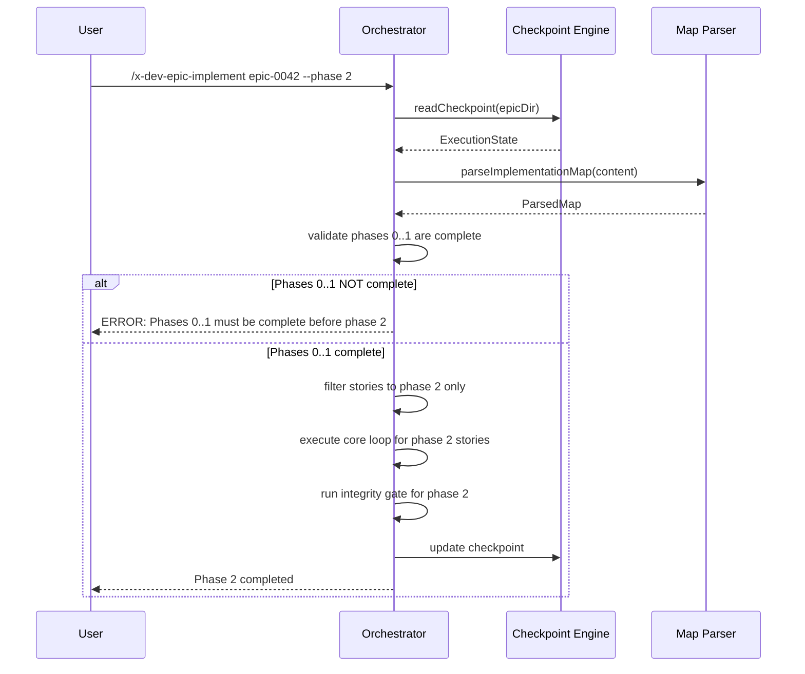
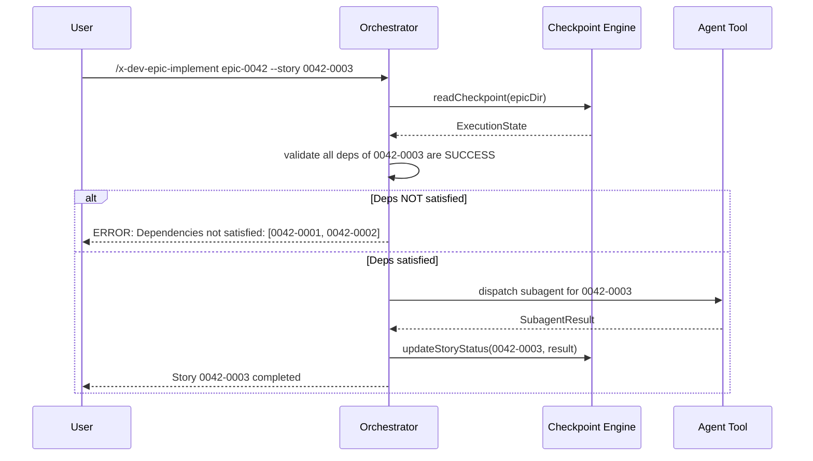

# História: Partial Execution (`--phase N`, `--story`)

**ID:** story-0005-0009

## 1. Dependências

| Blocked By | Blocks |
| :--- | :--- |
| story-0005-0005 | story-0005-0014 |

## 2. Regras Transversais Aplicáveis

| ID | Título |
| :--- | :--- |
| RULE-003 | Dependency Satisfaction |
| RULE-004 | Integrity Gate Mandatory |

## 3. Descrição

Como **orchestrator de épicos**, eu quero executar apenas uma fase específica (`--phase N`) ou
uma story específica (`--story XXXX-YYYY`), garantindo que posso retomar stories individuais
ou fases sem re-executar o épico inteiro.

A execução parcial é útil para: (1) retry manual de uma story que falhou, (2) execução fase
a fase para controle mais granular, (3) desenvolvimento iterativo onde o desenvolvedor quer
testar apenas uma parte do épico. O orchestrator verifica pré-condições antes de executar:
para `--phase N`, todas as fases anteriores devem estar completas; para `--story`, todas as
dependências da story devem ter status SUCCESS.

### 3.1 Modo `--phase N`

1. Ler checkpoint (ou verificar código existente se não há checkpoint)
2. Verificar que fases 0..N-1 estão completas:
   - Se há checkpoint: todas as stories das fases anteriores têm status SUCCESS
   - Se não há checkpoint: verificar via análise do código/branch existente (best effort)
3. Executar apenas stories da fase N
4. Integrity gate ao final da fase N
5. Atualizar checkpoint

### 3.2 Modo `--story XXXX-YYYY`

1. Ler checkpoint (obrigatório para single story)
2. Verificar que TODAS as dependências da story têm status SUCCESS
3. Despachar subagent para a story específica
4. Coletar resultado e atualizar checkpoint
5. NÃO executar integrity gate (é uma story isolada)

### 3.3 Validação de Pré-condições

- `--phase N` com N > max phase: erro "Phase N does not exist. Max phase is M."
- `--phase N` com fases anteriores incompletas: erro "Phases 0..N-1 must be complete."
- `--story` com story inexistente no mapa: erro "Story XXXX-YYYY not found in implementation map."
- `--story` com dependências não satisfeitas: erro "Dependencies not satisfied: [list]"
- `--phase` e `--story` são mutuamente exclusivos: erro se ambos passados

## 4. Definições de Qualidade Locais

### DoR Local (Definition of Ready)

- [ ] Core loop funcional (story-0005-0005 concluída)
- [ ] Checkpoint engine com leitura de estado
- [ ] Map parser com fase e dependency lookup

### DoD Local (Definition of Done)

- [ ] `--phase N` executa apenas stories da fase N após validar pré-condições
- [ ] `--story XXXX-YYYY` executa story isolada após validar dependências
- [ ] Erros claros para pré-condições não satisfeitas
- [ ] Flags mutuamente exclusivas rejeitadas
- [ ] SKILL.md atualizado com seção de partial execution

### Global Definition of Done (DoD)

- **Cobertura:** ≥ 95% Line, ≥ 90% Branch
- **Testes Automatizados:** Unitários, integração (golden file tests). Cenários Gherkin cobertos.
- **Relatório de Cobertura:** Vitest coverage report com thresholds validados
- **Documentação:** Partial execution documentada no SKILL.md
- **Persistência:** Checkpoint atualizado corretamente após execução parcial
- **Performance:** Validação de pré-condições < 1s

## 5. Contratos de Dados (Data Contract)

**Partial Execution Input:**

| Campo | Formato | Request | Response | Origem / Regra |
| :--- | :--- | :--- | :--- | :--- |
| `epicId` | string | M | - | Argumento posicional |
| `--phase` | number | O (exclusivo com --story) | - | Flag — número da fase |
| `--story` | string (XXXX-YYYY) | O (exclusivo com --phase) | - | Flag — ID da story |

**Prerequisite Validation Output:**

| Campo | Formato | Request | Response | Origem / Regra |
| :--- | :--- | :--- | :--- | :--- |
| `valid` | boolean | - | M | Derive — pré-condições satisfeitas |
| `error` | string? | - | O | Derive — mensagem de erro |
| `unsatisfiedDeps` | string[]? | - | O | Derive — dependências não completas |

## 6. Diagramas

### 6.1 Fluxo de `--phase N`



### 6.2 Fluxo de `--story XXXX-YYYY`



## 7. Critérios de Aceite (Gherkin)

```gherkin
Cenario: Execução de phase 2 com fases anteriores completas
  DADO que fases 0 e 1 têm todas as stories com status SUCCESS
  QUANDO --phase 2 é executado
  ENTÃO apenas stories da fase 2 são despachadas
  E integrity gate é executado ao final da fase 2
  E checkpoint é atualizado

Cenario: Execução de phase N com fase anterior incompleta
  DADO que fase 0 tem stories SUCCESS mas fase 1 tem story PENDING
  QUANDO --phase 2 é executado
  ENTÃO aborta com erro "Phases 0..1 must be complete before phase 2"

Cenario: Execução de story individual com dependências satisfeitas
  DADO que story "0042-0003" depende de "0042-0001" e "0042-0002"
  E ambas têm status SUCCESS no checkpoint
  QUANDO --story 0042-0003 é executado
  ENTÃO subagent é despachado para "0042-0003"
  E checkpoint é atualizado com o resultado
  E NÃO há integrity gate (execução de story isolada)

Cenario: Execução de story individual com dependência não satisfeita
  DADO que story "0042-0003" depende de "0042-0001" (SUCCESS) e "0042-0002" (PENDING)
  QUANDO --story 0042-0003 é executado
  ENTÃO aborta com erro "Dependencies not satisfied: [0042-0002]"

Cenario: --phase e --story mutuamente exclusivos
  DADO que o usuário passa ambas as flags
  QUANDO "--phase 2 --story 0042-0003" é executado
  ENTÃO aborta com erro "--phase and --story are mutually exclusive"

Cenario: --phase com número inválido
  DADO que o épico tem fases 0, 1, 2, 3
  QUANDO --phase 5 é executado
  ENTÃO aborta com erro "Phase 5 does not exist. Max phase is 3."

Cenario: --story com ID inexistente no mapa
  DADO que story "0042-9999" não existe no implementation map
  QUANDO --story 0042-9999 é executado
  ENTÃO aborta com erro "Story 0042-9999 not found in implementation map"
```

### 7.1 Scenario Ordering (TPP)

> Scenarios seguem TPP: phase com deps OK → phase com deps faltando → story com deps OK → story com deps faltando → flags exclusivas → fase inválida → story inexistente.

### 7.2 Mandatory Scenario Categories

- [x] Degenerate cases (fase inválida, story inexistente, flags exclusivas)
- [x] Happy path (phase com deps OK, story com deps OK)
- [x] Error paths (deps incompletas, flags conflitantes)
- [x] Boundary values (sem integrity gate para story isolada)

## 8. Sub-tarefas

- [ ] [Dev] Implementar validação de pré-condições para `--phase N`
- [ ] [Dev] Implementar validação de dependências para `--story XXXX-YYYY`
- [ ] [Dev] Implementar exclusividade mútua de flags
- [ ] [Dev] Implementar filtro de stories por fase no core loop
- [ ] [Dev] Implementar dispatch de story individual (sem integrity gate)
- [ ] [Dev] Atualizar SKILL.md com seção de partial execution
- [ ] [Test] Unitário: validação de phase (OK, incompleta, inválida)
- [ ] [Test] Unitário: validação de story (OK, deps faltando, inexistente)
- [ ] [Test] Unitário: exclusividade mútua de flags
- [ ] [Test] Integração: execução parcial com checkpoint real
