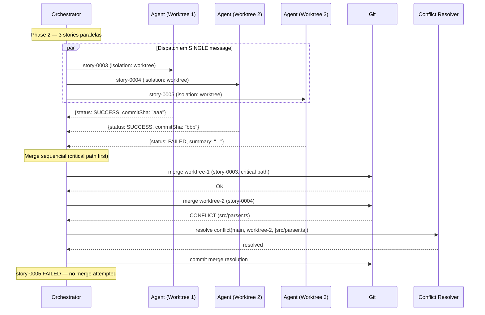

# História: Parallel Execution with Worktrees

**ID:** story-0005-0010

## 1. Dependências

| Blocked By | Blocks |
| :--- | :--- |
| story-0005-0005, story-0005-0007 | story-0005-0014 |

## 2. Regras Transversais Aplicáveis

| ID | Título |
| :--- | :--- |
| RULE-001 | Context Isolation |
| RULE-002 | Checkpoint After Every Story |
| RULE-003 | Dependency Satisfaction |
| RULE-007 | Critical Path Priority |

## 3. Descrição

Como **orchestrator de épicos**, eu quero executar múltiplas stories da mesma fase em paralelo
usando git worktrees isolados (`--parallel`), garantindo que stories independentes acelerem o
épico sem conflitos de merge.

O modo paralelo usa o Agent tool com `isolation: "worktree"` para criar cópias isoladas do
repositório para cada story na mesma fase. Cada subagent trabalha em seu worktree sem interferir
nos outros. Ao final da fase, os worktrees são merged sequencialmente na branch principal
(critical path primeiro, conforme RULE-007). Se ocorrer conflito de merge, um subagent de
conflict resolution é acionado.

O modo paralelo é opcional (flag `--parallel`, default: sequencial). É recomendado para épicos
com alto paralelismo intra-fase (> 3 stories por fase). Requer mais recursos (cada worktree
é uma cópia do repo) mas reduz significativamente o tempo total.

### 3.1 Worktree Dispatch

- Para cada story executável na fase, despachar subagent com `isolation: "worktree"`
- Todos os subagents são lançados em uma SINGLE message (máximo paralelismo)
- Cada subagent trabalha em branch separada no worktree
- O orchestrator aguarda TODOS os subagents completarem antes do merge

### 3.2 Merge Strategy

1. Ordenar stories completadas por critical path priority (RULE-007)
2. Para cada story SUCCESS (em ordem):
   a. Merge da branch worktree na branch principal
   b. Se conflito: acionar subagent de conflict resolution
   c. Se merge OK: registrar no checkpoint
3. Para stories FAILED: não tentar merge (failure handling via story-0005-0007)

### 3.3 Conflict Resolution Subagent

- Recebe: branch principal, branch worktree, arquivos em conflito
- Analisa o diff de ambos os lados
- Resolve conflitos preservando a intenção de ambas as stories
- Commita o merge resolution
- Retorna: SUCCESS ou FAILED (se conflito irresolvível)

### 3.4 Worktree Cleanup

- Worktrees de stories SUCCESS são limpos automaticamente após merge
- Worktrees de stories FAILED são preservados para diagnóstico
- O Agent tool com worktree já cuida da limpeza se nenhuma mudança foi feita

## 4. Definições de Qualidade Locais

### DoR Local (Definition of Ready)

- [ ] Core loop funcional (story-0005-0005 concluída)
- [ ] Failure handling funcional (story-0005-0007 concluída)
- [ ] Comportamento do Agent tool com `isolation: "worktree"` compreendido
- [ ] Git worktree commands testados manualmente

### DoD Local (Definition of Done)

- [ ] Stories despachadas em paralelo via worktrees isolados
- [ ] Merge sequencial ao final da fase (critical path first)
- [ ] Conflict resolution subagent funcional
- [ ] Checkpoint atualizado corretamente após merge
- [ ] SKILL.md atualizado com seção de parallel execution

### Global Definition of Done (DoD)

- **Cobertura:** ≥ 95% Line, ≥ 90% Branch
- **Testes Automatizados:** Unitários, integração (golden file tests). Cenários Gherkin cobertos.
- **Relatório de Cobertura:** Vitest coverage report com thresholds validados
- **Documentação:** Parallel mode documentado no SKILL.md
- **Persistência:** Checkpoint consistente após merges paralelos
- **Performance:** Overhead do merge < 30s por story. Worktree creation < 10s.

## 5. Contratos de Dados (Data Contract)

**Parallel Dispatch Config:**

| Campo | Formato | Request | Response | Origem / Regra |
| :--- | :--- | :--- | :--- | :--- |
| `stories` | string[] | M | - | Derive — stories executáveis na fase |
| `isolation` | `"worktree"` | M | - | Fixo — sempre worktree no modo paralelo |
| `branchPrefix` | string | M | - | Derive — `feat/epic-{epicId}-{storyId}` |

**Merge Result:**

| Campo | Formato | Request | Response | Origem / Regra |
| :--- | :--- | :--- | :--- | :--- |
| `storyId` | string | - | M | Echo — ID da story |
| `mergeStatus` | enum (`MERGED` \| `CONFLICT` \| `SKIPPED`) | - | M | Derive — resultado do merge |
| `conflictFiles` | string[]? | - | O | Derive — arquivos em conflito (se CONFLICT) |

## 6. Diagramas

### 6.1 Parallel Execution Flow



## 7. Critérios de Aceite (Gherkin)

```gherkin
Cenario: Dispatch paralelo de 3 stories em worktrees isolados
  DADO que fase 2 tem 3 stories executáveis
  E --parallel está ativado
  QUANDO o orchestrator executa fase 2
  ENTÃO 3 subagents são despachados em uma SINGLE message
  E cada subagent usa isolation: "worktree"
  E cada subagent trabalha em branch separada

Cenario: Merge sequencial com priorização por caminho crítico
  DADO que stories 0003 (critical path) e 0004 (não-critical) completaram com SUCCESS
  QUANDO o merge é executado
  ENTÃO 0003 é merged primeiro (critical path priority)
  E 0004 é merged em seguida

Cenario: Conflict resolution para merge com conflito
  DADO que story 0003 foi merged com sucesso
  E story 0004 tem conflito em "src/parser.ts" com a branch principal
  QUANDO o merge de 0004 é tentado
  ENTÃO um subagent de conflict resolution é acionado
  E o subagent resolve o conflito preservando a intenção de ambas stories
  E o merge é completado com commit de resolução

Cenario: Story FAILED não é merged
  DADO que story 0005 retornou com status FAILED
  QUANDO o merge sequencial é executado
  ENTÃO nenhum merge é tentado para story 0005
  E failure handling (retry/block) é acionado normalmente

Cenario: Todas as stories SUCCESS — merge sem conflitos
  DADO que 3 stories completaram SUCCESS em worktrees isolados
  E nenhum arquivo foi modificado por mais de uma story
  QUANDO o merge sequencial é executado
  ENTÃO todos os 3 merges são bem-sucedidos sem conflitos
  E o checkpoint registra todos como SUCCESS

Cenario: Conflict resolution falha — story marcada FAILED
  DADO que o subagent de conflict resolution não consegue resolver o conflito
  QUANDO o resultado é FAILED
  ENTÃO a story é marcada FAILED
  E block propagation é acionada para dependentes

Cenario: Fallback para sequencial quando --parallel não está ativo
  DADO que --parallel NÃO está ativo (default)
  QUANDO o orchestrator executa uma fase com 3 stories
  ENTÃO as stories são executadas uma por vez na mesma branch
  E não há worktrees nem merge

Cenario: Checkpoint atualizado após cada merge (não apenas após cada subagent)
  DADO que 3 stories completaram em paralelo
  QUANDO os merges são executados sequencialmente
  ENTÃO o checkpoint é atualizado após CADA merge (não em batch)
```

### 7.1 Scenario Ordering (TPP)

> Scenarios seguem TPP: dispatch paralelo → merge com priorização → conflito resolvido → FAILED sem merge → sem conflitos → conflito irresolvível → fallback sequencial → checkpoint timing.

### 7.2 Mandatory Scenario Categories

- [x] Degenerate cases (conflito irresolvível, story FAILED)
- [x] Happy path (dispatch paralelo, merge sem conflitos)
- [x] Error paths (conflito, FAILED)
- [x] Boundary values (fallback sequencial, checkpoint timing)

## 8. Sub-tarefas

- [ ] [Dev] Implementar dispatch paralelo com `isolation: "worktree"` em SINGLE message
- [ ] [Dev] Implementar merge sequencial com priorização por critical path
- [ ] [Dev] Implementar conflict resolution subagent prompt
- [ ] [Dev] Implementar worktree cleanup após merge
- [ ] [Dev] Implementar fallback para sequencial quando --parallel não ativo
- [ ] [Dev] Integrar com failure handling (story-0005-0007) para stories FAILED
- [ ] [Dev] Atualizar SKILL.md com seção de parallel execution
- [ ] [Test] Unitário: dispatch paralelo (mock Agent tool)
- [ ] [Test] Unitário: merge sequencial com e sem conflitos
- [ ] [Test] Unitário: conflict resolution (sucesso e falha)
- [ ] [Test] Integração: cenário completo parallel → merge → checkpoint
