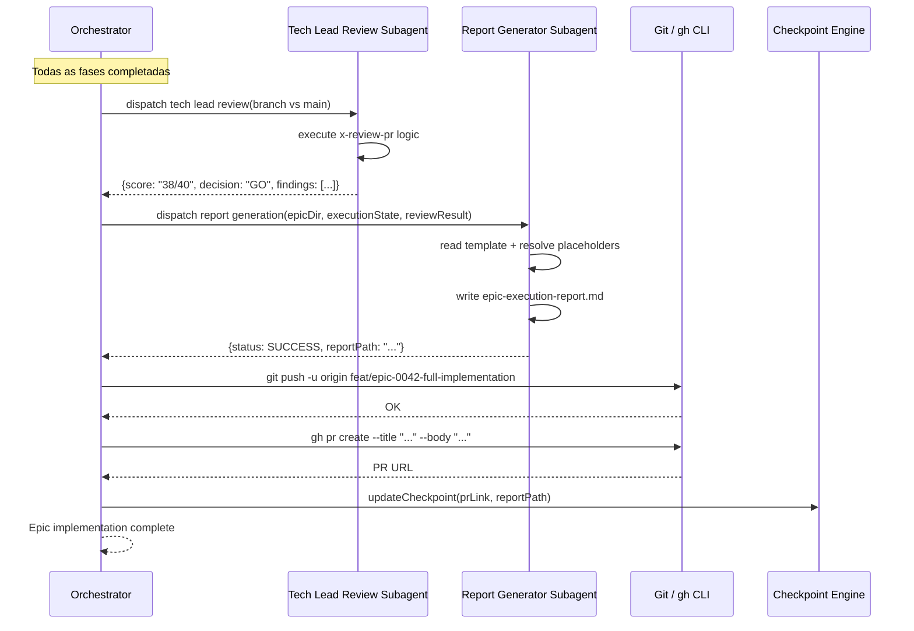

# História: Consolidação Final — Review + Report + PR

**ID:** story-0005-0011

## 1. Dependências

| Blocked By | Blocks |
| :--- | :--- |
| story-0005-0002, story-0005-0005 | story-0005-0014 |

## 2. Regras Transversais Aplicáveis

| ID | Título |
| :--- | :--- |
| RULE-001 | Context Isolation |
| RULE-008 | Subagent Result Contract |

## 3. Descrição

Como **orchestrator de épicos**, eu quero uma fase de consolidação final que execute o tech lead
review no diff completo do épico, gere o relatório de execução e crie o PR, garantindo que o
épico seja entregue com qualidade auditável.

A consolidação final é a última etapa do orchestrator. Após todas as fases serem completadas (ou
parcialmente completadas com stories FAILED/BLOCKED), o orchestrator despacha três sub-ações:

1. **Tech Lead Review**: Invoca `x-review-pr` no diff completo (branch do épico vs. main)
2. **Report Generation**: Gera `epic-execution-report.md` usando o template de story-0005-0002
   e os dados do `execution-state.json`
3. **PR Creation**: Cria PR via `gh pr create` com summary do report

O orchestrator delega cada ação a subagents para manter contexto leve (RULE-001).

### 3.1 Tech Lead Review Subagent

- Despachar subagent que executa lógica equivalente ao `x-review-pr`
- Input: branch do épico, base branch (main)
- O review cobre o diff COMPLETO do épico (todos os commits de todas as stories)
- Resultado: GO/NO-GO com score e findings

### 3.2 Report Generation Subagent

- Despachar subagent que:
  1. Lê o template `_TEMPLATE-EPIC-EXECUTION-REPORT.md`
  2. Lê o `execution-state.json`
  3. Resolve todos os placeholders
  4. Gera métricas: completion percentage, coverage delta, timeline
  5. Salva `epic-execution-report.md` no diretório do épico

### 3.3 PR Creation

- Push da branch: `git push -u origin feat/epic-{epicId}-full-implementation`
- Criar PR via `gh pr create` com:
  - Title: `feat(epic): implement EPIC-{epicId} — {title}`
  - Body: sumário do report (stories completadas, coverage, score do tech lead review)
- Registrar PR link no report e no checkpoint

### 3.4 Consolidação com Stories Incompletas

- Se há stories FAILED ou BLOCKED, a consolidação executa normalmente
- O report mostra claramente quais stories não foram completadas
- O PR body indica que o épico está parcialmente implementado
- O PR title pode incluir `[PARTIAL]` se completion < 100%

## 4. Definições de Qualidade Locais

### DoR Local (Definition of Ready)

- [ ] Epic execution report template criado (story-0005-0002 concluída)
- [ ] Core loop funcional (story-0005-0005 concluída)
- [ ] `x-review-pr` skill funcional e acessível
- [ ] `gh` CLI disponível para PR creation

### DoD Local (Definition of Done)

- [ ] Tech lead review executado no diff completo do épico
- [ ] Report gerado com todos os placeholders resolvidos
- [ ] PR criado com summary no body
- [ ] Consolidação funciona com épicos parcialmente completados
- [ ] SKILL.md atualizado com seção de consolidação final

### Global Definition of Done (DoD)

- **Cobertura:** ≥ 95% Line, ≥ 90% Branch
- **Testes Automatizados:** Unitários, integração (golden file tests). Cenários Gherkin cobertos.
- **Relatório de Cobertura:** Vitest coverage report com thresholds validados
- **Documentação:** Consolidação documentada no SKILL.md
- **Persistência:** Report e PR link no checkpoint
- **Performance:** Report generation < 30s. PR creation < 10s.

## 5. Contratos de Dados (Data Contract)

**PR Creation:**

| Campo | Formato | Request | Response | Origem / Regra |
| :--- | :--- | :--- | :--- | :--- |
| `title` | string (max 70 chars) | M | - | Generate — `feat(epic): implement EPIC-{epicId}` |
| `body` | string (markdown) | M | - | Generate — summary from report |
| `baseBranch` | string | M | - | Fixo — `main` |
| `headBranch` | string | M | - | Echo — branch do épico |
| `prUrl` | string (URL) | - | M | Derive — URL retornada pelo `gh pr create` |

**Report Summary (subset para PR body):**

| Campo | Formato | Request | Response | Origem / Regra |
| :--- | :--- | :--- | :--- | :--- |
| `storiesCompleted` | number | - | M | Derive — count SUCCESS |
| `storiesFailed` | number | - | M | Derive — count FAILED |
| `storiesBlocked` | number | - | M | Derive — count BLOCKED |
| `completionPercentage` | string | - | M | Derive — completed/total × 100 |
| `techLeadScore` | string | - | M | Derive — XX/40 do review |
| `techLeadDecision` | string | - | M | Derive — GO/NO-GO |
| `coverageLine` | string | - | M | Derive — line coverage final |
| `coverageBranch` | string | - | M | Derive — branch coverage final |

## 6. Diagramas

### 6.1 Fluxo de Consolidação Final



## 7. Critérios de Aceite (Gherkin)

```gherkin
Cenario: Consolidação completa — 100% das stories SUCCESS
  DADO que todas as stories do épico completaram com SUCCESS
  QUANDO a consolidação final é executada
  ENTÃO tech lead review é executado no diff completo
  E epic-execution-report.md é gerado com completion 100%
  E PR é criado com title sem "[PARTIAL]"
  E PR body contém stories completadas, coverage e tech lead score

Cenario: Consolidação parcial — stories FAILED e BLOCKED
  DADO que 8 de 14 stories completaram SUCCESS, 2 FAILED e 4 BLOCKED
  QUANDO a consolidação final é executada
  ENTÃO o report mostra completion 57.1%
  E o report lista stories FAILED com motivos
  E o report lista stories BLOCKED com dependências
  E PR title inclui "[PARTIAL]"
  E PR body indica implementação parcial

Cenario: Tech lead review retorna NO-GO
  DADO que o tech lead review retorna score 35/40 (NO-GO)
  QUANDO a consolidação registra o resultado
  ENTÃO o report inclui score 35/40 e decision NO-GO
  E findings do review são listados no report
  E o PR é criado normalmente (review informativo, não bloqueante)

Cenario: Report gerado com todos os placeholders resolvidos
  DADO que o template contém {{EPIC_ID}}, {{STORIES_COMPLETED}}, etc.
  QUANDO o report é gerado
  ENTÃO nenhum placeholder {{...}} permanece no arquivo final
  E todas as tabelas estão preenchidas com dados reais

Cenario: PR criado com summary adequado
  DADO que o report foi gerado
  QUANDO o PR é criado via gh CLI
  ENTÃO title segue formato "feat(epic): implement EPIC-0042 — título"
  E body contém seção "## Summary" com bullet points
  E body contém seção "## Metrics" com coverage e completion
  E body contém link para o report file

Cenario: Push falha — consolidação reporta erro
  DADO que o git push falha (ex: remote não acessível)
  QUANDO a consolidação tenta push
  ENTÃO a falha é registrada no report
  E o report é gerado mesmo sem PR
  E o checkpoint registra a falha
```

### 7.1 Scenario Ordering (TPP)

> Scenarios seguem TPP: consolidação 100% → parcial → NO-GO → placeholders → PR format → push failure.

### 7.2 Mandatory Scenario Categories

- [x] Degenerate cases (push failure)
- [x] Happy path (consolidação 100%)
- [x] Error paths (NO-GO, consolidação parcial)
- [x] Boundary values (placeholders resolvidos, PR format)

## 8. Sub-tarefas

- [ ] [Dev] Implementar dispatch do tech lead review subagent
- [ ] [Dev] Implementar dispatch do report generation subagent
- [ ] [Dev] Implementar resolução de placeholders do template
- [ ] [Dev] Implementar PR creation via gh CLI
- [ ] [Dev] Implementar lógica de consolidação parcial ([PARTIAL])
- [ ] [Dev] Atualizar SKILL.md com seção de consolidação final
- [ ] [Test] Unitário: report generation com placeholders resolvidos
- [ ] [Test] Unitário: PR body format com e sem partial
- [ ] [Test] Unitário: consolidação com mix de SUCCESS/FAILED/BLOCKED
- [ ] [Test] Integração: fluxo completo review → report → PR
