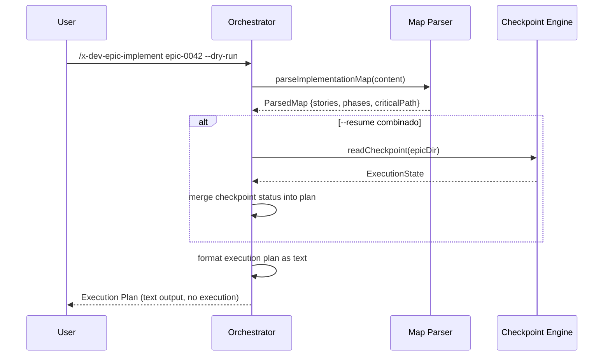

# História: Dry-run Mode (`--dry-run`)

**ID:** story-0005-0012

## 1. Dependências

| Blocked By | Blocks |
| :--- | :--- |
| story-0005-0004 | story-0005-0014 |

## 2. Regras Transversais Aplicáveis

| ID | Título |
| :--- | :--- |
| RULE-003 | Dependency Satisfaction |
| RULE-007 | Critical Path Priority |

## 3. Descrição

Como **orchestrator de épicos**, eu quero um modo dry-run que mostre o plano de execução sem
despachar nenhum subagent, garantindo que eu possa revisar a ordem de execução, dependências
e fases antes de iniciar a implementação real.

O dry-run é uma ferramenta de planejamento. Usa o implementation map parser (story-0005-0004)
para construir o DAG e computar o plano, depois exibe: fases, stories por fase, caminho crítico,
stories executáveis (considerando checkpoint se `--resume` ativo), e estimativas de execução.
Nenhum subagent é despachado, nenhum branch é criado, nenhum checkpoint é modificado.

### 3.1 Output do Dry-run

- Header: epic ID, total stories, total phases
- Para cada fase: lista de stories com título, dependências, se está no critical path
- Caminho crítico destacado
- Se `--resume` combinado: mostra stories pendentes vs. já completadas
- Se `--phase N` combinado: mostra apenas stories da fase N
- Formato: texto estruturado para terminal (com indentação e separadores)

### 3.2 Compatibilidade com Outras Flags

- `--dry-run --resume`: mostra o plano considerando o checkpoint existente
- `--dry-run --phase N`: mostra apenas o plano da fase N
- `--dry-run --parallel`: indica quais stories seriam paralelas
- `--dry-run --story XXXX-YYYY`: mostra dependências e status da story

## 4. Definições de Qualidade Locais

### DoR Local (Definition of Ready)

- [ ] Implementation map parser funcional (story-0005-0004 concluída)
- [ ] Formato de output do dry-run aprovado

### DoD Local (Definition of Done)

- [ ] Dry-run mostra plano completo sem executar
- [ ] Nenhum subagent despachado no modo dry-run
- [ ] Nenhum branch criado nem checkpoint modificado
- [ ] Compatível com --resume, --phase, --parallel, --story
- [ ] SKILL.md atualizado com seção de dry-run

### Global Definition of Done (DoD)

- **Cobertura:** ≥ 95% Line, ≥ 90% Branch
- **Testes Automatizados:** Unitários, integração (golden file tests). Cenários Gherkin cobertos.
- **Relatório de Cobertura:** Vitest coverage report com thresholds validados
- **Documentação:** Dry-run documentado no SKILL.md
- **Persistência:** N/A (somente leitura)
- **Performance:** Dry-run < 2s (apenas parsing + computation)

## 5. Contratos de Dados (Data Contract)

**Dry-run Output:**

| Campo | Formato | Request | Response | Origem / Regra |
| :--- | :--- | :--- | :--- | :--- |
| `epicId` | string | - | M | Echo — epic ID |
| `totalStories` | number | - | M | Derive — total de stories no mapa |
| `totalPhases` | number | - | M | Derive — total de fases |
| `criticalPath` | string[] | - | M | Derive — stories no caminho crítico |
| `phases` | Phase[] | - | M | Derive — fases com stories |
| `phases[].id` | number | - | M | Derive — número da fase |
| `phases[].stories` | StoryInfo[] | - | M | Derive — stories na fase |
| `phases[].stories[].id` | string | - | M | Echo — story ID |
| `phases[].stories[].title` | string | - | M | Echo — título |
| `phases[].stories[].isCriticalPath` | boolean | - | M | Derive — está no critical path |
| `phases[].stories[].status` | string? | - | O | Echo — status do checkpoint (se --resume) |

## 6. Diagramas

### 6.1 Fluxo do Dry-run



## 7. Critérios de Aceite (Gherkin)

```gherkin
Cenario: Dry-run mostra plano completo sem executar
  DADO que epic-0042 tem 14 stories em 5 fases
  QUANDO --dry-run é executado
  ENTÃO o output mostra 14 stories em 5 fases
  E o caminho crítico é destacado
  E NENHUM subagent é despachado
  E NENHUM branch é criado
  E NENHUM checkpoint é modificado

Cenario: Dry-run com --resume mostra status do checkpoint
  DADO que o checkpoint tem 5 stories SUCCESS e 9 PENDING
  QUANDO --dry-run --resume é executado
  ENTÃO o output mostra status de cada story (SUCCESS ou PENDING)
  E stories SUCCESS são marcadas como "já completadas"
  E stories PENDING são marcadas como "a executar"

Cenario: Dry-run com --phase mostra apenas fase específica
  DADO que epic-0042 tem 5 fases
  QUANDO --dry-run --phase 2 é executado
  ENTÃO o output mostra apenas stories da fase 2
  E indica quais dependências da fase 2 estão satisfeitas

Cenario: Dry-run com --parallel indica stories paralelas
  DADO que fase 1 tem 4 stories executáveis em paralelo
  QUANDO --dry-run --parallel é executado
  ENTÃO fase 1 é marcada como "4 stories paralelas (worktree)"

Cenario: Dry-run com --story mostra dependências da story
  DADO que story 0042-0005 depende de 0042-0001 e 0042-0002
  QUANDO --dry-run --story 0042-0005 é executado
  ENTÃO o output mostra dependências: 0042-0001, 0042-0002
  E mostra bloqueios: stories que dependem de 0042-0005
  E mostra fase da story e se está no critical path
```

### 7.1 Scenario Ordering (TPP)

> Scenarios seguem TPP: plano completo → com resume → com phase → com parallel → com story.

### 7.2 Mandatory Scenario Categories

- [x] Degenerate cases (implícito — sem dados retorna plano vazio)
- [x] Happy path (plano completo)
- [x] Error paths (N/A — dry-run é read-only)
- [x] Boundary values (combinação de flags)

## 8. Sub-tarefas

- [ ] [Dev] Implementar formatação do plano de execução como texto
- [ ] [Dev] Implementar combinação com --resume (merge checkpoint status)
- [ ] [Dev] Implementar combinação com --phase (filtro por fase)
- [ ] [Dev] Implementar combinação com --parallel (indicação de paralelismo)
- [ ] [Dev] Implementar combinação com --story (detalhe de uma story)
- [ ] [Dev] Atualizar SKILL.md com seção de dry-run
- [ ] [Test] Unitário: output do plano completo
- [ ] [Test] Unitário: combinações de flags (resume, phase, parallel, story)
- [ ] [Test] Unitário: verificar que nenhum side-effect ocorre (no dispatch, no branch, no checkpoint)
