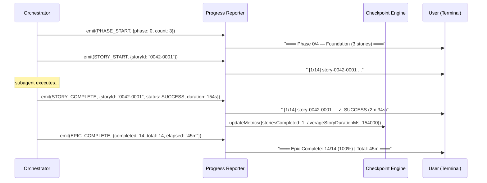

# História: Progress Reporting + Execution Metrics

**ID:** story-0005-0013

## 1. Dependências

| Blocked By | Blocks |
| :--- | :--- |
| story-0005-0005 | story-0005-0014 |

## 2. Regras Transversais Aplicáveis

| ID | Título |
| :--- | :--- |
| RULE-001 | Context Isolation |
| RULE-002 | Checkpoint After Every Story |

## 3. Descrição

Como **orchestrator de épicos**, eu quero ver o progresso da execução em tempo real e métricas
de performance por story e fase, garantindo visibilidade sobre o andamento e possibilidade de
estimar o tempo restante.

O progress reporting exibe status updates no output do orchestrator a cada mudança de estado
significativa: início de fase, início de story, conclusão de story (com duração), resultado de
integrity gate, e métricas acumuladas. As métricas incluem: tempo por story, tempo por fase,
stories completadas/pendentes/falhadas/bloqueadas, e estimativa de tempo restante baseada na
média das stories concluídas.

### 3.1 Progress Events

- `PHASE_START(phase, storiesCount)` — início de uma fase
- `STORY_START(storyId, phase)` — subagent despachado
- `STORY_COMPLETE(storyId, status, duration, commitSha?)` — subagent retornou
- `GATE_RESULT(phase, status, testCount, coverage)` — resultado do integrity gate
- `RETRY(storyId, retryNumber, previousError)` — retry iniciado
- `BLOCK(storyId, blockedStories[])` — block propagation executada
- `EPIC_COMPLETE(stats)` — execução finalizada

### 3.2 Output Format

```
═══ Phase 0/4 — Foundation (3 stories) ═══
  [1/14] story-0042-0001 ... ✓ SUCCESS (2m 34s) [abc123]
  [2/14] story-0042-0002 ... ✓ SUCCESS (1m 48s) [def456]
  [3/14] story-0042-0003 ... ✗ FAILED (3m 12s) → retry 1/2
  [3/14] story-0042-0003 ... ✓ SUCCESS (2m 05s) [ghi789]
  ── Gate Phase 0: PASS (42 tests, 96.3% coverage) ──

═══ Phase 1/4 — Core (2 stories) ═══
  [4/14] story-0042-0004 ... ✓ SUCCESS (4m 22s) [jkl012]
  ...

═══ Progress: 6/14 (42.9%) | Elapsed: 14m 41s | Est. remaining: ~20m ═══
```

### 3.3 Execution Metrics

- `storyDurations`: Map<storyId, duration em ms>
- `phaseDurations`: Map<phase, duration em ms>
- `averageStoryDuration`: média das durações (para estimativa)
- `estimatedRemaining`: (stories pendentes) × (média) — estimativa ingênua mas útil
- Métricas atualizadas no checkpoint via `updateMetrics()`

## 4. Definições de Qualidade Locais

### DoR Local (Definition of Ready)

- [ ] Core loop funcional (story-0005-0005 concluída)
- [ ] Checkpoint engine com `updateMetrics()` disponível

### DoD Local (Definition of Done)

- [ ] Progress events exibidos no output do orchestrator
- [ ] Métricas de duração por story e fase registradas
- [ ] Estimativa de tempo restante calculada e exibida
- [ ] Métricas persistidas no checkpoint
- [ ] SKILL.md atualizado com seção de progress reporting

### Global Definition of Done (DoD)

- **Cobertura:** ≥ 95% Line, ≥ 90% Branch
- **Testes Automatizados:** Unitários, integração (golden file tests). Cenários Gherkin cobertos.
- **Relatório de Cobertura:** Vitest coverage report com thresholds validados
- **Documentação:** Progress reporting documentado no SKILL.md
- **Persistência:** Métricas no checkpoint
- **Performance:** Progress update < 100ms (não deve impactar a execução)

## 5. Contratos de Dados (Data Contract)

**ExecutionMetrics (atualizado no checkpoint):**

| Campo | Formato | Request | Response | Origem / Regra |
| :--- | :--- | :--- | :--- | :--- |
| `storiesCompleted` | number | - | M | Derive — count SUCCESS |
| `storiesTotal` | number | - | M | Echo — total no mapa |
| `storiesFailed` | number | - | M | Derive — count FAILED |
| `storiesBlocked` | number | - | M | Derive — count BLOCKED |
| `elapsedMs` | number | - | M | Derive — tempo total decorrido |
| `estimatedRemainingMs` | number? | - | O | Derive — (pending × avg) |
| `averageStoryDurationMs` | number? | - | O | Derive — média das durações |

## 6. Diagramas

### 6.1 Progress Reporting Flow



## 7. Critérios de Aceite (Gherkin)

```gherkin
Cenario: Progress event para início de fase
  DADO que o orchestrator inicia fase 0 com 3 stories
  QUANDO PHASE_START é emitido
  ENTÃO o output mostra "Phase 0/N — Nome (3 stories)"

Cenario: Progress event para story completada com SUCCESS
  DADO que story "0042-0001" completou com SUCCESS em 154 segundos
  QUANDO STORY_COMPLETE é emitido
  ENTÃO o output mostra "✓ SUCCESS (2m 34s) [commitSha]"
  E métricas são atualizadas no checkpoint

Cenario: Progress event para story FAILED com retry
  DADO que story "0042-0003" falhou
  QUANDO STORY_COMPLETE(FAILED) seguido de RETRY é emitido
  ENTÃO o output mostra "✗ FAILED (3m 12s) → retry 1/2"

Cenario: Estimativa de tempo restante
  DADO que 4 stories completaram com média de 2m 30s cada
  E restam 10 stories PENDING
  QUANDO o progress é atualizado
  ENTÃO estimatedRemaining é aproximadamente 25 minutos
  E o output mostra "Est. remaining: ~25m"

Cenario: Métricas persistidas no checkpoint
  DADO que 6 stories completaram
  QUANDO o checkpoint é lido
  ENTÃO metrics.storiesCompleted é 6
  E metrics.averageStoryDurationMs reflete a média real
  E metrics.estimatedRemainingMs está calculado

Cenario: Progress summary ao final do épico
  DADO que todas as 14 stories completaram
  QUANDO EPIC_COMPLETE é emitido
  ENTÃO o output mostra "Epic Complete: 14/14 (100%) | Total: Xm"
  E inclui contagem de retries e gates
```

### 7.1 Scenario Ordering (TPP)

> Scenarios seguem TPP: phase start → story complete → FAILED/retry → estimativa → métricas persistidas → summary final.

### 7.2 Mandatory Scenario Categories

- [x] Degenerate cases (implícito — sem stories completas, estimativa é null)
- [x] Happy path (phase start, story complete, summary)
- [x] Error paths (FAILED com retry)
- [x] Boundary values (estimativa baseada em média, métricas persistidas)

## 8. Sub-tarefas

- [ ] [Dev] Implementar emissão de progress events no core loop
- [ ] [Dev] Implementar formatação de output para terminal
- [ ] [Dev] Implementar cálculo de métricas (duração, média, estimativa)
- [ ] [Dev] Implementar persistência de métricas no checkpoint
- [ ] [Dev] Atualizar SKILL.md com seção de progress reporting
- [ ] [Test] Unitário: formatação de cada tipo de progress event
- [ ] [Test] Unitário: cálculo de estimativa de tempo restante
- [ ] [Test] Unitário: persistência de métricas
- [ ] [Test] Integração: progress reporting durante execução mock
