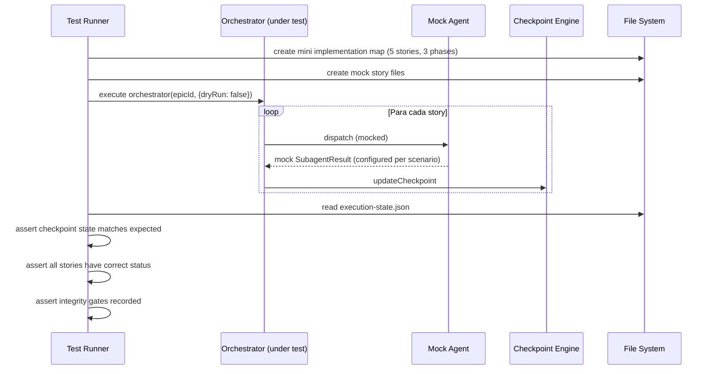

# História: E2E Tests + Generator Integration

**ID:** story-0005-0014

## 1. Dependências

| Blocked By | Blocks |
| :--- | :--- |
| story-0005-0005, story-0005-0006, story-0005-0007, story-0005-0008, story-0005-0009, story-0005-0010, story-0005-0011, story-0005-0012, story-0005-0013 | — |

## 2. Regras Transversais Aplicáveis

| ID | Título |
| :--- | :--- |
| RULE-001 | Context Isolation |
| RULE-002 | Checkpoint After Every Story |
| RULE-003 | Dependency Satisfaction |
| RULE-004 | Integrity Gate Mandatory |
| RULE-005 | Retry Budget |
| RULE-006 | Block Propagation Transitiva |
| RULE-007 | Critical Path Priority |
| RULE-008 | Subagent Result Contract |

## 3. Descrição

Como **desenvolvedor do ia-dev-environment**, eu quero testes E2E do orchestrator completo e
integração do `x-dev-epic-implement` no gerador do CLI, garantindo que a skill funcione
end-to-end e seja gerada corretamente para novos projetos.

Esta história é a capstone do épico — valida que todas as peças funcionam juntas. Inclui:
(1) testes E2E que simulam execução de épicos com mocks de subagent dispatch, verificando
checkpoint, integrity gates, failure handling, resumability e progress reporting;
(2) integração no gerador do CLI para que `x-dev-epic-implement` seja incluído nos projetos
gerados; (3) golden file tests para o SKILL.md e templates gerados; (4) documentação de
integração no CLAUDE.md.

### 3.1 E2E Tests

- Criar um mini implementation map sintético (5 stories, 3 fases)
- Mockar o dispatch de subagents (não executar `x-dev-lifecycle` real)
- Testar o pipeline completo: parse → loop → checkpoint → gate → report
- Cenários:
  - Happy path: todas as stories SUCCESS
  - Failure path: 1 story FAILED com retry → block propagation
  - Resume path: interromper no meio, resume continua
  - Partial path: `--phase 1` executa apenas fase 1
  - Dry-run path: `--dry-run` mostra plano sem executar
  - Parallel path: `--parallel` despacha em worktrees (mock)

### 3.2 Generator Integration

- Registrar `x-dev-epic-implement` no gerador do CLI como skill gerável
- Adicionar ao profile de skills (se aplicável)
- Verificar dual copy: `resources/skills-templates/core/` → `.claude/skills/`
- Registrar templates (`_TEMPLATE-EXECUTION-STATE.json`, `_TEMPLATE-EPIC-EXECUTION-REPORT.md`)

### 3.3 Golden File Tests

- SKILL.md: byte-for-byte comparison com golden file
- Templates: byte-for-byte comparison
- Validar que o gerador produz output idêntico ao golden file

### 3.4 Documentation

- Atualizar CLAUDE.md com a nova skill no índice
- Atualizar README.md (se aplicável)
- Documentar dependências internas (skills consumidas)

## 4. Definições de Qualidade Locais

### DoR Local (Definition of Ready)

- [ ] TODAS as stories anteriores (0001-0013) concluídas
- [ ] SKILL.md final completo com todas as seções
- [ ] Templates finais criados
- [ ] Gerador funcional para skills existentes

### DoD Local (Definition of Done)

- [ ] E2E tests cobrem happy path, failure, resume, partial, dry-run, parallel
- [ ] Golden file tests para SKILL.md e templates
- [ ] Skill registrada no gerador com dual copy
- [ ] CLAUDE.md atualizado com nova skill
- [ ] Coverage ≥ 95% line, ≥ 90% branch para código novo

### Global Definition of Done (DoD)

- **Cobertura:** ≥ 95% Line, ≥ 90% Branch
- **Testes Automatizados:** E2E, unitários, golden file tests. Cenários Gherkin cobertos.
- **Relatório de Cobertura:** Vitest coverage report com thresholds validados
- **Documentação:** CLAUDE.md, README.md, SKILL.md atualizados
- **Persistência:** N/A
- **Performance:** E2E tests < 30s total (com mocks)

## 5. Contratos de Dados (Data Contract)

**Mock SubagentResult (para E2E):**

| Campo | Formato | Request | Response | Origem / Regra |
| :--- | :--- | :--- | :--- | :--- |
| `status` | enum | - | M | Mock — configurável por cenário |
| `commitSha` | string | - | O | Mock — gerado aleatoriamente |
| `findingsCount` | number | - | M | Mock — configurável |
| `summary` | string | - | M | Mock — texto fixo por cenário |

**Generator Config Entry:**

| Campo | Formato | Request | Response | Origem / Regra |
| :--- | :--- | :--- | :--- | :--- |
| `skillName` | `x-dev-epic-implement` | M | - | Fixo |
| `sourcePath` | `resources/skills-templates/core/x-dev-epic-implement/` | M | - | Fixo |
| `targetPaths` | `.claude/skills/`, `.github/skills/` | M | - | Derive — dual copy |

## 6. Diagramas

### 6.1 E2E Test Flow



## 7. Critérios de Aceite (Gherkin)

```gherkin
Cenario: E2E happy path — todas as stories SUCCESS
  DADO que o mini implementation map tem 5 stories em 3 fases
  E o mock retorna SUCCESS para todas as stories
  QUANDO o orchestrator é executado
  ENTÃO o checkpoint final mostra 5/5 stories SUCCESS
  E 3 integrity gates com status PASS
  E o report é gerado com completion 100%

Cenario: E2E failure path — retry + block propagation
  DADO que o mock retorna FAILED para story 0001-0003 (fase 1)
  E FAILED no retry 1 também
  E FAILED no retry 2 também
  QUANDO o orchestrator é executado
  ENTÃO 0001-0003 tem status FAILED com retries 2
  E dependentes de 0001-0003 são BLOCKED
  E stories não-dependentes completam normalmente

Cenario: E2E resume path — continua de onde parou
  DADO que o checkpoint tem 2 stories SUCCESS e 3 PENDING
  QUANDO --resume é executado com mocks SUCCESS
  ENTÃO apenas as 3 stories PENDING são despachadas
  E as 2 SUCCESS NÃO são re-executadas
  E o checkpoint final mostra 5/5 SUCCESS

Cenario: E2E partial path — --phase executa apenas fase específica
  DADO que fases 0 e 1 estão completas no checkpoint
  QUANDO --phase 2 é executado
  ENTÃO apenas stories da fase 2 são despachadas
  E stories das fases 0 e 1 não são tocadas

Cenario: E2E dry-run — mostra plano sem executar
  DADO que o implementation map é válido
  QUANDO --dry-run é executado
  ENTÃO nenhum mock de subagent é chamado
  E nenhum checkpoint é criado
  E o plano é exibido corretamente

Cenario: Golden file test — SKILL.md gerado é idêntico ao golden
  DADO que o golden file do SKILL.md existe em "tests/golden/"
  QUANDO o gerador é executado
  ENTÃO o output é byte-for-byte idêntico ao golden file

Cenario: Golden file test — templates gerados são idênticos aos golden
  DADO que golden files dos templates existem
  QUANDO o gerador é executado
  ENTÃO cada template gerado é byte-for-byte idêntico ao respectivo golden file

Cenario: Generator integration — skill incluída na dual copy
  DADO que o gerador é executado para um projeto
  QUANDO a skill x-dev-epic-implement é gerada
  ENTÃO existe em ".claude/skills/x-dev-epic-implement/SKILL.md"
  E existe equivalente em ".github/skills/"
```

### 7.1 Scenario Ordering (TPP)

> Scenarios seguem TPP: happy path → failure → resume → partial → dry-run → golden files → generator integration.

### 7.2 Mandatory Scenario Categories

- [x] Degenerate cases (dry-run sem execução)
- [x] Happy path (E2E completo, golden files)
- [x] Error paths (failure + retry + block)
- [x] Boundary values (resume, partial, generator integration)

## 8. Sub-tarefas

- [ ] [Dev] Criar mini implementation map sintético para testes
- [ ] [Dev] Criar mock de subagent dispatch configurável por cenário
- [ ] [Dev] Implementar E2E test: happy path (5/5 SUCCESS)
- [ ] [Dev] Implementar E2E test: failure path (retry + block)
- [ ] [Dev] Implementar E2E test: resume path
- [ ] [Dev] Implementar E2E test: partial execution
- [ ] [Dev] Implementar E2E test: dry-run
- [ ] [Dev] Registrar skill no gerador
- [ ] [Dev] Criar golden files para SKILL.md e templates
- [ ] [Test] Golden file test: SKILL.md byte-for-byte
- [ ] [Test] Golden file test: templates byte-for-byte
- [ ] [Test] Integration: generator produces dual copy
- [ ] [Doc] Atualizar CLAUDE.md com nova skill no índice
- [ ] [Doc] Atualizar README.md (se aplicável)
