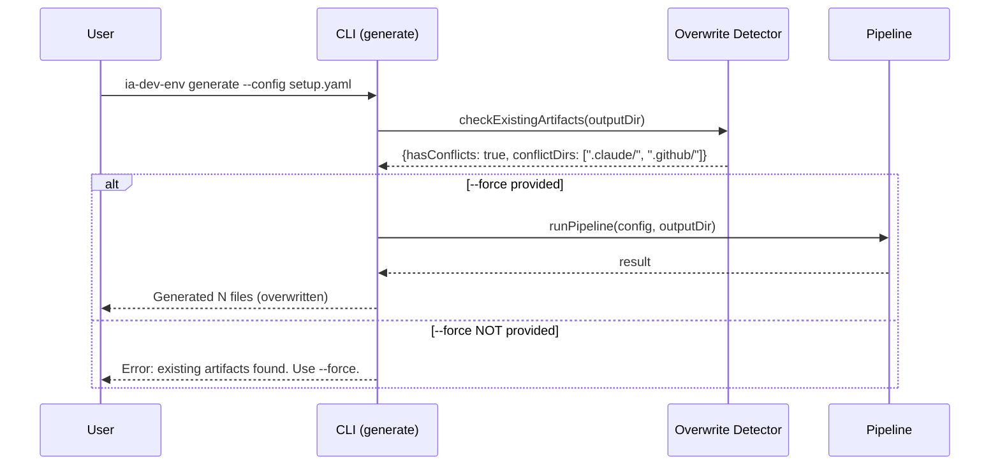
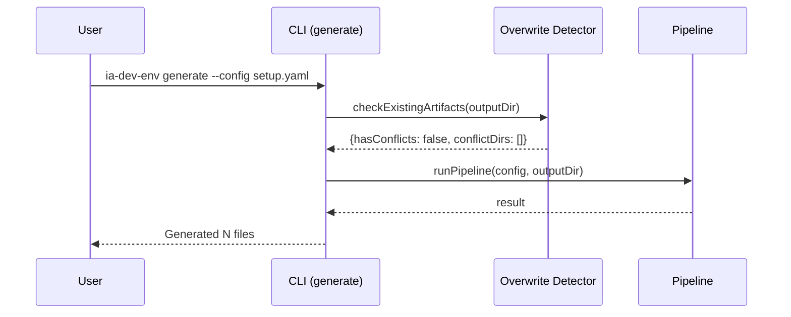

# História: Output Directory Cleanup + Overwrite Protection

**ID:** story-0005-0015

## 1. Dependências

| Blocked By | Blocks |
| :--- | :--- |
| — | — |

## 2. Regras Transversais Aplicáveis

| ID | Título |
| :--- | :--- |
| — | N/A (story isolada — não depende de regras do orchestrator) |

## 3. Descrição

Como **desenvolvedor usando o CLI `ia-dev-env generate`**, eu quero que a ferramenta gere os
arquivos diretamente na raiz do projeto (CWD) por padrão com proteção contra sobrescrita,
e que a pasta `docs/` contenha apenas documentação real (sem templates duplicados),
garantindo que eu não precise copiar manualmente os artefatos de uma pasta `output/` para o projeto.

### 3.1 Contexto

Hoje o CLI já tem `--output-dir` com default `"."`, porém:

1. **Sem proteção contra sobrescrita**: se o diretório já contém `.claude/`, `.github/`, `docs/`, etc.,
   os arquivos são sobrescritos silenciosamente sem aviso
2. **`docs/epic/` redundante**: o template `_TEMPLATE-EPIC-EXECUTION-REPORT.md` é copiado para 3 locais:
   - `.claude/templates/` (usado pelas skills)
   - `.github/templates/` (usado pelas skills)
   - `docs/epic/` (não usado por ninguém — redundante)
3. **Confusão sobre `docs/`**: a pasta mistura documentação renderizada (architecture, runbook) com
   templates em branco (epic), dificultando o entendimento do output

### 3.2 Mudanças Necessárias

#### 3.2.1 Remover output `docs/epic/`

O `EpicReportAssembler` atualmente emite o template para 3 destinos. Remover a cópia para
`docs/epic/` e manter apenas `.claude/templates/` e `.github/templates/`.

**Antes:**
```
OUTPUT_SUBDIRS = [
  "docs/epic",
  ".claude/templates",
  ".github/templates",
]
```

**Depois:**
```
OUTPUT_SUBDIRS = [
  ".claude/templates",
  ".github/templates",
]
```

#### 3.2.2 Overwrite Protection

Quando `--output-dir` aponta para um diretório que já contém artefatos gerados (`.claude/`, `.github/`,
`docs/`), o CLI deve:

1. **Detectar** a presença de diretórios/arquivos que seriam sobrescritos
2. **Avisar** o usuário listando os diretórios afetados
3. **Exigir confirmação explícita** via flag `--force` para prosseguir

**Comportamento:**
- Sem `--force` + diretório com artefatos existentes → erro com mensagem explicativa + lista de conflitos
- Com `--force` → sobrescreve sem perguntar (para CI/automação)
- Sem `--force` + diretório vazio/novo → gera normalmente (sem perguntas)
- `--dry-run` → nunca exige `--force` (não escreve nada)

**Mensagem de erro:**
```
Error: Output directory contains existing generated artifacts:
  - .claude/ (exists)
  - .github/ (exists)
  - docs/ (exists)

Use --force to overwrite existing files, or specify a different --output-dir.
```

#### 3.2.3 Atualizar Documentação de Uso

Atualizar a descrição do comando `generate` para deixar claro que:
- O default é CWD (raiz do projeto)
- `--force` é necessário para re-geração
- `--output-dir` permite gerar em diretório separado (para testes, CI, etc.)

## 4. Definições de Qualidade Locais

### DoR Local (Definition of Ready)

- [ ] Código do `EpicReportAssembler` identificado e compreendido
- [ ] Código do `cli.ts` (handleGenerate) identificado e compreendido
- [ ] Golden tests existentes revisados para entender impacto da remoção de `docs/epic/`

### DoD Local (Definition of Done)

- [ ] `docs/epic/` não é mais gerado no output
- [ ] Epic template continua sendo emitido em `.claude/templates/` e `.github/templates/`
- [ ] `--force` flag adicionada ao comando `generate`
- [ ] Sem `--force`, geração em diretório com artefatos existentes retorna erro
- [ ] Com `--force`, sobrescreve normalmente
- [ ] Diretório vazio não exige `--force`
- [ ] `--dry-run` ignora check de `--force`
- [ ] Golden tests atualizados (remoção de `docs/epic/` no expected output)
- [ ] Help text (`--help`) atualizado com documentação clara

### Global Definition of Done (DoD)

- **Cobertura:** ≥ 95% Line, ≥ 90% Branch
- **Testes Automatizados:** Unitários, integração (golden file tests). Cenários Gherkin cobertos.
- **Relatório de Cobertura:** Vitest coverage report com thresholds validados
- **Documentação:** Help text e CLAUDE.md atualizados
- **Backward Compatibility:** Quem já usa `--output-dir <path>` em diretórios novos não é afetado

## 5. Contratos de Dados (Data Contract)

**CLI Options (atualizado):**

| Campo | Formato | Request | Response | Origem / Regra |
| :--- | :--- | :--- | :--- | :--- |
| `--config` | string (path) | M | - | Echo — path to YAML config |
| `--output-dir` | string (path) | O | - | Default: `"."` (CWD) |
| `--force` | boolean | O | - | Default: `false`. Permite sobrescrever artefatos existentes |
| `--dry-run` | boolean | O | - | Default: `false`. Ignora check de `--force` |
| `--interactive` | boolean | O | - | Default: `false` |
| `--resources-dir` | string (path) | O | - | Auto-resolved se omitido |
| `--verbose` | boolean | O | - | Default: `false` |

**Overwrite Detection Result:**

| Campo | Formato | Request | Response | Origem / Regra |
| :--- | :--- | :--- | :--- | :--- |
| `hasConflicts` | boolean | - | M | Derive — existe algum artefato no destino |
| `conflictDirs` | string[] | - | M | Derive — lista de diretórios que seriam sobrescritos |

## 6. Diagramas

### 6.1 Fluxo de Geração com Overwrite Protection



### 6.2 Fluxo sem Conflitos



## 7. Critérios de Aceite (Gherkin)

```gherkin
Cenario: Geração em diretório vazio funciona sem --force
  DADO que o diretório de output está vazio
  QUANDO ia-dev-env generate --config setup.yaml é executado
  ENTÃO os artefatos são gerados normalmente
  E nenhum erro é exibido

Cenario: Geração em diretório com artefatos existentes falha sem --force
  DADO que o diretório de output contém .claude/ e .github/
  QUANDO ia-dev-env generate --config setup.yaml é executado sem --force
  ENTÃO um erro é exibido listando os diretórios conflitantes
  E NENHUM arquivo é escrito ou sobrescrito

Cenario: Geração com --force sobrescreve artefatos existentes
  DADO que o diretório de output contém .claude/ e .github/
  QUANDO ia-dev-env generate --config setup.yaml --force é executado
  ENTÃO os artefatos são gerados sobrescrevendo os existentes
  E o output confirma a sobrescrita

Cenario: Dry-run ignora check de --force
  DADO que o diretório de output contém artefatos existentes
  QUANDO ia-dev-env generate --config setup.yaml --dry-run é executado
  ENTÃO o plano é exibido normalmente
  E NENHUM arquivo é escrito
  E NENHUM erro de conflito é exibido

Cenario: docs/epic/ não é mais gerado no output
  DADO que o CLI é executado com qualquer configuração
  QUANDO a geração completa
  ENTÃO docs/epic/ NÃO existe no output
  E .claude/templates/_TEMPLATE-EPIC-EXECUTION-REPORT.md existe
  E .github/templates/_TEMPLATE-EPIC-EXECUTION-REPORT.md existe

Cenario: Mensagem de erro lista diretórios conflitantes
  DADO que o diretório de output contém .claude/, .github/ e docs/
  QUANDO ia-dev-env generate é executado sem --force
  ENTÃO a mensagem de erro lista ".claude/", ".github/" e "docs/"
  E a mensagem sugere usar --force

Cenario: Help text documenta --force e comportamento padrão
  DADO que o usuário executa ia-dev-env generate --help
  QUANDO o help é exibido
  ENTÃO --force é documentado com descrição clara
  E --output-dir mostra default "." (current directory)
```

### 7.1 Scenario Ordering (TPP)

> Scenarios seguem TPP: caso degenerado (vazio) → happy path (com --force) → error paths (sem --force) → dry-run → remoção docs/epic/ → boundary (mensagem de erro) → documentação.

### 7.2 Mandatory Scenario Categories

- [x] Degenerate cases (diretório vazio — sem conflitos)
- [x] Happy path (geração com --force em dir existente)
- [x] Error paths (geração sem --force em dir existente)
- [x] Boundary values (dry-run bypassa check, mensagem lista dirs específicos)

### 7.3 TDD Implementation Notes

**Outer loop (acceptance):** Testar CLI end-to-end: gerar em temp dir vazio, gerar em temp dir com artefatos, verificar mensagem de erro.

**Inner loop (unit):**
1. `checkExistingArtifacts(dir)` — retorna lista de conflitos
2. `EpicReportAssembler` — não gera mais `docs/epic/`
3. CLI flag parsing — `--force` é reconhecido

## 8. Sub-tarefas

- [ ] [Dev] Remover `"docs/epic"` do array `OUTPUT_SUBDIRS` no `EpicReportAssembler`
- [ ] [Dev] Criar função `checkExistingArtifacts(outputDir): OverwriteCheckResult`
- [ ] [Dev] Adicionar flag `--force` ao comando `generate` no `cli.ts`
- [ ] [Dev] Integrar overwrite check no `handleGenerate` (antes de executar pipeline)
- [ ] [Dev] Formatar mensagem de erro com lista de diretórios conflitantes
- [ ] [Dev] Garantir que `--dry-run` bypassa o check de overwrite
- [ ] [Dev] Atualizar help text do comando `generate`
- [ ] [Test] Unitário: `checkExistingArtifacts` com diretório vazio
- [ ] [Test] Unitário: `checkExistingArtifacts` com diretórios existentes
- [ ] [Test] Unitário: `EpicReportAssembler` não emite `docs/epic/`
- [ ] [Test] Integração: CLI com `--force` em diretório com artefatos
- [ ] [Test] Integração: CLI sem `--force` em diretório com artefatos (expect error)
- [ ] [Test] Integração: CLI com `--dry-run` em diretório com artefatos (no error)
- [ ] [Test] Golden files: remover `docs/epic/_TEMPLATE-EPIC-EXECUTION-REPORT.md` dos expected outputs
- [ ] [Doc] Atualizar CLAUDE.md (README) com documentação do --force
