# Mapa de Implementacao — Migracao ia-dev-env Node.js/TypeScript para Java 21

**Gerado a partir das dependencias BlockedBy/Blocks de cada historia do EPIC-0006.**

---

## 1. Matriz de Dependencias

| Story | Titulo | Blocked By | Blocks | Status |
| :--- | :--- | :--- | :--- | :--- |
| story-0006-0001 | Projeto Maven, pom.xml e Bootstrap CLI (Picocli) | — | story-0006-0005, story-0006-0006, story-0006-0007, story-0006-0022, story-0006-0023, story-0006-0027 | Pendente |
| story-0006-0002 | Modelos de Dominio — 17 Data Classes Java | — | story-0006-0005, story-0006-0006, story-0006-0008, story-0006-0009, story-0006-0024, story-0006-0025 | Pendente |
| story-0006-0003 | Hierarquia de Excecoes — 7 Custom Exceptions | — | story-0006-0005, story-0006-0007, story-0006-0024, story-0006-0025 | Pendente |
| story-0006-0004 | Empacotamento de Resources e Templates no Classpath | — | story-0006-0006, story-0006-0009 | Pendente |
| story-0006-0005 | Carregador de Configuracao YAML (SnakeYAML) | story-0006-0002, story-0006-0003 | story-0006-0008, story-0006-0022, story-0006-0023, story-0006-0027 | Pendente |
| story-0006-0006 | Motor de Templates Pebble com Filtro Python-Bool | story-0006-0002, story-0006-0004 | story-0006-0009 | Pendente |
| story-0006-0007 | Utilitarios de I/O, Seguranca de Caminhos e Output Atomico | story-0006-0003 | story-0006-0009 | Pendente |
| story-0006-0008 | Resolucao de Stack, Validacao e Mapeamentos de Dominio | story-0006-0002, story-0006-0005 | story-0006-0010, story-0006-0011, story-0006-0012, story-0006-0013, story-0006-0014, story-0006-0015, story-0006-0016, story-0006-0017, story-0006-0018, story-0006-0019, story-0006-0020, story-0006-0022, story-0006-0027 | Pendente |
| story-0006-0009 | Interface Assembler, Pipeline Orquestrador e Helpers | story-0006-0002, story-0006-0006, story-0006-0007 | story-0006-0010, story-0006-0011, story-0006-0012, story-0006-0013, story-0006-0014, story-0006-0015, story-0006-0016, story-0006-0017, story-0006-0018, story-0006-0019, story-0006-0020, story-0006-0021, story-0006-0027 | Pendente |
| story-0006-0010 | RulesAssembler — Regras Core e Condicionais | story-0006-0008, story-0006-0009 | story-0006-0027 | Pendente |
| story-0006-0011 | SkillsAssembler — Skills Core, Condicionais e Knowledge Packs | story-0006-0008, story-0006-0009 | story-0006-0027 | Pendente |
| story-0006-0012 | AgentsAssembler — Agents Core, Condicionais e Developer | story-0006-0008, story-0006-0009 | story-0006-0027 | Pendente |
| story-0006-0013 | PatternsAssembler e ProtocolsAssembler | story-0006-0008, story-0006-0009 | story-0006-0027 | Pendente |
| story-0006-0014 | HooksAssembler e SettingsAssembler | story-0006-0008, story-0006-0009 | story-0006-0027 | Pendente |
| story-0006-0015 | GithubInstructionsAssembler e GithubMcpAssembler | story-0006-0008, story-0006-0009 | story-0006-0027 | Pendente |
| story-0006-0016 | GithubSkillsAssembler e GithubAgentsAssembler | story-0006-0008, story-0006-0009 | story-0006-0027 | Pendente |
| story-0006-0017 | GithubHooksAssembler e GithubPromptsAssembler | story-0006-0008, story-0006-0009 | story-0006-0027 | Pendente |
| story-0006-0018 | DocsAssembler e GrpcDocsAssembler | story-0006-0008, story-0006-0009 | story-0006-0027 | Pendente |
| story-0006-0019 | RunbookAssembler, DocsAdrAssembler e CicdAssembler | story-0006-0008, story-0006-0009 | story-0006-0027 | Pendente |
| story-0006-0020 | Assemblers Codex (AGENTS.md, Config, Skills) e EpicReportAssembler | story-0006-0008, story-0006-0009 | story-0006-0027 | Pendente |
| story-0006-0021 | ReadmeAssembler, Auditor e Tabelas de Resumo | story-0006-0009 | story-0006-0027 | Pendente |
| story-0006-0022 | Comando Validate | story-0006-0001, story-0006-0005, story-0006-0008 | — | Pendente |
| story-0006-0023 | Modo Interativo (JLine) | story-0006-0001, story-0006-0005 | — | Pendente |
| story-0006-0024 | Sistema de Checkpoint (Gerenciamento de Estado de Execucao) | story-0006-0002, story-0006-0003 | story-0006-0026 | Pendente |
| story-0006-0025 | Parser de Implementation Map (DAG, Fases e Caminho Critico) | story-0006-0002, story-0006-0003 | — | Pendente |
| story-0006-0026 | Relatorios de Progresso (Metricas e Formatacao) | story-0006-0024 | — | Pendente |
| story-0006-0027 | Comando Generate End-to-End e CLI Display | story-0006-0001, story-0006-0005, story-0006-0008, story-0006-0009, story-0006-0010, story-0006-0011, story-0006-0012, story-0006-0013, story-0006-0014, story-0006-0015, story-0006-0016, story-0006-0017, story-0006-0018, story-0006-0019, story-0006-0020, story-0006-0021 | story-0006-0028, story-0006-0029, story-0006-0030 | Pendente |
| story-0006-0028 | Testes Golden File — Paridade Byte-a-Byte (8 Perfis) | story-0006-0027 | story-0006-0031 | Pendente |
| story-0006-0029 | Suite Completa de Testes e Cobertura JaCoCo | story-0006-0027 | story-0006-0031 | Pendente |
| story-0006-0030 | Build Nativo GraalVM e Configuracao de Reflexao | story-0006-0027 | — | Pendente |
| story-0006-0031 | Empacotamento Fat JAR e Documentacao de Distribuicao | story-0006-0028, story-0006-0029 | — | Pendente |

> **Nota:** story-0006-0006 (Pebble) depende de story-0006-0004 (Resources) porque o motor de templates precisa dos templates disponiveis no classpath para testes. story-0006-0021 (ReadmeAssembler) nao depende de story-0006-0008 (Stack) porque opera apenas sobre a lista de artefatos gerados pelo pipeline, sem necessidade de resolver stack. story-0006-0022 (Validate) e story-0006-0023 (Interactive) sao historias folha — nao bloqueiam nenhuma outra, podendo absorver atrasos.

---

## 2. Fases de Implementacao

> As historias sao agrupadas em fases. Dentro de cada fase, as historias podem ser implementadas **em paralelo**. Uma fase so pode iniciar quando todas as dependencias das fases anteriores estiverem concluidas.

```
╔══════════════════════════════════════════════════════════════════════════════════════════════════╗
║                             FASE 0 — Fundacao (4 paralelas)                                    ║
║                                                                                                ║
║   ┌──────────────────┐  ┌──────────────────┐  ┌──────────────────┐  ┌──────────────────┐       ║
║   │  story-0006-0001 │  │  story-0006-0002 │  │  story-0006-0003 │  │  story-0006-0004 │       ║
║   │  Maven + Picocli │  │  17 Data Classes │  │  7 Exceptions    │  │  Resources JAR   │       ║
║   └────────┬─────────┘  └────────┬─────────┘  └────────┬─────────┘  └────────┬─────────┘       ║
╚════════════╪═════════════════════╪═════════════════════╪═════════════════════╪══════════════════╝
             │                     │                     │                     │
             ▼                     ▼                     ▼                     ▼
╔══════════════════════════════════════════════════════════════════════════════════════════════════╗
║                        FASE 1 — Infraestrutura Core (5 paralelas)                              ║
║                                                                                                ║
║   ┌──────────────────┐  ┌──────────────────┐  ┌──────────────────┐                             ║
║   │  story-0006-0005 │  │  story-0006-0006 │  │  story-0006-0007 │                             ║
║   │  Config YAML     │  │  Template Pebble │  │  I/O + Atomico   │                             ║
║   │  (← 0002, 0003)  │  │  (← 0002, 0004)  │  │  (← 0003)        │                             ║
║   └────────┬─────────┘  └────────┬─────────┘  └────────┬─────────┘                             ║
║                                                                                                ║
║   ┌──────────────────┐  ┌──────────────────┐                                                   ║
║   │  story-0006-0024 │  │  story-0006-0025 │                                                   ║
║   │  Checkpoint      │  │  Map Parser      │                                                   ║
║   │  (← 0002, 0003)  │  │  (← 0002, 0003)  │                                                   ║
║   └────────┬─────────┘  └────────┬─────────┘                                                   ║
╚════════════╪═════════════════════╪═══════════════════════════════════════════════════════════════╝
             │                     │
             ▼                     ▼
╔══════════════════════════════════════════════════════════════════════════════════════════════════╗
║                           FASE 2 — Dominio e Pipeline (4 paralelas)                            ║
║                                                                                                ║
║   ┌───────────────────────────────┐  ┌───────────────────────────────┐                         ║
║   │  story-0006-0008              │  │  story-0006-0009              │                         ║
║   │  Stack Resolver + Validator   │  │  Assembler Interface + Pipeline│                        ║
║   │  (← 0002, 0005)               │  │  (← 0002, 0006, 0007)          │                        ║
║   └───────────────┬───────────────┘  └───────────────┬───────────────┘                         ║
║                                                                                                ║
║   ┌──────────────────┐  ┌──────────────────┐                                                   ║
║   │  story-0006-0023 │  │  story-0006-0026 │                                                   ║
║   │  Interativo JLine│  │  Progress Report │                                                   ║
║   │  (← 0001, 0005)  │  │  (← 0024)        │                                                   ║
║   └──────────────────┘  └──────────────────┘                                                   ║
╚════════════╪══════════════════════╪══════════════════════════════════════════════════════════════╝
             │                      │
             ▼                      ▼
╔══════════════════════════════════════════════════════════════════════════════════════════════════╗
║                         FASE 3 — Assemblers + Validate (13 paralelas)                          ║
║                                                                                                ║
║   ┌──────────────┐ ┌──────────────┐ ┌──────────────┐ ┌──────────────┐ ┌──────────────┐        ║
║   │ story-0006-  │ │ story-0006-  │ │ story-0006-  │ │ story-0006-  │ │ story-0006-  │        ║
║   │ 0010 Rules   │ │ 0011 Skills  │ │ 0012 Agents  │ │ 0013 Patterns│ │ 0014 Hooks+  │        ║
║   │ (← 0008,0009)│ │ (← 0008,0009)│ │ (← 0008,0009)│ │ (← 0008,0009)│ │ Settings     │        ║
║   └──────────────┘ └──────────────┘ └──────────────┘ └──────────────┘ └──────────────┘        ║
║                                                                                                ║
║   ┌──────────────┐ ┌──────────────┐ ┌──────────────┐ ┌──────────────┐ ┌──────────────┐        ║
║   │ story-0006-  │ │ story-0006-  │ │ story-0006-  │ │ story-0006-  │ │ story-0006-  │        ║
║   │ 0015 GH Inst.│ │ 0016 GH Sk+Ag│ │ 0017 GH Hk+Pr│ │ 0018 Docs    │ │ 0019 Runbook │        ║
║   │ + MCP        │ │              │ │              │ │ + gRPC       │ │ + ADR + CI   │        ║
║   └──────────────┘ └──────────────┘ └──────────────┘ └──────────────┘ └──────────────┘        ║
║                                                                                                ║
║   ┌──────────────┐ ┌──────────────┐ ┌──────────────┐                                          ║
║   │ story-0006-  │ │ story-0006-  │ │ story-0006-  │                                          ║
║   │ 0020 Codex+  │ │ 0021 Readme+ │ │ 0022 Validate│                                          ║
║   │ EpicReport   │ │ Auditor      │ │ Command      │                                          ║
║   └──────────────┘ └──────────────┘ └──────────────┘                                          ║
╚════════════════════════════════════════════════╪══════════════════════════════════════════════════╝
                                                 │
                                                 ▼
╔══════════════════════════════════════════════════════════════════════════════════════════════════╗
║                         FASE 4 — Integracao End-to-End (1 historia)                            ║
║                                                                                                ║
║   ┌──────────────────────────────────────────────────────────────────────────┐                  ║
║   │  story-0006-0027                                                        │                  ║
║   │  Comando Generate End-to-End + CLI Display                              │                  ║
║   │  (← 0001, 0005, 0008, 0009, 0010-0021)                                  │                  ║
║   └──────────────────────────────────┬───────────────────────────────────────┘                  ║
╚═════════════════════════════════════╪════════════════════════════════════════════════════════════╝
                                      │
                                      ▼
╔══════════════════════════════════════════════════════════════════════════════════════════════════╗
║                         FASE 5 — Qualidade e Validacao (3 paralelas)                           ║
║                                                                                                ║
║   ┌──────────────────┐  ┌──────────────────┐  ┌──────────────────┐                             ║
║   │  story-0006-0028 │  │  story-0006-0029 │  │  story-0006-0030 │                             ║
║   │  Golden Files    │  │  JaCoCo Coverage │  │  GraalVM Native  │                             ║
║   │  8 Perfis        │  │  ≥95%/≥90%       │  │  (Opcional)      │                             ║
║   │  (← 0027)        │  │  (← 0027)        │  │  (← 0027)        │                             ║
║   └────────┬─────────┘  └────────┬─────────┘  └──────────────────┘                             ║
╚════════════╪═════════════════════╪═══════════════════════════════════════════════════════════════╝
             │                     │
             ▼                     ▼
╔══════════════════════════════════════════════════════════════════════════════════════════════════╗
║                       FASE 6 — Distribuicao (1 historia)                                       ║
║                                                                                                ║
║   ┌──────────────────────────────────────────────────────────────────────────┐                  ║
║   │  story-0006-0031                                                        │                  ║
║   │  Empacotamento Fat JAR e Documentacao de Distribuicao                   │                  ║
║   │  (← 0028, 0029)                                                         │                  ║
║   └──────────────────────────────────────────────────────────────────────────┘                  ║
╚══════════════════════════════════════════════════════════════════════════════════════════════════╝
```

---

## 3. Caminho Critico

> O caminho critico (a sequencia mais longa de dependencias) determina o tempo minimo de implementacao do projeto.

```
story-0006-0002 ──→ story-0006-0005 ──→ story-0006-0008 ──→ story-0006-0010 ──→ story-0006-0027 ──→ story-0006-0028 ──→ story-0006-0031
   (Models)          (Config YAML)      (Stack Resolver)    (RulesAssembler)    (Generate E2E)      (Golden Files)      (Packaging)
     Fase 0              Fase 1              Fase 2              Fase 3              Fase 4              Fase 5              Fase 6
```

**7 fases no caminho critico, 7 historias na cadeia mais longa (story-0006-0002 → 0005 → 0008 → 0010 → 0027 → 0028 → 0031).**

Qualquer atraso em uma historia do caminho critico impacta diretamente a data de entrega final. As historias mais criticas sao story-0006-0008 (Stack Resolver — bloqueia 13 historias) e story-0006-0027 (Generate E2E — convergencia de todas as 12 historias de assemblers). Investir tempo extra na qualidade dessas duas historias evita retrabalho em cascata.

---

## 4. Grafo de Dependencias (Mermaid)

```mermaid
graph TD
    S0001["story-0006-0001<br/>Maven + Picocli"]
    S0002["story-0006-0002<br/>17 Data Classes"]
    S0003["story-0006-0003<br/>7 Exceptions"]
    S0004["story-0006-0004<br/>Resources JAR"]
    S0005["story-0006-0005<br/>Config YAML"]
    S0006["story-0006-0006<br/>Template Pebble"]
    S0007["story-0006-0007<br/>I/O + Atomico"]
    S0008["story-0006-0008<br/>Stack Resolver"]
    S0009["story-0006-0009<br/>Pipeline"]
    S0010["story-0006-0010<br/>RulesAssembler"]
    S0011["story-0006-0011<br/>SkillsAssembler"]
    S0012["story-0006-0012<br/>AgentsAssembler"]
    S0013["story-0006-0013<br/>Patterns+Protocols"]
    S0014["story-0006-0014<br/>Hooks+Settings"]
    S0015["story-0006-0015<br/>GH Instructions+MCP"]
    S0016["story-0006-0016<br/>GH Skills+Agents"]
    S0017["story-0006-0017<br/>GH Hooks+Prompts"]
    S0018["story-0006-0018<br/>Docs+gRPC"]
    S0019["story-0006-0019<br/>Runbook+ADR+CI"]
    S0020["story-0006-0020<br/>Codex+EpicReport"]
    S0021["story-0006-0021<br/>Readme+Auditor"]
    S0022["story-0006-0022<br/>Validate Command"]
    S0023["story-0006-0023<br/>Interactive JLine"]
    S0024["story-0006-0024<br/>Checkpoint"]
    S0025["story-0006-0025<br/>Map Parser"]
    S0026["story-0006-0026<br/>Progress Report"]
    S0027["story-0006-0027<br/>Generate E2E"]
    S0028["story-0006-0028<br/>Golden Files"]
    S0029["story-0006-0029<br/>JaCoCo Coverage"]
    S0030["story-0006-0030<br/>GraalVM Native"]
    S0031["story-0006-0031<br/>Fat JAR + Docs"]

    %% Fase 0 → 1
    S0002 --> S0005
    S0003 --> S0005
    S0002 --> S0006
    S0004 --> S0006
    S0003 --> S0007
    S0002 --> S0024
    S0003 --> S0024
    S0002 --> S0025
    S0003 --> S0025

    %% Fase 1 → 2
    S0002 --> S0008
    S0005 --> S0008
    S0002 --> S0009
    S0006 --> S0009
    S0007 --> S0009
    S0001 --> S0023
    S0005 --> S0023
    S0024 --> S0026

    %% Fase 2 → 3
    S0008 --> S0010
    S0009 --> S0010
    S0008 --> S0011
    S0009 --> S0011
    S0008 --> S0012
    S0009 --> S0012
    S0008 --> S0013
    S0009 --> S0013
    S0008 --> S0014
    S0009 --> S0014
    S0008 --> S0015
    S0009 --> S0015
    S0008 --> S0016
    S0009 --> S0016
    S0008 --> S0017
    S0009 --> S0017
    S0008 --> S0018
    S0009 --> S0018
    S0008 --> S0019
    S0009 --> S0019
    S0008 --> S0020
    S0009 --> S0020
    S0009 --> S0021
    S0001 --> S0022
    S0005 --> S0022
    S0008 --> S0022

    %% Fase 3 → 4
    S0001 --> S0027
    S0005 --> S0027
    S0008 --> S0027
    S0009 --> S0027
    S0010 --> S0027
    S0011 --> S0027
    S0012 --> S0027
    S0013 --> S0027
    S0014 --> S0027
    S0015 --> S0027
    S0016 --> S0027
    S0017 --> S0027
    S0018 --> S0027
    S0019 --> S0027
    S0020 --> S0027
    S0021 --> S0027

    %% Fase 4 → 5
    S0027 --> S0028
    S0027 --> S0029
    S0027 --> S0030

    %% Fase 5 → 6
    S0028 --> S0031
    S0029 --> S0031

    %% Estilos por fase
    classDef fase0 fill:#1a1a2e,stroke:#e94560,color:#fff
    classDef fase1 fill:#16213e,stroke:#0f3460,color:#fff
    classDef fase2 fill:#533483,stroke:#e94560,color:#fff
    classDef fase3 fill:#e94560,stroke:#fff,color:#fff
    classDef fase4 fill:#0d7377,stroke:#14ffec,color:#fff
    classDef fase5 fill:#2d3436,stroke:#fdcb6e,color:#fff
    classDef fase6 fill:#6c5ce7,stroke:#a29bfe,color:#fff

    class S0001,S0002,S0003,S0004 fase0
    class S0005,S0006,S0007,S0024,S0025 fase1
    class S0008,S0009,S0023,S0026 fase2
    class S0010,S0011,S0012,S0013,S0014,S0015,S0016,S0017,S0018,S0019,S0020,S0021,S0022 fase3
    class S0027 fase4
    class S0028,S0029,S0030 fase5
    class S0031 fase6
```



---

## 5. Resumo por Fase

| Fase | Historias | Camada | Paralelismo | Pre-requisito |
| :--- | :--- | :--- | :--- | :--- |
| 0 | 0001, 0002, 0003, 0004 | Fundacao | 4 paralelas | — |
| 1 | 0005, 0006, 0007, 0024, 0025 | Infraestrutura Core | 5 paralelas | Fase 0 concluida |
| 2 | 0008, 0009, 0023, 0026 | Dominio + Pipeline | 4 paralelas | Fase 1 concluida (parcial) |
| 3 | 0010-0022 | Assemblers + Comandos | 13 paralelas | Fase 2 concluida (0008+0009) |
| 4 | 0027 | Integracao E2E | 1 (sequencial) | Fase 3 concluida |
| 5 | 0028, 0029, 0030 | Qualidade + Validacao | 3 paralelas | Fase 4 concluida |
| 6 | 0031 | Distribuicao | 1 (sequencial) | Fase 5 concluida (0028+0029) |

**Total: 31 historias em 7 fases.**

> **Nota:** As historias da trilha paralela (0023 Interactive, 0024 Checkpoint, 0025 Map Parser, 0026 Progress) seguem cadeias de dependencia independentes dos assemblers. Podem ser desenvolvidas em paralelo por outra equipe sem conflitos. story-0006-0022 (Validate) e story-0006-0023 (Interactive) sao historias folha — nao bloqueiam nenhuma outra historia, permitindo absorcao de atrasos sem impacto no caminho critico.

---

## 6. Detalhamento por Fase

### Fase 0 — Fundacao

| Story | Escopo Principal | Artefatos Chave |
| :--- | :--- | :--- |
| story-0006-0001 | Projeto Maven com dependencias e CLI Picocli | pom.xml, IaDevEnvApplication.java, GenerateCommand.java (skeleton), ValidateCommand.java (skeleton) |
| story-0006-0002 | 17 data classes Java com fromMap() | ProjectConfig.java, ProjectIdentity.java, ArchitectureConfig.java, InterfaceConfig.java, LanguageConfig.java, FrameworkConfig.java, DataConfig.java, SecurityConfig.java, ObservabilityConfig.java, InfraConfig.java, TestingConfig.java, McpServerConfig.java, McpConfig.java, TechComponent.java, PipelineResult.java, FileDiff.java, ProjectFoundation.java |
| story-0006-0003 | 7 excecoes customizadas com contexto | CliException.java, ConfigValidationException.java, ConfigParseException.java, PipelineException.java, CheckpointValidationException.java, CheckpointIOException.java, PartialExecutionException.java |
| story-0006-0004 | Resources empacotados no JAR | src/main/resources/ com ~500 template files, ResourceDiscovery.java |

**Entregas da Fase 0:**

- Projeto Maven compilavel com `mvn clean compile`
- 17 modelos de dominio imuiveis com desserializacao YAML
- Hierarquia de excecoes com contexto rico
- Todos os templates e resources acessiveis via classpath
- CLI skeleton respondendo a `--help` e `--version`

### Fase 1 — Infraestrutura Core

| Story | Escopo Principal | Artefatos Chave |
| :--- | :--- | :--- |
| story-0006-0005 | Config YAML loader + shorthand mapping + context builder | ConfigLoader.java, ConfigProfiles.java, ContextBuilder.java |
| story-0006-0006 | Template engine Pebble com Python-bool filter | TemplateEngine.java, PythonBoolFilter.java |
| story-0006-0007 | I/O utils, path safety, atomic output, overwrite detection | PathUtils.java, AtomicOutput.java, OverwriteDetector.java |
| story-0006-0024 | Checkpoint CRUD e state management | ExecutionState.java, StoryEntry.java, IntegrityGateEntry.java, ExecutionMetrics.java, StoryStatus.java, CheckpointEngine.java, CheckpointValidation.java, ResumeHandler.java |
| story-0006-0025 | Implementation map parser com DAG e fases | MarkdownParser.java, DagBuilder.java, DagValidator.java, PhaseComputer.java, CriticalPathFinder.java, ExecutableStories.java, PartialExecution.java, ParsedMap.java |

**Entregas da Fase 1:**

- Capacidade de carregar e validar configs YAML
- Motor de templates produzindo output compativel com Nunjucks
- Escrita atomica de arquivos com safety checks
- Sistema de checkpoint para execucao de epicos
- Parser de implementation map com deteccao de ciclos

### Fase 2 — Dominio e Pipeline

| Story | Escopo Principal | Artefatos Chave |
| :--- | :--- | :--- |
| story-0006-0008 | Stack resolution, validation, mappings | StackResolver.java, ResolvedStack.java, StackValidator.java, StackMapping.java, VersionResolver.java, SkillRegistry.java, CoreKpRouting.java, PatternMapping.java, ProtocolMapping.java, StackPackMapping.java |
| story-0006-0009 | Assembler interface e pipeline orchestrator | Assembler.java (interface), AssemblerPipeline.java, PipelineOptions.java, CopyHelpers.java, Consolidator.java, ConditionEvaluator.java |
| story-0006-0023 | Modo interativo com JLine | InteractivePrompter.java |
| story-0006-0026 | Progress metrics e reporting | MetricsCalculator.java, ProgressFormatter.java, ProgressReporter.java |

**Entregas da Fase 2:**

- Resolucao completa de stack para todos os 8 perfis
- Pipeline pronto para receber assemblers
- Modo interativo funcional
- Relatorios de progresso para execucao de epicos

### Fase 3 — Assemblers + Comandos

| Story | Escopo Principal | Artefatos Chave |
| :--- | :--- | :--- |
| story-0006-0010 | Rules assembler com condicionais | RulesAssembler.java, RulesIdentity.java, RulesConditionals.java |
| story-0006-0011 | Skills assembler com feature gates | SkillsAssembler.java, SkillsSelection.java |
| story-0006-0012 | Agents assembler com selection | AgentsAssembler.java, AgentsSelection.java |
| story-0006-0013 | Patterns e protocols assemblers | PatternsAssembler.java, ProtocolsAssembler.java |
| story-0006-0014 | Hooks e settings assemblers | HooksAssembler.java, SettingsAssembler.java |
| story-0006-0015 | GitHub instructions e MCP assemblers | GithubInstructionsAssembler.java, GithubMcpAssembler.java |
| story-0006-0016 | GitHub skills e agents assemblers | GithubSkillsAssembler.java, GithubAgentsAssembler.java |
| story-0006-0017 | GitHub hooks e prompts assemblers | GithubHooksAssembler.java, GithubPromptsAssembler.java |
| story-0006-0018 | Docs e gRPC assemblers | DocsAssembler.java, GrpcDocsAssembler.java |
| story-0006-0019 | Runbook, ADR e CI/CD assemblers | RunbookAssembler.java, DocsAdrAssembler.java, CicdAssembler.java |
| story-0006-0020 | Codex assemblers e epic report | CodexAgentsMdAssembler.java, CodexConfigAssembler.java, CodexSkillsAssembler.java, EpicReportAssembler.java |
| story-0006-0021 | Readme assembler e auditor | ReadmeAssembler.java, ReadmeTables.java, ReadmeUtils.java, Auditor.java |
| story-0006-0022 | Comando validate completo | ValidateCommand.java (completo) |

**Entregas da Fase 3:**

- Todos os 23 assemblers implementados e testados individualmente
- Comando validate funcional
- Feature gates operando corretamente para todos os 8 perfis
- Cada assembler produzindo output compativel com golden files

### Fase 4 — Integracao End-to-End

| Story | Escopo Principal | Artefatos Chave |
| :--- | :--- | :--- |
| story-0006-0027 | Generate command completo com CLI display | GenerateCommand.java (completo), CliDisplay.java |

**Entregas da Fase 4:**

- `ia-dev-env generate --config X` funcionando end-to-end
- Todos os flags (--dry-run, --force, --verbose, --output-dir) operando
- CLI display com tabela de resumo formatada
- Pipeline completo executando em < 2s

### Fase 5 — Qualidade e Validacao

| Story | Escopo Principal | Artefatos Chave |
| :--- | :--- | :--- |
| story-0006-0028 | Golden file tests para 8 perfis | GoldenFileTest.java (@ParameterizedTest), golden files em test resources |
| story-0006-0029 | Cobertura JaCoCo com thresholds | jacoco-maven-plugin config, testes adicionais para gaps |
| story-0006-0030 | Build nativo GraalVM (opcional) | reflect-config.json, resource-config.json, native-maven-plugin |

**Entregas da Fase 5:**

- Paridade byte-a-byte confirmada para todos os 8 perfis
- Cobertura ≥ 95% line, ≥ 90% branch
- Native image compilando e funcionando (opcional)

### Fase 6 — Distribuicao

| Story | Escopo Principal | Artefatos Chave |
| :--- | :--- | :--- |
| story-0006-0031 | Fat JAR + docs + release | ia-dev-env-2.0.0.jar, bin/ia-dev-env wrapper, README.md, CHANGELOG.md |

**Entregas da Fase 6:**

- Fat JAR distribuivel via `java -jar`
- Wrapper script para deteccao de Java 21
- Documentacao completa de uso e contribuicao
- Release checklist pronta

---

## 7. Observacoes Estrategicas

### Gargalo Principal

**story-0006-0008 (Resolucao de Stack, Validacao e Mapeamentos)** bloqueia **13 historias** diretamente — todos os 12 assemblers (0010-0020) + o comando validate (0022). E a historia que estabelece o vocabulario compartilhado (ResolvedStack, StackMapping, SkillRegistry) que todos os assemblers consomem. Investir tempo extra em design limpo e testes abrangentes aqui evita refactoring em cascata de 13 implementacoes downstream.

**story-0006-0009 (Interface Assembler e Pipeline)** e o segundo maior gargalo, bloqueando **13 historias** (12 assemblers + ReadmeAssembler). Define o contrato que todos os assemblers implementam. Uma mudanca na interface Assembler apos a Fase 3 iniciar forçaria retrabalho em ate 12 assemblers simultaneamente.

### Historias Folha (sem dependentes)

As seguintes historias NAO bloqueiam nenhuma outra — sao candidatas a paralelismo maximo e podem absorver atrasos sem impacto no caminho critico:

- **story-0006-0022** (Comando Validate) — funcionalidade standalone, pode ser entregue independentemente
- **story-0006-0023** (Modo Interativo JLine) — funcionalidade de UX, nao afeta pipeline core
- **story-0006-0025** (Parser de Implementation Map) — subsistema independente
- **story-0006-0026** (Relatorios de Progresso) — subsistema independente
- **story-0006-0030** (Build Nativo GraalVM) — opcional, pode ser deferido para release futura

### Otimizacao de Tempo

- **Fase 0** oferece **4 historias paralelas** — ideal para onboarding de 4 desenvolvedores simultaneamente
- **Fase 3** e o pico de paralelismo com **13 historias** — maximo de desenvolvedores produtivos. Recomendado alocar todo o time disponivel nesta fase
- **Trilha independente:** historias 0024 (Checkpoint) → 0026 (Progress) e 0025 (Map Parser) podem ser desenvolvidas por uma equipe separada desde a Fase 1, sem interferir na trilha principal dos assemblers
- **Quick wins:** story-0006-0003 (Exceptions) e a mais simples da Fase 0 — pode ser usada como warmup para novos membros

### Dependencias Cruzadas

**Ponto de convergencia principal:** story-0006-0027 (Generate E2E) converge **16 dependencias** (0001, 0005, 0008, 0009, 0010-0021). E o maior fan-in do grafo. Requer que TODAS as 12 historias de assemblers estejam concluidas antes de iniciar. Atraso em qualquer assembler individual atrasa a integracao.

**Convergencia secundaria:** story-0006-0031 (Packaging) converge 0028 (Golden Files) e 0029 (Coverage). Ambas podem ser desenvolvidas em paralelo apos a Fase 4, mas 0031 so inicia quando ambas terminam.

**Trilha paralela isolada:** stories 0024 → 0026 formam uma cadeia independente (Checkpoint → Progress). story-0006-0025 (Map Parser) tambem e independente. Essas tres historias nao tem nenhuma dependencia cruzada com os assemblers — podem ser desenvolvidas por equipe dedicada sem sincronizacao.

### Marco de Validacao Arquitetural

**story-0006-0010 (RulesAssembler)** deve servir como **marco de validacao arquitetural**. E o primeiro assembler implementado apos o pipeline estar pronto (Fase 3). Ao concluir story-0006-0010 com sucesso, valida-se:

1. **Interface Assembler** funciona corretamente (contrato, ciclo de vida)
2. **Pipeline** executa assemblers sem erros (ordering, error handling)
3. **Template engine** renderiza templates existentes (compatibilidade Pebble/Nunjucks)
4. **Stack resolver** fornece contexto correto (mappings, ports, commands)
5. **Golden file** do RulesAssembler e identico ao TypeScript

Se story-0006-0010 produz output identico ao TypeScript, e alta a probabilidade de que os demais 11 assemblers tambem produzam — pois todos seguem o mesmo padrao. Se falhar, deve-se investigar e corrigir **antes** de expandir para os demais assemblers, evitando retrabalho multiplicado por 12.

Recomendacao: alocar o desenvolvedor mais experiente em story-0006-0010 e usar seu resultado como template de referencia para os demais assemblers.
