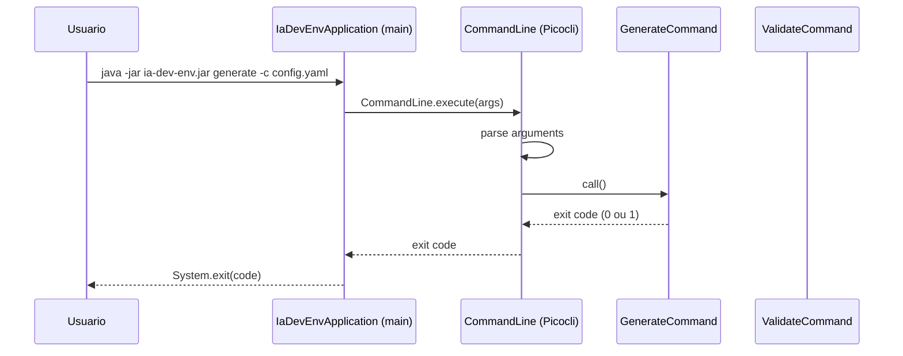
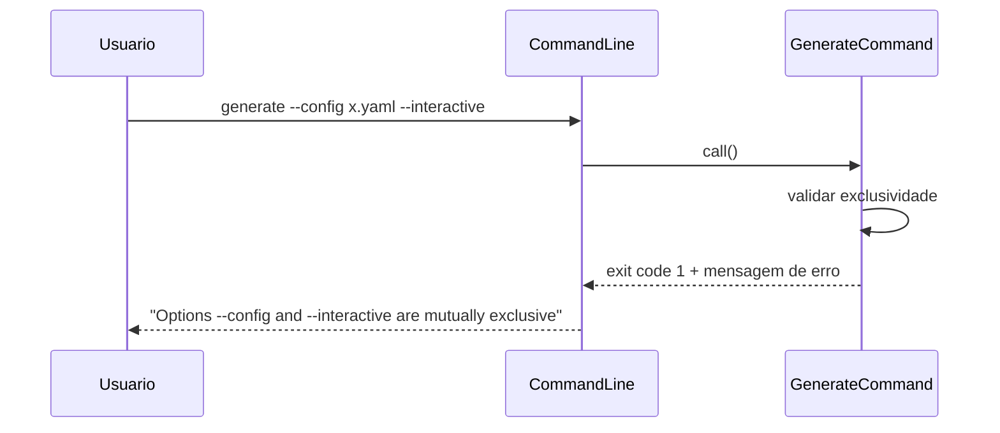

# Historia: Projeto Maven, pom.xml e Bootstrap CLI (Picocli)

**ID:** story-0006-0001

## 1. Dependencias

| Blocked By | Blocks |
| :--- | :--- |
| — | story-0006-0005, story-0006-0006, story-0006-0007, story-0006-0022, story-0006-0023, story-0006-0027 |

## 2. Regras Transversais Aplicaveis

| ID | Titulo |
| :--- | :--- |
| RULE-006 | Cobertura JaCoCo |
| RULE-009 | Compatibilidade Cross-Platform |

## 3. Descricao

Como **Desenvolvedor Java**, eu quero o setup inicial do projeto Maven com Java 21, pom.xml
configurado com todas as dependencias necessarias, estrutura de pacotes definida e classe main
com Picocli, garantindo que o projeto compile, execute e produza um fat JAR funcional desde o
primeiro commit.

Esta historia e a fundacao de todo o projeto Java. Define o pom.xml com as dependencias
essenciais (Picocli para CLI, Pebble para templates, SnakeYAML para YAML, Jackson para JSON,
JLine para modo interativo, SLF4J/Logback para logging, JUnit 5 + AssertJ + Mockito para
testes, JaCoCo para cobertura), a estrutura de pacotes seguindo convencoes Java, a classe
main `IaDevEnvApplication` com Picocli, e os esqueletos dos subcomandos `generate` e `validate`.
O build DEVE gerar um fat JAR via `maven-shade-plugin` executavel com `java -jar`.

### 3.1 pom.xml e Dependencias

- `groupId`: com.iadevenv
- `artifactId`: ia-dev-env
- `version`: 2.0.0
- `java.version`: 21
- Dependencias de runtime: Picocli, Pebble, SnakeYAML, Jackson Databind, JLine, SLF4J API, Logback Classic
- Dependencias de teste: JUnit 5 (Jupiter), AssertJ, Mockito
- Plugins: maven-compiler-plugin (Java 21), maven-shade-plugin (fat JAR), jacoco-maven-plugin (cobertura ≥ 95% line, ≥ 90% branch), maven-surefire-plugin

### 3.2 Estrutura de Pacotes

```
src/main/java/com/iadevenv/
├── cli/            # Picocli commands (IaDevEnvApplication, GenerateCommand, ValidateCommand)
├── config/         # Carregamento e validacao de configuracao YAML
├── model/          # Data classes (records) do dominio
├── domain/         # Logica de negocio pura (zero dependencia de framework)
├── assembler/      # Assemblers de pipeline (geracao de artefatos)
├── checkpoint/     # Sistema de checkpoint e estado de execucao
├── progress/       # Relatorios de progresso e metricas
├── template/       # Motor de templates (Pebble wrapper)
├── exception/      # Hierarquia de excecoes customizadas
└── util/           # Utilitarios de I/O, Path, seguranca
```

### 3.3 IaDevEnvApplication (Main)

- Classe anotada com `@Command` do Picocli
- Subcomandos registrados: `generate`, `validate`
- Opcoes globais: `--help`, `--version` (exibe "2.0.0")
- Metodo `main()` delega para `CommandLine.execute()`
- Retorna exit code adequado (0 sucesso, 1 erro de uso, 2 erro de execucao)

### 3.4 GenerateCommand (Esqueleto)

- Anotado com `@Command(name = "generate")`
- Opcoes: `-c`/`--config` (caminho do YAML), `-i`/`--interactive` (modo interativo), `-o`/`--output` (diretorio de saida), `-s`/`--stack` (perfil bundled), `-v`/`--verbose` (log detalhado), `--dry-run` (simular sem escrever), `-f`/`--force` (sobrescrever existentes)
- Validacao: `--config` e `--interactive` sao mutuamente exclusivos
- Corpo do `call()`: placeholder retornando 0

### 3.5 ValidateCommand (Esqueleto)

- Anotado com `@Command(name = "validate")`
- Opcoes: `-c`/`--config` (caminho do YAML, obrigatorio), `-v`/`--verbose`
- Corpo do `call()`: placeholder retornando 0

### 3.6 maven-shade-plugin

- Configurar `mainClass` como `com.iadevenv.cli.IaDevEnvApplication`
- Gerar JAR em `target/ia-dev-env-2.0.0.jar`
- Incluir todas as dependencias no fat JAR
- Transformer para merge de `META-INF/services`

## 4. Definicoes de Qualidade Locais

### DoR Local (Definition of Ready)

- [ ] Java 21 JDK instalado e disponivel no PATH
- [ ] Maven 3.9+ disponivel
- [ ] Dependencias Maven resolvidas e disponveis nos repositorios
- [ ] Picocli API e modelo de commands estudados

### DoD Local (Definition of Done)

- [ ] `mvn clean package` compila sem erros e gera fat JAR
- [ ] `java -jar target/ia-dev-env-2.0.0.jar --help` exibe usage com subcomandos
- [ ] `java -jar target/ia-dev-env-2.0.0.jar --version` exibe "2.0.0"
- [ ] `java -jar target/ia-dev-env-2.0.0.jar generate --help` exibe opcoes do generate
- [ ] `java -jar target/ia-dev-env-2.0.0.jar validate --help` exibe opcoes do validate
- [ ] JaCoCo configurado com thresholds (95% line, 90% branch)
- [ ] Estrutura de pacotes criada com package-info.java em cada pacote
- [ ] Testes unitarios para CLI help, version, comandos invalidos

### Global Definition of Done (DoD)

- **Cobertura:** ≥ 95% Line Coverage, ≥ 90% Branch Coverage (JaCoCo)
- **Testes Automatizados:** Unitarios (JUnit 5 + AssertJ), integracao, golden file
- **Relatorio de Cobertura:** JaCoCo HTML + XML
- **Documentacao:** Javadoc em classes publicas
- **Performance:** Geracao completa < 2s
- **TDD Compliance:** Test-first, refactoring explicito, TPP incremental

## 5. Contratos de Dados (Data Contract)

**pom.xml:**

| Campo | Valor | Obrigatorio |
| :--- | :--- | :--- |
| `groupId` | com.iadevenv | M |
| `artifactId` | ia-dev-env | M |
| `version` | 2.0.0 | M |
| `java.version` | 21 | M |

**CLI Options — GenerateCommand:**

| Opcao | Curta | Tipo | Default | Obrigatorio |
| :--- | :--- | :--- | :--- | :--- |
| `--config` | `-c` | String (path) | — | Condicional (exclusivo com -i) |
| `--interactive` | `-i` | boolean | false | Condicional (exclusivo com -c) |
| `--output` | `-o` | String (path) | `.` | O |
| `--stack` | `-s` | String | — | O |
| `--verbose` | `-v` | boolean | false | O |
| `--dry-run` | — | boolean | false | O |
| `--force` | `-f` | boolean | false | O |

**CLI Options — ValidateCommand:**

| Opcao | Curta | Tipo | Default | Obrigatorio |
| :--- | :--- | :--- | :--- | :--- |
| `--config` | `-c` | String (path) | — | M |
| `--verbose` | `-v` | boolean | false | O |

## 6. Diagramas

### 6.1 Estrutura de Comandos Picocli



### 6.2 Fluxo de Validacao de Exclusividade --config / --interactive



## 7. Criterios de Aceite (Gherkin)

```gherkin
Cenario: --help exibe usage com subcomandos
  DADO que o fat JAR foi construido com sucesso
  QUANDO o usuario executa "java -jar ia-dev-env.jar --help"
  ENTAO a saida contem "Usage: ia-dev-env"
  E a saida lista os subcomandos "generate" e "validate"
  E o exit code e 0

Cenario: --version exibe 2.0.0
  DADO que o fat JAR foi construido com sucesso
  QUANDO o usuario executa "java -jar ia-dev-env.jar --version"
  ENTAO a saida contem "2.0.0"
  E o exit code e 0

Cenario: generate --help mostra todas as opcoes
  DADO que o fat JAR foi construido com sucesso
  QUANDO o usuario executa "java -jar ia-dev-env.jar generate --help"
  ENTAO a saida contem as opcoes "-c", "--config", "-i", "--interactive", "-o", "--output"
  E a saida contem as opcoes "-s", "--stack", "-v", "--verbose", "--dry-run", "-f", "--force"
  E o exit code e 0

Cenario: validate --help mostra opcoes do validate
  DADO que o fat JAR foi construido com sucesso
  QUANDO o usuario executa "java -jar ia-dev-env.jar validate --help"
  ENTAO a saida contem as opcoes "-c", "--config", "-v", "--verbose"
  E o exit code e 0

Cenario: Comando inexistente retorna erro
  DADO que o fat JAR foi construido com sucesso
  QUANDO o usuario executa "java -jar ia-dev-env.jar foobar"
  ENTAO a saida de erro contem "Unmatched argument"
  E o exit code e diferente de 0

Cenario: --config e --interactive sao mutuamente exclusivos
  DADO que o fat JAR foi construido com sucesso
  QUANDO o usuario executa "java -jar ia-dev-env.jar generate --config x.yaml --interactive"
  ENTAO a saida contem mensagem indicando que --config e --interactive sao mutuamente exclusivos
  E o exit code e diferente de 0
```

### 7.1 Scenario Ordering (TPP)

> Scenarios seguem TPP: caso mais simples (--help) → constante (--version) → subcomando help (generate, validate) → erro de input (comando inexistente) → validacao de regra de negocio (exclusividade mutual).

### 7.2 Mandatory Scenario Categories

- [x] Degenerate cases (comando inexistente)
- [x] Happy path (--help, --version, generate --help, validate --help)
- [x] Error paths (comando inexistente, exclusividade mutual)
- [x] Boundary values (exclusividade --config/--interactive)

### 7.3 TDD Implementation Notes

**Outer loop (acceptance):** Testar CLI end-to-end executando o fat JAR como processo externo e validando stdout, stderr e exit code.

**Inner loop (unit):**
1. `IaDevEnvApplication` — verificar registro de subcomandos via Picocli `CommandLine`
2. `GenerateCommand` — validar parsing de opcoes e regra de exclusividade `--config`/`--interactive`
3. `ValidateCommand` — validar parsing de opcoes obrigatorias
4. `maven-shade-plugin` — verificar que JAR contem manifest com Main-Class correto

## 8. Sub-tarefas

- [ ] [Dev] pom.xml com todas as dependencias (Picocli, Pebble, SnakeYAML, Jackson, JLine, SLF4J/Logback, JUnit5, AssertJ, Mockito, JaCoCo)
- [ ] [Dev] Estrutura de pacotes com package-info.java (cli, config, model, domain, assembler, checkpoint, progress, template, exception, util)
- [ ] [Dev] IaDevEnvApplication com `@Command`, `--help`, `--version`, registro de subcomandos
- [ ] [Dev] GenerateCommand skeleton com todas as opcoes (-c, -i, -o, -s, -v, --dry-run, -f)
- [ ] [Dev] ValidateCommand skeleton com opcoes (-c, -v)
- [ ] [Dev] maven-shade-plugin configurado para fat JAR com mainClass
- [ ] [Dev] Validacao de exclusividade --config/--interactive no GenerateCommand
- [ ] [Test] Unitario: CLI --help exibe usage com subcomandos
- [ ] [Test] Unitario: CLI --version exibe "2.0.0"
- [ ] [Test] Unitario: generate --help lista todas as opcoes
- [ ] [Test] Unitario: validate --help lista opcoes
- [ ] [Test] Unitario: comando inexistente retorna exit code != 0
- [ ] [Test] Unitario: exclusividade --config/--interactive
- [ ] [Test] Integracao: fat JAR executa e responde a --help
- [ ] [Doc] Javadoc em IaDevEnvApplication, GenerateCommand, ValidateCommand
