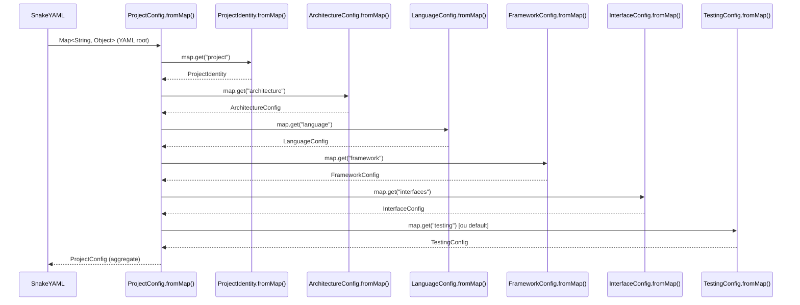

# Historia: Modelos de Dominio — 17 Data Classes Java

**ID:** story-0006-0002

## 1. Dependencias

| Blocked By | Blocks |
| :--- | :--- |
| — | story-0006-0005, story-0006-0006, story-0006-0008, story-0006-0009, story-0006-0024, story-0006-0025 |

## 2. Regras Transversais Aplicaveis

| ID | Titulo |
| :--- | :--- |
| RULE-003 | Factory Method fromMap() |
| RULE-007 | Zero Dependencia de Framework no Dominio |

## 3. Descricao

Como **Desenvolvedor Java**, eu quero portar as 17 data classes de TypeScript para Java usando
records imutaveis com metodos estaticos `fromMap()` para desserializacao YAML, garantindo que
o modelo de dominio seja identico ao TypeScript em campos, tipos, defaults e validacoes.

Esta historia porta todo o modelo de dominio definido em `models.ts` do projeto TypeScript.
As 17 classes representam a estrutura de configuracao do projeto que alimenta todo o pipeline
de geracao. Cada classe DEVE ter um metodo estatico `fromMap(Map<String, Object>)` que recebe
o resultado do parse YAML (SnakeYAML retorna `Map<String, Object>`) e retorna a instancia
tipada. Os defaults DEVEM ser identicos aos do TypeScript para manter paridade funcional.

O pacote `model` NAO pode importar frameworks externos (RULE-007) — apenas tipos da standard
library Java (`java.util.Map`, `java.util.List`, `java.util.Optional`).

### 3.1 Records com Imutabilidade

- Usar Java `record` para classes sem logica mutavel
- Campos obrigatorios validados no construtor compacto
- Campos opcionais com valores default via factory method `fromMap()`
- Collections retornadas como `List.copyOf()` ou `Map.copyOf()` (imutaveis)

### 3.2 Listagem das 17 Data Classes

| # | Classe | Descricao |
| :--- | :--- | :--- |
| 1 | `TechComponent` | Componente tecnologico com name (String) e version (String, opcional) |
| 2 | `ProjectIdentity` | Nome, proposito, linguagem do projeto |
| 3 | `ArchitectureConfig` | Estilo de arquitetura, DDD, event-driven |
| 4 | `InterfaceConfig` | Lista de interfaces (rest, grpc, graphql, events, cli) |
| 5 | `LanguageConfig` | Linguagem e versao |
| 6 | `FrameworkConfig` | Framework e versao |
| 7 | `DataConfig` | Database, migration tool, cache |
| 8 | `SecurityConfig` | Configuracoes de seguranca |
| 9 | `ObservabilityConfig` | Metricas, tracing, logging |
| 10 | `InfraConfig` | Container, orchestrator, cloud |
| 11 | `TestingConfig` | Coverage thresholds (default: 95/90), smoke, contract |
| 12 | `McpServerConfig` | Configuracao individual de servidor MCP |
| 13 | `McpConfig` | Lista de servidores MCP |
| 14 | `ProjectConfig` | Aggregate raiz contendo todos os configs |
| 15 | `PipelineResult` | Resultado do pipeline (arquivos gerados, erros) |
| 16 | `FileDiff` | Diferenca de arquivo (path, conteudo anterior, conteudo novo) |
| 17 | `ProjectFoundation` | Fundacao do projeto (identidade + arquitetura + interfaces) |

### 3.3 Factory Method fromMap()

- Recebe `Map<String, Object>` retornado pelo SnakeYAML
- Extrai campos com cast seguro (`(String) map.get("key")` com null check)
- Aplica defaults para campos ausentes (identicos ao TypeScript)
- Lanca `ConfigValidationException` para valores invalidos ou tipos incorretos
- Trata nested maps recursivamente (e.g., `ProjectConfig` chama `LanguageConfig.fromMap()` para subcampo)

### 3.4 ProjectConfig — Aggregate Raiz

- Contem todos os demais configs como campos
- `fromMap()` delega para cada sub-config via seus respectivos `fromMap()`
- Secoes opcionais (data, security, observability, infra, mcp) podem ser ausentes no YAML
- Secoes obrigatorias (project, architecture, interfaces, language, framework) lancam excecao se ausentes
- Campos calculados: `buildTool` derivado de `framework` quando nao especificado

### 3.5 Defaults Criticos

| Classe | Campo | Default |
| :--- | :--- | :--- |
| `TestingConfig` | `coverageLine` | 95 |
| `TestingConfig` | `coverageBranch` | 90 |
| `TestingConfig` | `smokeTests` | true |
| `TestingConfig` | `contractTests` | false |
| `ArchitectureConfig` | `domainDriven` | false |
| `ArchitectureConfig` | `eventDriven` | false |
| `InfraConfig` | `nativeBuild` | false |
| `SecurityConfig` | `resilience` | true |

## 4. Definicoes de Qualidade Locais

### DoR Local (Definition of Ready)

- [ ] Codigo TypeScript `models.ts` lido e campos mapeados
- [ ] Tipos TypeScript mapeados para tipos Java (string→String, number→int/double, boolean→boolean, array→List, object→Map)
- [ ] Defaults do TypeScript documentados para cada campo opcional
- [ ] Convenção de records Java 21 compreendida

### DoD Local (Definition of Done)

- [ ] 17 records/classes criados no pacote `com.iadevenv.model`
- [ ] Todos os `fromMap()` implementados com tratamento de null e defaults
- [ ] Zero imports de frameworks externos no pacote model (RULE-007)
- [ ] Collections imutaveis retornadas em todos os getters
- [ ] `ProjectConfig.fromMap()` delega para sub-configs corretamente
- [ ] Testes unitarios para cada `fromMap()` com config completa, parcial e invalida
- [ ] Defaults identicos ao TypeScript verificados por testes

### Global Definition of Done (DoD)

- **Cobertura:** ≥ 95% Line Coverage, ≥ 90% Branch Coverage (JaCoCo)
- **Testes Automatizados:** Unitarios (JUnit 5 + AssertJ), integracao, golden file
- **Relatorio de Cobertura:** JaCoCo HTML + XML
- **Documentacao:** Javadoc em classes publicas
- **Performance:** Geracao completa < 2s
- **TDD Compliance:** Test-first, refactoring explicito, TPP incremental

## 5. Contratos de Dados (Data Contract)

**Mapeamento de Campos — ProjectConfig (aggregate):**

| Campo | Tipo Java | Origem YAML | Obrigatorio | Default |
| :--- | :--- | :--- | :--- | :--- |
| `identity` | ProjectIdentity | `project` | M | — |
| `architecture` | ArchitectureConfig | `architecture` | M | — |
| `interfaces` | InterfaceConfig | `interfaces` | M | — |
| `language` | LanguageConfig | `language` | M | — |
| `framework` | FrameworkConfig | `framework` | M | — |
| `data` | DataConfig | `data` | O | DataConfig vazio |
| `security` | SecurityConfig | `security` | O | SecurityConfig default |
| `observability` | ObservabilityConfig | `observability` | O | ObservabilityConfig default |
| `infra` | InfraConfig | `infra` | O | InfraConfig default |
| `testing` | TestingConfig | `testing` | O | TestingConfig(95, 90, true, false) |
| `mcp` | McpConfig | `mcp` | O | McpConfig vazio |

**Mapeamento de Campos — TechComponent:**

| Campo | Tipo Java | Origem YAML | Obrigatorio | Default |
| :--- | :--- | :--- | :--- | :--- |
| `name` | String | `name` | M | — |
| `version` | String | `version` | O | null |

**Mapeamento de Campos — PipelineResult:**

| Campo | Tipo Java | Origem YAML | Obrigatorio | Default |
| :--- | :--- | :--- | :--- | :--- |
| `generatedFiles` | List\<String\> | — | M | — |
| `errors` | List\<String\> | — | M | — |
| `diffs` | List\<FileDiff\> | — | M | — |

## 6. Diagramas

### 6.1 Hierarquia de Composicao do ProjectConfig



## 7. Criterios de Aceite (Gherkin)

```gherkin
Cenario: ProjectConfig.fromMap() com configuracao completa
  DADO que existe um Map representando um YAML completo com todas as secoes preenchidas
  QUANDO ProjectConfig.fromMap() e invocado com esse Map
  ENTAO o ProjectConfig retornado contem todos os sub-configs com campos corretos
  E identity.name corresponde ao valor do YAML
  E language.name e language.version correspondem ao YAML
  E testing.coverageLine e 95 e testing.coverageBranch e 90

Cenario: ProjectConfig.fromMap() com secoes opcionais ausentes
  DADO que existe um Map com apenas as secoes obrigatorias (project, architecture, interfaces, language, framework)
  QUANDO ProjectConfig.fromMap() e invocado
  ENTAO o ProjectConfig retornado contem sub-configs opcionais com defaults
  E data e um DataConfig vazio
  E testing tem coverageLine 95 e coverageBranch 90
  E infra tem nativeBuild false
  E security tem resilience true

Cenario: TechComponent.fromMap() com name e version
  DADO que existe um Map com "name" = "postgresql" e "version" = "16"
  QUANDO TechComponent.fromMap() e invocado
  ENTAO o TechComponent retornado tem name "postgresql" e version "16"

Cenario: TechComponent.fromMap() com apenas name
  DADO que existe um Map com "name" = "redis" e sem campo "version"
  QUANDO TechComponent.fromMap() e invocado
  ENTAO o TechComponent retornado tem name "redis" e version null

Cenario: InterfaceConfig lista multiplas interfaces
  DADO que existe um Map com "interfaces" contendo ["rest", "grpc", "events"]
  QUANDO InterfaceConfig.fromMap() e invocado
  ENTAO a lista retornada contem exatamente "rest", "grpc", "events"
  E a lista e imutavel (tentativa de add lanca UnsupportedOperationException)

Cenario: Defaults para TestingConfig com valores padrao 95/90
  DADO que existe um Map vazio (sem campos de testing)
  QUANDO TestingConfig.fromMap() e invocado com Map vazio
  ENTAO coverageLine e 95
  E coverageBranch e 90
  E smokeTests e true
  E contractTests e false

Cenario: fromMap() com tipo invalido lanca excecao
  DADO que existe um Map com "name" contendo um Integer em vez de String
  QUANDO ProjectIdentity.fromMap() e invocado
  ENTAO ConfigValidationException e lancada
  E a mensagem contem o nome do campo e o tipo esperado

Cenario: ProjectIdentity com campos obrigatorios ausentes lanca excecao
  DADO que existe um Map sem o campo "name" (obrigatorio para ProjectIdentity)
  QUANDO ProjectIdentity.fromMap() e invocado
  ENTAO ConfigValidationException e lancada
  E a mensagem indica que o campo "name" e obrigatorio
```

### 7.1 Scenario Ordering (TPP)

> Scenarios seguem TPP: config completa (caso feliz) → secoes opcionais ausentes (defaults) → componente com dois campos → componente com campo opcional → colecao multipla → defaults especificos → tipo invalido (erro) → campo obrigatorio ausente (erro).

### 7.2 Mandatory Scenario Categories

- [x] Degenerate cases (tipo invalido, campo obrigatorio ausente)
- [x] Happy path (config completa, TechComponent com name + version)
- [x] Error paths (ConfigValidationException para tipo invalido e campo ausente)
- [x] Boundary values (secoes opcionais ausentes com defaults, lista imutavel)

### 7.3 TDD Implementation Notes

**Outer loop (acceptance):** Testar `ProjectConfig.fromMap()` com Map simulando YAML completo e verificar que todos os sub-configs estao corretos.

**Inner loop (unit):**
1. `TechComponent.fromMap()` — caso mais simples (2 campos)
2. `ProjectIdentity.fromMap()` — campos obrigatorios + validacao
3. `LanguageConfig.fromMap()` + `FrameworkConfig.fromMap()` — pares name/version
4. `TestingConfig.fromMap()` — defaults numericos (95/90)
5. `InterfaceConfig.fromMap()` — lista imutavel
6. `ProjectConfig.fromMap()` — composicao de todos (mais complexo, ultimo)

## 8. Sub-tarefas

- [ ] [Dev] TechComponent record com fromMap() (name, version opcional)
- [ ] [Dev] ProjectIdentity record com fromMap() e validacao de campos obrigatorios
- [ ] [Dev] ArchitectureConfig record com fromMap() (style, domainDriven, eventDriven)
- [ ] [Dev] InterfaceConfig record com fromMap() e lista imutavel
- [ ] [Dev] LanguageConfig + FrameworkConfig records com fromMap()
- [ ] [Dev] DataConfig + SecurityConfig + ObservabilityConfig records com defaults
- [ ] [Dev] InfraConfig + TestingConfig records com defaults (95/90, nativeBuild false)
- [ ] [Dev] McpServerConfig + McpConfig records com fromMap()
- [ ] [Dev] ProjectConfig aggregate com fromMap() delegando para sub-configs
- [ ] [Dev] PipelineResult + FileDiff + ProjectFoundation records
- [ ] [Test] Unitario: fromMap() para cada uma das 17 classes com config completa
- [ ] [Test] Unitario: fromMap() com secoes opcionais ausentes e verificacao de defaults
- [ ] [Test] Unitario: fromMap() com tipo invalido lanca ConfigValidationException
- [ ] [Test] Unitario: fromMap() com campo obrigatorio ausente lanca excecao
- [ ] [Test] Unitario: imutabilidade de collections retornadas
- [ ] [Doc] Javadoc em todas as 17 classes com descricao e exemplo de fromMap()
