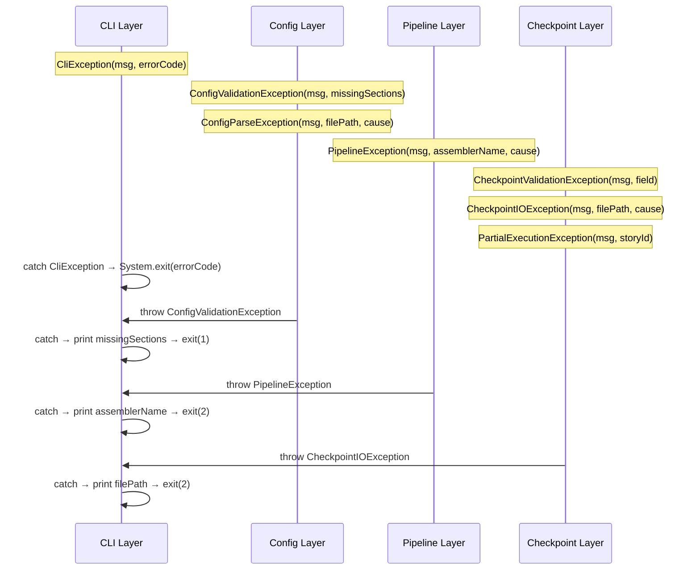

# Historia: Hierarquia de Excecoes — 7 Custom Exceptions

**ID:** story-0006-0003

## 1. Dependencias

| Blocked By | Blocks |
| :--- | :--- |
| — | story-0006-0005, story-0006-0007, story-0006-0024, story-0006-0025 |

## 2. Regras Transversais Aplicaveis

| ID | Titulo |
| :--- | :--- |
| RULE-007 | Zero Dependencia de Framework no Dominio |

## 3. Descricao

Como **Desenvolvedor Java**, eu quero portar as 7 excecoes customizadas do TypeScript para Java,
cada uma estendendo `RuntimeException` e carregando contexto rico (valores que causaram o erro),
garantindo que mensagens de erro sejam informativas e rastreáveis sem depender de frameworks externos.

As excecoes sao a espinha dorsal do tratamento de erros em todo o projeto. Cada excecao carrega
campos especificos que contextualizam o erro conforme regra CC-07 do Clean Code: nunca lancar
excecoes genericas sem informacao sobre o que causou a falha. Todas residem no pacote
`com.iadevenv.exception` e NAO importam frameworks externos (RULE-007).

A hierarquia e plana — todas estendem diretamente `RuntimeException` (unchecked), sem necessidade
de heranca entre elas. Isso simplifica o tratamento no CLI (catch no nivel de comando Picocli)
e evita hierarquias profundas desnecessarias.

### 3.1 CliException

- Excecao generica de CLI para erros de uso (argumentos invalidos, flags conflitantes)
- Campos: `message` (String), `errorCode` (int)
- O `errorCode` mapeia para exit codes do processo (1 = erro de uso, 2 = erro de execucao)

### 3.2 ConfigValidationException

- Lancada quando secoes obrigatorias estao ausentes no YAML ou valores sao invalidos
- Campos: `message` (String), `missingSections` (List\<String\>)
- A lista `missingSections` permite ao usuario saber exatamente o que falta no YAML

### 3.3 ConfigParseException

- Lancada quando o YAML e sintaticamente invalido (SnakeYAML falha no parse)
- Campos: `message` (String), `filePath` (String), `cause` (Throwable)
- Preserva a causa original (excecao do SnakeYAML) para stack trace completo

### 3.4 PipelineException

- Lancada quando um assembler falha durante a geracao de artefatos
- Campos: `message` (String), `assemblerName` (String), `cause` (Throwable)
- O `assemblerName` identifica qual dos 23 assemblers falhou no pipeline

### 3.5 CheckpointValidationException

- Lancada quando o estado do checkpoint e invalido (campos ausentes, enum invalido)
- Campos: `message` (String), `field` (String)
- O `field` identifica qual campo do checkpoint esta invalido

### 3.6 CheckpointIOException

- Lancada quando operacoes de I/O com o arquivo de checkpoint falham
- Campos: `message` (String), `filePath` (String), `cause` (Throwable)
- Preserva o caminho do arquivo e a causa original para diagnostico

### 3.7 PartialExecutionException

- Lancada quando uma story executa parcialmente (nem sucesso nem falha completa)
- Campos: `message` (String), `storyId` (String)
- O `storyId` identifica qual story teve execucao parcial

## 4. Definicoes de Qualidade Locais

### DoR Local (Definition of Ready)

- [ ] Excecoes do TypeScript identificadas e campos mapeados
- [ ] Convenção CC-07 (Clean Code — excecoes com contexto) compreendida
- [ ] Decisao sobre RuntimeException vs checked exception tomada (unchecked)

### DoD Local (Definition of Done)

- [ ] 7 classes de excecao criadas no pacote `com.iadevenv.exception`
- [ ] Cada excecao carrega campos de contexto especificos
- [ ] Todas estendem `RuntimeException` (unchecked)
- [ ] Zero imports de frameworks externos (RULE-007)
- [ ] Getters para todos os campos de contexto
- [ ] `toString()` override com informacao legivel incluindo campos de contexto
- [ ] Testes unitarios para cada excecao verificando campos e mensagens

### Global Definition of Done (DoD)

- **Cobertura:** ≥ 95% Line Coverage, ≥ 90% Branch Coverage (JaCoCo)
- **Testes Automatizados:** Unitarios (JUnit 5 + AssertJ), integracao, golden file
- **Relatorio de Cobertura:** JaCoCo HTML + XML
- **Documentacao:** Javadoc em classes publicas
- **Performance:** Geracao completa < 2s
- **TDD Compliance:** Test-first, refactoring explicito, TPP incremental

## 5. Contratos de Dados (Data Contract)

**Assinatura dos Construtores:**

| Excecao | Construtor | Campos de Contexto |
| :--- | :--- | :--- |
| `CliException` | `(String message, int errorCode)` | `errorCode`: int |
| `ConfigValidationException` | `(String message, List<String> missingSections)` | `missingSections`: List\<String\> |
| `ConfigParseException` | `(String message, String filePath, Throwable cause)` | `filePath`: String |
| `PipelineException` | `(String message, String assemblerName, Throwable cause)` | `assemblerName`: String |
| `CheckpointValidationException` | `(String message, String field)` | `field`: String |
| `CheckpointIOException` | `(String message, String filePath, Throwable cause)` | `filePath`: String |
| `PartialExecutionException` | `(String message, String storyId)` | `storyId`: String |

**Mapeamento de Exit Codes (CliException):**

| errorCode | Significado |
| :--- | :--- |
| 1 | Erro de uso (argumentos invalidos, flags conflitantes) |
| 2 | Erro de execucao (falha durante geracao) |

## 6. Diagramas

### 6.1 Hierarquia de Excecoes



## 7. Criterios de Aceite (Gherkin)

```gherkin
Cenario: CliException carrega errorCode
  DADO que uma CliException e criada com message "Invalid argument" e errorCode 1
  QUANDO os campos sao acessados
  ENTAO getMessage() retorna "Invalid argument"
  E getErrorCode() retorna 1

Cenario: ConfigValidationException lista secoes ausentes
  DADO que uma ConfigValidationException e criada com missingSections ["language", "framework"]
  QUANDO os campos sao acessados
  ENTAO getMissingSections() retorna lista com "language" e "framework"
  E getMessage() contem informacao sobre secoes ausentes
  E a lista retornada e imutavel

Cenario: ConfigParseException preserva causa original
  DADO que existe uma excecao original do SnakeYAML (ScannerException)
  QUANDO uma ConfigParseException e criada com filePath "config.yaml" e a causa original
  ENTAO getCause() retorna a excecao original do SnakeYAML
  E getFilePath() retorna "config.yaml"
  E a stack trace contem a causa encadeada

Cenario: PipelineException inclui nome do assembler
  DADO que o assembler "RulesAssembler" falhou com uma IOException
  QUANDO uma PipelineException e criada com assemblerName "RulesAssembler" e a causa
  ENTAO getAssemblerName() retorna "RulesAssembler"
  E getCause() retorna a IOException original
  E getMessage() contem "RulesAssembler"

Cenario: CheckpointIOException inclui caminho do arquivo
  DADO que a leitura do arquivo "/tmp/checkpoint/execution-state.json" falhou
  QUANDO uma CheckpointIOException e criada com filePath e causa IOException
  ENTAO getFilePath() retorna "/tmp/checkpoint/execution-state.json"
  E getCause() e a IOException original
  E getMessage() contem o caminho do arquivo
```

### 7.1 Scenario Ordering (TPP)

> Scenarios seguem TPP: caso mais simples (CliException com 2 campos) → lista de strings (ConfigValidationException) → causa encadeada (ConfigParseException) → nome contextual (PipelineException) → caminho de arquivo (CheckpointIOException).

### 7.2 Mandatory Scenario Categories

- [x] Degenerate cases (N/A — excecoes sao objetos simples, sem caso degenerado)
- [x] Happy path (criacao de cada excecao com campos corretos)
- [x] Error paths (N/A — as excecoes SAO o mecanismo de erro)
- [x] Boundary values (imutabilidade de listas, causa encadeada, campos de contexto)

### 7.3 TDD Implementation Notes

**Outer loop (acceptance):** Verificar que cada excecao e capturavel como `RuntimeException` e que os campos de contexto sao acessiveis apos o catch.

**Inner loop (unit):**
1. `CliException` — caso mais simples (message + errorCode)
2. `CheckpointValidationException` + `PartialExecutionException` — message + campo unico
3. `ConfigValidationException` — message + lista imutavel
4. `ConfigParseException` + `CheckpointIOException` — message + filePath + causa encadeada
5. `PipelineException` — message + assemblerName + causa encadeada
6. Verificar `toString()` override em todas as excecoes

## 8. Sub-tarefas

- [ ] [Dev] CliException com message e errorCode
- [ ] [Dev] ConfigValidationException com message e missingSections (List\<String\> imutavel)
- [ ] [Dev] ConfigParseException com message, filePath e cause (Throwable)
- [ ] [Dev] PipelineException com message, assemblerName e cause (Throwable)
- [ ] [Dev] CheckpointValidationException com message e field
- [ ] [Dev] CheckpointIOException com message, filePath e cause (Throwable)
- [ ] [Dev] PartialExecutionException com message e storyId
- [ ] [Test] Unitario: CliException — getMessage(), getErrorCode()
- [ ] [Test] Unitario: ConfigValidationException — getMissingSections() retorna lista imutavel
- [ ] [Test] Unitario: ConfigParseException — getCause() preserva excecao original, getFilePath()
- [ ] [Test] Unitario: PipelineException — getAssemblerName(), getCause()
- [ ] [Test] Unitario: CheckpointValidationException — getField()
- [ ] [Test] Unitario: CheckpointIOException — getFilePath(), getCause()
- [ ] [Test] Unitario: PartialExecutionException — getStoryId()
- [ ] [Test] Unitario: todas as excecoes sao RuntimeException (instanceof check)
- [ ] [Doc] Javadoc em todas as 7 excecoes com descricao e exemplo de uso
