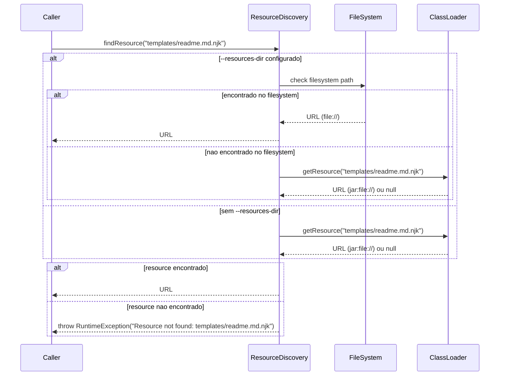
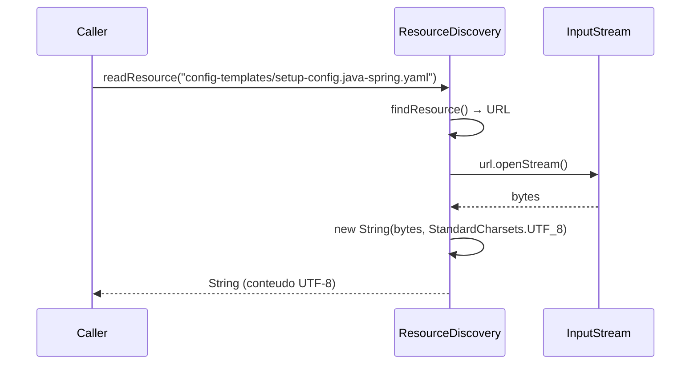

# Historia: Empacotamento de Resources e Templates no Classpath

**ID:** story-0006-0004

## 1. Dependencias

| Blocked By | Blocks |
| :--- | :--- |
| — | story-0006-0006, story-0006-0009 |

## 2. Regras Transversais Aplicaveis

| ID | Titulo |
| :--- | :--- |
| RULE-001 | Paridade Byte-a-Byte |
| RULE-009 | Compatibilidade Cross-Platform |

## 3. Descricao

Como **Desenvolvedor Java**, eu quero copiar toda a arvore de resources do projeto TypeScript
para `src/main/resources/` e implementar `ResourceDiscovery.java` para localizacao de resources
via classpath e filesystem, garantindo que templates, config-templates, e todos os artefatos
sejam acessiveis tanto dentro do fat JAR quanto via diretorio externo.

Esta historia resolve o problema de empacotamento: o projeto TypeScript le templates e resources
do filesystem diretamente, enquanto o projeto Java precisa acessar resources empacotados dentro
do JAR via classpath. A classe `ResourceDiscovery` abstrai essa diferenca, oferecendo uma API
unica para localizar resources independente de estarem no JAR ou no filesystem.

Os templates Nunjucks/Jinja2 existentes DEVEM ser copiados sem modificacao — a compatibilidade
com a sintaxe e responsabilidade do motor de templates (Pebble, story-0006-0006). Esta historia
apenas garante que os arquivos estejam acessiveis no lugar certo.

### 3.1 Copia da Arvore de Resources

Copiar a estrutura completa de `resources/` do projeto TypeScript para `src/main/resources/`:

- `core/` — 14 arquivos de regras, skills, agents base
- `core-rules/` — templates de regras condicionais
- `config-templates/` — 8 YAML de perfis bundled + 1 setup config
- `skills-templates/` — templates de skills por linguagem/framework
- `agents-templates/` — templates de agents por role
- `github-*-templates/` — templates para artefatos .github/
- `hooks-templates/` — templates de hooks
- `settings-templates/` — templates de settings JSON
- `patterns/` — padroes de design por linguagem
- `protocols/` — protocolos de comunicacao
- `databases/` — scripts e templates por banco
- `frameworks/` — templates por framework
- `languages/` — templates por linguagem
- `security/` — templates de seguranca
- `infrastructure/` — templates de infra
- `cloud-providers/` — templates por cloud provider
- `docs/` — templates de documentacao
- `codex-templates/` — templates para Codex
- `cicd-templates/` — templates de CI/CD
- `prompts/` — prompt templates
- `templates/` — 13 templates core do pipeline

### 3.2 ResourceDiscovery.java

- Metodo `findResource(String relativePath)`: localiza resource pelo caminho relativo
- Estrategia de busca: (1) `--resources-dir` filesystem se especificado, (2) classpath via `ClassLoader.getResource()`
- Metodo `listResources(String directory)`: lista todos os resources em um diretorio
- Metodo `readResource(String relativePath)`: le conteudo como String (UTF-8)
- Metodo `resourceExists(String relativePath)`: verifica existencia sem ler
- Em caso de recurso nao encontrado: lancar excecao com mensagem clara indicando o caminho procurado e as estrategias tentadas

### 3.3 Maven Resource Configuration

- Configurar `<resources>` no pom.xml para incluir `src/main/resources/**` no JAR
- Nao aplicar filtering (para preservar templates com `{{placeholders}}` literais)
- Garantir que encoding UTF-8 seja mantido em todos os resources

### 3.4 Opcao --resources-dir

- Permitir override do classpath via opcao de linha de comando `--resources-dir`
- Util para desenvolvimento e debugging (aponta para resources no filesystem)
- ResourceDiscovery prioriza filesystem sobre classpath quando ambos disponveis

## 4. Definicoes de Qualidade Locais

### DoR Local (Definition of Ready)

- [ ] Arvore de resources do TypeScript mapeada completamente
- [ ] Decisao sobre estrutura de diretorios em src/main/resources/ tomada
- [ ] ClassLoader.getResource() vs getResourceAsStream() avaliados para JAR
- [ ] Encoding UTF-8 e line endings LF verificados nos resources originais

### DoD Local (Definition of Done)

- [ ] Todos os resources copiados para `src/main/resources/` com estrutura preservada
- [ ] ResourceDiscovery implementado com busca classpath + filesystem
- [ ] Maven configurado para incluir resources no JAR sem filtering
- [ ] Encoding UTF-8 e line endings LF preservados
- [ ] Testes verificam acesso a resources via classpath (simulando JAR)
- [ ] Testes verificam acesso via --resources-dir (filesystem)
- [ ] Mensagem de erro clara quando resource nao encontrado

### Global Definition of Done (DoD)

- **Cobertura:** ≥ 95% Line Coverage, ≥ 90% Branch Coverage (JaCoCo)
- **Testes Automatizados:** Unitarios (JUnit 5 + AssertJ), integracao, golden file
- **Relatorio de Cobertura:** JaCoCo HTML + XML
- **Documentacao:** Javadoc em classes publicas
- **Performance:** Geracao completa < 2s
- **TDD Compliance:** Test-first, refactoring explicito, TPP incremental

## 5. Contratos de Dados (Data Contract)

**ResourceDiscovery API:**

| Metodo | Parametro | Retorno | Descricao |
| :--- | :--- | :--- | :--- |
| `findResource` | `String relativePath` | `URL` | Localiza resource, lanca excecao se nao encontrado |
| `listResources` | `String directory` | `List<String>` | Lista nomes de resources no diretorio |
| `readResource` | `String relativePath` | `String` | Le conteudo como UTF-8 |
| `resourceExists` | `String relativePath` | `boolean` | Verifica existencia sem I/O pesado |

**Estrutura de Resources no JAR:**

| Diretorio | Quantidade Estimada | Descricao |
| :--- | :--- | :--- |
| `core/` | 14 | Regras, skills, agents base |
| `config-templates/` | 9 | 8 perfis + 1 setup config |
| `skills-templates/` | variavel | Templates de skills por linguagem |
| `agents-templates/` | variavel | Templates de agents por role |
| `templates/` | 13 | Templates core do pipeline |
| `patterns/` | variavel | Padroes por linguagem |
| `frameworks/` | variavel | Templates por framework |
| `languages/` | variavel | Templates por linguagem |

## 6. Diagramas

### 6.1 Fluxo de Descoberta de Resources



### 6.2 Fluxo de Leitura com Encoding



## 7. Criterios de Aceite (Gherkin)

```gherkin
Cenario: ResourceDiscovery encontra resources via classpath em JAR
  DADO que o JAR contem "config-templates/setup-config.java-spring.yaml" no classpath
  E nenhum --resources-dir foi configurado
  QUANDO findResource("config-templates/setup-config.java-spring.yaml") e invocado
  ENTAO retorna uma URL valida apontando para o resource no classpath
  E readResource() retorna o conteudo completo do arquivo

Cenario: ResourceDiscovery encontra resources via --resources-dir filesystem
  DADO que --resources-dir aponta para um diretorio no filesystem contendo "templates/readme.md.njk"
  QUANDO findResource("templates/readme.md.njk") e invocado
  ENTAO retorna uma URL com protocolo "file://"
  E o conteudo lido e identico ao arquivo no filesystem

Cenario: ResourceDiscovery falha com mensagem clara quando nao encontra
  DADO que o resource "inexistente/foo.txt" nao existe no classpath nem no filesystem
  QUANDO findResource("inexistente/foo.txt") e invocado
  ENTAO uma excecao e lancada
  E a mensagem contem "Resource not found: inexistente/foo.txt"
  E a mensagem indica as estrategias de busca tentadas (classpath, filesystem)

Cenario: Todos os 8 config-templates acessiveis via classpath
  DADO que o JAR foi construido com os resources empacotados
  QUANDO resourceExists() e verificado para cada um dos 8 perfis bundled
  ENTAO todos retornam true: "config-templates/setup-config.go-gin.yaml", "config-templates/setup-config.java-quarkus.yaml", "config-templates/setup-config.java-spring.yaml", "config-templates/setup-config.kotlin-ktor.yaml", "config-templates/setup-config.python-click-cli.yaml", "config-templates/setup-config.python-fastapi.yaml", "config-templates/setup-config.rust-axum.yaml", "config-templates/setup-config.typescript-nestjs.yaml"

Cenario: Templates preservam encoding UTF-8 e line endings LF
  DADO que um template contem caracteres UTF-8 (acentos, simbolos) e line endings LF
  QUANDO readResource() e usado para ler o template
  ENTAO o conteudo retornado preserva todos os caracteres UTF-8
  E line endings sao LF (\n), nao CRLF (\r\n)
```

### 7.1 Scenario Ordering (TPP)

> Scenarios seguem TPP: caso mais simples (classpath em JAR) → override com filesystem → erro (resource inexistente) → verificacao abrangente (8 perfis) → propriedade de encoding (UTF-8 + LF).

### 7.2 Mandatory Scenario Categories

- [x] Degenerate cases (resource inexistente com mensagem clara)
- [x] Happy path (classpath, filesystem, 8 perfis)
- [x] Error paths (resource nao encontrado)
- [x] Boundary values (encoding UTF-8, line endings LF)

### 7.3 TDD Implementation Notes

**Outer loop (acceptance):** Testar que todos os 8 config-templates sao acessiveis via classpath apos `mvn package` e que o conteudo esta correto.

**Inner loop (unit):**
1. `resourceExists()` — verifica existencia (true/false)
2. `findResource()` via classpath — URL valida retornada
3. `findResource()` via filesystem (--resources-dir) — prioriza filesystem
4. `readResource()` — conteudo String UTF-8
5. `findResource()` inexistente — excecao com mensagem
6. `listResources()` — lista arquivos de um diretorio

## 8. Sub-tarefas

- [ ] [Dev] Copiar toda a arvore `resources/` para `src/main/resources/` preservando estrutura
- [ ] [Dev] Verificar e corrigir encoding UTF-8 e line endings LF em todos os resources copiados
- [ ] [Dev] Implementar ResourceDiscovery.java com findResource(), listResources(), readResource(), resourceExists()
- [ ] [Dev] Implementar estrategia de busca: filesystem (--resources-dir) → classpath
- [ ] [Dev] Configurar Maven `<resources>` no pom.xml sem filtering
- [ ] [Test] Unitario: ResourceDiscovery.findResource() via classpath
- [ ] [Test] Unitario: ResourceDiscovery.findResource() via filesystem
- [ ] [Test] Unitario: ResourceDiscovery.findResource() inexistente lanca excecao com mensagem clara
- [ ] [Test] Unitario: ResourceDiscovery.readResource() preserva UTF-8
- [ ] [Test] Integracao: verificar que todos os 8 config-templates estao acessiveis no classpath
- [ ] [Test] Integracao: verificar encoding e line endings dos resources no JAR
- [ ] [Doc] Javadoc em ResourceDiscovery com exemplos de uso
