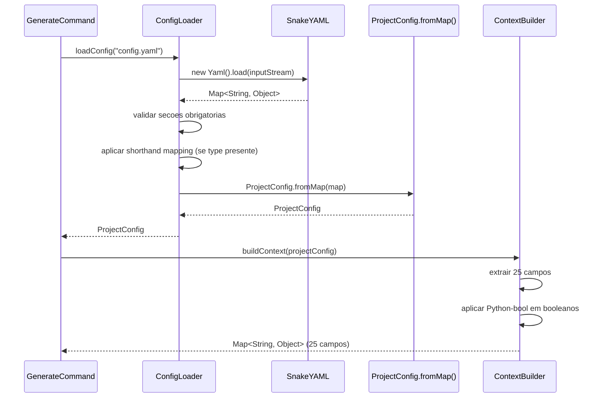
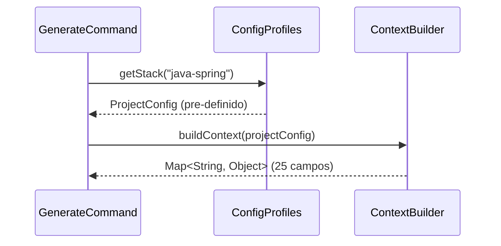

# Historia: Carregador de Configuracao YAML (SnakeYAML)

**ID:** story-0006-0005

## 1. Dependencias

| Blocked By | Blocks |
| :--- | :--- |
| story-0006-0002, story-0006-0003 | story-0006-0008, story-0006-0022, story-0006-0023, story-0006-0027 |

## 2. Regras Transversais Aplicaveis

| ID | Titulo |
| :--- | :--- |
| RULE-003 | Factory Method fromMap() |
| RULE-007 | Zero Dependencia de Framework no Dominio |
| RULE-010 | Contexto de Template 25 Campos |

## 3. Descricao

Como **Desenvolvedor Java**, eu quero portar o modulo `config.ts` para Java, implementando
`ConfigLoader` para leitura e validacao de YAML, `ConfigProfiles` com os 8 perfis bundled,
e `ContextBuilder` com os 25 campos de template context, garantindo que a configuracao
carregada seja identica a do TypeScript em estrutura, defaults e shorthand mappings.

Esta historia conecta o YAML do usuario ao modelo de dominio (story-0006-0002). O `ConfigLoader`
usa SnakeYAML para parsear o arquivo, valida secoes obrigatorias, aplica shorthand mappings
(e.g., "api" → microservice+rest) e retorna um `ProjectConfig` tipado. O `ConfigProfiles`
armazena as 8 constantes de stack mapping que permitem ao usuario usar `--stack java-spring`
em vez de criar um YAML completo. O `ContextBuilder` transforma o `ProjectConfig` em um
`Map<String, Object>` com exatamente 25 campos usados pelos templates, incluindo conversao
Python-bool (RULE-002).

O ConfigLoader e ConfigProfiles residem no pacote `com.iadevenv.config`. O ContextBuilder
reside no mesmo pacote. O SnakeYAML e usado APENAS no ConfigLoader — os demais modulos
recebem `ProjectConfig` ou `Map<String, Object>` tipados (RULE-007 aplicado ao dominio).

### 3.1 ConfigLoader

- Metodo `loadConfig(String filePath)`: le arquivo YAML, parseia com SnakeYAML, valida, retorna `ProjectConfig`
- Validacao de secoes obrigatorias: `project`, `architecture`, `interfaces`, `language`, `framework`
- Se secao obrigatoria ausente: lancar `ConfigValidationException` com lista de secoes faltantes
- Se YAML sintaticamente invalido: lancar `ConfigParseException` com filePath e causa original
- Delegar para `ProjectConfig.fromMap()` apos validacao

### 3.2 Shorthand Mapping

Transformar shorthands em configuracoes completas antes de passar para `ProjectConfig.fromMap()`:

| Shorthand | architecture.style | interfaces |
| :--- | :--- | :--- |
| `api` | microservice | [rest] |
| `cli` | library | [cli] |
| `library` | library | [] |
| `worker` | microservice | [event-consumer] |
| `fullstack` | monolith | [rest] |

O shorthand e detectado no campo `type` da secao `project` do YAML. Se presente, sobrescreve
`architecture.style` e `interfaces` com os valores mapeados.

### 3.3 ConfigProfiles (8 Stacks Bundled)

Constantes `STACK_MAPPING` com as 8 configuracoes pre-definidas:

| Stack Key | Linguagem | Framework | Build Tool |
| :--- | :--- | :--- | :--- |
| `java-quarkus` | java 21 | quarkus | maven |
| `java-spring` | java 21 | spring-boot | maven |
| `python-fastapi` | python 3.12 | fastapi | pip |
| `python-click-cli` | python 3.12 | click | pip |
| `go-gin` | go 1.22 | gin | go |
| `kotlin-ktor` | kotlin 2.0 | ktor | gradle |
| `typescript-nestjs` | typescript 5 | nestjs | npm |
| `rust-axum` | rust 1.78 | axum | cargo |

Cada stack define: language (name + version), framework (name + version), build_tool,
architecture_style, interfaces, e defaults para data, security, testing, infra.

### 3.4 ContextBuilder — 25 Campos

Transformar `ProjectConfig` em `Map<String, Object>` com exatamente os 25 campos esperados
pelos templates:

| # | Campo | Tipo | Origem |
| :--- | :--- | :--- | :--- |
| 1 | `project_name` | String | identity.name |
| 2 | `project_purpose` | String | identity.purpose |
| 3 | `language_name` | String | language.name |
| 4 | `language_version` | String | language.version |
| 5 | `framework_name` | String | framework.name |
| 6 | `framework_version` | String | framework.version |
| 7 | `build_tool` | String | framework.buildTool ou derivado |
| 8 | `architecture_style` | String | architecture.style |
| 9 | `domain_driven` | String | Python-bool de architecture.domainDriven |
| 10 | `event_driven` | String | Python-bool de architecture.eventDriven |
| 11 | `database_name` | String | data.database.name ou "none" |
| 12 | `database_version` | String | data.database.version ou "" |
| 13 | `cache_name` | String | data.cache.name ou "none" |
| 14 | `cache_version` | String | data.cache.version ou "" |
| 15 | `migration_tool` | String | data.migrationTool ou "none" |
| 16 | `interfaces_list` | String | join de interfaces com ", " |
| 17 | `has_rest` | String | Python-bool: interfaces contem "rest" |
| 18 | `has_grpc` | String | Python-bool: interfaces contem "grpc" |
| 19 | `has_graphql` | String | Python-bool: interfaces contem "graphql" |
| 20 | `has_events` | String | Python-bool: interfaces contem "events" ou "event-consumer" |
| 21 | `native_build` | String | Python-bool de infra.nativeBuild |
| 22 | `smoke_tests` | String | Python-bool de testing.smokeTests |
| 23 | `contract_tests` | String | Python-bool de testing.contractTests |
| 24 | `coverage_line` | int | testing.coverageLine |
| 25 | `coverage_branch` | int | testing.coverageBranch |

**Python-bool (RULE-002):** Valores booleanos DEVEM ser convertidos para strings `"True"` ou `"False"`.

## 4. Definicoes de Qualidade Locais

### DoR Local (Definition of Ready)

- [ ] Modelos de dominio implementados (story-0006-0002 concluida)
- [ ] Excecoes customizadas implementadas (story-0006-0003 concluida)
- [ ] Codigo TypeScript `config.ts` lido e shorthand mappings documentados
- [ ] Tabela de 25 campos do context builder aprovada

### DoD Local (Definition of Done)

- [ ] ConfigLoader le YAML e retorna ProjectConfig
- [ ] Validacao de secoes obrigatorias lanca ConfigValidationException
- [ ] YAML invalido lanca ConfigParseException com filePath e causa
- [ ] Shorthand mappings funcionam para todos os 5 tipos (api, cli, library, worker, fullstack)
- [ ] ConfigProfiles contem 8 stacks com todos os campos corretos
- [ ] ContextBuilder produz Map com exatamente 25 campos
- [ ] Python-bool aplicado em todos os campos booleanos (RULE-002)
- [ ] Campos ausentes usam defaults identicos ao TypeScript

### Global Definition of Done (DoD)

- **Cobertura:** ≥ 95% Line Coverage, ≥ 90% Branch Coverage (JaCoCo)
- **Testes Automatizados:** Unitarios (JUnit 5 + AssertJ), integracao, golden file
- **Relatorio de Cobertura:** JaCoCo HTML + XML
- **Documentacao:** Javadoc em classes publicas
- **Performance:** Geracao completa < 2s
- **TDD Compliance:** Test-first, refactoring explicito, TPP incremental

## 5. Contratos de Dados (Data Contract)

**ConfigLoader API:**

| Metodo | Parametro | Retorno | Excecoes |
| :--- | :--- | :--- | :--- |
| `loadConfig` | `String filePath` | `ProjectConfig` | `ConfigValidationException`, `ConfigParseException` |

**ConfigProfiles API:**

| Metodo | Parametro | Retorno | Descricao |
| :--- | :--- | :--- | :--- |
| `getStack` | `String stackKey` | `ProjectConfig` | Retorna config pre-definida para o stack |
| `getAvailableStacks` | — | `List<String>` | Retorna lista das 8 stack keys |
| `isValidStack` | `String stackKey` | `boolean` | Verifica se stack key e valida |

**ContextBuilder API:**

| Metodo | Parametro | Retorno | Descricao |
| :--- | :--- | :--- | :--- |
| `buildContext` | `ProjectConfig config` | `Map<String, Object>` | Mapa com 25 campos para templates |

**Shorthand Mapping:**

| Shorthand Input | architecture.style Output | interfaces Output |
| :--- | :--- | :--- |
| `api` | `microservice` | `[rest]` |
| `cli` | `library` | `[cli]` |
| `library` | `library` | `[]` |
| `worker` | `microservice` | `[event-consumer]` |
| `fullstack` | `monolith` | `[rest]` |

## 6. Diagramas

### 6.1 Fluxo de Carregamento de Configuracao



### 6.2 Fluxo de Stack Bundled



## 7. Criterios de Aceite (Gherkin)

```gherkin
Cenario: Config valida carrega ProjectConfig completo
  DADO que existe um arquivo YAML com todas as secoes preenchidas (project, architecture, interfaces, language, framework, data, testing)
  QUANDO ConfigLoader.loadConfig() e invocado com o caminho do arquivo
  ENTAO um ProjectConfig e retornado com todos os sub-configs populados
  E identity.name corresponde ao valor "project.name" do YAML
  E language.name e language.version correspondem ao YAML
  E testing.coverageLine e o valor definido no YAML

Cenario: Secao obrigatoria ausente lanca ConfigValidationException
  DADO que existe um arquivo YAML sem a secao "language"
  QUANDO ConfigLoader.loadConfig() e invocado
  ENTAO ConfigValidationException e lancada
  E getMissingSections() contem "language"
  E getMessage() indica quais secoes sao obrigatorias

Cenario: YAML invalido lanca ConfigParseException
  DADO que existe um arquivo com conteudo YAML sintaticamente invalido (indentacao errada, caracteres ilegais)
  QUANDO ConfigLoader.loadConfig() e invocado
  ENTAO ConfigParseException e lancada
  E getFilePath() retorna o caminho do arquivo
  E getCause() contem a excecao original do SnakeYAML

Cenario: Shorthand "api" resolve para microservice+rest
  DADO que existe um YAML com "type: api" na secao project
  QUANDO ConfigLoader.loadConfig() e invocado
  ENTAO o ProjectConfig retornado tem architecture.style "microservice"
  E interfaces contem "rest"

Cenario: Shorthand "cli" resolve para library+cli
  DADO que existe um YAML com "type: cli" na secao project
  QUANDO ConfigLoader.loadConfig() e invocado
  ENTAO o ProjectConfig retornado tem architecture.style "library"
  E interfaces contem "cli"

Cenario: ContextBuilder produz 25 campos com Python-bool
  DADO que existe um ProjectConfig com domainDriven=true, eventDriven=false, nativeBuild=false, smokeTests=true, contractTests=false
  QUANDO ContextBuilder.buildContext() e invocado
  ENTAO o Map retornado contem exatamente 25 chaves
  E domain_driven e "True" (Python-bool)
  E event_driven e "False" (Python-bool)
  E native_build e "False" (Python-bool)
  E smoke_tests e "True" (Python-bool)
  E contract_tests e "False" (Python-bool)
  E has_rest, has_grpc, has_graphql, has_events sao strings "True" ou "False"

Cenario: Secoes opcionais ausentes usam defaults
  DADO que existe um YAML com apenas as secoes obrigatorias (project, architecture, interfaces, language, framework)
  QUANDO ConfigLoader.loadConfig() e invocado
  ENTAO o ProjectConfig retornado tem testing com coverageLine 95 e coverageBranch 90
  E data tem database com name "none"
  E infra tem nativeBuild false
  E security tem resilience true
```

### 7.1 Scenario Ordering (TPP)

> Scenarios seguem TPP: config completa (caso feliz simples) → secao ausente (erro) → YAML invalido (erro) → shorthand "api" (transformacao) → shorthand "cli" (transformacao) → ContextBuilder 25 campos (composicao) → secoes opcionais com defaults (boundary).

### 7.2 Mandatory Scenario Categories

- [x] Degenerate cases (YAML invalido, secao obrigatoria ausente)
- [x] Happy path (config completa, shorthands, ContextBuilder)
- [x] Error paths (ConfigValidationException, ConfigParseException)
- [x] Boundary values (25 campos exatos, Python-bool, defaults)

### 7.3 TDD Implementation Notes

**Outer loop (acceptance):** Carregar um YAML real de um dos 8 perfis bundled e verificar que o `ProjectConfig` resultante e identico ao esperado.

**Inner loop (unit):**
1. `ConfigLoader.loadConfig()` com config minima valida — retorna ProjectConfig
2. `ConfigLoader.loadConfig()` com secao ausente — lanca ConfigValidationException
3. `ConfigLoader.loadConfig()` com YAML invalido — lanca ConfigParseException
4. Shorthand "api" → microservice + rest
5. Shorthand "cli" → library + cli
6. `ConfigProfiles.getStack("java-spring")` — retorna ProjectConfig pre-definido
7. `ContextBuilder.buildContext()` — 25 campos com Python-bool

## 8. Sub-tarefas

- [ ] [Dev] ConfigLoader.java com loadConfig(), validacao de secoes obrigatorias, integracao SnakeYAML
- [ ] [Dev] Shorthand mapping (api, cli, library, worker, fullstack) aplicado antes de fromMap()
- [ ] [Dev] ConfigProfiles.java com STACK_MAPPING para os 8 perfis bundled
- [ ] [Dev] ContextBuilder.java com buildContext() produzindo 25 campos
- [ ] [Dev] Python-bool conversion helper (boolean → "True"/"False")
- [ ] [Test] Unitario: ConfigLoader com config completa retorna ProjectConfig
- [ ] [Test] Unitario: ConfigLoader com secao obrigatoria ausente lanca ConfigValidationException
- [ ] [Test] Unitario: ConfigLoader com YAML invalido lanca ConfigParseException
- [ ] [Test] Unitario: shorthand "api" → microservice + rest
- [ ] [Test] Unitario: shorthand "cli" → library + cli
- [ ] [Test] Unitario: shorthand "library", "worker", "fullstack" mapeamentos
- [ ] [Test] Unitario: ConfigProfiles.getStack() para cada um dos 8 perfis
- [ ] [Test] Unitario: ContextBuilder produz exatamente 25 campos
- [ ] [Test] Unitario: ContextBuilder aplica Python-bool em todos os booleanos
- [ ] [Test] Unitario: secoes opcionais ausentes usam defaults identicos ao TypeScript
- [ ] [Doc] Javadoc em ConfigLoader, ConfigProfiles, ContextBuilder
