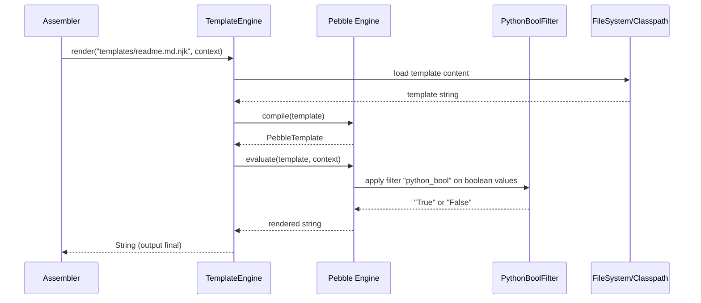
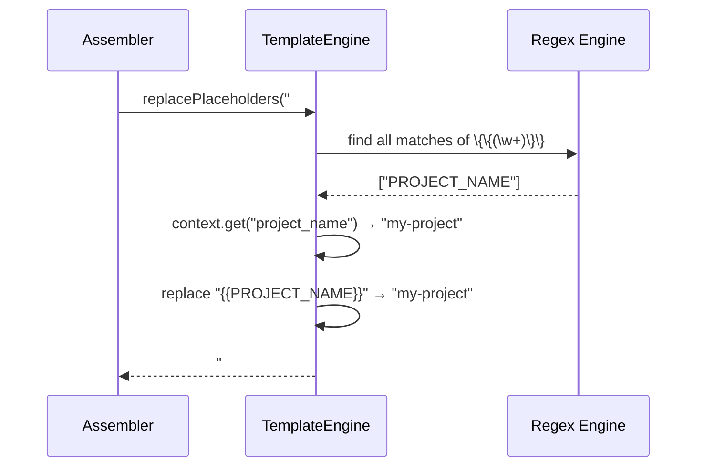

# Historia: Motor de Templates Pebble com Filtro Python-Bool

**ID:** story-0006-0006

## 1. Dependencias

| Blocked By | Blocks |
| :--- | :--- |
| story-0006-0002 | story-0006-0009 |

## 2. Regras Transversais Aplicaveis

| ID | Titulo |
| :--- | :--- |
| RULE-001 | Paridade Byte-a-Byte |
| RULE-002 | Formatacao Python-Bool |
| RULE-010 | Contexto de Template 25 Campos |

## 3. Descricao

Como **Desenvolvedor Java**, eu quero portar o modulo `template-engine.ts` para Java usando
Pebble Template Engine como wrapper, com custom filter para Python-bool, metodos de render
e substituicao de placeholders legacy, garantindo que o output gerado seja identico ao produzido
pelo Nunjucks do TypeScript para os mesmos templates e contexto.

O Pebble usa sintaxe Jinja2 nativamente (``, ``, `{{ variable }}`), o que
facilita a compatibilidade com os templates Nunjucks/Jinja2 existentes. O wrapper `TemplateEngine`
encapsula toda a configuracao do Pebble: autoescape desabilitado (markdown nao deve ser escaped),
strict mode para detectar variaveis ausentes, e o custom filter `python_bool` que converte
booleanos Java (`true`/`false`) para strings Python (`"True"`/`"False"`).

Alem do render de templates Jinja2, o engine precisa do metodo `replacePlaceholders()` para
substituicao de placeholders legacy `{{PLACEHOLDER}}` (uppercase com double braces) que existem
em alguns templates mais antigos do projeto. Esses placeholders NAO sao Jinja2 — sao simples
find-and-replace com chave uppercase no contexto.

### 3.1 TemplateEngine.java

- Constructor: recebe `Path` base para resolucao de templates (ou classpath loader)
- `render(Path templatePath, Map<String, Object> context)`: carrega template do filesystem ou classpath, renderiza com contexto, retorna String
- `renderString(String template, Map<String, Object> context)`: renderiza template inline (String) com contexto
- `replacePlaceholders(String content, Map<String, Object> context)`: substitui `{{KEY}}` por valor de `context.get(key.toLowerCase())`

### 3.2 Configuracao do Pebble

- `autoEscaping(false)` — templates geram Markdown, YAML, JSON — nao HTML
- `strictVariables(false)` — variaveis ausentes retornam string vazia (nao lancar erro)
- `newLineTrimming(false)` — preservar newlines exatamente como no template
- Registrar `PythonBoolFilter` como extension customizada
- Loader: `ClasspathLoader` para resources no JAR + `FileLoader` para filesystem

### 3.3 PythonBoolFilter.java

- Implementa `com.mitchellbosecke.pebble.extension.Filter`
- Nome do filtro: `python_bool`
- Comportamento: se input e `Boolean` true → retorna "True", se false → retorna "False"
- Se input nao e Boolean → retorna o proprio input inalterado
- Uso nos templates: `{{ domain_driven | python_bool }}`

### 3.4 replacePlaceholders()

- Regex: `\{\{(\w+)\}\}` para encontrar `{{PLACEHOLDER}}`
- Para cada match: buscar `context.get(placeholder.toLowerCase())`
- Se valor encontrado: substituir pelo valor (toString())
- Se valor nao encontrado: manter o placeholder original (nao remover)
- Nao confundir com sintaxe Jinja2 — este metodo opera em strings ja renderizadas ou em conteudo nao-Jinja2

### 3.5 Compatibilidade com Nunjucks

- O Pebble e compativel com a maioria da sintaxe Jinja2/Nunjucks
- `...` — condicional
- `...` — loop
- `{{ variable }}` — interpolacao
- `{{ variable | filter }}` — filtros
- Diferencas conhecidas que DEVEM ser tratadas: filtros customizados do Nunjucks que nao existem no Pebble (mapear ou reimplementar)

## 4. Definicoes de Qualidade Locais

### DoR Local (Definition of Ready)

- [ ] Modelos de dominio implementados (story-0006-0002 concluida)
- [ ] Templates Nunjucks/Jinja2 analisados para uso de filtros e tags
- [ ] Pebble Template Engine API estudada
- [ ] Lista de filtros customizados do Nunjucks identificados

### DoD Local (Definition of Done)

- [ ] TemplateEngine renderiza templates com variaveis simples corretamente
- [ ] PythonBoolFilter converte true→"True" e false→"False"
- [ ] replacePlaceholders substitui `{{KEY}}` por valores do contexto
- [ ] Autoescape desabilitado (output nao escaped)
- [ ] Condicionais (``) e loops (``) funcionam
- [ ] Template inexistente lanca excecao com caminho
- [ ] Output identico ao Nunjucks para templates de referencia

### Global Definition of Done (DoD)

- **Cobertura:** ≥ 95% Line Coverage, ≥ 90% Branch Coverage (JaCoCo)
- **Testes Automatizados:** Unitarios (JUnit 5 + AssertJ), integracao, golden file
- **Relatorio de Cobertura:** JaCoCo HTML + XML
- **Documentacao:** Javadoc em classes publicas
- **Performance:** Geracao completa < 2s
- **TDD Compliance:** Test-first, refactoring explicito, TPP incremental

## 5. Contratos de Dados (Data Contract)

**TemplateEngine API:**

| Metodo | Parametros | Retorno | Descricao |
| :--- | :--- | :--- | :--- |
| `render` | `Path templatePath, Map<String, Object> context` | `String` | Renderiza template de arquivo |
| `renderString` | `String template, Map<String, Object> context` | `String` | Renderiza template inline |
| `replacePlaceholders` | `String content, Map<String, Object> context` | `String` | Substitui `{{KEY}}` por valor |

**PythonBoolFilter:**

| Input | Output | Descricao |
| :--- | :--- | :--- |
| `true` (Boolean) | `"True"` | Python-style boolean true |
| `false` (Boolean) | `"False"` | Python-style boolean false |
| qualquer outro tipo | input inalterado | Passthrough para nao-booleanos |

**Configuracao Pebble:**

| Propriedade | Valor | Justificativa |
| :--- | :--- | :--- |
| `autoEscaping` | `false` | Templates geram Markdown/YAML, nao HTML |
| `strictVariables` | `false` | Variaveis ausentes retornam vazio |
| `newLineTrimming` | `false` | Preservar newlines do template |

## 6. Diagramas

### 6.1 Fluxo de Renderizacao de Template



### 6.2 Fluxo de replacePlaceholders



## 7. Criterios de Aceite (Gherkin)

```gherkin
Cenario: Render template com variaveis simples
  DADO que existe um template com conteudo "Hello {{ name }}, welcome to {{ project }}!"
  E o contexto contem name="World" e project="ia-dev-env"
  QUANDO renderString() e invocado
  ENTAO o resultado e "Hello World, welcome to ia-dev-env!"

Cenario: Python-bool filter converte true para "True" e false para "False"
  DADO que existe um template com conteudo "DDD: {{ ddd | python_bool }}, Events: {{ events | python_bool }}"
  E o contexto contem ddd=true e events=false
  QUANDO renderString() e invocado
  ENTAO o resultado e "DDD: True, Events: False"
  E NAO contem "true" ou "false" (lowercase Java-style)

Cenario: replacePlaceholders substitui {{LANGUAGE}} por valor do contexto
  DADO que existe conteudo "Stack: {{LANGUAGE_NAME}} {{LANGUAGE_VERSION}}"
  E o contexto contem language_name="java" e language_version="21"
  QUANDO replacePlaceholders() e invocado
  ENTAO o resultado e "Stack: java 21"
  E nenhum placeholder {{...}} permanece no resultado

Cenario: Template com condicionais renderiza corretamente
  DADO que existe um template com "REST API"
  E o contexto contem has_rest="True"
  QUANDO renderString() e invocado
  ENTAO o resultado contem "REST API"

Cenario: Template com loops renderiza corretamente
  DADO que existe um template com "{{ item }} "
  E o contexto contem items=["alpha", "beta", "gamma"]
  QUANDO renderString() e invocado
  ENTAO o resultado contem "alpha beta gamma"

Cenario: Template inexistente lanca excecao com caminho
  DADO que o template "templates/nonexistent.md.njk" nao existe no classpath nem no filesystem
  QUANDO render() e invocado com esse caminho
  ENTAO uma excecao e lancada
  E a mensagem contem o caminho "templates/nonexistent.md.njk"
```

### 7.1 Scenario Ordering (TPP)

> Scenarios seguem TPP: caso mais simples (variaveis simples) → filtro customizado (Python-bool) → placeholder legacy → condicional → loop → erro (template inexistente).

### 7.2 Mandatory Scenario Categories

- [x] Degenerate cases (template inexistente)
- [x] Happy path (variaveis simples, condicionais, loops)
- [x] Error paths (template nao encontrado com caminho na mensagem)
- [x] Boundary values (Python-bool filter, placeholder replacement)

### 7.3 TDD Implementation Notes

**Outer loop (acceptance):** Renderizar um template real do projeto (e.g., `templates/readme.md.njk`) com contexto de um dos 8 perfis e comparar com golden file do TypeScript.

**Inner loop (unit):**
1. `renderString()` com variavel simples — "Hello {{ name }}" → "Hello World"
2. `PythonBoolFilter` — true → "True", false → "False", string → string (passthrough)
3. `replacePlaceholders()` — "{{KEY}}" → valor do contexto
4. `renderString()` com `` — condicional
5. `renderString()` com `` — loop
6. `render()` com template inexistente — excecao com caminho

## 8. Sub-tarefas

- [ ] [Dev] TemplateEngine.java com constructor, render(), renderString()
- [ ] [Dev] PythonBoolFilter.java implementando Pebble Filter interface
- [ ] [Dev] Registrar PythonBoolFilter como extension no Pebble engine
- [ ] [Dev] Configuracao Pebble: autoEscaping off, strictVariables false, newLineTrimming false
- [ ] [Dev] ClasspathLoader + FileLoader para resolver templates
- [ ] [Dev] replacePlaceholders() com regex para `{{KEY}}`
- [ ] [Test] Unitario: renderString() com variaveis simples
- [ ] [Test] Unitario: PythonBoolFilter true→"True", false→"False", passthrough
- [ ] [Test] Unitario: replacePlaceholders() com chaves encontradas e nao encontradas
- [ ] [Test] Unitario: renderString() com condicionais 
- [ ] [Test] Unitario: renderString() com loops 
- [ ] [Test] Unitario: render() com template inexistente lanca excecao
- [ ] [Test] Integracao: renderizar template real com contexto e comparar com output esperado
- [ ] [Doc] Javadoc em TemplateEngine e PythonBoolFilter
