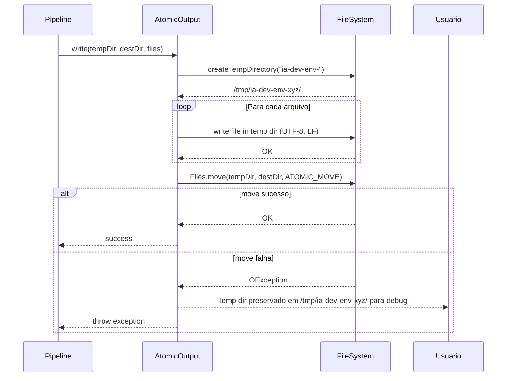
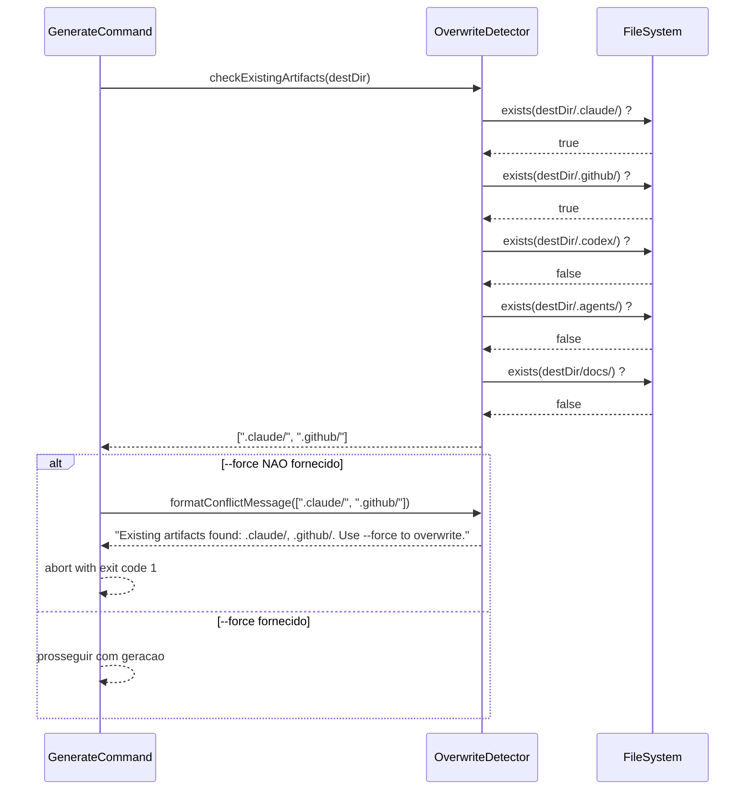

# Historia: Utilitarios de I/O, Seguranca de Caminhos e Output Atomico

**ID:** story-0006-0007

## 1. Dependencias

| Blocked By | Blocks |
| :--- | :--- |
| story-0006-0003 | story-0006-0009 |

## 2. Regras Transversais Aplicaveis

| ID | Titulo |
| :--- | :--- |
| RULE-008 | Output Atomico |
| RULE-009 | Compatibilidade Cross-Platform |
| RULE-011 | Rejeicao de Caminhos Perigosos |
| RULE-012 | Deteccao de Overwrite |

## 3. Descricao

Como **Desenvolvedor Java**, eu quero portar os modulos `utils.ts` e `overwrite-detector.ts`
para Java, implementando `PathUtils` para normalizacao e seguranca de caminhos, `AtomicOutput`
para escrita transacional de arquivos, e `OverwriteDetector` para deteccao de conflitos com
artefatos existentes, garantindo que a geracao de arquivos seja segura, atomica e cross-platform.

Esta historia implementa a camada de utilitarios de I/O que todas as demais stories de geracao
utilizam. O `PathUtils` protege contra escrita em diretorios perigosos (home, root, /usr, /etc,
/var, /bin, /sbin) — uma medida de seguranca critica ja que a ferramenta escreve centenas de
arquivos. O `AtomicOutput` garante que falhas parciais nao deixem o diretorio de destino em
estado inconsistente: escreve em diretorio temporario e depois move atomicamente. O
`OverwriteDetector` verifica se ja existem artefatos no destino antes de gerar, evitando
sobreescrita acidental.

Todos os utilitarios usam `java.nio.file.Path` exclusivamente (RULE-009) e NUNCA concatenam
strings com `/` ou `\\`. Line endings sao sempre LF (`\n`).

### 3.1 PathUtils.java

- `normalizeDirectory(String path)`: resolve caminhos relativos contra o diretorio atual, normaliza `..` e `.`, retorna `Path` absoluto
- `rejectDangerousPath(Path path)`: valida que o path nao e home dir (`~`, `$HOME`), root (`/`), ou diretorio de sistema (`/usr`, `/etc`, `/var`, `/bin`, `/sbin`). Lanca `CliException` com errorCode 1 e mensagem explicativa
- `validateDestPath(Path path)`: combina normalizeDirectory + rejectDangerousPath + verificacao de permissao de escrita
- Uso de `Path.toRealPath()` e `Path.normalize()` para resolver symlinks e caminhos relativos

### 3.2 AtomicOutput.java

- Logica de escrita transacional conforme RULE-008:
  1. Criar diretorio temporario via `Files.createTempDirectory("ia-dev-env-")`
  2. Escrever todos os arquivos no diretorio temporario
  3. Se todos os writes completarem com sucesso: `Files.move(tempDir, destDir, StandardCopyOption.ATOMIC_MOVE)`
  4. Em caso de falha: preservar o diretorio temporario e reportar o caminho ao usuario
- Metodo `write(Path tempDir, Path destDir, Map<String, String> files)`: recebe mapa de caminhos relativos → conteudo
- Cada arquivo escrito com encoding UTF-8 e line endings LF
- Criar subdiretorios necessarios dentro do temp dir automaticamente
- Se `ATOMIC_MOVE` nao suportado (cross-filesystem): fallback para copy + delete

### 3.3 OverwriteDetector.java

- `checkExistingArtifacts(Path destDir)`: verifica existencia de `.claude/`, `.github/`, `.codex/`, `.agents/`, `docs/` no diretorio destino
- Retorna `List<String>` com nomes dos diretorios encontrados
- `formatConflictMessage(List<String> conflicts)`: formata mensagem de erro listando conflitos e sugerindo `--force`
- Se lista vazia: sem conflitos, geracao pode prosseguir
- Se lista nao-vazia e `--force` nao fornecido: abortar com mensagem formatada

### 3.4 Rejeicao de Caminhos — Lista Completa

| Caminho | Razao |
| :--- | :--- |
| `~` / `$HOME` / `System.getProperty("user.home")` | Home directory — risco de sobrescrever configs pessoais |
| `/` | Root — risco catastrofico |
| `/usr` | Diretorio de sistema — programas do SO |
| `/etc` | Diretorio de sistema — configuracoes do SO |
| `/var` | Diretorio de sistema — dados variaveis |
| `/bin` | Diretorio de sistema — binarios essenciais |
| `/sbin` | Diretorio de sistema — binarios de admin |

### 3.5 Cross-Platform Considerations

- Usar `Path` em todo lugar, nunca String concatenation
- Separador de diretorio via `Path.resolve()`, nunca hardcoded `/`
- Line endings: sempre escrever `\n` (LF), nunca `\r\n` (CRLF)
- Encoding: sempre UTF-8 via `StandardCharsets.UTF_8`
- Temp directory: `Files.createTempDirectory()` usa diretorio temp do SO

## 4. Definicoes de Qualidade Locais

### DoR Local (Definition of Ready)

- [ ] Excecoes customizadas implementadas (story-0006-0003 concluida)
- [ ] Codigo TypeScript `utils.ts` e `overwrite-detector.ts` lido e funcionalidade mapeada
- [ ] `java.nio.file` API estudada (Files.move, StandardCopyOption.ATOMIC_MOVE)
- [ ] Lista de caminhos perigosos aprovada

### DoD Local (Definition of Done)

- [ ] PathUtils normaliza caminhos relativos corretamente
- [ ] PathUtils rejeita todos os caminhos perigosos listados com CliException
- [ ] AtomicOutput escreve em temp dir e move atomicamente
- [ ] AtomicOutput preserva temp dir em caso de falha e reporta caminho
- [ ] OverwriteDetector detecta .claude/, .github/, .codex/, .agents/, docs/
- [ ] OverwriteDetector formata mensagem de conflito com sugestao --force
- [ ] Todos os writes usam UTF-8 e LF
- [ ] Testes com filesystem real (nao mock) para AtomicOutput

### Global Definition of Done (DoD)

- **Cobertura:** ≥ 95% Line Coverage, ≥ 90% Branch Coverage (JaCoCo)
- **Testes Automatizados:** Unitarios (JUnit 5 + AssertJ), integracao, golden file
- **Relatorio de Cobertura:** JaCoCo HTML + XML
- **Documentacao:** Javadoc em classes publicas
- **Performance:** Geracao completa < 2s
- **TDD Compliance:** Test-first, refactoring explicito, TPP incremental

## 5. Contratos de Dados (Data Contract)

**PathUtils API:**

| Metodo | Parametro | Retorno | Excecoes |
| :--- | :--- | :--- | :--- |
| `normalizeDirectory` | `String path` | `Path` | — |
| `rejectDangerousPath` | `Path path` | `void` | `CliException(msg, 1)` |
| `validateDestPath` | `Path path` | `void` | `CliException(msg, 1)` |

**AtomicOutput API:**

| Metodo | Parametros | Retorno | Excecoes |
| :--- | :--- | :--- | :--- |
| `write` | `Path tempDir, Path destDir, Map<String, String> files` | `void` | `IOException`, `CliException` |

**OverwriteDetector API:**

| Metodo | Parametro | Retorno | Descricao |
| :--- | :--- | :--- | :--- |
| `checkExistingArtifacts` | `Path destDir` | `List<String>` | Nomes de diretorios existentes |
| `formatConflictMessage` | `List<String> conflicts` | `String` | Mensagem formatada com --force |

**CliException ErrorCodes (PathUtils):**

| errorCode | Contexto |
| :--- | :--- |
| 1 | Caminho perigoso rejeitado |
| 1 | Caminho invalido ou sem permissao de escrita |

## 6. Diagramas

### 6.1 Fluxo de Escrita Atomica



### 6.2 Fluxo de Deteccao de Overwrite



## 7. Criterios de Aceite (Gherkin)

```gherkin
Cenario: normalizeDirectory resolve caminhos relativos
  DADO que o diretorio atual e "/home/user/projects"
  QUANDO normalizeDirectory("./output") e invocado
  ENTAO o Path retornado e "/home/user/projects/output"
  E o Path e absoluto e normalizado (sem "." ou "..")

Cenario: rejectDangerousPath rejeita home directory
  DADO que o home directory do usuario e "/home/user"
  QUANDO rejectDangerousPath(Path.of("/home/user")) e invocado
  ENTAO CliException e lancada com errorCode 1
  E a mensagem contem "dangerous" ou "rejected"
  E a mensagem contem o caminho rejeitado

Cenario: rejectDangerousPath rejeita /usr
  DADO que o Path e "/usr"
  QUANDO rejectDangerousPath(Path.of("/usr")) e invocado
  ENTAO CliException e lancada com errorCode 1
  E a mensagem indica que "/usr" e um diretorio de sistema protegido

Cenario: AtomicOutput move arquivos com sucesso
  DADO que existe um mapa de arquivos com 3 entradas: "a.txt" → "content-a", "dir/b.txt" → "content-b", "c.md" → "content-c"
  E o diretorio destino nao existe
  QUANDO AtomicOutput.write() e invocado
  ENTAO os 3 arquivos existem no diretorio destino
  E o conteudo de cada arquivo corresponde ao esperado
  E o diretorio temporario foi removido apos o move
  E todos os arquivos estao em encoding UTF-8 com line endings LF

Cenario: AtomicOutput preserva temp dir em caso de falha
  DADO que existe um mapa de arquivos para escrita
  E o diretorio destino nao tem permissao de escrita (simulando falha no move)
  QUANDO AtomicOutput.write() e invocado
  ENTAO uma excecao e lancada
  E o diretorio temporario NAO foi removido
  E a mensagem da excecao contem o caminho do diretorio temporario

Cenario: OverwriteDetector detecta .claude/ existente
  DADO que o diretorio destino contem ".claude/" e ".github/"
  MAS nao contem ".codex/", ".agents/" ou "docs/"
  QUANDO checkExistingArtifacts() e invocado
  ENTAO a lista retornada contem ".claude/" e ".github/"
  E a lista NAO contem ".codex/", ".agents/" ou "docs/"

Cenario: OverwriteDetector retorna lista vazia quando nao ha conflitos
  DADO que o diretorio destino esta vazio (nao contem nenhum dos artefatos monitorados)
  QUANDO checkExistingArtifacts() e invocado
  ENTAO a lista retornada esta vazia
  E formatConflictMessage() com lista vazia retorna string vazia
```

### 7.1 Scenario Ordering (TPP)

> Scenarios seguem TPP: normalizacao simples → rejeicao de home → rejeicao de /usr → escrita atomica com sucesso → escrita atomica com falha → deteccao de conflito → sem conflitos.

### 7.2 Mandatory Scenario Categories

- [x] Degenerate cases (diretorio vazio sem conflitos, lista vazia)
- [x] Happy path (normalizacao, escrita atomica com sucesso, deteccao de conflito)
- [x] Error paths (rejeicao de caminhos perigosos, falha no atomic move)
- [x] Boundary values (preservacao de temp dir em falha, encoding UTF-8, LF line endings)

### 7.3 TDD Implementation Notes

**Outer loop (acceptance):** Testar fluxo completo: validar path → escrever atomicamente → verificar arquivos no destino. Testar deteccao de overwrite em diretorio com artefatos existentes.

**Inner loop (unit):**
1. `PathUtils.normalizeDirectory()` — caminho relativo → absoluto
2. `PathUtils.rejectDangerousPath()` — home dir → CliException
3. `PathUtils.rejectDangerousPath()` — /usr, /etc, /var, /bin, /sbin → CliException
4. `PathUtils.rejectDangerousPath()` — caminho valido → sem excecao
5. `OverwriteDetector.checkExistingArtifacts()` — diretorio com .claude/ → lista com ".claude/"
6. `OverwriteDetector.checkExistingArtifacts()` — diretorio vazio → lista vazia
7. `OverwriteDetector.formatConflictMessage()` — mensagem formatada com --force
8. `AtomicOutput.write()` — escrita com sucesso (integracao com filesystem real)
9. `AtomicOutput.write()` — falha preserva temp dir (integracao com filesystem real)

## 8. Sub-tarefas

- [ ] [Dev] PathUtils.java com normalizeDirectory(), rejectDangerousPath(), validateDestPath()
- [ ] [Dev] Lista de caminhos perigosos: home, root, /usr, /etc, /var, /bin, /sbin
- [ ] [Dev] AtomicOutput.java com write() usando temp dir + Files.move(ATOMIC_MOVE)
- [ ] [Dev] Logica de fallback quando ATOMIC_MOVE nao suportado (cross-filesystem)
- [ ] [Dev] Preservacao de temp dir em caso de falha com mensagem contendo caminho
- [ ] [Dev] OverwriteDetector.java com checkExistingArtifacts() e formatConflictMessage()
- [ ] [Dev] Verificacao dos 5 diretorios: .claude/, .github/, .codex/, .agents/, docs/
- [ ] [Test] Unitario: normalizeDirectory resolve caminhos relativos
- [ ] [Test] Unitario: rejectDangerousPath rejeita home, root, /usr, /etc, /var, /bin, /sbin
- [ ] [Test] Unitario: rejectDangerousPath aceita caminhos validos
- [ ] [Test] Unitario: OverwriteDetector com diretorios existentes
- [ ] [Test] Unitario: OverwriteDetector com diretorio vazio retorna lista vazia
- [ ] [Test] Unitario: formatConflictMessage com lista de conflitos e lista vazia
- [ ] [Test] Integracao: AtomicOutput.write() com filesystem real — sucesso
- [ ] [Test] Integracao: AtomicOutput.write() com falha — temp dir preservado
- [ ] [Test] Integracao: verificar encoding UTF-8 e line endings LF nos arquivos escritos
- [ ] [Doc] Javadoc em PathUtils, AtomicOutput, OverwriteDetector
