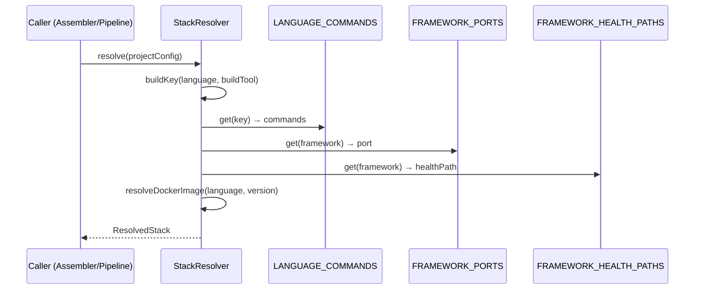
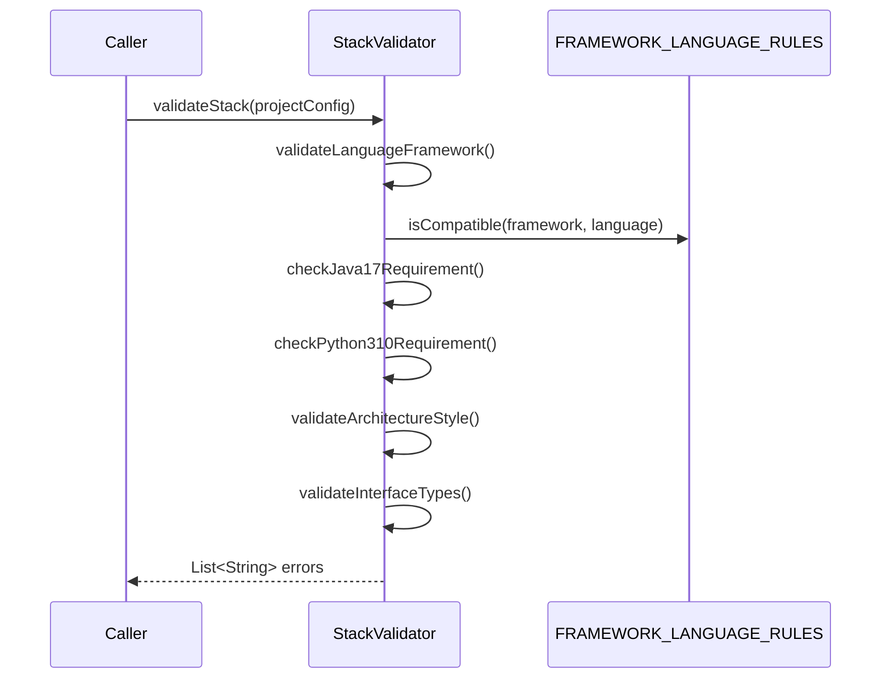

# Historia: Resolucao de Stack, Validacao e Mapeamentos de Dominio

**ID:** story-0006-0008

## 1. Dependencias

| Blocked By | Blocks |
| :--- | :--- |
| story-0006-0002, story-0006-0005 | story-0006-0010, story-0006-0011, story-0006-0012, story-0006-0013, story-0006-0014, story-0006-0015, story-0006-0016, story-0006-0017, story-0006-0018, story-0006-0019, story-0006-0020, story-0006-0022, story-0006-0027 |

## 2. Regras Transversais Aplicaveis

| ID | Titulo |
| :--- | :--- |
| RULE-003 | Factory Method fromMap() |
| RULE-007 | Zero Dependencia de Framework no Dominio |

## 3. Descricao

Como **Desenvolvedor Java**, eu quero portar os modulos de resolucao de stack, validacao e mapeamentos de dominio do TypeScript para Java 21, garantindo que toda a logica de resolucao de comandos, validacao de combinacoes language/framework e registros de knowledge packs esteja disponivel para os assemblers consumirem.

Esta historia porta 9 modulos TypeScript: `domain/resolver.ts`, `domain/validator.ts`, `domain/stack-mapping.ts`, `domain/version-resolver.ts`, `domain/skill-registry.ts`, `domain/core-kp-routing.ts`, `domain/pattern-mapping.ts`, `domain/protocol-mapping.ts`, `domain/stack-pack-mapping.ts`. Sao modulos puramente de dominio, sem dependencia de frameworks externos (RULE-007).

### 3.1 StackResolver

Responsavel por derivar todos os comandos e metadados de build/test a partir de um `ProjectConfig`. O metodo `resolve(ProjectConfig)` retorna um `ResolvedStack` contendo:

- `compileCmd` — comando de compilacao (ex: `mvn compile`, `npx tsc --noEmit`)
- `buildCmd` — comando de build (ex: `mvn package`, `npm run build`)
- `testCmd` — comando de teste (ex: `mvn test`, `npx vitest`)
- `coverageCmd` — comando de cobertura (ex: `mvn verify -Pcoverage`, `npx vitest --coverage`)
- `fileExtension` — extensao de arquivo fonte (ex: `.java`, `.ts`, `.py`)
- `buildFile` — arquivo de build (ex: `pom.xml`, `package.json`, `Cargo.toml`)
- `packageManager` — gerenciador de pacotes (ex: `maven`, `npm`, `pip`)
- `port` — porta padrao do framework (ex: 8080 para Quarkus, 3000 para NestJS)
- `healthPath` — endpoint de health check (ex: `/q/health`, `/health`)
- `dockerImage` — imagem Docker base (ex: `eclipse-temurin:21-jre-alpine`)

A resolucao usa as mappings `LANGUAGE_COMMANDS`, `FRAMEWORK_PORTS` e `FRAMEWORK_HEALTH_PATHS`.

### 3.2 StackValidator

Valida que a combinacao de language, framework, versao e arquitetura no `ProjectConfig` e consistente. Metodos:

- `validateLanguageFramework()` — verifica que o framework e compativel com a linguagem (ex: spring-boot requer java, fastapi requer python, nestjs requer typescript)
- `checkJava17Requirement()` — Quarkus 3+ e Spring Boot 3+ requerem Java 17+; se a versao configurada for inferior, retorna erro
- `checkPython310Requirement()` — FastAPI 0.100+ requer Python 3.10+
- `validateArchitectureStyle()` — aceita apenas `microservice`, `monolith`, `library`; rejeita qualquer outro valor
- `validateInterfaceTypes()` — valida que os tipos de interface sao conhecidos (rest, grpc, graphql, websocket, tcp, cli, events)

O metodo principal `validateStack(ProjectConfig)` executa todas as validacoes e retorna `List<String>` com erros encontrados (lista vazia = valido).

### 3.3 Mappings de Dominio

Estruturas de dados estaticas que mapeiam combinacoes de linguagem/framework para seus valores de stack:

- **LANGUAGE_COMMANDS** — 8 entradas: `java-maven`, `java-gradle`, `kotlin-gradle`, `typescript-npm`, `python-pip`, `go-go`, `rust-cargo`, `csharp-dotnet`. Cada entrada mapeia para compile/build/test/coverage commands.
- **FRAMEWORK_PORTS** — 11 entradas mapeando frameworks para portas padrao (ex: quarkus→8080, nestjs→3000, fastapi→8000, gin→8080, axum→3000).
- **FRAMEWORK_HEALTH_PATHS** — 11 entradas mapeando frameworks para paths de health check.
- **FRAMEWORK_LANGUAGE_RULES** — regras de validacao de quais linguagens sao compativeis com quais frameworks.

### 3.4 SkillRegistry e Core KP Routing

`SkillRegistry` contem a constante `CORE_KNOWLEDGE_PACKS` — a lista de knowledge packs que sao incluidos em qualquer geracao, independente do perfil: `coding-standards`, `architecture`, `testing`, `security`, `compliance`, `api-design`, `observability`, `resilience`, `infrastructure`, `protocols`, `story-planning`, `layer-templates`, `dockerfile`.

`CoreKpRouting` define o mapeamento de quais knowledge packs sao roteados para quais agents e skills.

### 3.5 PatternMapping, ProtocolMapping, StackPackMapping

- **PatternMapping** — mapeia architecture styles para categorias de patterns (architectural, microservice, resilience, integration, data).
- **ProtocolMapping** — mapeia interface types para protocolos (rest→REST/OpenAPI, grpc→gRPC/Proto3, graphql→GraphQL, websocket→WebSocket, events→event-driven).
- **StackPackMapping** — mapeia stacks para packs especificos de tecnologia.

### 3.6 VersionResolver

Resolve versoes de dependencias e ferramentas com base no stack configurado. Determina versoes minimas, recomendadas e imagens Docker.

## 4. Definicoes de Qualidade Locais

### DoR Local (Definition of Ready)

- [ ] Data classes de dominio implementadas (story-0006-0002 concluida)
- [ ] Carregador YAML funcional para carregar ProjectConfig (story-0006-0005 concluido)
- [ ] Codigo TypeScript equivalente lido e compreendido (resolver.ts, validator.ts, stack-mapping.ts, version-resolver.ts, skill-registry.ts, core-kp-routing.ts, pattern-mapping.ts, protocol-mapping.ts, stack-pack-mapping.ts)
- [ ] Todas as 8 entradas de LANGUAGE_COMMANDS documentadas e verificadas

### DoD Local (Definition of Done)

- [ ] StackResolver.resolve() retorna ResolvedStack completo para todos os 8 stacks
- [ ] StackValidator.validateStack() detecta todas as combinacoes invalidas
- [ ] LANGUAGE_COMMANDS contem exatamente 8 entradas com comandos corretos
- [ ] FRAMEWORK_PORTS contem exatamente 11 entradas
- [ ] FRAMEWORK_HEALTH_PATHS contem exatamente 11 entradas
- [ ] FRAMEWORK_LANGUAGE_RULES valida todas as combinacoes language/framework
- [ ] SkillRegistry.CORE_KNOWLEDGE_PACKS contem 13 packs
- [ ] PatternMapping, ProtocolMapping e StackPackMapping portados com paridade
- [ ] VersionResolver resolve versoes corretamente para cada stack
- [ ] Nenhuma classe importa frameworks externos (RULE-007)
- [ ] Todos os metodos publicos possuem Javadoc

### Global Definition of Done (DoD)

- **Cobertura:** ≥ 95% Line Coverage, ≥ 90% Branch Coverage (JaCoCo)
- **Testes Automatizados:** Unitarios (JUnit 5 + AssertJ), integracao, golden file
- **Relatorio de Cobertura:** JaCoCo HTML + XML
- **Documentacao:** Javadoc em classes publicas
- **Performance:** Geracao completa < 2s
- **TDD Compliance:** Test-first, refactoring explicito, TPP incremental

## 5. Contratos de Dados (Data Contract)

**StackResolver.resolve():**

| Campo | Formato | Request | Response | Origem / Regra |
| :--- | :--- | :--- | :--- | :--- |
| `config` | ProjectConfig | M | - | Echo — configuracao do projeto |
| `compileCmd` | String | - | M | Derive — LANGUAGE_COMMANDS[lang-buildtool].compile |
| `buildCmd` | String | - | M | Derive — LANGUAGE_COMMANDS[lang-buildtool].build |
| `testCmd` | String | - | M | Derive — LANGUAGE_COMMANDS[lang-buildtool].test |
| `coverageCmd` | String | - | M | Derive — LANGUAGE_COMMANDS[lang-buildtool].coverage |
| `fileExtension` | String | - | M | Derive — da linguagem (ex: `.java`, `.ts`) |
| `buildFile` | String | - | M | Derive — do build tool (ex: `pom.xml`, `package.json`) |
| `packageManager` | String | - | M | Derive — do build tool (ex: `maven`, `npm`) |
| `port` | int | - | M | Derive — FRAMEWORK_PORTS[framework] |
| `healthPath` | String | - | M | Derive — FRAMEWORK_HEALTH_PATHS[framework] |
| `dockerImage` | String | - | M | Derive — da linguagem e versao |

**StackValidator.validateStack():**

| Campo | Formato | Request | Response | Origem / Regra |
| :--- | :--- | :--- | :--- | :--- |
| `config` | ProjectConfig | M | - | Echo — configuracao do projeto |
| `errors` | List\<String\> | - | M | Derive — lista de erros (vazia = valido) |

**LANGUAGE_COMMANDS map keys:**

| Key | Language | Build Tool |
| :--- | :--- | :--- |
| `java-maven` | Java | Maven |
| `java-gradle` | Java | Gradle |
| `kotlin-gradle` | Kotlin | Gradle |
| `typescript-npm` | TypeScript | npm |
| `python-pip` | Python | pip |
| `go-go` | Go | go |
| `rust-cargo` | Rust | Cargo |
| `csharp-dotnet` | C# | dotnet |

## 6. Diagramas

### 6.1 Fluxo de Resolucao de Stack



### 6.2 Fluxo de Validacao de Stack



## 7. Criterios de Aceite (Gherkin)

```gherkin
Cenario: Resolver java-quarkus retorna todos os campos corretamente
  DADO que o ProjectConfig define language=java, framework=quarkus, buildTool=maven
  QUANDO StackResolver.resolve() e invocado
  ENTÃO ResolvedStack.compileCmd deve ser "mvn compile"
  E ResolvedStack.buildCmd deve ser "mvn package"
  E ResolvedStack.testCmd deve ser "mvn test"
  E ResolvedStack.coverageCmd deve conter "jacoco"
  E ResolvedStack.fileExtension deve ser ".java"
  E ResolvedStack.buildFile deve ser "pom.xml"
  E ResolvedStack.packageManager deve ser "maven"
  E ResolvedStack.port deve ser 8080
  E ResolvedStack.healthPath deve ser "/q/health"
  E ResolvedStack.dockerImage deve conter "eclipse-temurin"

Cenario: Resolver typescript-nestjs retorna porta 3000
  DADO que o ProjectConfig define language=typescript, framework=nestjs, buildTool=npm
  QUANDO StackResolver.resolve() e invocado
  ENTÃO ResolvedStack.port deve ser 3000
  E ResolvedStack.compileCmd deve conter "tsc"
  E ResolvedStack.fileExtension deve ser ".ts"
  E ResolvedStack.buildFile deve ser "package.json"
  E ResolvedStack.packageManager deve ser "npm"

Cenario: Validacao falha para spring-boot com python
  DADO que o ProjectConfig define language=python, framework=spring-boot
  QUANDO StackValidator.validateStack() e invocado
  ENTÃO a lista de erros NAO deve estar vazia
  E deve conter mensagem indicando que spring-boot requer java

Cenario: Validacao falha para Java 11 com Quarkus 3
  DADO que o ProjectConfig define language=java, version=11, framework=quarkus, frameworkVersion=3.0
  QUANDO StackValidator.validateStack() e invocado
  ENTÃO a lista de erros deve conter mensagem indicando que Quarkus 3+ requer Java 17+

Cenario: Validacao falha para Python 3.8 com FastAPI recente
  DADO que o ProjectConfig define language=python, version=3.8, framework=fastapi, frameworkVersion=0.100
  QUANDO StackValidator.validateStack() e invocado
  ENTÃO a lista de erros deve conter mensagem indicando que FastAPI 0.100+ requer Python 3.10+

Cenario: Validacao aceita architecture styles validos
  DADO que o ProjectConfig define architectureStyle como "microservice"
  QUANDO StackValidator.validateArchitectureStyle() e invocado
  ENTÃO a validacao passa sem erros
  E o mesmo ocorre para "monolith" e "library"

Cenario: Validacao rejeita architecture style invalido
  DADO que o ProjectConfig define architectureStyle como "serverless"
  QUANDO StackValidator.validateArchitectureStyle() e invocado
  ENTÃO a lista de erros deve conter mensagem indicando que "serverless" nao e um estilo valido
  E a mensagem deve listar os estilos aceitos: microservice, monolith, library

Cenario: SkillRegistry contem todos os core knowledge packs
  DADO que o SkillRegistry e consultado
  QUANDO CORE_KNOWLEDGE_PACKS e acessado
  ENTÃO deve conter exatamente 13 entries
  E deve incluir: coding-standards, architecture, testing, security, compliance, api-design, observability, resilience, infrastructure, protocols, story-planning, layer-templates, dockerfile
```

### 7.1 Scenario Ordering (TPP)

> Scenarios seguem TPP: caso mais simples (resolve single stack) → segundo stack (confirma generalidade) → validacao de erro simples (language/framework incompativel) → validacao com versao (Java 17) → validacao com versao (Python 3.10) → validacao positiva (styles aceitos) → validacao negativa (style invalido) → registro estatico (skill registry).

### 7.2 Mandatory Scenario Categories

- [x] Degenerate cases (resolve java-quarkus — caso basico completo)
- [x] Happy path (resolve typescript-nestjs, architecture styles validos)
- [x] Error paths (spring-boot+python, Java 11+Quarkus 3, Python 3.8+FastAPI)
- [x] Boundary values (architecture style invalido, skill registry exato com 13 entries)

### 7.3 TDD Implementation Notes

**Outer loop (acceptance):** Testes de aceitacao para resolve() de cada stack e validateStack() com configs invalidas. Cada cenario Gherkin mapeado para um teste JUnit 5 parametrizado.

**Inner loop (unit):**
1. `ResolvedStack` — value object com todos os campos
2. `LANGUAGE_COMMANDS` — map estatico com 8 entradas, testado entry-by-entry
3. `FRAMEWORK_PORTS` — map estatico com 11 entradas
4. `FRAMEWORK_HEALTH_PATHS` — map estatico com 11 entradas
5. `StackValidator` — cada metodo de validacao testado isoladamente
6. `SkillRegistry` — constante verificada por tamanho e conteudo

## 8. Sub-tarefas

- [ ] [Dev] Implementar `StackResolver.java` com metodo `resolve(ProjectConfig): ResolvedStack`
- [ ] [Dev] Implementar `ResolvedStack.java` como record/value object imutavel
- [ ] [Dev] Implementar `StackValidator.java` com metodos validateLanguageFramework(), checkJava17Requirement(), checkPython310Requirement(), validateArchitectureStyle(), validateInterfaceTypes()
- [ ] [Dev] Implementar `StackMapping.java` com constantes LANGUAGE_COMMANDS (8 entradas), FRAMEWORK_PORTS (11 entradas), FRAMEWORK_HEALTH_PATHS (11 entradas), FRAMEWORK_LANGUAGE_RULES
- [ ] [Dev] Implementar `VersionResolver.java` com resolucao de versoes e imagens Docker
- [ ] [Dev] Implementar `SkillRegistry.java` com CORE_KNOWLEDGE_PACKS + `CoreKpRouting.java` com roteamento de KPs
- [ ] [Dev] Implementar `PatternMapping.java` + `ProtocolMapping.java` + `StackPackMapping.java`
- [ ] [Test] Unitario: StackResolver.resolve() para cada um dos 8 stacks (parametrizado)
- [ ] [Test] Unitario: StackValidator — cada validacao com caso valido e invalido
- [ ] [Test] Unitario: mappings — verificar tamanho, chaves e valores de LANGUAGE_COMMANDS, FRAMEWORK_PORTS, FRAMEWORK_HEALTH_PATHS
