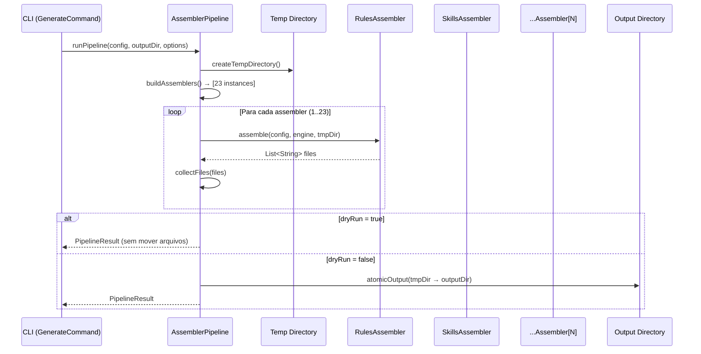
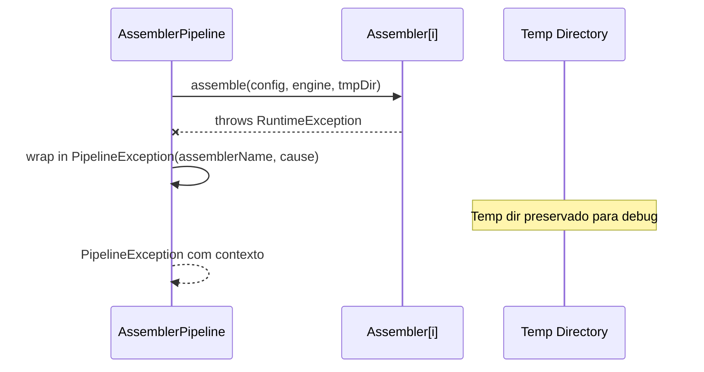

# Historia: Interface Assembler, Pipeline Orquestrador e Helpers

**ID:** story-0006-0009

## 1. Dependencias

| Blocked By | Blocks |
| :--- | :--- |
| story-0006-0002, story-0006-0006, story-0006-0007 | story-0006-0010, story-0006-0011, story-0006-0012, story-0006-0013, story-0006-0014, story-0006-0015, story-0006-0016, story-0006-0017, story-0006-0018, story-0006-0019, story-0006-0020, story-0006-0021, story-0006-0027 |

## 2. Regras Transversais Aplicaveis

| ID | Titulo |
| :--- | :--- |
| RULE-004 | Interface Assembler Uniforme |
| RULE-005 | Ordem de Execucao Pipeline |
| RULE-008 | Output Atomico |

## 3. Descricao

Como **Desenvolvedor Java**, eu quero portar a interface Assembler, o pipeline orquestrador e os helpers de copia/consolidacao do TypeScript para Java 21, estabelecendo a infraestrutura central que todos os 23 assemblers utilizarao para gerar artefatos.

Esta historia porta 5 modulos TypeScript: `assembler/pipeline.ts`, `assembler/index.ts`, `assembler/copy-helpers.ts`, `assembler/consolidator.ts`, `assembler/conditions.ts`. Define o contrato padronizado (RULE-004), a ordem de execucao (RULE-005) e o mecanismo de output atomico (RULE-008).

### 3.1 Interface Assembler (RULE-004)

Contrato uniforme que todo assembler DEVE implementar:

```java
public interface Assembler {
    List<String> assemble(ProjectConfig config, TemplateEngine engine, Path outputDir);
}
```

- Recebe `ProjectConfig` (dados do projeto), `TemplateEngine` (motor de templates Pebble) e `Path` (diretorio de output)
- Retorna `List<String>` com caminhos absolutos dos arquivos gerados
- Assemblers NAO podem ter efeitos colaterais alem da escrita de arquivos no `outputDir`
- Cada assembler e responsavel por criar seus subdiretorios conforme necessario

### 3.2 AssemblerPipeline (RULE-005)

Orquestrador que executa os 23 assemblers na ordem fixa definida em RULE-005:

1. `buildAssemblers()` — instancia os 23 assemblers na ordem correta:
   Rules → Skills → Agents → Patterns → Protocols → Hooks → Settings → GithubInstructions → GithubMcp → GithubSkills → GithubAgents → GithubHooks → GithubPrompts → Docs → GrpcDocs → Runbook → CodexAgentsMd → CodexConfig → CodexSkills → DocsAdr → Cicd → EpicReport → Readme

2. `executeAssemblers()` — loop sequencial que invoca `assemble()` em cada assembler, coletando os arquivos gerados e tratando excecoes

3. `runPipeline(config, outputDir, options)` — metodo principal que:
   - Cria diretorio temporario (RULE-008)
   - Executa assemblers no temp dir
   - Se `dryRun=true`, retorna resultado sem mover arquivos
   - Se `dryRun=false`, move atomicamente para destino final
   - Retorna `PipelineResult` com lista de arquivos, contagem e status

4. `atomicOutput()` — usa `Files.move()` com `ATOMIC_MOVE` para mover o diretorio temporario para o destino final. Em caso de falha, preserva o temp dir para debug.

### 3.3 PipelineOptions

Value object com opcoes de execucao do pipeline:

- `dryRun` (boolean) — se true, nao escreve arquivos no destino final
- `force` (boolean) — se true, permite sobrescrever artefatos existentes
- `verbose` (boolean) — se true, emite logs detalhados
- `resourcesDir` (Path) — diretorio de resources/templates (auto-resolved se null)

### 3.4 CopyHelpers

Utilitarios para copiar templates com rendering de variaveis:

- `copyTemplateWithRendering(engine, templatePath, context, outputPath)` — le template, renderiza com contexto, escreve no output
- `copyStaticFile(sourcePath, outputPath)` — copia arquivo sem rendering
- `copyDirectory(sourceDir, outputDir)` — copia diretorio recursivamente
- `ensureDirectory(path)` — cria diretorio e pais se nao existirem

### 3.5 Consolidator

Consolida outputs de multiplos assemblers, gerando resumos e estatisticas do que foi gerado. Produz a lista final de arquivos e contagens por categoria.

### 3.6 ConditionEvaluator

Avalia feature gates para decidir quais assemblers/artefatos devem ser incluidos:

- `hasFeature(config, featureName)` — verifica se o projeto possui uma feature
- `hasInterface(config, interfaceType)` — verifica se o projeto possui um tipo de interface
- `hasDatabase(config)` — atalho para verificar presenca de database
- `hasCache(config)` — atalho para verificar presenca de cache
- `evaluate(config, condition)` — avalia uma condicao generica

### 3.7 Target Directories

Mapeamento de targets logicos para diretorios fisicos:

| Target | Diretorio Fisico |
| :--- | :--- |
| `root` | `outputDir` |
| `claude` | `outputDir/.claude` |
| `github` | `outputDir/.github` |
| `codex` | `outputDir/.codex` |
| `codex-agents` | `outputDir/.agents` |
| `docs` | `outputDir/docs` |

## 4. Definicoes de Qualidade Locais

### DoR Local (Definition of Ready)

- [ ] Data classes de dominio implementadas (story-0006-0002 concluida)
- [ ] Motor de templates Pebble funcional (story-0006-0006 concluido)
- [ ] Utilitarios de I/O e output atomico implementados (story-0006-0007 concluido)
- [ ] Codigo TypeScript equivalente lido e compreendido (pipeline.ts, index.ts, copy-helpers.ts, consolidator.ts, conditions.ts)
- [ ] Ordem dos 23 assemblers confirmada conforme RULE-005

### DoD Local (Definition of Done)

- [ ] Interface Assembler definida com contrato assemble(ProjectConfig, TemplateEngine, Path): List<String>
- [ ] AssemblerPipeline instancia 23 assemblers na ordem RULE-005
- [ ] Pipeline executa loop sequencial sem pular assemblers
- [ ] Modo dry-run retorna resultado sem escrever arquivos
- [ ] Modo real usa output atomico (RULE-008)
- [ ] CopyHelpers copia e renderiza templates corretamente
- [ ] ConditionEvaluator avalia feature gates
- [ ] PipelineResult contem lista de arquivos, contagem e status
- [ ] Excecao em um assembler resulta em PipelineException com contexto
- [ ] Todos os metodos publicos possuem Javadoc

### Global Definition of Done (DoD)

- **Cobertura:** ≥ 95% Line Coverage, ≥ 90% Branch Coverage (JaCoCo)
- **Testes Automatizados:** Unitarios (JUnit 5 + AssertJ), integracao, golden file
- **Relatorio de Cobertura:** JaCoCo HTML + XML
- **Documentacao:** Javadoc em classes publicas
- **Performance:** Geracao completa < 2s
- **TDD Compliance:** Test-first, refactoring explicito, TPP incremental

## 5. Contratos de Dados (Data Contract)

**Assembler interface:**

| Campo | Formato | Request | Response | Origem / Regra |
| :--- | :--- | :--- | :--- | :--- |
| `config` | ProjectConfig | M | - | Echo — configuracao do projeto |
| `engine` | TemplateEngine | M | - | Echo — motor de templates Pebble |
| `outputDir` | Path | M | - | Echo — diretorio de output |
| `generatedFiles` | List\<String\> | - | M | Derive — caminhos dos arquivos gerados |

**AssemblerPipeline.runPipeline():**

| Campo | Formato | Request | Response | Origem / Regra |
| :--- | :--- | :--- | :--- | :--- |
| `config` | ProjectConfig | M | - | Echo — configuracao do projeto |
| `outputDir` | Path | M | - | Echo — diretorio destino final |
| `options` | PipelineOptions | M | - | Echo — opcoes de execucao |
| `result` | PipelineResult | - | M | Derive — resultado da execucao |

**PipelineOptions:**

| Campo | Tipo | Default | Descricao |
| :--- | :--- | :--- | :--- |
| `dryRun` | boolean | false | Nao escreve arquivos no destino |
| `force` | boolean | false | Permite sobrescrever artefatos existentes |
| `verbose` | boolean | false | Logs detalhados |
| `resourcesDir` | Path | null (auto) | Diretorio de resources/templates |

**PipelineResult:**

| Campo | Tipo | Descricao |
| :--- | :--- | :--- |
| `generatedFiles` | List\<String\> | Caminhos de todos os arquivos gerados |
| `fileCount` | int | Total de arquivos gerados |
| `assemblerResults` | Map\<String, List\<String\>\> | Arquivos por assembler |
| `success` | boolean | True se todos os assemblers completaram |
| `durationMs` | long | Tempo total de execucao em milissegundos |

## 6. Diagramas

### 6.1 Fluxo do Pipeline



### 6.2 Tratamento de Erro no Pipeline



## 7. Criterios de Aceite (Gherkin)

```gherkin
Cenario: Pipeline executa 23 assemblers na ordem correta
  DADO que o AssemblerPipeline e configurado com um ProjectConfig valido
  QUANDO runPipeline() e invocado
  ENTÃO 23 assemblers devem ser executados
  E a ordem de execucao deve ser: Rules, Skills, Agents, Patterns, Protocols, Hooks, Settings, GithubInstructions, GithubMcp, GithubSkills, GithubAgents, GithubHooks, GithubPrompts, Docs, GrpcDocs, Runbook, CodexAgentsMd, CodexConfig, CodexSkills, DocsAdr, Cicd, EpicReport, Readme

Cenario: Dry-run nao escreve arquivos no destino
  DADO que PipelineOptions.dryRun e true
  QUANDO runPipeline() e invocado
  ENTÃO PipelineResult deve conter a lista de arquivos que seriam gerados
  MAS o diretorio de output NAO deve conter nenhum arquivo novo
  E PipelineResult.success deve ser true

Cenario: Pipeline retorna PipelineResult com sucesso
  DADO que todos os assemblers completam sem erro
  QUANDO runPipeline() e invocado com dryRun=false
  ENTÃO PipelineResult.success deve ser true
  E PipelineResult.fileCount deve ser maior que zero
  E PipelineResult.generatedFiles deve conter os caminhos dos arquivos
  E PipelineResult.durationMs deve ser maior que zero

Cenario: Assembler falha e pipeline lanca PipelineException com contexto
  DADO que um assembler lanca RuntimeException durante assemble()
  QUANDO runPipeline() e invocado
  ENTÃO uma PipelineException deve ser lancada
  E a excecao deve conter o nome do assembler que falhou
  E a excecao deve conter a causa original
  E o diretorio temporario deve ser preservado para debug

Cenario: AtomicOutput move diretorio temporario para destino final
  DADO que o pipeline completou a geracao em diretorio temporario
  QUANDO atomicOutput() e invocado
  ENTÃO os arquivos sao movidos para o diretorio de output final
  E o diretorio temporario e removido apos o move

Cenario: CopyHelpers copia e renderiza template corretamente
  DADO que um template contem variaveis {{ project_name }} e {{ language_name }}
  E o contexto define project_name="my-app" e language_name="java"
  QUANDO copyTemplateWithRendering() e invocado
  ENTÃO o arquivo de output deve conter "my-app" e "java" nos locais corretos
  E as variaveis de template devem ter sido substituidas

Cenario: ConditionEvaluator avalia feature gate corretamente
  DADO que o ProjectConfig define interfaces=["rest", "grpc"] e database="postgresql"
  QUANDO ConditionEvaluator.hasInterface(config, "rest") e invocado
  ENTÃO deve retornar true
  E hasInterface(config, "graphql") deve retornar false
  E hasDatabase(config) deve retornar true
  E hasCache(config) deve retornar false
```

### 7.1 Scenario Ordering (TPP)

> Scenarios seguem TPP: caso basico (23 assemblers na ordem) → caso sem efeito colateral (dry-run) → happy path completo (result com sucesso) → error path (assembler falha) → mecanismo interno (atomic output) → helper (copy+render) → helper (condition evaluator).

### 7.2 Mandatory Scenario Categories

- [x] Degenerate cases (pipeline executa todos os assemblers na ordem)
- [x] Happy path (pipeline com sucesso, dry-run, copy helpers)
- [x] Error paths (assembler falha com PipelineException)
- [x] Boundary values (atomic output, condition evaluator com diferentes features)

### 7.3 TDD Implementation Notes

**Outer loop (acceptance):** Testes de aceitacao para runPipeline() com assemblers mock que verificam ordem de chamada e coleta de resultados. Teste de dry-run verificando que nenhum arquivo e escrito.

**Inner loop (unit):**
1. `Assembler` interface — compilacao do contrato
2. `buildAssemblers()` — verifica 23 instancias na ordem correta
3. `executeAssemblers()` — mock assemblers, verifica chamada sequencial
4. `PipelineResult` — value object com todos os campos
5. `CopyHelpers.copyTemplateWithRendering()` — template simples → rendered output
6. `ConditionEvaluator` — cada metodo testado com config positiva e negativa
7. `atomicOutput()` — temp dir movido para destino

## 8. Sub-tarefas

- [ ] [Dev] Definir interface `Assembler` com metodo `assemble(ProjectConfig, TemplateEngine, Path): List<String>`
- [ ] [Dev] Implementar `AssemblerPipeline.java` com buildAssemblers(), executeAssemblers(), runPipeline()
- [ ] [Dev] Implementar `PipelineOptions.java` como record imutavel
- [ ] [Dev] Implementar `PipelineResult.java` como record imutavel
- [ ] [Dev] Implementar `CopyHelpers.java` com copyTemplateWithRendering(), copyStaticFile(), copyDirectory(), ensureDirectory()
- [ ] [Dev] Implementar `Consolidator.java` para consolidacao de outputs e estatisticas
- [ ] [Dev] Implementar `ConditionEvaluator.java` com hasFeature(), hasInterface(), hasDatabase(), hasCache(), evaluate()
- [ ] [Test] Unitario: pipeline ordering — verificar que buildAssemblers() retorna 23 instancias na ordem RULE-005
- [ ] [Test] Unitario: dry-run — verificar que nenhum arquivo e escrito no destino
- [ ] [Test] Unitario: CopyHelpers — template com variaveis renderizado corretamente
- [ ] [Test] Unitario: ConditionEvaluator — cada feature gate testado com configs positiva e negativa
