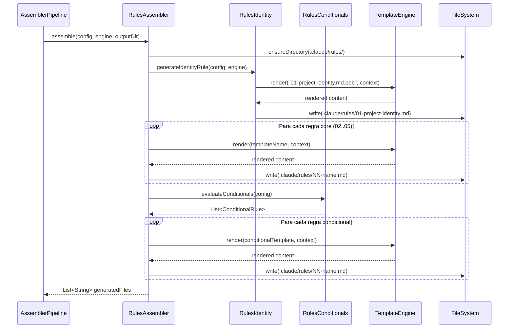

# Historia: RulesAssembler — Regras Core e Condicionais

**ID:** story-0006-0010

## 1. Dependencias

| Blocked By | Blocks |
| :--- | :--- |
| story-0006-0008, story-0006-0009 | story-0006-0027 |

## 2. Regras Transversais Aplicaveis

| ID | Titulo |
| :--- | :--- |
| RULE-001 | Paridade Byte-a-Byte |
| RULE-004 | Interface Assembler Uniforme |
| RULE-005 | Ordem de Execucao Pipeline |

## 3. Descricao

Como **Desenvolvedor Java**, eu quero portar o RulesAssembler do TypeScript para Java 21, garantindo que as 5 regras core e as regras condicionais sejam geradas identicamente ao output TypeScript, para que projetos gerados tenham as mesmas regras de codificacao e arquitetura.

Esta historia porta 3 modulos TypeScript: `rules-assembler.ts`, `rules-identity.ts`, `rules-conditionals.ts`. O RulesAssembler e o primeiro assembler executado no pipeline (posicao 1 de 23, conforme RULE-005) e gera os arquivos em `.claude/rules/`.

### 3.1 Regras Core (Sempre Geradas)

O RulesAssembler SEMPRE gera 5 regras core, independente da configuracao do projeto:

1. **01-project-identity.md** — Renderizado com dados do ProjectConfig: nome do projeto, linguagem, framework, arquitetura, stack completo. Usa template Pebble com variaveis como `{{ project_name }}`, `{{ language_name }}`, `{{ framework_name }}`, `{{ architecture_style }}`.

2. **02-domain.md** — Template de dominio com placeholders para o usuario preencher: entities, value objects, aggregates, business rules, state machines, glossario.

3. **03-coding-standards.md** — Regras de coding standards: limites de metodo (25 linhas), classe (250 linhas), parametros (4), SOLID, error handling, forbidden patterns.

4. **04-architecture-summary.md** — Resumo da arquitetura: dependency direction, package structure, layer rules. Renderizado com `{{ architecture_style }}`.

5. **05-quality-gates.md** — Quality gates: cobertura minima (95% line, 90% branch), categorias de teste, naming, merge checklist.

### 3.2 RulesIdentity

Modulo especializado que gera a regra `01-project-identity.md`. Constroi o contexto de template com todos os dados do projeto:

- Nome, proposito, arquitetura
- Stack completo (linguagem, versao, framework, build tool)
- Interfaces (REST, gRPC, etc.)
- Database, cache, message broker
- Configuracoes de observabilidade, resiliencia, containers

### 3.3 RulesConditionals

Modulo que avalia condicoes do ProjectConfig e adiciona regras extras alem das 5 core:

- **Database present:** adiciona regra com convencoes de acesso a dados, migrations, connection pooling
- **Cache present:** adiciona regra com convencoes de cache (TTL, invalidacao, serialization)
- **Security frameworks:** adiciona regra com convencoes de seguranca (autenticacao, autorizacao, CORS)
- **Observability enabled:** adiciona regra com convencoes de observabilidade (metricas, tracing, logging)

Cada regra condicional e numerada a partir de 06 (ex: `06-database-conventions.md`, `07-cache-conventions.md`).

### 3.4 Output

Todos os arquivos sao gerados em `.claude/rules/`:

```
.claude/rules/
├── 01-project-identity.md     (sempre)
├── 02-domain.md               (sempre)
├── 03-coding-standards.md     (sempre)
├── 04-architecture-summary.md (sempre)
├── 05-quality-gates.md        (sempre)
├── 06-database-conventions.md (condicional: database != none)
├── 07-cache-conventions.md    (condicional: cache != none)
└── ...                        (outras condicionais)
```

## 4. Definicoes de Qualidade Locais

### DoR Local (Definition of Ready)

- [ ] StackResolver e StackValidator funcionais (story-0006-0008 concluida)
- [ ] Interface Assembler e Pipeline funcionais (story-0006-0009 concluida)
- [ ] Templates Pebble para rules disponíveis no classpath
- [ ] Golden files do TypeScript para regras disponíveis como referencia
- [ ] Codigo TypeScript equivalente lido (rules-assembler.ts, rules-identity.ts, rules-conditionals.ts)

### DoD Local (Definition of Done)

- [ ] RulesAssembler implementa interface Assembler (RULE-004)
- [ ] 5 regras core geradas para qualquer ProjectConfig valido
- [ ] 01-project-identity.md contem nome, linguagem, framework e arquitetura do projeto
- [ ] Regras condicionais adicionadas quando feature correspondente esta presente
- [ ] Regras condicionais NAO geradas quando feature ausente
- [ ] Output identico ao golden file para java-quarkus profile (RULE-001)
- [ ] Templates renderizados sem variaveis nao-resolvidas
- [ ] Todos os metodos publicos possuem Javadoc

### Global Definition of Done (DoD)

- **Cobertura:** ≥ 95% Line Coverage, ≥ 90% Branch Coverage (JaCoCo)
- **Testes Automatizados:** Unitarios (JUnit 5 + AssertJ), integracao, golden file
- **Relatorio de Cobertura:** JaCoCo HTML + XML
- **Documentacao:** Javadoc em classes publicas
- **Performance:** Geracao completa < 2s
- **TDD Compliance:** Test-first, refactoring explicito, TPP incremental

## 5. Contratos de Dados (Data Contract)

**RulesAssembler.assemble():**

| Campo | Formato | Request | Response | Origem / Regra |
| :--- | :--- | :--- | :--- | :--- |
| `config` | ProjectConfig | M | - | Echo — configuracao do projeto |
| `engine` | TemplateEngine | M | - | Echo — motor Pebble |
| `outputDir` | Path | M | - | Echo — diretorio de output |
| `generatedFiles` | List\<String\> | - | M | Derive — caminhos dos arquivos gerados |

**Output files (core):**

| Arquivo | Template | Renderizado |
| :--- | :--- | :--- |
| `.claude/rules/01-project-identity.md` | `rules/01-project-identity.md.peb` | Sim — dados do ProjectConfig |
| `.claude/rules/02-domain.md` | `rules/02-domain.md.peb` | Sim — placeholders de dominio |
| `.claude/rules/03-coding-standards.md` | `rules/03-coding-standards.md.peb` | Sim — language-specific |
| `.claude/rules/04-architecture-summary.md` | `rules/04-architecture-summary.md.peb` | Sim — architecture style |
| `.claude/rules/05-quality-gates.md` | `rules/05-quality-gates.md.peb` | Sim — thresholds |

**Contexto de Template (01-project-identity):**

| Variavel | Tipo | Origem |
| :--- | :--- | :--- |
| `project_name` | String | config.projectName |
| `project_purpose` | String | config.projectPurpose |
| `language_name` | String | config.language.name |
| `language_version` | String | config.language.version |
| `framework_name` | String | config.framework.name |
| `architecture_style` | String | config.architectureStyle |
| `build_tool` | String | config.buildTool |
| `database_type` | String | config.database.type |
| `interfaces` | List\<String\> | config.interfaces |

## 6. Diagramas

### 6.1 Fluxo do RulesAssembler



## 7. Criterios de Aceite (Gherkin)

```gherkin
Cenario: Gera 5 regras core para configuracao minima
  DADO que o ProjectConfig contem apenas campos obrigatorios (nome, linguagem, framework)
  QUANDO RulesAssembler.assemble() e invocado
  ENTÃO 5 arquivos devem ser gerados em .claude/rules/
  E os arquivos devem ser: 01-project-identity.md, 02-domain.md, 03-coding-standards.md, 04-architecture-summary.md, 05-quality-gates.md

Cenario: 01-project-identity contem nome e stack do projeto
  DADO que o ProjectConfig define projectName="my-api", language=java, framework=spring-boot, architectureStyle=microservice
  QUANDO RulesAssembler.assemble() e invocado
  ENTÃO .claude/rules/01-project-identity.md deve conter "my-api"
  E deve conter "java" como linguagem
  E deve conter "spring-boot" como framework
  E deve conter "microservice" como architecture style

Cenario: Configuracao com database adiciona regra condicional de DB
  DADO que o ProjectConfig define database.type="postgresql"
  QUANDO RulesAssembler.assemble() e invocado
  ENTÃO alem das 5 regras core, deve existir uma regra condicional de database
  E o total de arquivos gerados deve ser maior que 5

Cenario: Configuracao sem database nao gera regra de DB
  DADO que o ProjectConfig define database.type="none" ou database ausente
  QUANDO RulesAssembler.assemble() e invocado
  ENTÃO exatamente 5 regras core devem ser geradas
  E NENHUM arquivo com "database" no nome deve existir em .claude/rules/

Cenario: Output identico ao golden file para java-quarkus profile
  DADO que o ProjectConfig e carregado do setup-config.java-quarkus.yaml
  QUANDO RulesAssembler.assemble() e invocado
  ENTÃO cada arquivo gerado em .claude/rules/ deve ser byte-a-byte identico ao golden file correspondente do perfil java-quarkus
```

### 7.1 Scenario Ordering (TPP)

> Scenarios seguem TPP: caso degenerado (5 regras core minimas) → verificacao de conteudo (identity com dados) → condicional positiva (database presente) → condicional negativa (database ausente) → paridade total (golden file).

### 7.2 Mandatory Scenario Categories

- [x] Degenerate cases (5 regras core com config minima)
- [x] Happy path (identity com dados corretos, condicional com database)
- [x] Error paths (config sem database nao gera regra extra)
- [x] Boundary values (golden file byte-a-byte para java-quarkus)

### 7.3 TDD Implementation Notes

**Outer loop (acceptance):** Teste de golden file comparando output gerado com referencia do TypeScript para o perfil java-quarkus. Cada arquivo comparado byte-a-byte.

**Inner loop (unit):**
1. `RulesAssembler.assemble()` — verifica que 5 arquivos sao gerados com nomes corretos
2. `RulesIdentity` — verifica que variaveis de template sao substituidas no 01-project-identity.md
3. `RulesConditionals.evaluateConditionals()` — config com database retorna regra extra; config sem database retorna lista vazia
4. Template rendering — variaveis `{{ project_name }}`, `{{ language_name }}` substituidas corretamente

## 8. Sub-tarefas

- [ ] [Dev] Implementar `RulesAssembler.java` implementando interface Assembler
- [ ] [Dev] Implementar `RulesIdentity.java` para geracao de 01-project-identity.md
- [ ] [Dev] Implementar `RulesConditionals.java` para avaliacao de condicoes e geracao de regras extras
- [ ] [Test] Unitario: RulesAssembler — gera 5 arquivos core com nomes corretos
- [ ] [Test] Unitario: RulesIdentity — 01-project-identity.md contem dados do ProjectConfig
- [ ] [Test] Unitario: RulesConditionals — config com database gera regra extra; config sem database nao gera
- [ ] [Test] Golden file: comparacao byte-a-byte de .claude/rules/ para perfil java-quarkus
