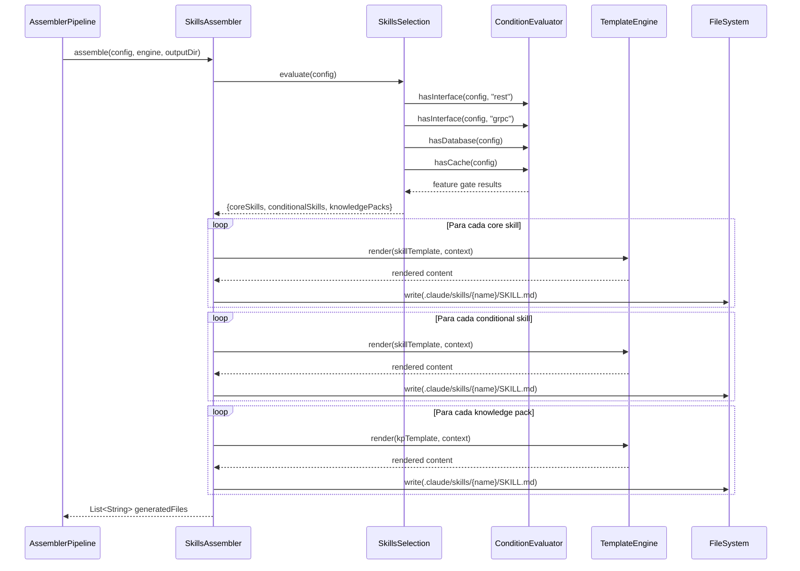

# Historia: SkillsAssembler — Skills Core, Condicionais e Knowledge Packs

**ID:** story-0006-0011

## 1. Dependencias

| Blocked By | Blocks |
| :--- | :--- |
| story-0006-0008, story-0006-0009 | story-0006-0027 |

## 2. Regras Transversais Aplicaveis

| ID | Titulo |
| :--- | :--- |
| RULE-001 | Paridade Byte-a-Byte |
| RULE-004 | Interface Assembler Uniforme |
| RULE-005 | Ordem de Execucao Pipeline |

## 3. Descricao

Como **Desenvolvedor Java**, eu quero portar o SkillsAssembler e o SkillsSelection do TypeScript para Java 21, garantindo que as skills core, skills condicionais e knowledge packs sejam gerados com paridade byte-a-byte em relacao ao output TypeScript.

Esta historia porta 2 modulos TypeScript: `skills-assembler.ts` e `skills-selection.ts`. O SkillsAssembler e o segundo assembler executado no pipeline (posicao 2 de 23, conforme RULE-005) e gera os arquivos em `.claude/skills/`.

### 3.1 Skills Core (Sempre Geradas)

Skills que sao incluidas em QUALQUER geracao, independente do perfil do projeto:

- `x-dev-lifecycle` — Orquestra ciclo completo de implementacao de feature
- `x-dev-implement` — Implementa feature seguindo convencoes do projeto
- `x-review` — Review paralelo com especialistas
- `x-review-pr` — Tech Lead review com checklist de 40 pontos
- `x-git-push` — Operacoes git: branch, commit, push, PR
- `x-ops-troubleshoot` — Diagnostico de erros e falhas
- `x-test-plan` — Plano de teste abrangente
- `x-test-run` — Execucao de testes com cobertura
- `x-story-create` — Criacao de stories
- `x-story-epic` — Planejamento de epic
- `x-story-epic-full` — Epic completo
- `x-story-map` — Implementation map
- `x-dev-epic-implement` — Implementacao de epic
- `run-e2e` — Testes end-to-end
- `patterns` — Design patterns

Cada skill e copiada do diretorio de templates com rendering de variaveis especificas do projeto (linguagem, framework, build tool, etc.).

### 3.2 Skills Condicionais

Skills adicionais incluidas com base em feature gates avaliados pelo `SkillsSelection`:

| Feature Gate | Skills Adicionais |
| :--- | :--- |
| `hasRest` | Skills de API REST (endpoints, OpenAPI) |
| `hasGrpc` | Skills de gRPC (protobuf, services) |
| `hasGraphql` | Skills de GraphQL (schema, resolvers) |
| `hasEvents` | Skills de eventos (producers, consumers) |
| `hasDomain` | Skills de DDD (aggregates, bounded contexts) |
| `hasDatabase` | Skills de database (migrations, repositories) |
| `hasCache` | Skills de cache (estrategias, invalidacao) |
| `hasObservability` | Skills de observabilidade (metricas, tracing) |

### 3.3 Knowledge Packs (Sempre Incluidos)

Knowledge packs sao conteudo de referencia que agents e skills consultam internamente. NAO aparecem no menu `/` do usuario. Sao SEMPRE incluidos, independente do perfil:

- `coding-standards` — Padroes de codificacao
- `architecture` — Padroes arquiteturais
- `testing` — Padroes de teste
- `security` — Padroes de seguranca
- `compliance` — Conformidade
- `api-design` — Design de API
- `observability` — Observabilidade
- `resilience` — Resiliencia
- `infrastructure` — Infraestrutura
- `protocols` — Protocolos de comunicacao
- `story-planning` — Planejamento de stories
- `layer-templates` — Templates por camada
- `dockerfile` — Configuracao Docker

Cada knowledge pack e copiado como um diretorio com SKILL.md (marcado `user-invocable: false` no frontmatter YAML).

### 3.4 SkillsSelection

Motor de selecao que avalia feature gates do ProjectConfig para determinar quais skills condicionais incluir:

```
evaluate(config) → {
  coreSkills: [...],           // sempre
  conditionalSkills: [...],    // baseado em features
  knowledgePacks: [...]        // sempre
}
```

## 4. Definicoes de Qualidade Locais

### DoR Local (Definition of Ready)

- [ ] StackResolver e StackValidator funcionais (story-0006-0008 concluida)
- [ ] Interface Assembler e Pipeline funcionais (story-0006-0009 concluida)
- [ ] Templates Pebble para skills disponíveis no classpath
- [ ] SkillRegistry.CORE_KNOWLEDGE_PACKS definido (story-0006-0008)
- [ ] Golden files do TypeScript para skills disponíveis como referencia

### DoD Local (Definition of Done)

- [ ] SkillsAssembler implementa interface Assembler (RULE-004)
- [ ] Skills core geradas para qualquer ProjectConfig valido
- [ ] Skills condicionais geradas apenas quando feature gate e true
- [ ] Skills condicionais NAO geradas quando feature gate e false
- [ ] Knowledge packs sempre incluidos (13 packs)
- [ ] Cada skill SKILL.md renderizado com variaveis do projeto
- [ ] Output identico ao golden file para java-spring profile (RULE-001)
- [ ] Todos os metodos publicos possuem Javadoc

### Global Definition of Done (DoD)

- **Cobertura:** ≥ 95% Line Coverage, ≥ 90% Branch Coverage (JaCoCo)
- **Testes Automatizados:** Unitarios (JUnit 5 + AssertJ), integracao, golden file
- **Relatorio de Cobertura:** JaCoCo HTML + XML
- **Documentacao:** Javadoc em classes publicas
- **Performance:** Geracao completa < 2s
- **TDD Compliance:** Test-first, refactoring explicito, TPP incremental

## 5. Contratos de Dados (Data Contract)

**SkillsAssembler.assemble():**

| Campo | Formato | Request | Response | Origem / Regra |
| :--- | :--- | :--- | :--- | :--- |
| `config` | ProjectConfig | M | - | Echo — configuracao do projeto |
| `engine` | TemplateEngine | M | - | Echo — motor Pebble |
| `outputDir` | Path | M | - | Echo — diretorio de output |
| `generatedFiles` | List\<String\> | - | M | Derive — caminhos dos arquivos gerados |

**Output structure:**

```
.claude/skills/
├── x-dev-lifecycle/SKILL.md      (core)
├── x-dev-implement/SKILL.md      (core)
├── x-review/SKILL.md             (core)
├── x-review-pr/SKILL.md          (core)
├── x-git-push/SKILL.md           (core)
├── x-ops-troubleshoot/SKILL.md   (core)
├── x-test-plan/SKILL.md          (core)
├── x-test-run/SKILL.md           (core)
├── ...                            (outras core)
├── coding-standards/SKILL.md     (knowledge pack)
├── architecture/SKILL.md         (knowledge pack)
├── testing/SKILL.md              (knowledge pack)
├── security/SKILL.md             (knowledge pack)
├── ...                            (outros KPs)
└── {conditional}/SKILL.md        (condicionais)
```

**SkillsSelection.evaluate():**

| Campo | Tipo | Descricao |
| :--- | :--- | :--- |
| `coreSkills` | List\<String\> | Nomes das skills core (sempre incluidas) |
| `conditionalSkills` | List\<String\> | Nomes das skills condicionais (baseado em features) |
| `knowledgePacks` | List\<String\> | Nomes dos KPs (sempre incluidos) |

## 6. Diagramas

### 6.1 Fluxo do SkillsAssembler



## 7. Criterios de Aceite (Gherkin)

```gherkin
Cenario: Gera skills core para qualquer configuracao
  DADO que o ProjectConfig contem apenas campos obrigatorios
  QUANDO SkillsAssembler.assemble() e invocado
  ENTÃO as skills core devem ser geradas em .claude/skills/
  E cada skill deve ter um arquivo SKILL.md
  E x-dev-lifecycle, x-review, x-git-push devem estar presentes

Cenario: Configuracao com REST inclui api-design skill
  DADO que o ProjectConfig define interfaces=["rest"]
  QUANDO SkillsAssembler.assemble() e invocado
  ENTÃO alem das skills core, a skill de api-design deve estar presente
  E o SKILL.md de api-design deve conter conteudo renderizado

Cenario: Configuracao com gRPC inclui protocols skill
  DADO que o ProjectConfig define interfaces=["grpc"]
  QUANDO SkillsAssembler.assemble() e invocado
  ENTÃO alem das skills core, a skill de protocols deve estar presente com conteudo de gRPC

Cenario: Configuracao sem database exclui skills de DB
  DADO que o ProjectConfig define database.type="none" ou database ausente
  QUANDO SkillsAssembler.assemble() e invocado
  ENTÃO NENHUMA skill condicional de database deve ser gerada
  E as skills core e knowledge packs devem estar presentes normalmente

Cenario: Knowledge packs sempre incluidos
  DADO que o ProjectConfig contem qualquer configuracao valida
  QUANDO SkillsAssembler.assemble() e invocado
  ENTÃO 13 knowledge packs devem ser gerados em .claude/skills/
  E devem incluir: coding-standards, architecture, testing, security, compliance, api-design, observability, resilience, infrastructure, protocols, story-planning, layer-templates, dockerfile
  E cada KP deve ter SKILL.md com user-invocable: false no frontmatter

Cenario: Output identico ao golden file para java-spring profile
  DADO que o ProjectConfig e carregado do setup-config.java-spring.yaml
  QUANDO SkillsAssembler.assemble() e invocado
  ENTÃO cada arquivo gerado em .claude/skills/ deve ser byte-a-byte identico ao golden file correspondente do perfil java-spring
```

### 7.1 Scenario Ordering (TPP)

> Scenarios seguem TPP: caso basico (skills core) → condicional positiva (REST→api-design) → condicional positiva (gRPC→protocols) → condicional negativa (sem database) → constante (knowledge packs) → paridade total (golden file).

### 7.2 Mandatory Scenario Categories

- [x] Degenerate cases (skills core com config minima)
- [x] Happy path (condicionais com REST e gRPC)
- [x] Error paths (config sem database exclui skills de DB)
- [x] Boundary values (golden file byte-a-byte para java-spring, KPs exatos com 13 entries)

### 7.3 TDD Implementation Notes

**Outer loop (acceptance):** Teste de golden file comparando output gerado com referencia do TypeScript para o perfil java-spring. Verificacao de que skills condicionais aparecem/desaparecem conforme features.

**Inner loop (unit):**
1. `SkillsAssembler.assemble()` — verifica que skills core sao geradas com SKILL.md
2. `SkillsSelection.evaluate()` — config com REST retorna api-design; config sem REST nao retorna
3. `SkillsSelection.evaluate()` — knowledge packs sempre retornados (13 entries)
4. Template rendering — variaveis de skill substituidas corretamente
5. SKILL.md frontmatter — knowledge packs marcados `user-invocable: false`

## 8. Sub-tarefas

- [ ] [Dev] Implementar `SkillsAssembler.java` implementando interface Assembler
- [ ] [Dev] Implementar `SkillsSelection.java` com avaliacao de feature gates para skills condicionais
- [ ] [Test] Unitario: SkillsAssembler — gera skills core com SKILL.md para qualquer config
- [ ] [Test] Unitario: SkillsSelection — feature gate REST retorna api-design; feature gate gRPC retorna protocols
- [ ] [Test] Unitario: SkillsSelection — knowledge packs sempre retornados com 13 entries
- [ ] [Test] Golden file: comparacao byte-a-byte de .claude/skills/ para perfil java-spring
