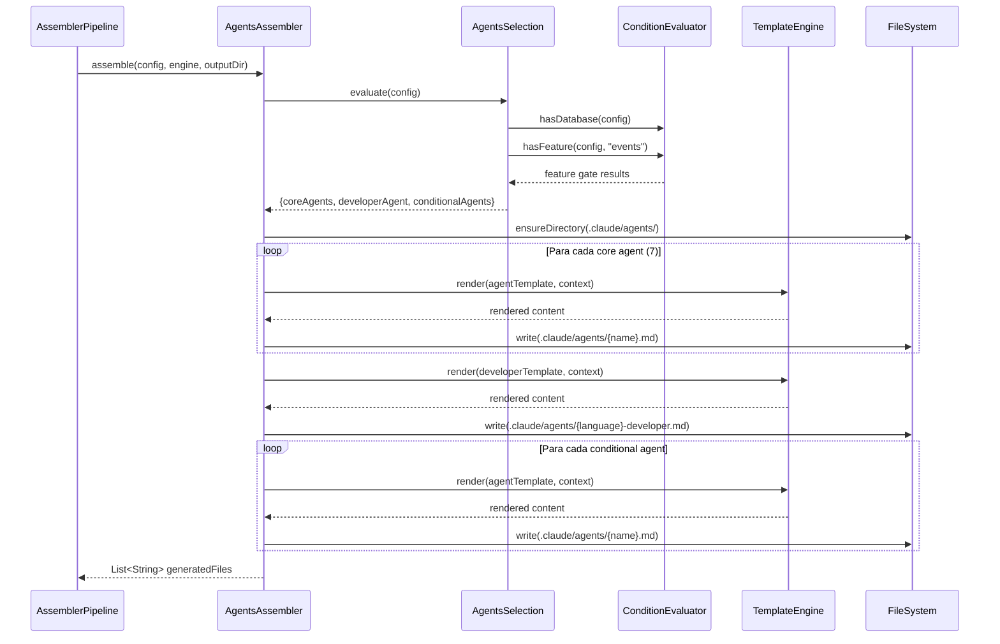

# Historia: AgentsAssembler — Agents Core, Condicionais e Developer

**ID:** story-0006-0012

## 1. Dependencias

| Blocked By | Blocks |
| :--- | :--- |
| story-0006-0008, story-0006-0009 | story-0006-0027 |

## 2. Regras Transversais Aplicaveis

| ID | Titulo |
| :--- | :--- |
| RULE-001 | Paridade Byte-a-Byte |
| RULE-004 | Interface Assembler Uniforme |
| RULE-005 | Ordem de Execucao Pipeline |

## 3. Descricao

Como **Desenvolvedor Java**, eu quero portar o AgentsAssembler e o AgentsSelection do TypeScript para Java 21, garantindo que os 7 agents core, o agent de developer especifico da linguagem e os agents condicionais sejam gerados com paridade byte-a-byte em relacao ao output TypeScript.

Esta historia porta 2 modulos TypeScript: `agents-assembler.ts` e `agents-selection.ts`. O AgentsAssembler e o terceiro assembler executado no pipeline (posicao 3 de 23, conforme RULE-005) e gera os arquivos em `.claude/agents/`.

### 3.1 Agents Core (Sempre Gerados)

Os 7 agents core sao personas de IA especializadas, usadas internamente por skills para delegar trabalho. Sao incluidos em QUALQUER geracao:

1. **architect.md** — Persona de arquiteto de software. Conhece patterns, trade-offs, ADRs.
2. **devops-engineer.md** — Persona de engenheiro DevOps. Conhece CI/CD, Docker, Kubernetes, infra.
3. **performance-engineer.md** — Persona de engenheiro de performance. Conhece profiling, benchmarks, otimizacoes.
4. **product-owner.md** — Persona de Product Owner. Conhece requisitos, priorizacao, user stories.
5. **qa-engineer.md** — Persona de QA. Conhece testing strategies, coverage, quality gates.
6. **security-engineer.md** — Persona de seguranca. Conhece OWASP, autenticacao, autorizacao, CVEs.
7. **tech-lead.md** — Persona de Tech Lead. Conhece code review, SOLID, clean code, 40-point checklist.

Cada agent e renderizado a partir de um template Pebble com variaveis do projeto (linguagem, framework, stack) para contextualizar as instrucoes.

### 3.2 Agent Developer (Language-Specific)

Alem dos 7 agents core, um agent de developer especifico da linguagem e gerado dinamicamente:

- `config.language.name = "java"` → gera `java-developer.md`
- `config.language.name = "typescript"` → gera `typescript-developer.md`
- `config.language.name = "python"` → gera `python-developer.md`
- `config.language.name = "go"` → gera `go-developer.md`
- `config.language.name = "kotlin"` → gera `kotlin-developer.md`
- `config.language.name = "rust"` → gera `rust-developer.md`
- `config.language.name = "csharp"` → gera `csharp-developer.md`

O template do developer agent contem convencoes e idiomatismos especificos da linguagem, alem de boas praticas de framework.

### 3.3 Agents Condicionais

Agents adicionais incluidos com base em feature gates avaliados pelo `AgentsSelection`:

- **database-engineer.md** — se o projeto possui database (convencoes de SQL, migrations, connection pooling)
- **event-engineer.md** — se o projeto possui eventos/messaging (Kafka, RabbitMQ, event sourcing)

### 3.4 AgentsSelection

Motor de selecao que avalia feature gates do ProjectConfig para determinar quais agents incluir:

```
evaluate(config) → {
  coreAgents: [7 agents],
  developerAgent: "{language}-developer",
  conditionalAgents: [...]
}
```

### 3.5 Output

```
.claude/agents/
├── architect.md              (core)
├── devops-engineer.md        (core)
├── performance-engineer.md   (core)
├── product-owner.md          (core)
├── qa-engineer.md            (core)
├── security-engineer.md      (core)
├── tech-lead.md              (core)
├── {language}-developer.md   (language-specific)
└── {conditional}.md          (condicionais)
```

## 4. Definicoes de Qualidade Locais

### DoR Local (Definition of Ready)

- [ ] StackResolver e StackValidator funcionais (story-0006-0008 concluida)
- [ ] Interface Assembler e Pipeline funcionais (story-0006-0009 concluida)
- [ ] Templates Pebble para agents disponíveis no classpath
- [ ] Golden files do TypeScript para agents disponíveis como referencia
- [ ] Codigo TypeScript equivalente lido (agents-assembler.ts, agents-selection.ts)

### DoD Local (Definition of Done)

- [ ] AgentsAssembler implementa interface Assembler (RULE-004)
- [ ] 7 agents core gerados para qualquer ProjectConfig valido
- [ ] Agent developer gerado com nome correto baseado na linguagem
- [ ] Agents condicionais gerados apenas quando feature gate e true
- [ ] Templates renderizados com variaveis do projeto
- [ ] Output identico ao golden file para go-gin profile (RULE-001)
- [ ] Todos os metodos publicos possuem Javadoc

### Global Definition of Done (DoD)

- **Cobertura:** ≥ 95% Line Coverage, ≥ 90% Branch Coverage (JaCoCo)
- **Testes Automatizados:** Unitarios (JUnit 5 + AssertJ), integracao, golden file
- **Relatorio de Cobertura:** JaCoCo HTML + XML
- **Documentacao:** Javadoc em classes publicas
- **Performance:** Geracao completa < 2s
- **TDD Compliance:** Test-first, refactoring explicito, TPP incremental

## 5. Contratos de Dados (Data Contract)

**AgentsAssembler.assemble():**

| Campo | Formato | Request | Response | Origem / Regra |
| :--- | :--- | :--- | :--- | :--- |
| `config` | ProjectConfig | M | - | Echo — configuracao do projeto |
| `engine` | TemplateEngine | M | - | Echo — motor Pebble |
| `outputDir` | Path | M | - | Echo — diretorio de output |
| `generatedFiles` | List\<String\> | - | M | Derive — caminhos dos arquivos gerados |

**AgentsSelection.evaluate():**

| Campo | Tipo | Descricao |
| :--- | :--- | :--- |
| `coreAgents` | List\<String\> | 7 nomes fixos: architect, devops-engineer, performance-engineer, product-owner, qa-engineer, security-engineer, tech-lead |
| `developerAgent` | String | `{language}-developer` — derivado de config.language.name |
| `conditionalAgents` | List\<String\> | Agents extras baseados em features |

**Contexto de Template (agents):**

| Variavel | Tipo | Origem |
| :--- | :--- | :--- |
| `project_name` | String | config.projectName |
| `language_name` | String | config.language.name |
| `language_version` | String | config.language.version |
| `framework_name` | String | config.framework.name |
| `architecture_style` | String | config.architectureStyle |
| `build_tool` | String | config.buildTool |
| `database_type` | String | config.database.type |

## 6. Diagramas

### 6.1 Fluxo do AgentsAssembler



## 7. Criterios de Aceite (Gherkin)

```gherkin
Cenario: Gera 7 agents core para qualquer configuracao
  DADO que o ProjectConfig contem apenas campos obrigatorios
  QUANDO AgentsAssembler.assemble() e invocado
  ENTÃO pelo menos 7 arquivos .md devem ser gerados em .claude/agents/
  E devem incluir: architect.md, devops-engineer.md, performance-engineer.md, product-owner.md, qa-engineer.md, security-engineer.md, tech-lead.md

Cenario: Configuracao com language=java gera java-developer agent
  DADO que o ProjectConfig define language.name="java"
  QUANDO AgentsAssembler.assemble() e invocado
  ENTÃO .claude/agents/java-developer.md deve existir
  E deve conter conteudo especifico de convencoes Java
  E o total de agents deve ser pelo menos 8 (7 core + 1 developer)

Cenario: Configuracao com language=typescript gera typescript-developer agent
  DADO que o ProjectConfig define language.name="typescript"
  QUANDO AgentsAssembler.assemble() e invocado
  ENTÃO .claude/agents/typescript-developer.md deve existir
  E deve conter conteudo especifico de convencoes TypeScript
  E java-developer.md NAO deve existir

Cenario: Agents condicionais baseados em features
  DADO que o ProjectConfig define database.type="postgresql" e interfaces contendo "events"
  QUANDO AgentsAssembler.assemble() e invocado
  ENTÃO alem dos 7 core e do developer agent, agents condicionais devem ser gerados
  E o total de agents deve ser maior que 8

Cenario: Output identico ao golden file para go-gin profile
  DADO que o ProjectConfig e carregado do setup-config.go-gin.yaml
  QUANDO AgentsAssembler.assemble() e invocado
  ENTÃO cada arquivo gerado em .claude/agents/ deve ser byte-a-byte identico ao golden file correspondente do perfil go-gin
```

### 7.1 Scenario Ordering (TPP)

> Scenarios seguem TPP: caso basico (7 agents core) → language-specific (java-developer) → language-specific alternativo (typescript-developer) → condicionais (features) → paridade total (golden file).

### 7.2 Mandatory Scenario Categories

- [x] Degenerate cases (7 agents core com config minima)
- [x] Happy path (java-developer, typescript-developer, agents condicionais)
- [x] Error paths (typescript-developer presente, java-developer ausente quando language=typescript)
- [x] Boundary values (golden file byte-a-byte para go-gin)

### 7.3 TDD Implementation Notes

**Outer loop (acceptance):** Teste de golden file comparando output gerado com referencia do TypeScript para o perfil go-gin. Verificacao de que o developer agent correto e gerado.

**Inner loop (unit):**
1. `AgentsAssembler.assemble()` — verifica que 7 agents core sao gerados
2. `AgentsSelection.evaluate()` — config com language=java retorna developerAgent="java-developer"
3. `AgentsSelection.evaluate()` — config com language=typescript retorna developerAgent="typescript-developer"
4. `AgentsSelection.evaluate()` — conditionais baseados em hasDatabase(), hasFeature("events")
5. Template rendering — variaveis do projeto substituidas corretamente nos agents

## 8. Sub-tarefas

- [ ] [Dev] Implementar `AgentsAssembler.java` implementando interface Assembler
- [ ] [Dev] Implementar `AgentsSelection.java` com avaliacao de feature gates e selecao de developer agent
- [ ] [Test] Unitario: AgentsAssembler — gera 7 agents core para qualquer config
- [ ] [Test] Unitario: AgentsSelection — language=java retorna java-developer; language=typescript retorna typescript-developer
- [ ] [Test] Unitario: AgentsSelection — agents condicionais baseados em features (database, events)
- [ ] [Test] Golden file: comparacao byte-a-byte de .claude/agents/ para perfil go-gin
