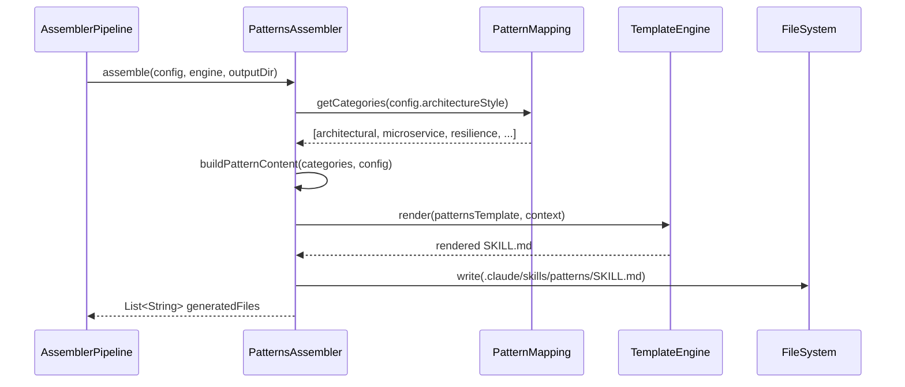
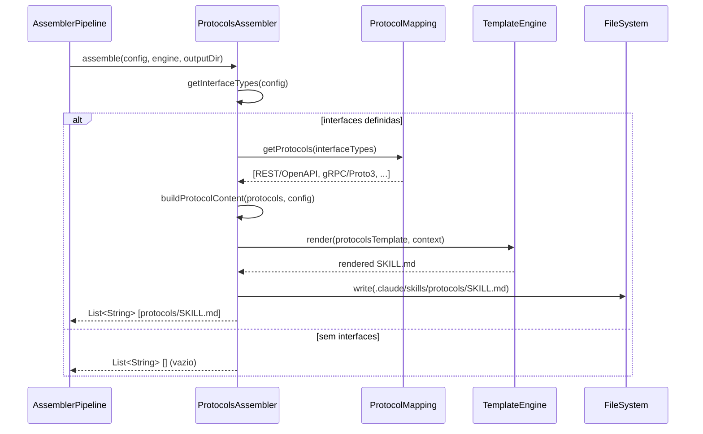

# Historia: PatternsAssembler e ProtocolsAssembler

**ID:** story-0006-0013

## 1. Dependencias

| Blocked By | Blocks |
| :--- | :--- |
| story-0006-0008, story-0006-0009 | story-0006-0027 |

## 2. Regras Transversais Aplicaveis

| ID | Titulo |
| :--- | :--- |
| RULE-001 | Paridade Byte-a-Byte |
| RULE-004 | Interface Assembler Uniforme |
| RULE-005 | Ordem de Execucao Pipeline |

## 3. Descricao

Como **Desenvolvedor Java**, eu quero portar o PatternsAssembler e o ProtocolsAssembler do TypeScript para Java 21, garantindo que os patterns arquiteturais e as especificacoes de protocolos de comunicacao sejam gerados com paridade byte-a-byte em relacao ao output TypeScript.

Esta historia porta 2 modulos TypeScript: `patterns-assembler.ts` e `protocols-assembler.ts`. O PatternsAssembler e o quarto assembler (posicao 4 de 23) e o ProtocolsAssembler e o quinto (posicao 5 de 23), conforme RULE-005.

### 3.1 PatternsAssembler

Gera `.claude/skills/patterns/SKILL.md` contendo design patterns organizados por categoria. Os patterns sao selecionados com base no `architectureStyle` e nas features do projeto:

**Categorias de Patterns:**

| Categoria | Descricao | Quando Incluir |
| :--- | :--- | :--- |
| `architectural/` | Patterns arquiteturais (Hexagonal, Clean Architecture, DDD) | Sempre |
| `microservice/` | Patterns de microservicos (Saga, Circuit Breaker, Service Mesh) | architectureStyle = microservice |
| `resilience/` | Patterns de resiliencia (Retry, Bulkhead, Rate Limiter) | Sempre (se resilience enabled) |
| `integration/` | Patterns de integracao (API Gateway, Event Bus, Adapter) | Se houver interfaces externas |
| `data/` | Patterns de dados (Repository, CQRS, Event Sourcing) | Se houver database |

A selecao usa o `PatternMapping` (portado em story-0006-0008) para determinar quais categorias aplicam-se ao projeto.

### 3.2 ProtocolsAssembler

Gera `.claude/skills/protocols/SKILL.md` contendo especificacoes de protocolos de comunicacao. Os protocolos sao selecionados com base nos `interfaceTypes` do projeto:

| Interface Type | Protocolo Gerado |
| :--- | :--- |
| `rest` | REST/OpenAPI — convencoes de endpoints, status codes, versioning, HATEOAS |
| `grpc` | gRPC/Proto3 — definicao de services, messages, streaming, error handling |
| `graphql` | GraphQL — schema design, queries, mutations, subscriptions, error handling |
| `websocket` | WebSocket — connection lifecycle, message formats, heartbeat, reconnection |
| `events` | Event-driven — event schemas, topics, producers, consumers, idempotency |

A selecao usa o `ProtocolMapping` (portado em story-0006-0008) para mapear interface types para conteudo de protocolo.

Se o projeto nao define nenhum interface type, o ProtocolsAssembler nao gera arquivo algum.

### 3.3 Rendering

Ambos os assemblers usam templates Pebble com variaveis do projeto para contextualizar o conteudo. Variaveis comuns: `{{ language_name }}`, `{{ framework_name }}`, `{{ architecture_style }}`.

## 4. Definicoes de Qualidade Locais

### DoR Local (Definition of Ready)

- [ ] StackResolver, PatternMapping e ProtocolMapping funcionais (story-0006-0008 concluida)
- [ ] Interface Assembler e Pipeline funcionais (story-0006-0009 concluida)
- [ ] Templates Pebble para patterns e protocols disponíveis no classpath
- [ ] Golden files do TypeScript para patterns e protocols disponíveis como referencia
- [ ] Codigo TypeScript equivalente lido (patterns-assembler.ts, protocols-assembler.ts)

### DoD Local (Definition of Done)

- [ ] PatternsAssembler implementa interface Assembler (RULE-004)
- [ ] ProtocolsAssembler implementa interface Assembler (RULE-004)
- [ ] Patterns selecionados corretamente por architectureStyle e features
- [ ] Protocols selecionados corretamente por interfaceTypes
- [ ] Config sem interfaces nao gera protocols
- [ ] Config microservice gera patterns de microservice
- [ ] Config library nao gera patterns de microservice
- [ ] Output identico ao golden file para python-fastapi profile (RULE-001)
- [ ] Todos os metodos publicos possuem Javadoc

### Global Definition of Done (DoD)

- **Cobertura:** ≥ 95% Line Coverage, ≥ 90% Branch Coverage (JaCoCo)
- **Testes Automatizados:** Unitarios (JUnit 5 + AssertJ), integracao, golden file
- **Relatorio de Cobertura:** JaCoCo HTML + XML
- **Documentacao:** Javadoc em classes publicas
- **Performance:** Geracao completa < 2s
- **TDD Compliance:** Test-first, refactoring explicito, TPP incremental

## 5. Contratos de Dados (Data Contract)

**PatternsAssembler.assemble():**

| Campo | Formato | Request | Response | Origem / Regra |
| :--- | :--- | :--- | :--- | :--- |
| `config` | ProjectConfig | M | - | Echo — configuracao do projeto |
| `engine` | TemplateEngine | M | - | Echo — motor Pebble |
| `outputDir` | Path | M | - | Echo — diretorio de output |
| `generatedFiles` | List\<String\> | - | M | Derive — caminhos dos arquivos gerados |

**ProtocolsAssembler.assemble():**

| Campo | Formato | Request | Response | Origem / Regra |
| :--- | :--- | :--- | :--- | :--- |
| `config` | ProjectConfig | M | - | Echo — configuracao do projeto |
| `engine` | TemplateEngine | M | - | Echo — motor Pebble |
| `outputDir` | Path | M | - | Echo — diretorio de output |
| `generatedFiles` | List\<String\> | - | M | Derive — caminhos dos arquivos gerados (vazio se sem interfaces) |

**Output files:**

| Assembler | Output | Condicao |
| :--- | :--- | :--- |
| PatternsAssembler | `.claude/skills/patterns/SKILL.md` | Sempre (conteudo varia) |
| ProtocolsAssembler | `.claude/skills/protocols/SKILL.md` | Apenas se interfaces definidas |

**Pattern categories mapeamento:**

| architectureStyle | Categories Incluidas |
| :--- | :--- |
| `microservice` | architectural, microservice, resilience, integration, data |
| `monolith` | architectural, resilience, data |
| `library` | architectural |

**Protocol selection mapeamento:**

| Interface Type | Protocolo |
| :--- | :--- |
| `rest` | REST/OpenAPI |
| `grpc` | gRPC/Proto3 |
| `graphql` | GraphQL |
| `websocket` | WebSocket |
| `events` | Event-driven |

## 6. Diagramas

### 6.1 Fluxo do PatternsAssembler



### 6.2 Fluxo do ProtocolsAssembler



## 7. Criterios de Aceite (Gherkin)

```gherkin
Cenario: Configuracao microservice gera patterns de microservice
  DADO que o ProjectConfig define architectureStyle="microservice"
  QUANDO PatternsAssembler.assemble() e invocado
  ENTÃO .claude/skills/patterns/SKILL.md deve ser gerado
  E o conteudo deve incluir patterns de microservice (Saga, Circuit Breaker)
  E o conteudo deve incluir patterns architectural e resilience

Cenario: Configuracao library nao gera patterns de microservice
  DADO que o ProjectConfig define architectureStyle="library"
  QUANDO PatternsAssembler.assemble() e invocado
  ENTÃO .claude/skills/patterns/SKILL.md deve ser gerado
  E o conteudo deve incluir patterns architectural
  MAS o conteudo NAO deve incluir patterns de microservice (Saga, Circuit Breaker)

Cenario: Configuracao com REST gera protocol REST/OpenAPI
  DADO que o ProjectConfig define interfaces=["rest"]
  QUANDO ProtocolsAssembler.assemble() e invocado
  ENTÃO .claude/skills/protocols/SKILL.md deve ser gerado
  E o conteudo deve incluir convencoes REST/OpenAPI (endpoints, status codes, versioning)

Cenario: Configuracao com gRPC gera protocol gRPC/Proto3
  DADO que o ProjectConfig define interfaces=["grpc"]
  QUANDO ProtocolsAssembler.assemble() e invocado
  ENTÃO .claude/skills/protocols/SKILL.md deve ser gerado
  E o conteudo deve incluir convencoes gRPC/Proto3 (services, messages, streaming)

Cenario: Configuracao sem interfaces nao gera protocols
  DADO que o ProjectConfig define interfaces como lista vazia ou ausente
  QUANDO ProtocolsAssembler.assemble() e invocado
  ENTÃO NENHUM arquivo deve ser gerado em .claude/skills/protocols/
  E a lista de arquivos retornada deve estar vazia

Cenario: Output identico ao golden file para python-fastapi profile
  DADO que o ProjectConfig e carregado do setup-config.python-fastapi.yaml
  QUANDO PatternsAssembler.assemble() e ProtocolsAssembler.assemble() sao invocados
  ENTÃO cada arquivo gerado deve ser byte-a-byte identico ao golden file correspondente do perfil python-fastapi
```

### 7.1 Scenario Ordering (TPP)

> Scenarios seguem TPP: caso com mais output (microservice→patterns completos) → caso restritivo (library→patterns minimos) → protocolo unico (REST) → protocolo alternativo (gRPC) → caso degenerado (sem interfaces→sem protocols) → paridade total (golden file).

### 7.2 Mandatory Scenario Categories

- [x] Degenerate cases (config sem interfaces nao gera protocols)
- [x] Happy path (microservice com patterns, REST com protocols, gRPC com protocols)
- [x] Error paths (library nao gera patterns de microservice)
- [x] Boundary values (golden file byte-a-byte para python-fastapi)

### 7.3 TDD Implementation Notes

**Outer loop (acceptance):** Teste de golden file comparando output gerado com referencia do TypeScript para o perfil python-fastapi. Verificacao de que patterns e protocols correspondem ao esperado.

**Inner loop (unit):**
1. `PatternsAssembler.assemble()` — architectureStyle=microservice retorna patterns de microservice
2. `PatternsAssembler.assemble()` — architectureStyle=library retorna apenas patterns architectural
3. `ProtocolsAssembler.assemble()` — interfaces=["rest"] retorna SKILL.md com REST/OpenAPI
4. `ProtocolsAssembler.assemble()` — interfaces=[] retorna lista vazia
5. PatternMapping e ProtocolMapping — verificar mapeamentos corretos

## 8. Sub-tarefas

- [ ] [Dev] Implementar `PatternsAssembler.java` implementando interface Assembler
- [ ] [Dev] Implementar `ProtocolsAssembler.java` implementando interface Assembler
- [ ] [Test] Unitario: PatternsAssembler — architectureStyle=microservice inclui patterns de microservice
- [ ] [Test] Unitario: PatternsAssembler — architectureStyle=library exclui patterns de microservice
- [ ] [Test] Unitario: ProtocolsAssembler — interfaces=["rest"] gera REST/OpenAPI
- [ ] [Test] Unitario: ProtocolsAssembler — interfaces=["grpc"] gera gRPC/Proto3
- [ ] [Test] Unitario: ProtocolsAssembler — interfaces vazio nao gera arquivo
- [ ] [Test] Golden file: comparacao byte-a-byte de patterns e protocols para perfil python-fastapi
