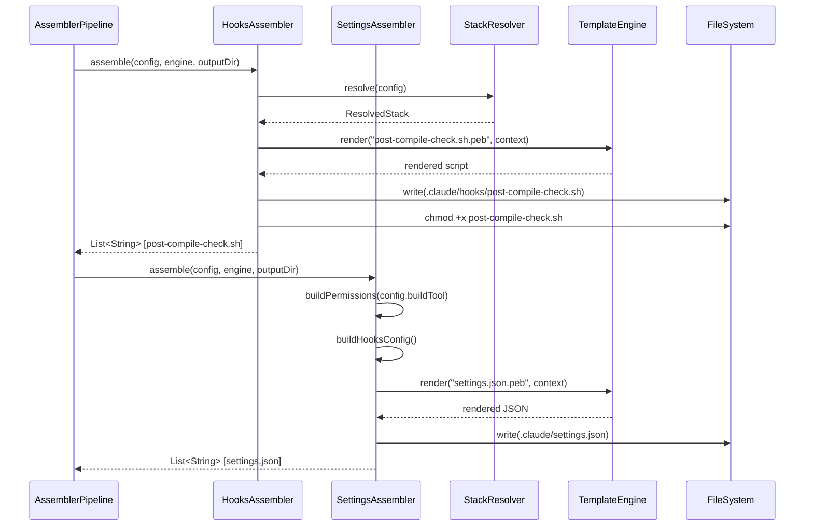
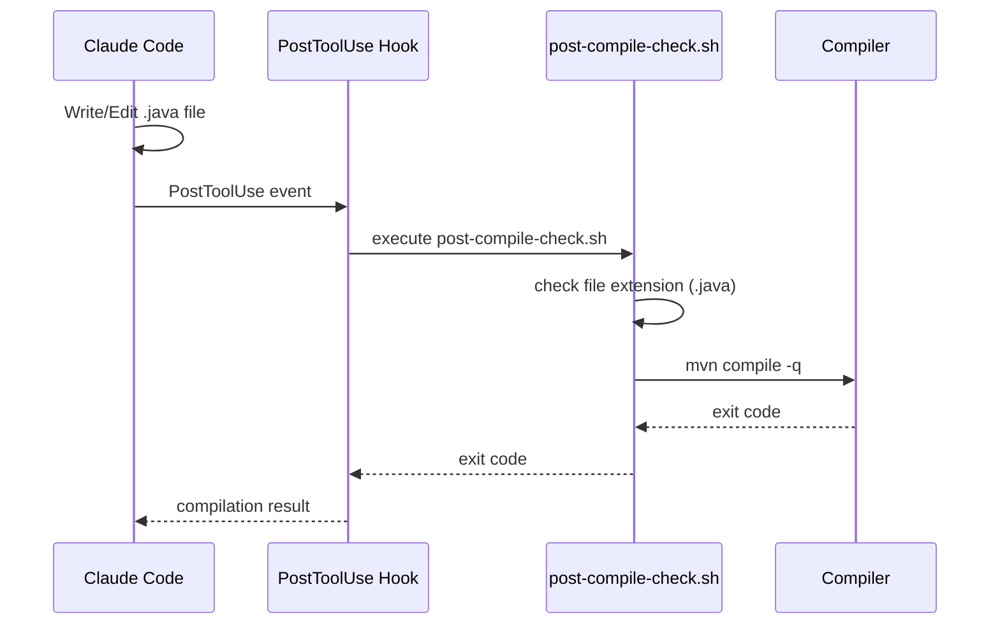

# Historia: HooksAssembler e SettingsAssembler

**ID:** story-0006-0014

## 1. Dependencias

| Blocked By | Blocks |
| :--- | :--- |
| story-0006-0008, story-0006-0009 | story-0006-0027 |

## 2. Regras Transversais Aplicaveis

| ID | Titulo |
| :--- | :--- |
| RULE-001 | Paridade Byte-a-Byte |
| RULE-004 | Interface Assembler Uniforme |
| RULE-005 | Ordem de Execucao Pipeline |

## 3. Descricao

Como **Desenvolvedor Java**, eu quero portar o HooksAssembler e o SettingsAssembler do TypeScript para Java 21, garantindo que os scripts de automacao e as configuracoes de permissoes/hooks sejam gerados com paridade byte-a-byte em relacao ao output TypeScript.

Esta historia porta 2 modulos TypeScript: `hooks-assembler.ts` e `settings-assembler.ts`. O HooksAssembler e o sexto assembler (posicao 6 de 23) e o SettingsAssembler e o setimo (posicao 7 de 23), conforme RULE-005.

### 3.1 HooksAssembler

Gera `.claude/hooks/` com scripts de automacao que sao executados automaticamente em resposta a eventos do Claude Code.

**Arquivo principal: `post-compile-check.sh`**

Script Bash executado apos o evento `PostToolUse` quando o tool e `Write` ou `Edit` e o arquivo modificado e um arquivo-fonte. O script:

1. Verifica se o arquivo modificado tem extensao de codigo-fonte (`.java`, `.ts`, `.py`, `.go`, `.rs`, `.kt`, etc.)
2. Se sim, executa o comando de compilacao apropriado para o stack:
   - Java/Maven: `mvn compile -q`
   - Java/Gradle: `gradle compileJava -q`
   - TypeScript/npm: `npx --no-install tsc --noEmit`
   - Go: `go build ./...`
   - Rust: `cargo check`
   - Python: `python -m py_compile`
   - Kotlin: `gradle compileKotlin -q`
3. Retorna exit code do compilador (0 = OK, non-zero = erro)

O script DEVE ter permissao de execucao (`chmod +x`). O HooksAssembler garante isso apos a escrita.

### 3.2 SettingsAssembler

Gera `.claude/settings.json` com configuracoes do Claude Code:

**Estrutura do settings.json:**

```json
{
  "permissions": {
    "allow": [
      "comando1",
      "comando2",
      ...
    ]
  },
  "hooks": {
    "PostToolUse": [
      {
        "matcher": "Write|Edit",
        "command": ".claude/hooks/post-compile-check.sh"
      }
    ]
  }
}
```

**Permissions (allow list):**

A lista de comandos Bash permitidos varia conforme o build tool do projeto:

| Build Tool | Comandos Permitidos |
| :--- | :--- |
| `maven` | `mvn compile`, `mvn test`, `mvn package`, `mvn verify`, `mvn clean`, `mvn dependency:tree`, `java -version` |
| `gradle` | `gradle build`, `gradle test`, `gradle compileJava`, `gradle clean`, `gradle dependencies`, `java -version` |
| `npm` | `npm run build`, `npm test`, `npm run lint`, `npx tsc --noEmit`, `npx vitest`, `npx eslint`, `node --version` |
| `pip` | `python -m pytest`, `python -m mypy`, `python -m black`, `python -m flake8`, `pip list`, `python --version` |
| `cargo` | `cargo build`, `cargo test`, `cargo check`, `cargo clippy`, `cargo fmt`, `rustc --version` |
| `go` | `go build ./...`, `go test ./...`, `go vet ./...`, `go fmt ./...`, `go version` |
| `dotnet` | `dotnet build`, `dotnet test`, `dotnet run`, `dotnet --version` |

Alem dos comandos do build tool, comandos universais sao sempre incluidos: `git status`, `git diff`, `git log`, `git add`, `git commit`, `ls`, `cat`, `find`, `grep`.

**Hooks config:**

Referencia o script `post-compile-check.sh` para execucao automatica apos `Write` ou `Edit`.

### 3.3 Rendering

- `post-compile-check.sh` e renderizado via template Pebble com variaveis: `{{ compile_cmd }}`, `{{ file_extension }}`, `{{ build_tool }}`
- `settings.json` e renderizado via template Pebble com a lista de comandos permitidos baseada no build tool

## 4. Definicoes de Qualidade Locais

### DoR Local (Definition of Ready)

- [ ] StackResolver funcional com compileCmd resolvido (story-0006-0008 concluida)
- [ ] Interface Assembler e Pipeline funcionais (story-0006-0009 concluida)
- [ ] Templates Pebble para hooks e settings disponíveis no classpath
- [ ] Golden files do TypeScript para hooks e settings disponíveis como referencia
- [ ] Codigo TypeScript equivalente lido (hooks-assembler.ts, settings-assembler.ts)

### DoD Local (Definition of Done)

- [ ] HooksAssembler implementa interface Assembler (RULE-004)
- [ ] SettingsAssembler implementa interface Assembler (RULE-004)
- [ ] post-compile-check.sh gerado com permissao executavel
- [ ] post-compile-check.sh contem comando de compilacao correto para o stack
- [ ] settings.json contem permissions corretas para o build tool do projeto
- [ ] settings.json contem hooks config referenciando post-compile-check.sh
- [ ] settings.json e JSON valido (parseable sem erros)
- [ ] Output identico ao golden file para kotlin-ktor profile (RULE-001)
- [ ] Todos os metodos publicos possuem Javadoc

### Global Definition of Done (DoD)

- **Cobertura:** ≥ 95% Line Coverage, ≥ 90% Branch Coverage (JaCoCo)
- **Testes Automatizados:** Unitarios (JUnit 5 + AssertJ), integracao, golden file
- **Relatorio de Cobertura:** JaCoCo HTML + XML
- **Documentacao:** Javadoc em classes publicas
- **Performance:** Geracao completa < 2s
- **TDD Compliance:** Test-first, refactoring explicito, TPP incremental

## 5. Contratos de Dados (Data Contract)

**HooksAssembler.assemble():**

| Campo | Formato | Request | Response | Origem / Regra |
| :--- | :--- | :--- | :--- | :--- |
| `config` | ProjectConfig | M | - | Echo — configuracao do projeto |
| `engine` | TemplateEngine | M | - | Echo — motor Pebble |
| `outputDir` | Path | M | - | Echo — diretorio de output |
| `generatedFiles` | List\<String\> | - | M | Derive — [".claude/hooks/post-compile-check.sh"] |

**SettingsAssembler.assemble():**

| Campo | Formato | Request | Response | Origem / Regra |
| :--- | :--- | :--- | :--- | :--- |
| `config` | ProjectConfig | M | - | Echo — configuracao do projeto |
| `engine` | TemplateEngine | M | - | Echo — motor Pebble |
| `outputDir` | Path | M | - | Echo — diretorio de output |
| `generatedFiles` | List\<String\> | - | M | Derive — [".claude/settings.json"] |

**settings.json structure:**

| Campo | Tipo | Descricao |
| :--- | :--- | :--- |
| `permissions.allow` | List\<String\> | Comandos Bash permitidos (build tool + universais) |
| `hooks.PostToolUse` | List\<HookEntry\> | Hooks disparados apos Write/Edit |
| `hooks.PostToolUse[].matcher` | String | Regex de tools que ativam o hook |
| `hooks.PostToolUse[].command` | String | Caminho do script a executar |

**post-compile-check.sh contexto de template:**

| Variavel | Tipo | Origem |
| :--- | :--- | :--- |
| `compile_cmd` | String | ResolvedStack.compileCmd |
| `file_extension` | String | ResolvedStack.fileExtension |
| `build_tool` | String | config.buildTool |
| `language_name` | String | config.language.name |

## 6. Diagramas

### 6.1 Fluxo do HooksAssembler e SettingsAssembler



### 6.2 Fluxo de Execucao do Hook (Runtime)



## 7. Criterios de Aceite (Gherkin)

```gherkin
Cenario: Gera post-compile-check.sh com permissao executavel
  DADO que o ProjectConfig define qualquer stack valido
  QUANDO HooksAssembler.assemble() e invocado
  ENTÃO .claude/hooks/post-compile-check.sh deve ser gerado
  E o arquivo deve ter permissao de execucao (executable flag)
  E o conteudo deve ser um script Bash valido (iniciar com #!/bin/bash ou #!/usr/bin/env bash)

Cenario: settings.json contem permissions para maven commands (java-quarkus)
  DADO que o ProjectConfig define buildTool="maven" (perfil java-quarkus)
  QUANDO SettingsAssembler.assemble() e invocado
  ENTÃO .claude/settings.json deve conter permissions.allow com "mvn compile"
  E deve conter "mvn test"
  E deve conter "mvn package"
  E deve conter comandos universais como "git status"

Cenario: settings.json contem permissions para npm commands (typescript-nestjs)
  DADO que o ProjectConfig define buildTool="npm" (perfil typescript-nestjs)
  QUANDO SettingsAssembler.assemble() e invocado
  ENTÃO .claude/settings.json deve conter permissions.allow com "npm run build"
  E deve conter "npm test"
  E deve conter "npx tsc --noEmit"
  E NAO deve conter "mvn compile" ou outros comandos de Maven

Cenario: Hooks config referencia post-compile-check.sh
  DADO que o ProjectConfig define qualquer stack valido
  QUANDO SettingsAssembler.assemble() e invocado
  ENTÃO .claude/settings.json deve conter hooks.PostToolUse
  E o hook deve referenciar ".claude/hooks/post-compile-check.sh"
  E o matcher deve incluir "Write" e "Edit"

Cenario: settings.json e JSON valido
  DADO que o ProjectConfig define qualquer stack valido
  QUANDO SettingsAssembler.assemble() e invocado
  ENTÃO .claude/settings.json deve ser parseavel como JSON valido sem erros
  E deve conter as chaves "permissions" e "hooks" no nivel raiz

Cenario: Output identico ao golden file para kotlin-ktor profile
  DADO que o ProjectConfig e carregado do setup-config.kotlin-ktor.yaml
  QUANDO HooksAssembler.assemble() e SettingsAssembler.assemble() sao invocados
  ENTÃO .claude/hooks/post-compile-check.sh deve ser byte-a-byte identico ao golden file do perfil kotlin-ktor
  E .claude/settings.json deve ser byte-a-byte identico ao golden file do perfil kotlin-ktor
```

### 7.1 Scenario Ordering (TPP)

> Scenarios seguem TPP: caso basico (hook com permissao executavel) → permissions specificas (maven) → permissions alternativas (npm) → hooks config → validacao de formato (JSON valido) → paridade total (golden file).

### 7.2 Mandatory Scenario Categories

- [x] Degenerate cases (hook gerado com permissao executavel)
- [x] Happy path (permissions para maven, permissions para npm, hooks config)
- [x] Error paths (npm NAO contem comandos maven)
- [x] Boundary values (JSON valido, golden file byte-a-byte para kotlin-ktor)

### 7.3 TDD Implementation Notes

**Outer loop (acceptance):** Teste de golden file comparando output gerado com referencia do TypeScript para o perfil kotlin-ktor. Verificacao de que settings.json e JSON valido.

**Inner loop (unit):**
1. `HooksAssembler.assemble()` — gera post-compile-check.sh com conteudo e permissao executavel
2. `SettingsAssembler.buildPermissions("maven")` — retorna lista com comandos maven + universais
3. `SettingsAssembler.buildPermissions("npm")` — retorna lista com comandos npm + universais; sem maven
4. `SettingsAssembler.buildHooksConfig()` — retorna config com PostToolUse referenciando post-compile-check.sh
5. JSON parsing — settings.json renderizado e parseavel sem erros

## 8. Sub-tarefas

- [ ] [Dev] Implementar `HooksAssembler.java` implementando interface Assembler
- [ ] [Dev] Implementar `SettingsAssembler.java` implementando interface Assembler
- [ ] [Test] Unitario: HooksAssembler — post-compile-check.sh gerado com permissao executavel
- [ ] [Test] Unitario: SettingsAssembler — permissions corretas para maven (java-quarkus)
- [ ] [Test] Unitario: SettingsAssembler — permissions corretas para npm (typescript-nestjs); sem maven
- [ ] [Test] Unitario: SettingsAssembler — hooks config referencia post-compile-check.sh
- [ ] [Test] Unitario: SettingsAssembler — settings.json e JSON valido
- [ ] [Test] Golden file: comparacao byte-a-byte de hooks e settings para perfil kotlin-ktor
