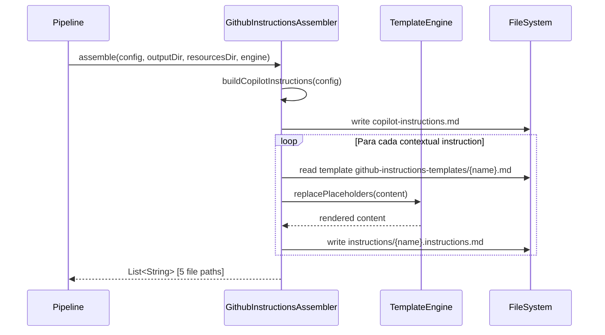
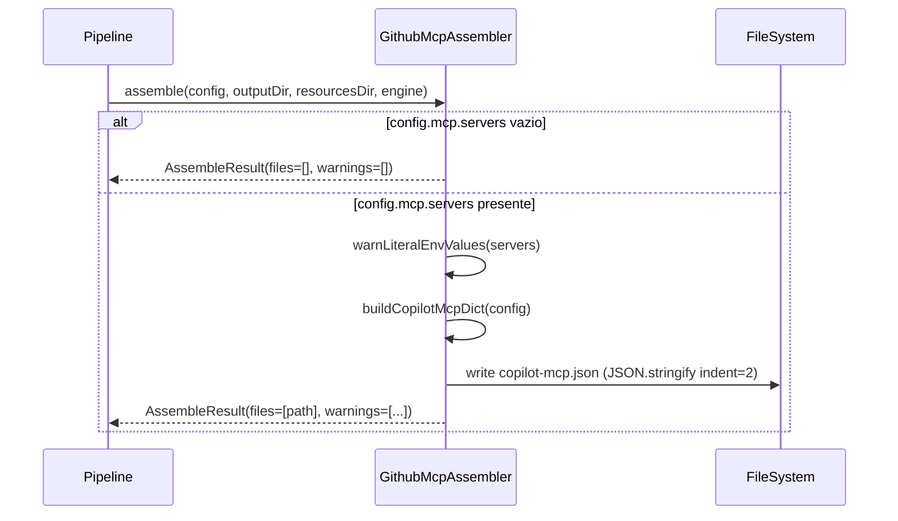

# Historia: GithubInstructionsAssembler e GithubMcpAssembler

**ID:** story-0006-0015

## 1. Dependencias

| Blocked By | Blocks |
| :--- | :--- |
| story-0006-0008, story-0006-0009 | story-0006-0027 |

## 2. Regras Transversais Aplicaveis

| ID | Titulo |
| :--- | :--- |
| RULE-001 | Paridade Byte-a-Byte |
| RULE-004 | Interface Assembler Uniforme |
| RULE-005 | Ordem de Execucao Pipeline |

## 3. Descricao

Como **Desenvolvedor Java**, eu quero portar `github-instructions-assembler.ts` (190 linhas) e
`github-mcp-assembler.ts` (81 linhas) para Java 21, garantindo que os artefatos `.github/` para
GitHub Copilot sejam gerados com paridade byte-a-byte em relacao a versao TypeScript.

GithubInstructionsAssembler gera o diretorio `.github/instructions/` com arquivos de instrucoes
contextuais para GitHub Copilot. O assembler produz dois tipos de output: (1) `copilot-instructions.md`
na raiz de `.github/`, construido programaticamente com secoes de identidade do projeto, stack de
tecnologia, constraints e referencias contextuais; (2) arquivos `.instructions.md` contextuais por
topico (domain, coding-standards, architecture, quality-gates), renderizados a partir de templates
com placeholder replacement via TemplateEngine.

GithubMcpAssembler gera `.github/copilot-mcp.json` com a configuracao de MCP servers do projeto.
O assembler so gera o arquivo quando `config.mcp.servers` contem pelo menos um servidor configurado.
Caso contrario, retorna resultado vazio (graceful no-op). Adicionalmente, o assembler valida que
valores de variaveis de ambiente nos servidores MCP usam formato `$VARIABLE` e emite warnings para
valores literais.

### 3.1 GithubInstructionsAssembler

- Metodo `buildCopilotInstructions(ProjectConfig)` constroi o conteudo de `copilot-instructions.md`
  programaticamente, sem template engine, usando string building com secoes:
  - **Identity Section:** nome do projeto, architecture style, DDD, event-driven, interfaces, language, framework
  - **Stack Section:** tabela markdown com Technology Stack (Architecture, Language, Framework, Build Tool, Container, Orchestrator, Resilience, Native Build, Smoke Tests, Contract Tests)
  - **Constraints Section:** 3 constraints fixas (Cloud-Agnostic, Horizontal scalability, Externalized configuration)
  - **Contextual Refs Section:** lista de references para os 4 instruction files contextuais
- Metodos auxiliares: `formatInterfaces(config)` formata interfaces (REST/GRPC em maiusculas), `formatFrameworkVersion(config)` adiciona versao se presente
- Metodo `assemble()` gera o global file e 4 contextual files via template replacement
- Templates contextuais residem em `resources/github-instructions-templates/{name}.md`
- Constante `CONTEXTUAL_INSTRUCTIONS`: `["domain", "coding-standards", "architecture", "quality-gates"]`

### 3.2 GithubMcpAssembler

- Metodo `warnLiteralEnvValues(List<McpServerConfig>)` verifica se valores de env vars usam formato `$VARIABLE`; se nao, emite warning
- Metodo `buildCopilotMcpDict(ProjectConfig)` constroi a estrutura JSON: `{ "mcpServers": { "<id>": { "url": "...", "capabilities": [...], "env": {...} } } }`
- Se `config.mcp.servers` esta vazio, retorna `AssembleResult` com files=[] e warnings=[]
- JSON serializado com indentacao de 2 espacos e trailing newline
- Retorna `AssembleResult` com files e warnings (warnings para env vars literais)

### 3.3 Estrutura de Classes Java

```
src/main/java/com/iadevenv/assembler/
├── GithubInstructionsAssembler.java   # implements Assembler
└── GithubMcpAssembler.java            # implements Assembler, returns AssembleResult
```

## 4. Definicoes de Qualidade Locais

### DoR Local (Definition of Ready)

- [ ] Interface `Assembler` implementada e disponivel (story-0006-0009)
- [ ] `StackMapping` e resolucao de stack funcional (story-0006-0008)
- [ ] `TemplateEngine` com `replacePlaceholders()` funcional (story-0006-0006)
- [ ] Modelos `ProjectConfig`, `McpServerConfig`, `McpConfig` disponiveis (story-0006-0002)
- [ ] Templates `github-instructions-templates/` no classpath (story-0006-0004)
- [ ] `AssembleResult` record disponivel (story-0006-0009)

### DoD Local (Definition of Done)

- [ ] `GithubInstructionsAssembler` gera `copilot-instructions.md` com todas as secoes
- [ ] `GithubInstructionsAssembler` gera 4 instruction files contextuais
- [ ] `GithubMcpAssembler` gera `copilot-mcp.json` com estrutura JSON valida quando MCP configurado
- [ ] `GithubMcpAssembler` retorna files=[] quando nenhum MCP server configurado
- [ ] Warnings emitidos para env vars com valores literais (sem `$`)
- [ ] Output identico ao golden file para rust-axum profile
- [ ] Javadoc em classes e metodos publicos

### Global Definition of Done (DoD)

- **Cobertura:** ≥ 95% Line Coverage, ≥ 90% Branch Coverage (JaCoCo)
- **Testes Automatizados:** Unitarios (JUnit 5 + AssertJ), integracao, golden file
- **Relatorio de Cobertura:** JaCoCo HTML + XML
- **Documentacao:** Javadoc em classes publicas
- **Performance:** Geracao completa < 2s
- **TDD Compliance:** Test-first, refactoring explicito, TPP incremental

## 5. Contratos de Dados (Data Contract)

**GithubInstructionsAssembler output:**

| Artefato | Caminho | Conteudo |
| :--- | :--- | :--- |
| Global instructions | `.github/copilot-instructions.md` | Markdown com Identity, Stack, Constraints, Contextual Refs |
| Domain instructions | `.github/instructions/domain.instructions.md` | Template renderizado com placeholders do projeto |
| Coding standards | `.github/instructions/coding-standards.instructions.md` | Template renderizado com placeholders do projeto |
| Architecture | `.github/instructions/architecture.instructions.md` | Template renderizado com placeholders do projeto |
| Quality gates | `.github/instructions/quality-gates.instructions.md` | Template renderizado com placeholders do projeto |

**GithubMcpAssembler output:**

| Artefato | Caminho | Condicao |
| :--- | :--- | :--- |
| MCP config | `.github/copilot-mcp.json` | Somente quando `config.mcp.servers.size() > 0` |

**Estrutura JSON do copilot-mcp.json:**

```json
{
  "mcpServers": {
    "<server-id>": {
      "url": "<server-url>",
      "capabilities": ["capability1", "capability2"],
      "env": {
        "KEY": "$VARIABLE"
      }
    }
  }
}
```

**AssembleResult (retorno do GithubMcpAssembler):**

| Campo | Tipo | Descricao |
| :--- | :--- | :--- |
| `files` | `List<String>` | Caminhos dos arquivos gerados |
| `warnings` | `List<String>` | Warnings de validacao (env vars literais) |

## 6. Diagramas

### 6.1 Fluxo GithubInstructionsAssembler



### 6.2 Fluxo GithubMcpAssembler



## 7. Criterios de Aceite (Gherkin)

```gherkin
Cenario: Gera copilot-instructions.md com instrucoes globais
  DADO que um ProjectConfig valido esta configurado com project.name="meu-projeto"
  E language.name="typescript" e framework.name="nestjs"
  QUANDO GithubInstructionsAssembler.assemble() e executado
  ENTAO o arquivo ".github/copilot-instructions.md" e gerado
  E o conteudo contem "# Project Identity — meu-projeto"
  E o conteudo contem a secao "## Technology Stack" com tabela markdown
  E o conteudo contem a secao "## Constraints"
  E o conteudo contem a secao "## Contextual Instructions"

Cenario: Gera 4 instruction files contextuais
  DADO que os templates existem em resources/github-instructions-templates/
  E o TemplateEngine esta configurado com contexto do projeto
  QUANDO GithubInstructionsAssembler.assemble() e executado
  ENTAO 4 arquivos sao gerados em ".github/instructions/"
  E os arquivos sao: domain.instructions.md, coding-standards.instructions.md, architecture.instructions.md, quality-gates.instructions.md
  E cada arquivo tem placeholders substituidos pelo TemplateEngine

Cenario: Instrucoes contem nome do projeto e stack
  DADO que project.name="api-pagamentos" e language.name="java" e language.version="21"
  E framework.name="quarkus" e architecture.style="hexagonal"
  QUANDO buildCopilotInstructions(config) e executado
  ENTAO o resultado contem "- **Name:** api-pagamentos"
  E o resultado contem "| Language | Java 21 |"
  E o resultado contem "| Framework | Quarkus"
  E o resultado contem "| Architecture | Hexagonal |"

Cenario: Gera copilot-mcp.json quando McpConfig presente
  DADO que config.mcp.servers contem um servidor com id="firecrawl", url="https://mcp.example.com"
  E capabilities=["scrape", "crawl"] e env={"API_KEY": "$FIRECRAWL_KEY"}
  QUANDO GithubMcpAssembler.assemble() e executado
  ENTAO o arquivo ".github/copilot-mcp.json" e gerado
  E o JSON contem "mcpServers" com entrada "firecrawl"
  E a entrada contem "url": "https://mcp.example.com"
  E a entrada contem "capabilities": ["scrape", "crawl"]
  E warnings esta vazio (env var usa formato $VARIABLE)

Cenario: Nao gera copilot-mcp.json quando McpConfig ausente
  DADO que config.mcp.servers esta vazio (lista vazia)
  QUANDO GithubMcpAssembler.assemble() e executado
  ENTAO nenhum arquivo e gerado
  E AssembleResult.files esta vazio
  E AssembleResult.warnings esta vazio

Cenario: Output identico ao golden file para rust-axum profile
  DADO que o ProjectConfig e carregado a partir do perfil bundled "rust-axum"
  QUANDO GithubInstructionsAssembler.assemble() e GithubMcpAssembler.assemble() sao executados
  ENTAO os arquivos gerados sao byte-a-byte identicos aos golden files de referencia
  E nenhuma diferenca de whitespace, line ending ou ordenacao e detectada
```

### 7.1 Scenario Ordering (TPP)

> Scenarios seguem TPP: geracao basica (copilot-instructions.md) → multiplicidade (4 files contextuais) → conteudo especifico (nome e stack) → condicional positivo (MCP presente) → condicional negativo (MCP ausente) → paridade completa (golden file).

### 7.2 Mandatory Scenario Categories

- [x] Degenerate cases (McpConfig ausente, servers vazio)
- [x] Happy path (geracao de instructions, geracao de MCP)
- [x] Error paths (env vars literais geram warnings)
- [x] Boundary values (golden file byte-a-byte)

### 7.3 TDD Implementation Notes

**Outer loop (acceptance):** Golden file test comparando output gerado para rust-axum contra referencia. Usar `Files.readString()` + `assertEquals()` para comparacao byte-a-byte.

**Inner loop (unit):**
1. `buildCopilotInstructions()` — verificar cada secao individualmente com strings esperadas
2. `formatInterfaces()` — REST → "REST", grpc → "GRPC", misto → "REST, GRPC"
3. `warnLiteralEnvValues()` — testar com `$VAR` (sem warning) e "literal" (com warning)
4. `buildCopilotMcpDict()` — verificar estrutura JSON com capabilities e env
5. Condicional MCP ausente — verificar retorno vazio sem escrita em disco

## 8. Sub-tarefas

- [ ] [Dev] GithubInstructionsAssembler.java com buildCopilotInstructions(), formatInterfaces(), formatFrameworkVersion()
- [ ] [Dev] GithubInstructionsAssembler: geracao de 4 contextual instruction files via TemplateEngine.replacePlaceholders()
- [ ] [Dev] GithubMcpAssembler.java com warnLiteralEnvValues(), buildCopilotMcpDict()
- [ ] [Dev] GithubMcpAssembler: condicional de servers vazio (graceful no-op)
- [ ] [Test] Unitario: GithubInstructionsAssembler — copilot-instructions.md com todas as secoes
- [ ] [Test] Unitario: GithubInstructionsAssembler — 4 instruction files contextuais gerados
- [ ] [Test] Unitario: GithubMcpAssembler — geracao com MCP configurado, JSON valido
- [ ] [Test] Unitario: GithubMcpAssembler — no-op quando servers vazio
- [ ] [Test] Unitario: warnLiteralEnvValues — warning para valores literais, sem warning para $VAR
- [ ] [Test] Golden file: comparacao byte-a-byte do output para rust-axum profile
- [ ] [Doc] Javadoc em GithubInstructionsAssembler e GithubMcpAssembler
